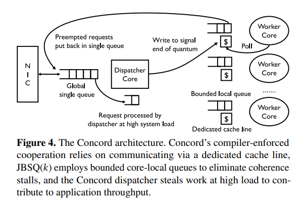
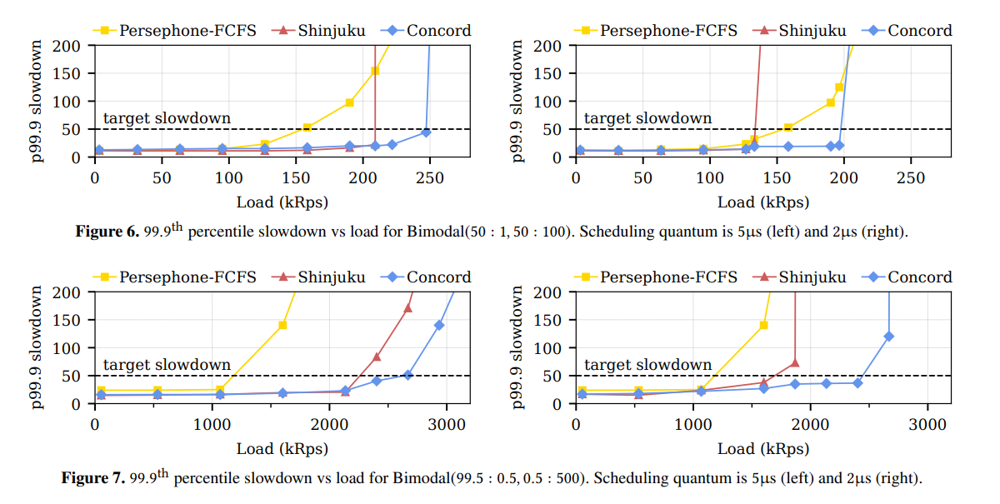
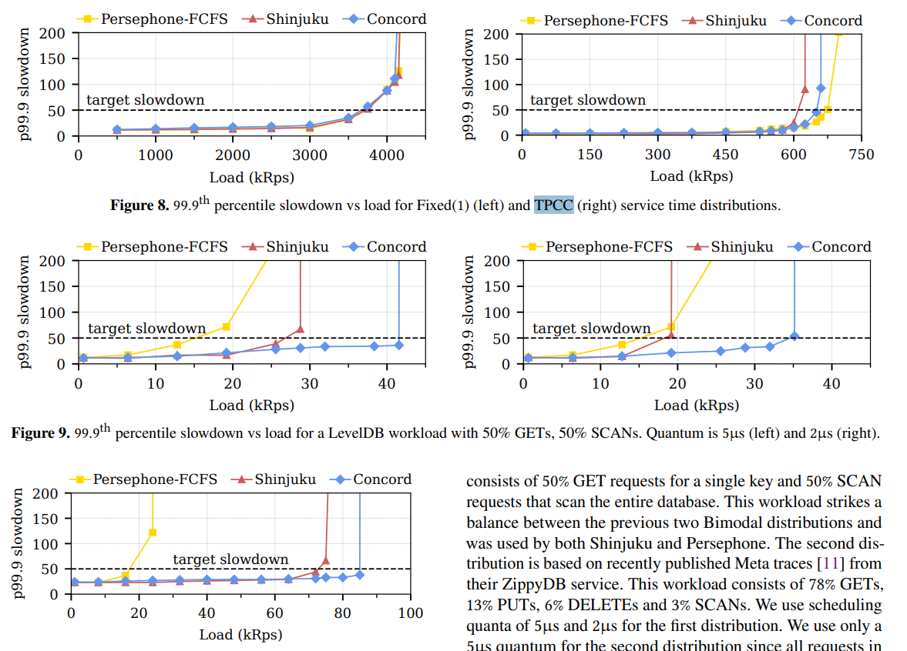
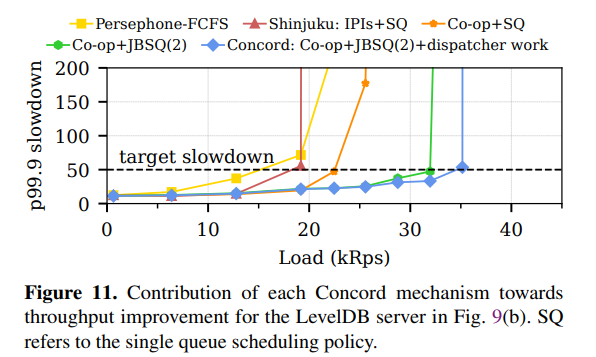

# 阅读笔记：Achieving Microsecond-Scale Tail Latency Efficiently with Approximate Optimal Scheduling

时间：2023/12/16

## 杂项

tail latency：尾延迟，指并发系统在完成任务时，因为少数单元速度较慢而产生的延迟。详见 [长尾延迟的思路，性能优化](https://zhuanlan.zhihu.com/p/475809973) 。

计算机中的poll一般指轮询。

## Introduction

### 尾延迟优化很重要

因为并行度增加、任务进一步细分的发展趋势，尾延迟优化越来越重要。

### 当前尾延迟优化技术

#### 介绍

当前最优使用排队论来优化尾延迟，先来先服务FCFS更适合light-tailed任务，处理机共享PS更适合heavy-tailed任务。单队列比多队列更能优化尾延迟。

    light-tailed和heavy-tailed分别指，在任务处理时间的分布中，尾部任务（处理时间最长的那一批）占比小和占比大的情况。

#### 弊端

现阶段，优化尾延迟和提高吞吐率间存在矛盾，优化尾延迟会导致吞吐率的降低。

同时，优化尾延迟会导致其在高负载下表现更差（更易出现饥饿）。

优化尾延迟也会导致可移植性和支持程序的通用性降低。

### 本文提出的Concord

优势：在尾延迟和吞吐率的权衡中做到了更好，并且不会损害可移植性。

#### 创新点

关键创新点：对optimal scheduling policies的估计/逼近，使新的微秒级机制成为可能。

其没有采用新的policy，而是采用新的mechanism。该mechanism可以高效地逼近现存policy。

三个机制：

1. 编译器强制协作（compiler-enforced cooperation），通过进程间异步通信来逼近精确抢占。它使Concord能够避免中断、减少抢占开销。
2. 使用Join-Bounded Shortest Queue（JBSQ）来接近单队列的表现。
3. Concord dispatcher（用来将请求加入队列的线程）是work-conserving的，可以同时逼近单队列和精确抢占。

。

    “Work-conserving” 是指系统或调度器在可行的情况下一直保持活跃，不让任何可执行的任务处于空闲状态。

#### 性能测试

和Shinjuku和Persephone比较，Concord不仅性能更好，还在未来可能实现的更小时间粒度上有更突出的表现。

其优势主要在吞吐率方面，是在达到了尾延迟要求（SLO）的条件下获得了更高的吞吐率。

### 行文结构

In the rest of the paper,

we first perform a quantitative analysis of the throughput overheads in existing systems optimized for tail latency (§2),

before using the results of the analysis to design (§3) and implement (§4) Concord.

We then evaluate Concord and demonstrate its throughput benefits (§5),

discuss its limitations and broader applicability (§6),

present related work (§7),

and conclude (§8).

## Throughput Overheads at µs Scale

研究在微秒级实现可抢占单队列（即尾延迟优化）带来的吞吐量开销。

研究对象：物理单队列系统（专门使用一个线程来调度其它线程共享的队列）

先建了一个表达吞吐量开销的数学模型（略）

在每一个调度时间单位结束时，都需要进行一次调度。而在其中，可能出现抢占导致的额外调度。

微秒级实现可抢占单队列的吞吐量开销受以下三个方面的影响。

### 对抢占的分析

列举两种实现抢占的方式（基于中断的方式、代码探测方式）：

    代码探测方式：不需要调度器，而是通过在编译期插入bookkeeping probes代码，程序自身执行bookkeeping probes来实现调度。

对于基于中断的方式，吞吐量开销正比于[核间中断（IPI）的处理时间/调度时间]，开销很大。

对于代码探测方式，需要确定合适的插入bookkeeping probes的频率。频率确定后，吞吐量开销与调度时间无关。不过开销也很大。

### 对同步线程间通信的分析

维护单物理队列需要进行调度线程和工作线程间进行同步线程间通信。

    【此处可能对我的QEMU调度器实现有帮助】多个线程同时从单队列的调度器获取任务可能出现同步问题，当前最优解决方案为：

    1. 工作进程在完成请求后设置一个标志，然后轮询专用的缓存行以获取新的请求；
    2. 调度程序持续轮询工作进程的标志，并在标志被设置后立即发送新的请求。

    该方法会造成读写标志和请求时的至少两次缓存不命中，以及可能的工作线程等待调度线程为其分配任务。

### 对专用调度器线程的分析

调度器线程完全不贡献吞吐量，因此也会造成开销。

## Design

Concord不直接使用对尾延迟优化的调度算法，而是去近似它，这样能在尾延迟增长不大的情况下明显提高吞吐量。

其三个机制见Introduce章节。

其同样使用一个分配器线程和多个工作线程。

### Compiler-Enforced Cooperation

作为IPI的替代，用于支持抢占。开销更低，不需要对硬件non-standard use，更安全。

使用专用缓存行来进行线程间通信，工作线程通过编译期插入代码的方式定期检查专用缓存行。

调度器线程负责在调度时间结束时发信息，同时决定为工作线程分配什么任务。工作线程负责进行具体的上下文切换。

该设计使得Concord可以支持各种不同调度算法。

然后讲了一大堆说明该设计为什么性能更好。

该设计以安全为先：其在线程进行外部调用或者持有锁的时候，不会进行调度。而这对性能影响不大。

### Stall-Free Workers

为了避免工作线程出现空闲，采用Join-Bounded-Shortest-Queue策略（JBSQ(𝑘)）。

每个线程有一个最大容量为k的队列，还有一个全局队列。分配器会先将任务放到每个线程的局部队列直至填满，剩余的再放进全局队列。因此，工作线程执行完一个任务后，不需等待分配器分配，可以直接进行下一个任务。

其使工作线程获取任务从pull-based变为push-based。

k不能太大，否则可能出现任务分配失衡。需要刚好大到使工作进程不会空闲。经验公式：k = ceil(cnext/S + 1)，cnext为工作进程从一个任务调度到下一个任务的时间，S为调度时间间隔。当S >= 1μs时，k = 2。

### Work-Conserving Dispatcher

调度器线程会在负载较高（所有工作线程的队列均填满）时也和工作线程一样处理任务。

对需要在调度器上运行的任务代码插入rdtsc()，使得其定期停下来执行调度工作。

因此，在Concord上运行的任务有两种代码插入：在工作线程上运行的任务插入开销较低的缓存行轮询代码；在调度器上运行的任务插入开销较高的rdtsc()。

因为在两种线程上运行的任务，插入代码不同。所以调度器线程只能从全局队列获取任务，而不能从工作线程的局部队列获取。

（有一个问题：任务难道是在运行时才决定插入何种代码吗？但插入代码不应该是在编译期完成吗？）

## Concord Prototype

讨论Concord的实现细节。

### API

- `setup()` initializes global application state

- `setup_worker(int core_num)` initializes application state for each worker thread, such as local variables
or configuration options

- `response_t* handle_request(request_t*)` processes a single application request and returns a pointer
to the response. At any particular point in time, a request is only processed by a single thread, although preemption might cause it to be served by multiple threads
over its entire service time.

### 运行时

将Concord运行时集成到已有的系统中，例如Shinjuku和Persephone，即可使它们实现Concord特性。

### 编译器

对LLVM进行修改以实现插入代码。

插入的频率大致为每200行LLVM IR一次。

## Evaluation

We evaluate Concord to answer the following questions:

- How does Concord perform across different service time distributions for which different scheduling policies are optimal? (§5.2)
- How does Concord perform for a real, latency-sensitive application? (§5.3)
- What is the contribution of each individual mechanism to Concord’s performance benefits? (§5.4)
- What are the drawbacks of Concord’s design? (§5.5)
- Do Concord’s mechanisms remain useful as datacenter server hardware evolves to provide increased support for microsecond-scale scheduling? (§5.6)

### Methodology

#### 基准

blind policies（不依赖应用级信息的policy）；采取两个在不同条件下的当前最优算法作为基准。

Shinjuku：在服务时间方差大的情况下的基准。

Persephone-FCFS：在服务时间方差小的情况下的基准。

研究对象为在Shinjuku上实现的Concord。

#### 测试环境

略

#### 负载

有人造的测试软件，有真实的应用软件。

#### 测量标准

在达到目标99.9th percentile Slowdown SLO（应该能够代表尾延迟的标准）的情况下，可达到的最大吞吐量。

### 测试结果

总之就是，Concord在目标SLO下可以承载更高的负载。

在测试TPCC负载时，Concord表现不好，文中说，因为分配器不是决定性能的瓶颈，此时Concord的抢占机制造成吞吐量上的开销成为主要因素。

### 对Concord机制的深入分析

抢占机制：开销很低，可以忽略不计，而且也比当前最优更好。

各个机制对性能提升的贡献：Compiler-Enforced Cooperation比基于中断的抢占降低了开销，JBSQ(2)减少了处理器空闲时间，调度器大部分时间空闲，也可以处理任务。

systems that cumulatively employ compiler-enforced cooperation, JBSQ(2) scheduling and a work-conserving dispatcher sustain a throughput of ≈ 22.5 kRps, ≈ 32 kRps, and ≈35 kRps, respectively.

各个机制对抢占开销降低的贡献：Compiler-Enforced Cooperation可以降低抢占通知的开销，JBSQ(2) scheduling可以降低抢占后等待下一个任务的开销。其中compiler-enforced cooperation是贡献最大的机制。

然后对比实验了一下，证明调度器处理任务确实是有用的。

### 近似调度的缺陷

在低负载下，会轻微提高尾延迟。原因是一部分任务由调度器处理，速度变慢。

### 在未来发展趋势下的表现

也很好。

## Discussion

局限性：

1. 需要任务的源代码能够被LLVM后端处理。
2. Concord原型只适用于单调度器系统。

Concord可以应用在单逻辑队列的系统上。

cooperative preemption有更广泛的用途。

## Related Work

Shinjuku，Persephone，Compiler Interrupts，还有一些应用级系统
