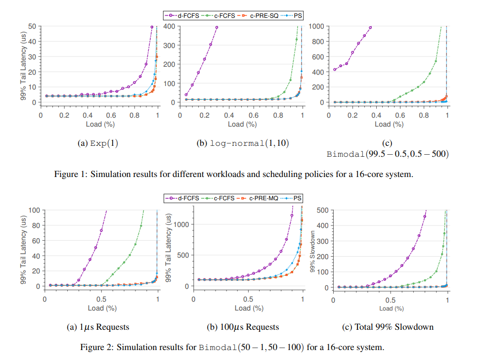
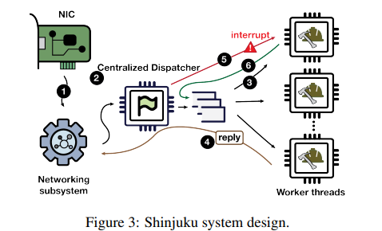
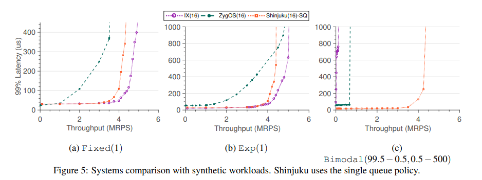
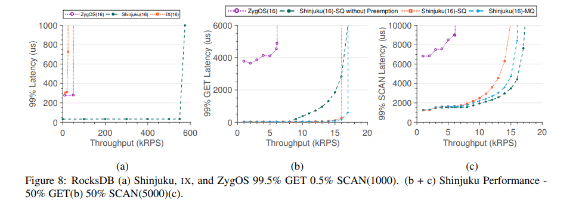

# 阅读笔记：Shinjuku: Preemptive Scheduling for µsecond-scale Tail Latency

时间：2023/12/16

## Abstract

Shinjuku通过支持抢占，相较于非抢占的调度器在吞吐量和尾延迟上获得了更好的性能。

##  Introduction

### 现有策略及问题

现有的“分布式队列和先来先服务”（d-FCFS）算法在任务处理时间方差大/heavy-tailed的情况下性能较差。同时，它也不是[work-conserving](./阅读笔记：Approximate%20Optimal%20Scheduling.md)的。

“中心化队列和先来先服务”（c-FCFS）及其近似实现（如ZygOS）同样有上面提到的问题。

为了解决这些问题，处理器共享（PS）是最好的方案。其细粒度、公平地为不同的任务分配处理器资源。

使用抢占可以近似PS。但无论Linux内核还是用户态库实现的抢占都无法达到微秒级调度的标准。

### 文章提出的策略

Shinjuku, a single-address space operating system that implements preemptive scheduling at the microsecond-scale and improves tail latency and throughput for both light- and heavy-tailed service time distributions.

Shinjuku采用的机制：
1. 不再强调receive-side scaling（RSS），
2. 真中心化调度，
3. 调度器线程已知中心化的知识/信息，
4. 使用硬件机制posted interrupts（中断虚拟化？）

Shinjuku有两种策略可选：
1. 没有关于服务时间的先验知识
2. 有先验知识，并可将请求分为不同的service level objectives（SLO）。

与当前最优（IX和ZygOS）的比较：light-tail下基本相同，heavy-tail下性能更好。

### 行文结构

§2 motivates the need for preemptive scheduling at microsecond-scale.

§3 discusses the design and implementation of Shinjuku.

§4 presents a thorough quantitative evaluation

while §5 discusses related work.

## Motivation

需要同时做到低尾延迟和高吞吐量，那就同时要求好的调度策略和低开销的实现机制。

    感想：好像现在读到的两篇论文都说系统内核自带的任务切换机制效率太低，所以对响应时间要求严格的软件都选择绕过系统，自己实现任务切换？

    协程是不是属于这种类型？

为了分析各个调度策略在理想条件下的性能，本文还写了一个单独的事件模拟器。结果表明，d-FCFS性能最差，PS在特定条件下最优。

Shinjuku采用c-PRE策略，其表现在模拟实验中最好。但它需要随时进行打断。因此，Shinjuku还需要实现低开销的打断和用户级线程切换机制。

## Shinjuku

### 设计总览

将网络子系统和任务调度分离，接受到的请求先由网络子系统处理（1），然后进入中心调度器线程（2），由其分配到各个工作线程（3）。任务会附带上下文以支持抢占操作。工作线程完成任务后，传回网络子系统（4）。

调度器通过时间戳来记录任务的运行时间。当任务运行达到抢占时间（如5微秒或15微秒）时，向工作线程发出中断，使其切换上下文，并将被抢占的任务重新排队。

各个模块中的通信使用共享内存（配合专用缓存行）。

### 快抢占

经过好几种方案的比较和改进，最后选用了优化的中断发送方法来进行抢占的通知。Shinjuku直接访问物理Advanced Programmable Interrupt Controller（APIC），从而直接发送中断，不需退出虚拟机（VM exit）。

### 低开销上下文切换

为了减少上下文切换的开销，Shinjuku进行了一些流程简化：在Linux `swapcontext`的基础上，不设置信号掩码（signal mask），不保存和恢复浮点寄存器。因此，任务也需满足一些要求。

### 抢占调度

本文设计了两种调度策略。它们在低方差的负载上近似c-FCFS，在其它情况下近似PS。

#### 单队列（SQ）策略

所有任务没有优先级区分，也具有相同的尾递归SLO。它们共用一个队列。

#### 多队列（MQ）策略

任务根据类型放入不同的队列。处理器出现空闲时，先选择一个队列，再处理其队首的任务。

队列选择算法：基于BVT，计算每个任务的warp factor来代表优先级。

偏向于选择时间短的任务，但也要考虑已经等待一段时间的时间长的任务。

优先级=已排队时间/SLO目标延迟，高者优先

## Evaluation

与IX、ZygOS进行对比

### 在人造负载上的比较

负载方差小时，IX延迟最低，Shinjuku接近IX；负载方差大时，Shinjuku延迟明显低于另外两者。

### 分析

经常打断有多重要？打断频率越高，Shinjuku在减少尾延迟方面效果越好。

可扩展性如何？Shinjuku可以通过使用2个或多个调度器线程来适应更高的线程数和更高的带宽。

### 在RocksDB上的比较

Shinjuku性能优于ZygOS和IX。

对不同配置的Shinjuku进行对比，无抢占的SQ策略更适合长请求，而有抢占的SQ更适合短请求。有抢占的MQ在有抢占的SQ基础上，在长短请求方面均有提升，但短请求不如无抢占的SQ。

