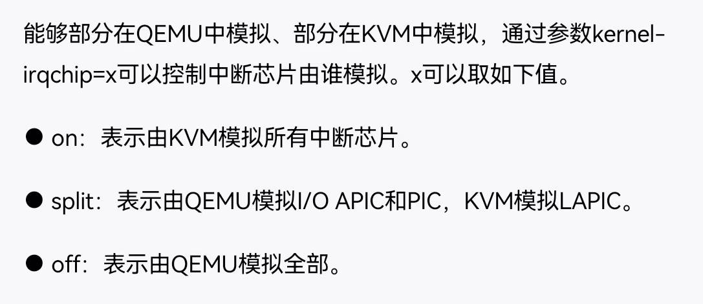
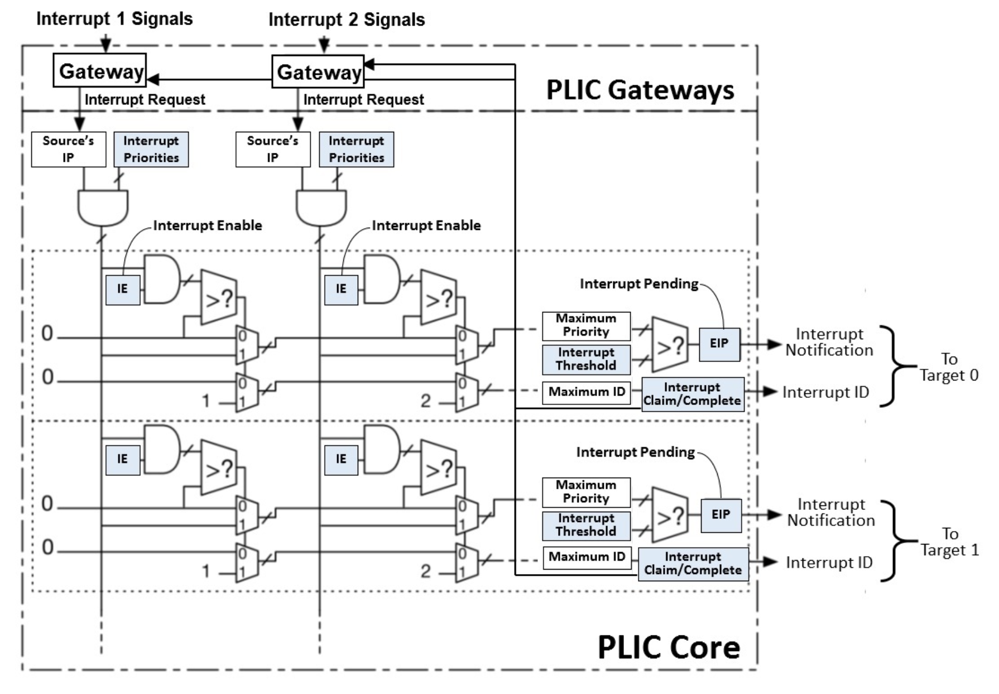

# 关于plic的源码阅读

时间：2023/12/29

中断控制器可以选择在QEMU中、KVM中、还是部分在QEMU中、部分在KVM中。

在KVM中模拟，性能最好

## plic示意图

本次目标：了解设备如何将中断线连接到plic，以及plic与CPU之间是否有除了MMIO之外的通信方式（例如中断通知？），以在之后，在我的调度器中实现这两个机制。

## plic在virt设备中的注册

关于注册中断控制器的代码，出现在了`hw/riscv/virt.c`的以下位置：

- 86行，`virt_memmap`数组的初始化中的`VIRT_PLIC`。注册设备在MMIO中的内存空间。
- 452行，`create_fdt_socket_plic`函数。创建plic设备的fdt节点。
- 823行，`create_fdt_sockets`函数。调用了`create_fdt_socket_plic`函数。
- 1169行，`virt_create_plic`函数。负责创建plic设备。
- 1474行，`virt_machine_init`函数。其将`virt_create_plic`函数创建的plic设备放入virt设备的`irqchip`变量。注意：irqchip和plic都是每个“socket”一个，“socket”是什么？是指一个CPU吗？
- 1563行，`virt_machine_init`函数。这句应该是，把串口的中断线连到了plic上。这句中的`mmio_irqchip`就是之前的`irqchip`，也就是plic。

应该也许只要在这些地方做修改，就能实现中断控制器的功能？