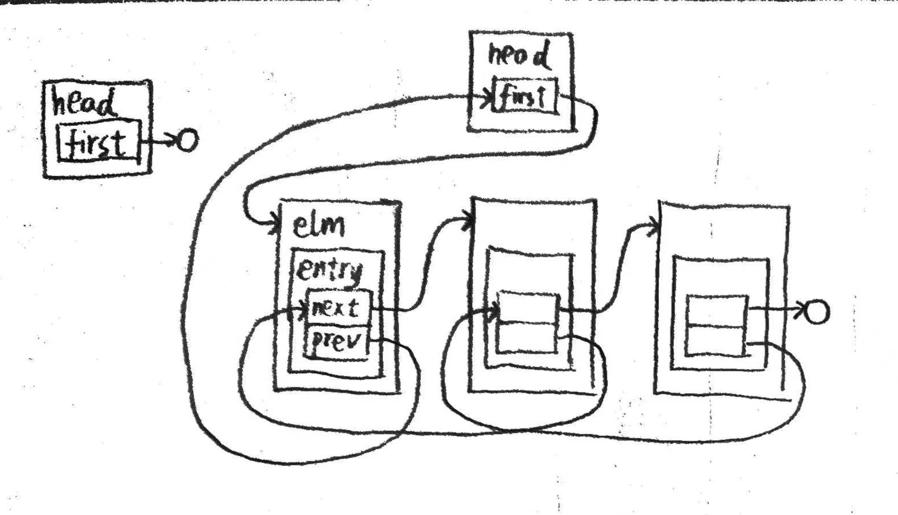
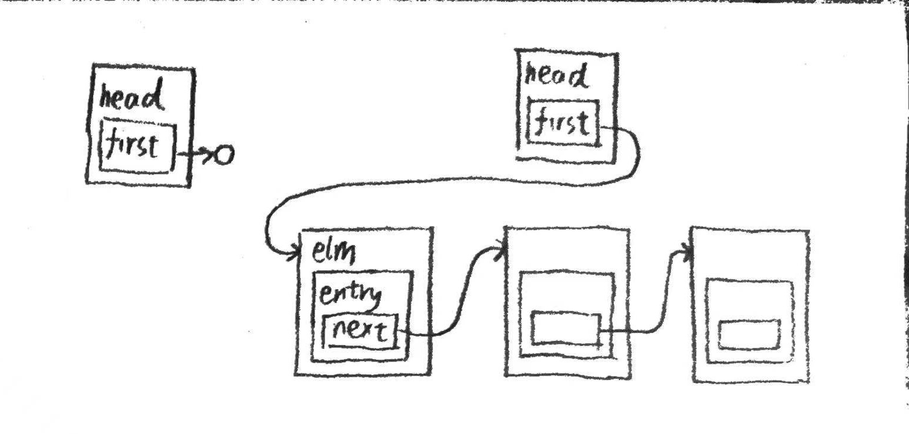
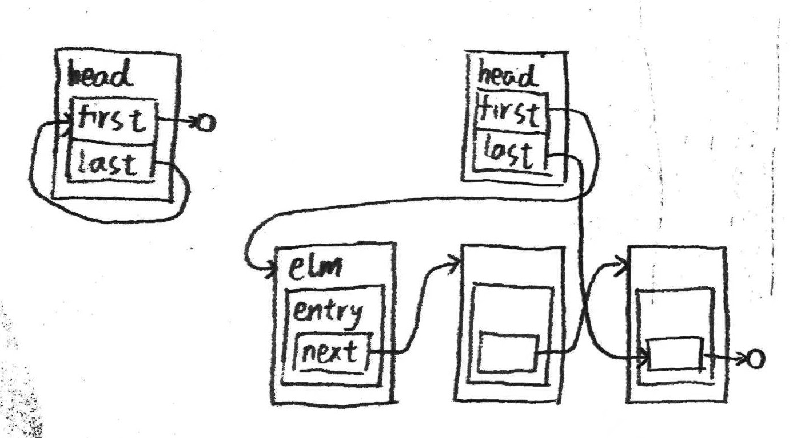
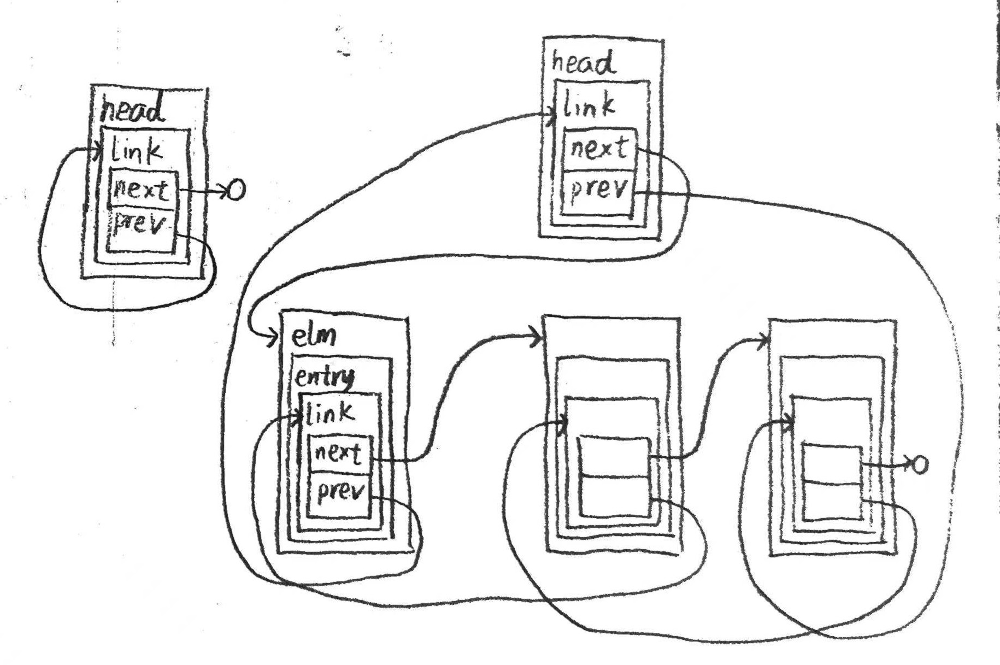

# queue.h源码阅读

时间：2024/1/14

文件路径：\<qemu根目录\>/include/qemu/queue.h

## 简介

包含4种数据结构：
- 单链表（singly-linked list/`QSLIST`）
- 列表（list/`QLIST`）
- 简单队列（simple queue/`QSIMPLEQ`）
- 尾队列（tail queue/）

它们的介绍：

**单链表**：head节点只指向列表头，链表元素为单向指针。移除头部元素需要用一个宏。

**列表**：head节点只指向列表头，元素为双向指针。可以任意删除元素，但只能单向遍历。

**简单队列**：head节点指向队列头和尾，元素为单向指针。只能从队列头删除元素。

**尾队列**：head节点指向队列头和尾，元素为双向指针。可以任意删除和添加元素，可以双向遍历。

## `head`、`entry`、`elm`、`type`和`field`

这些是实现四种列表时用到的概念。

`head`是四种列表的头节点，不存储数据，同时用该节点代表整个列表。

`elm`是列表元素（非head节点）这一整体，包括数据部分和指针部分。

`entry`是列表元素（非head节点）的指针部分，用于维护数据的链接关系。

`type`是`elm`的类型名。

`field`是`elm`中的一个`entry`类型的字段名，代表`elm`的指针部分。

其中，`type`是类型名称，`elm`是具体的对象。`elm.field`就是`entry`。

## 列表

### 内存布局

空列表和非空列表的内存布局如下：



### 方法

下文列出的“函数”其实都是宏，只是写成了函数的形式我好阅读一些（）

“函数”的参数若无特殊说明，则除了field以外都是指针。

```C
void QLIST_INIT(head);
// 根据两个同类列表的head的指针，交换两个head指向的列表。
// dstlist和srclist均为head对象的指针。
void QLIST_SWAP(dstlist, srclist, field);
// listelm为列表中，作为插入基准的elm对象的指针
void QLIST_INSERT_AFTER(listelm, elm, field);
void QLIST_INSERT_BEFORE(listelm, elm, field);
void QLIST_INSERT_HEAD(head, elm, field);
// QLIST_REMOVE需要确保elm在列表中，而QLIST_SAFE_REMOVE不需要
void QLIST_REMOVE(elm, field);
void QLIST_SAFE_REMOVE(elm, field);
int QLIST_IS_INSERTED(elm, field);
// FOREACH系列的宏可以生成for语句，在后面加大括号就能循环（真是把C语言玩出花了……）
// var为循环中依次指向每个entry的指针
QLIST_FOREACH(var, head, field) {/*循环代码*/}
// 使用QLIST_FOREACH_SAFE可以一边遍历一边删除当前项，而QLIST_FOREACH不行
QLIST_FOREACH_SAFE(var, head, field, next_var) {/*循环代码*/}
// 判断列表是否为空
int QSLIST_EMPTY(head);
type *QSLIST_FIRST(head);
type *QSLIST_NEXT(elm, field);
```

### 用例

```C
// 创建类型名称
typedef QLIST_HEAD(, myElm) myHead;
struct myElm {
        int myData;
        QLIST_ENTRY(myElm) myEntry;
}

//创建对象
myHead head;
QLIST_INIT(head); //head要先初始化再使用
myElm elm;
QSLIST_INSERT_HEAD(head, elm, myEntry)
```

## 单链表

### 内存布局

空链表和非空链表的内存布局如下：



### 方法

下文列出的“函数”其实都是宏，只是写成了函数的形式我好阅读一些。

“函数”的参数若无特殊说明，则除了type和field以外都是指针。

```C
void QSLIST_INIT(head);
// listelm为链表中，作为插入基准的elm对象的指针
void QSLIST_INSERT_AFTER(slistelm, elm, field);
void QSLIST_INSERT_HEAD(head, elm, field);
void QSLIST_INSERT_HEAD_ATOMIC(head, elm, field);
// src和dest均为head地指针
// 原子地将src指向的链表移动到dest，移动后src为空，dest原本指向的链表被丢弃
void QSLIST_MOVE_ATOMIC(dest, src);
void QSLIST_REMOVE_HEAD(head, field);
void QSLIST_REMOVE_AFTER(slistelm, field);
void QSLIST_REMOVE(head, elm, type, field);
// FOREACH系列后接大括号即可循环
QSLIST_FOREACH(var, head, field) {/*循环代码*/}
// 使用QSLIST_FOREACH_SAFE可以一边遍历一边删除当前项，而QSLIST_FOREACH不行
QSLIST_FOREACH_SAFE(var, head, field, tvar) {/*循环代码*/}
// 判断链表是否为空
int QSLIST_EMPTY(head);
type *QSLIST_FIRST(head);
type *QSLIST_NEXT(elm, field);
```

### 用例

```C
// 创建类型名称
typedef QSLIST_HEAD(, myElm) myHead;
struct myElm {
        int myData;
        QSLIST_ENTRY(myElm) myEntry;
}

//创建对象
myHead head;
QSLIST_INIT(head); //head要先初始化再使用
myElm elm;
QSLIST_INSERT_HEAD(head, elm, myEntry)
```

## 简单队列

### 内存布局

空队列和非空队列的内存布局如下：



### 方法

下文列出的“函数”其实都是宏，只是写成了函数的形式我好阅读一些。

“函数”的参数若无特殊说明，则除了type和field以外都是指针。

```C
void QSIMPLEQ_INIT(head);
void QSIMPLEQ_INSERT_HEAD(head, elm, field);
void QSIMPLEQ_INSERT_TAIL(head, elm, field);
// listelm为队列中，作为插入基准的elm对象的指针
void QSIMPLEQ_INSERT_AFTER(head, listelm, elm, field);
// 需保证head指向的队列非空
void QSIMPLEQ_REMOVE_HEAD(head, field);
// 在队列中的elm之后切分，将原队列分成两个队列（划分后的队列可以为空）
// removed为一个head类型的指针
// 队列划分后，removed指向前半部分的队列，head指向后半部分的队列
void QSIMPLEQ_SPLIT_AFTER(head, elm, field, removed);
void QSIMPLEQ_REMOVE(head, elm, type, field);
// FOREACH系列后接大括号即可循环
QSIMPLEQ_FOREACH(var, head, field) {/*循环代码*/}
// 使用QSIMPLEQ_FOREACH_SAFE可以一边遍历一边删除当前项，而QSIMPLEQ_FOREACH不行
QSIMPLEQ_FOREACH_SAFE(var, head, field, next) {/*循环代码*/}
// 将head2指向的队列连接在head1后面，清空head2
void QSIMPLEQ_CONCAT(head1, head2);
// 将head2指向的队列连接在head1前面，清空head2
void QSIMPLEQ_PREPEND(head1, head2);
type *QSIMPLEQ_LAST(head, type, field);
// 判断队列是否为空
int QSIMPLEQ_EMPTY_ATOMIC(head);
int QSIMPLEQ_EMPTY(head);
type *QSIMPLEQ_FIRST(head);
type *QSIMPLEQ_NEXT(elm, field);
```

### 用例

```C
// 创建类型名称
typedef QSIMPLEQ_HEAD(, myElm) myHead;
struct myElm {
        int myData;
        QSIMPLEQ_ENTRY(myElm) myEntry;
}

//创建对象
myHead head;
QSIMPLEQ_INIT(head); //head要先初始化再使用
myElm elm;
QSIMPLEQ_INSERT_HEAD(head, elm, myEntry)
```

## 尾队列

### 内存布局

空尾队列和非空尾队列的内存布局如下：



这里多套了一层（link，prev不再指向next而是指向link）是为了实现反向遍历。

### 方法

下文列出的“函数”其实都是宏，只是写成了函数的形式我好阅读一些。

“函数”的参数若无特殊说明，则除了type和field以外都是指针。

```C
void QTAILQ_INIT(head);
void QTAILQ_INSERT_HEAD(head, elm, field);
void QTAILQ_INSERT_TAIL(head, elm, field);
// listelm为尾队列中，作为插入基准的elm对象的指针
void QTAILQ_INSERT_AFTER(head, listelm, elm, field);
void QTAILQ_INSERT_BEFORE(listelm, elm, field);
void QTAILQ_REMOVE(head, elm, field);
// left和right均为head上的尾队列中的elm
// 删除left和right之间（包含left和right）的元素
void QTAILQ_REMOVE_SEVERAL(head, left, right, field);
// FOREACH系列后接大括号即可循环
QTAILQ_FOREACH(var, head, field) {/*循环代码*/}
// 使用QTAILQ_FOREACH_SAFE可以一边遍历一边删除当前项，而QTAILQ_FOREACH不行，QTAILQ_FOREACH_REVERSE和QTAILQ_FOREACH_REVERSE_SAFE同理
QTAILQ_FOREACH_SAFE(var, head, field, next_var) {/*循环代码*/}
QTAILQ_FOREACH_REVERSE(var, head, field) {/*循环代码*/}
QTAILQ_FOREACH_REVERSE_SAFE(var, head, field, prev_var) {/*循环代码*/}
// 判断尾队列是否为空
int QTAILQ_EMPTY(head);
type *QTAILQ_FIRST(head);
type *QTAILQ_NEXT(elm, field);
// 判断elm是否在尾队列中
int QTAILQ_IN_USE(elm, field);
// 根据一个link，获取其前一个elm的指针
// 对尾队列第一个elm的link使用，得到NULL
// 对head的link使用，得到尾队列最后一个elm
// link对用户是透明的，可以不使用这个宏，而是使用QTAILQ_PREV
type *QTAILQ_LINK_PREV(link);
type *QTAILQ_LAST(head);
type *QTAILQ_PREV(elm, field);
```

### 用例

```C
// 创建类型名称
typedef QTAILQ_HEAD(, myElm) myHead;
struct myElm {
        int myData;
        QTAILQ_ENTRY(myElm) myEntry;
}

//创建对象
myHead head;
QTAILQ_INIT(head); //head要先初始化再使用
myElm elm;
QTAILQ_INSERT_HEAD(head, elm, myEntry)
```