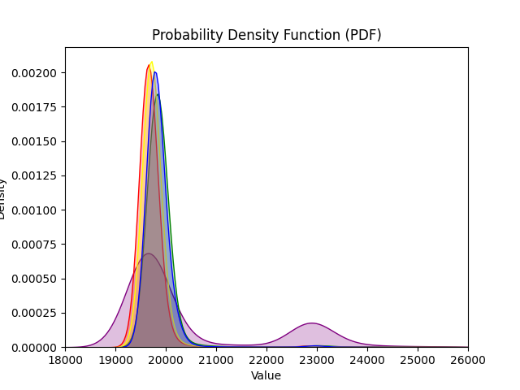
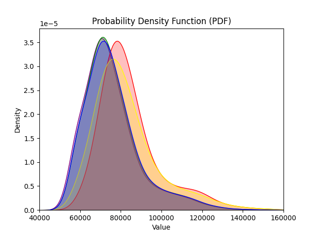

# trait接口测试记录

时间：2024/11/27

## 测试方式

采用学长之前的测试代码，测试不同的async trait接口实现下，打开并读取一个大文件的时间。

不过，原本代码中，文件的打开和读取过程中没有使用await，即，接口完全使用同步函数实现。为了补充接口实现使用异步函数后，各种接口类型的运行时间，我又将测试环境换成了async-std提供的协程运行时，将文件的打开和读取换成async-std提供的异步函数。在两种环境下均进行了测试。

## 代码仓库

[https://github.com/rosy233333/evaluation](https://github.com/rosy233333/evaluation)

## std测试结果

|实现方式|平均时间（ns）|标准差（ns）|
|-|-|-|
|async-trait|20666|5082|
|stack future|19982|1889|
|static dispatch|19782|1778|
|AFIT static dispatch|19837|1535|
|dynosaur|19927|1632|

平均时间从低到高：static dispatch < AFIT static dispatch < dynosaur < stack future < async-trait

密度分布函数：

红色：static dispatch

黄色：AFIT static dispatch

紫色：async-trait

蓝色：dynosaur

绿色：stack future

图中的峰值时间从低到高：static dispatch ≈ async-trait < AFIT static dispatch < dynosaur < stack future

## async-std测试结果

|实现方式|平均时间（ns）|标准差（ns）|
|-|-|-|
|async-trait|75521|15061|
|stack future|76164|24028|
|static dispatch|84772|17053|
|AFIT static dispatch|82988|17655|
|dynosaur|76343|15374|

平均时间从低到高：async-trait < stack future < dynosaur < AFIT static dispatch < static dispatch

密度分布函数：

（代表各种实现方式的颜色与上一张图相同）

图中的峰值时间从低到高：async-trait < stack future < dynosaur < AFIT static dispatch < static dispatch

## 实验结论

1. **使用静态分发的接口类型不适合带有异步函数的接口实现。** 为了用poll函数重写原本用async函数提供的接口，需要将状态保存在实现该trait的对象中，即在对象中保存Future，增加了实现的复杂度。一方面，async调用->poll接口->async实现的多级转化大大增加了开销（从而导致静态分发在async-std测试中用时明显长于其它实现）；另一方面，如果接口中包含局部生命周期的参数，则它的生命周期与包含Future的对象的生命周期无法适配，从而导致编译不通过。（在实验中，我是通过将引用类型的参数转化为裸指针再传入Future来解决的）
2. 不过，在合适的场景（接口实现不包含异步函数）中，静态分发可以在接口调用时获得更低的开销，因为它不需要对Future进行额外的内存分配。
3. 三种需要额外内存分配的接口类型，在std和async-std测试下的用时具有相反的排序。可能是因为std下的测试更注重衡量Future创建时的开销，async-std下的测试更注重测量Future调用时的开销。（后者的调用次数多于前者）