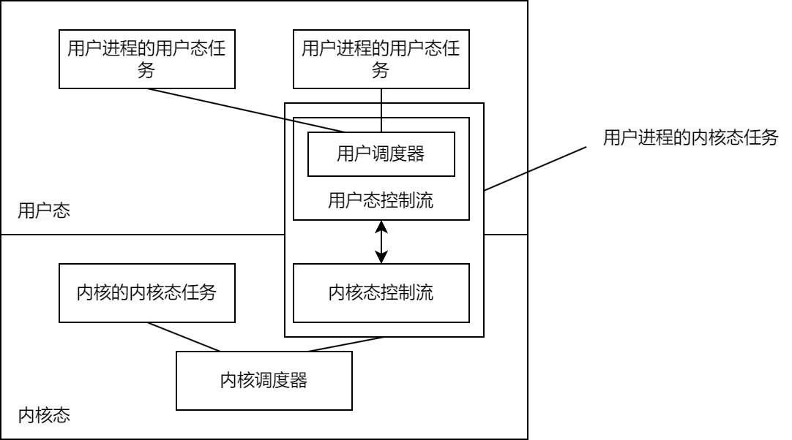

# 共享调度器设计文档

时间：2024.12.30

## 设计目标

在AsyncOS上实现用户态任务（用户进程的用户态线程/协程）和内核态任务（内核线程/协程、用户进程的内核态线程/协程）的统一调度。体现在两方面：

1. 使用相同的任务管理模块管理以上两种任务，实现数据结构、函数方面的通用。
2. 使用户态任务的优先级可以及时反映在对应的内核态任务中，从而实现实时性更高的优先级调度。

## 阶段1：实现以上两个目标

**任务与调度器的关系**：所有内核态任务（无论其属于用户进程或内核）位于同一个调度器（与AsyncOS当前实现一致），每个用户进程的用户态任务位于一个调度器中。

**调度器与就绪队列的关系**：对于多核访问内核调度器，以及用户进程的多个内核态线程访问同一用户态调度器的情况，将原本的单队列实现修改为多队列实现（内核调度器的每个CPU核心/用户调度器的每个内核态线程访问一个就绪队列）。这样修改的原因是为了更好地支持后续的thread per core实现。

对于**用户进程的内核态任务**的设计：该任务具有内核态代码和用户态代码，其中内核态代码负责设置自身优先级、在合适时机（没有用户态任务需要执行）时阻塞，以及特权级切换时的其它要处理的事情；用户态代码负责维护和运行用户态调度器、运行其中的用户态任务。

**数据结构、函数共享的实现**：

采用vDSO实现，分别在用户和内核空间中存储自己的调度器，并对外提供调度器的首地址。vDSO中的代码通过首地址访问调度器，从而进行用户态或内核态的任务调度。

**优先级统一的实现**：先采用COPS的实现。

#### 实现步骤

首先修改内核原本代码，使得：调度相关代码可以通过vDSO共享到用户态；通过传入首地址等方式，使调度代码支持用户态调度器和内核态调度器。

再通过vDSO实现代码共享，并在用户态实现用户态任务管理。

再将单队列实现修改为多队列实现。

### 确认原本内核代码的修改范围

当前，调度相关代码大部分位于trampoline模块中。

“取出任务-执行任务”这一循环的核心代码是`trampoline`函数和`run_task`函数。

- [x] 用户态的任务调度会使用户进程的内核态任务进入用户态后调用`trampoline`函数，这部分的代码逻辑与内核启动时调用`trampoline`函数类似。在该情况下，需要修改调用了`axhal::arch::wait_for_irqs()`的位置，因为用户态无法进行这些特权操作。
- 用户态的一般任务调度不会再次调用`trampoline`函数，只会在`trampoline`函数的一次调用中循环。
- [x] 在`run_task`函数中，需要修改`if curr.is_init()`判断后的执行代码：如果在内核，则关闭系统；如果在用户态，则结束对应进程。

[ ] 调度过程中会涉及CurrentTask和CurrentExecutor两个全局变量。需要修改成可被vDSO共享的模式。[ ] 并且，需要将CurrentExecutor修改为CurrentScheduler，解除Executor和Scheduler的绑定。（因为在AsyncOS中，Executor只是代表进程，而并不具备任务调度功能。）

[ ] 对任务的各种操作，体现在`task_api`库定义的接口和`trampoline`库定义的实现中。其中使用了`crate_interface`库进行接口定义与实现，要求定义与实现的两个库在一起编译。因此，需要将`trampoline`放置于vDSO中（此时就无法与`task_api`在一起编译了），再在内核态和用户态重新提供“调用vDSO以实现`task_api`”的代码。

[ ] 不会将完整的`trampoline`库移入vDSO，而会将其中一些功能移动到其它库中。这包括FS初始化和executor模块初始化（包括executor会使用的的用户进程内核线程内核代码`user_task_top`）

[ ] 在`trampoline`库中还会涉及到引用的其它库，目前不知道能否一起放入vDSO中。

[ ] 除了`task_api`以外，内核可能会依赖其它的任务管理接口（例如`executor::spawn_raw`，这个函数涉及了泛型，因此不知道能否放入crate_interface中），因此可能需要调整task_api；`trampoline`的任务调度过程可能会涉及一些进程操作（例如，退出用户进程），因此需要理清`trampoline`（在vDSO中共享）和`executor`（只在内核提供）分别对外、对互相提供哪些api

||trampoline|executor|
|-|-|-|
|向对方提供的API|无|init、CurrentExecutor|
|向其它内核模块提供的API|||

### 修改方案，在vDSO中只放置调度器和trap相关内容

#### 调度器部分

在vDSO中管理当前调度器（每个CPU分别管理），提供创建调度器、切换调度器、向当前调度器中放入取出任务的接口。

内核中，只需修改用到了当前调度器的部分即可。

用户态，需要修改Executor里使用的调度器。

使用Map将进程的用户态调度器与内核态任务关联，从而实现优先级实时更新；更新任务优先级时，通过Scheduler自带的接口判断是否需要抢占（需要在Scheduler接口中增加获取最高优先级的接口）。

#### 中断部分

## 阶段2：增加对thread per core的支持

起因：原有的调度方式，在同一用户态进程具有多个内核态线程时，可能出现同一CPU核心上，这些线程相互调度的情况。该情况，虽然是同一个用户态进程，但切换需要进入内核态，因此需要避免该情况，使同一用户态进程在每个CPU核心上只有一个内核态线程。

为了实现高效的thread per core，需要保证：用户进程内的所有操作（例如I/O、系统调用、同步操作）不会阻塞内核态任务。

用户进程具有两种创建任务的接口：在当前核心创建用户态任务，以及在另一核心创建用户态任务：

1. 如果某个CPU核心上没有该进程的内核态任务，则在该核心上创建内核态任务，并在其调度队列上创建用户态任务。【这时，创建的用户态任务的行为类似于直接创建内核态任务】
2. 如果所有CPU核心上均有该进程的内核态任务，则创建用户态任务，并加入进程在某个核心（的内核态任务）上的调度队列。

用户进程只具有和用户态任务有关的接口，没有直接控制内核态任务的接口（但可以用以上接口间接创建内核态任务）。
