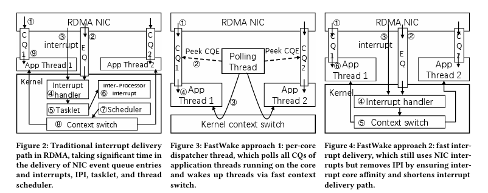

# FastWake论文阅读笔记

时间：2024/3/28

原文：[https://dl.acm.org/doi/abs/10.1145/3600061.3600063](https://dl.acm.org/doi/abs/10.1145/3600061.3600063)

## 摘要

中断和轮询模式的对比：中断模式允许在线程间共享处理器，但中断模式比轮询模式开销更大。（疑问：如果建立一个轮询线程，负责轮询网卡、接收结果、唤醒阻塞的任务，不是也能在线程间共享处理器吗？）

FastWake，对中断模式的RDMA网络栈的重新设计。（RDMA模式的网络栈和正常的TCP/IP不同）

方法1：完全移除中断，使用与核心一一对应的调度器线程，轮询同一核心上所有线程的任务队列，然后使用kernel fast path上下文切换到“completion event已经到来”的线程。拥有基本等同于轮询模式的性能，但它会使CPU时刻以100%利用率运行，因此有更节能的方法2。

方法2：因为使用中断唤醒相同核上的线程，比唤醒不同核上的线程更快，因此调整了RDMA事件队列映射，提高中断的核亲和性。之后，还修改了线程唤醒的内核路径，移除了tasklet、获取锁、进程切换的开销。

## 简介

一些应用场景，为了在多个线程间共享处理器时间，需要使用中断模式，但中断模式开销（6~10us）大于轮询模式（1.6us）。（“the killer microseconds”）

这个开销在TCP/IP协议栈中不受关注，因为协议栈本身的开销更大（>20us）。但在低延迟的RDMA中，就需要关注该开销了。

分享RDMA中断模式的开销，发现中断对核的亲和性很重要（相同核4us，不同核7~10us）。但即使在相同核上触发中断，开销仍然较大。

两种方案，一种完全移除中断，但提高了耗能；另一种降低中断时延，且对耗能的提高不明显。见摘要。

该方案兼容已有的RDMA应用。此外，该方案还提供了一种新的IPC机制。

## 背景

由于数据中心采用了RPC（远程过程调用），大大增加了一次轮询的开销，因此使用忙轮询直到任务完成的方式会显著浪费CPU资源。

解决时延问题：编程语言层面、操作系统层面、硬件架构层面。编程语言层面：协程，但它们存在限制了使用的编程语言、需要将系统的阻塞API重写成协程API等限制。操作系统层面：通过加速上下文切换、绕过调度器等方法减少IPC开销、利用硬件虚拟化，但它们聚焦于IPC，无法减少中断传递的时延（？）。硬件架构层面：新的硬件架构以单线程性能为代价加速上下文切换，但它们还未准备好部署。

之后都是对RDMA机制的介绍，感觉目前可以不看？

## 设计

可在商用硬件和Linux上工作，且不需要修改已有的RDMA应用。

CQ：完成队列；EQ：事件队列

### 方法1

基于：上下文切换比中断更快。

让用户进程直接读CQE不太安全，因此，调度线程放在内核中。

Linux内核不支持快速上下文切换到指定线程。因此设计了新的系统调用`switch_to(pid)`，在不访问内核调度器的情况下切换线程。其只能切换到相同核上的线程。

该调度线程在一个守护进程中运行，通过共享内存访问其它进程的CQ。

优点是开销小，缺点是让CPU时刻满负荷运行。

### 方法2

实现中断亲核性：CQ在创建时绑定一个completion vector（用于确定该事件的完成会唤醒哪个线程），该向量决定中断被送往哪个核。

使用了RDMA NICs的“CQ-to-EQ remapping”功能。允许将完成向量更改到另一个核。

缩短中断传递路径：完全在“top half”处理中断，消除tasklet的开销。同时，简化了完成通道（completion channel）内核数据结构，去除了锁。

简化切换任务的机制，不调用原有API和内核调度器，而是直接将线程放到运行队列的最前端，然后切换上下文。

同时，修改了CQ的存储方式（存储指针改为存储值），省略了同步的开销。

## 实现

使用5000行代码，包含了对OFED的修改，以及用户态守护进程。

作为副产物，FastWake也实现了快速IPC：两个系统调用`hibernate() `和`wake_up_process(pid)`。前者使进程睡眠（进入中断等待态），直到被后者唤醒。唤醒的原理：先检查被唤醒进程是否和自己在同一核上，若是则直接唤醒；若非则发起核间中断来唤醒。

## 评估

即使中断和进程已在同一核上的情况，FastWake的中断模式也快于传统的中断模式。

## 讨论

硬件可行性：主要是CQ-to-EQ机制的问题，只有Mellanox NIC支持该机制。

调度公平性：通过绕过内核调度器直接切换任务，隐式提高了任务的优先级，但其优先级仍比其它run queue上的更高优先级任务低。

未来工作：在高负载核真实情况下的评估、协程支持。

## 我的评价

由于我需要使用`smoltcp`中的`poll`方法，这里提到的轮询模式，使用一个专门的协程来`poll`的确可行。至于中断模式的方法，我们的网络实现，应该和亲核性没有什么关系？因此，就使用原来的方案就可。