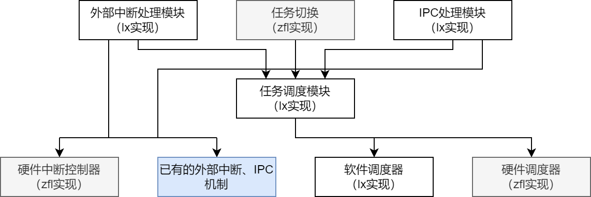

# 项目描述文档

时间：2024/7/12

## 历史版本

第一版：[97d7cca](https://gitee.com/LC_rosy/weekly-progress/blob/94d7cca6c2da299e1dfc9adb1a271d1f475b9c46/24.6.26~24.7.2/%E9%A1%B9%E7%9B%AE%E8%AE%BE%E8%AE%A1.md)

## 项目描述

编写不与特定操作系统绑定、适用于多种基于 Rust 语言的操作系统（下文称为 Rust 操作系统）的任务调度模块。它可以直接作为 Rust 操作系统的组件，从而方便 Rust 操作系统的开发。

## 架构和分工

项目中，我负责实现的部分为任务调度、外部中断处理、IPC处理三个功能。它们可以使用软件实现，也可以调用学长的硬件实现。这些模块与学长实现的切换机制结合，可以组成通用的任务管理、外部中断处理、IPC处理模块。

项目的整体结构和分工如下图：

## 功能目标

基础功能：

- [ ] 向操作系统提供描述任务的接口和使用调度器的接口
- [ ] 队列管理功能（就绪队列、阻塞队列）

需优先实现/提早考虑的扩展功能：

- [ ] 支持hypervisor、操作系统、进程、线程、协程的多级调度
- [ ] 与[学长的工作](https://github.com/ATS-INTC/moic)结合，支持学长的硬件调度器

一般扩展功能：

- [ ] 提供任务调度算法的接口，支持多种任务调度算法
- [ ] 支持多核
- [ ] 支持优先级调度

## 比赛目标和计划

目标：

- [ ] 开发满足功能目标的调度框架
- [ ] 将arceos、alien或rcore的任务调度模块改为使用该框架实现，证明该框架的可移植性。

计划：

- 7.2 ~ 7.8     细化设计
- 7.9 ~ 7.15    实现基于硬件调度器的任务调度模块，尽快与学长对接
- 7.16 ~ 7.21   实现软件调度器
- 7.22 ~ 7.28   移植到系统中；准备总结文档和演示视频

## 项目设计

### feature

采用 Rust 语言的 `feature` 功能，实现对一些调度功能的选择性支持。

由于这些功能可能会降低任务调度模块的通用性（例如，外部中断处理功能可能会和具体的硬件架构绑定），因此将它们作为 `feature` 实现。

计划实现这些feature：

- `ext_intr`：外部中断处理功能
- `ipc`：进程间通信功能
- `moic`：使用zfl学长设计的硬件 `MOIC` 实现任务调度、中断处理和IPC
- `priority`：支持任务优先级

不同的 `feature` 可以各自独立启用或任意组合启用。这说明，对于外部中断和IPC功能，本项目需要实现软件方案，同时兼容zfl学长的硬件方案。

### `Task`

#### 介绍

该数据结构代表任务，且可以代表不同种类的任务（如hypervisor、os、进程、线程、协程）。该数据结构的具体实现由学长实现的任务切换机制完成，在任务调度模块中，我们认为`Task`可以是任意类型。

本项目的各个模块均使用泛型，以支持不同类型的`Task`。

### 任务调度模块

本模块包含`Current`、`Scheduler`和`BlockQueue`三个类型，从而提供任务调度功能。

`Current`为模块提供的全局变量，与CPU核心绑定，表示CPU当前执行的任务。

`Scheduler`为模块提供的全局变量，与地址空间绑定，表示地址空间所有者（如os内核、用户进程）的内部调度器。

`BlockQueue`由用户创建，根据用户需求在全局或局部作用域中使用。

#### `Current`

用于标识当前正在运行的任务的TCB。

似乎arceos里使用了riscv的tp（x4）寄存器保存当前任务，不知道本模块中能否使用？

#### `Scheduler`

调度器负责管理就绪和运行的任务，并且从中取出任务运行。

如果启用了 `moic` feature ，则可以利用 `MOIC` 硬件进行调度。

##### 方法

`add(&mut self, task: Task)`

向调度器中加入任务。

`fetch(&mut self) -> Task`

从调度器中取出下一个运行的任务。

`remove(&mut self, task: Task)`

从调度器中删除一个任务。

`ready_tasks(&self) -> &[&Task]`

获取调度器中就绪的所有任务。

该接口还未完全确定，同时，`moic_driver`似乎还没有该功能对应的接口。

#### `BlockQueue`

阻塞队列用于存放因相同原因阻塞的一系列任务，并唤醒它们。

在启用`moic` feature的情况下，也可能会使用这里的队列。此时，系统中存在两种阻塞队列：`moic`中的硬件队列，以及此处定义的软件队列。

##### 方法

`add(&mut self, task: Task)`

向阻塞队列中加入任务。

`add_with_cond(&mut self, task: Task, cond: Box<dyn Fn() -> bool>)`

若Fn为假，向阻塞队列中加入任务。该任务只有在Fn为真时才会被唤醒。

`wake_one(&mut self)`

唤醒阻塞队列中的一个任务。

该接口还未完全确定，因为尚不清楚调度器和阻塞队列的关系，不知道阻塞队列如何将任务放入调度器中。

`wake_all(&mut self)`

唤醒阻塞队列中的所有任务。

该接口还未完全确定，因为尚不清楚调度器和阻塞队列的关系，不知道阻塞队列如何将任务放入调度器中。

`block_tasks(&self) -> &[&Task]`

获取阻塞队列中的所有任务。

该接口还未完全确定，主要是不确定获取的任务是什么形式，而且不知道会不会破坏“每个任务在内存中同时有且只有一个实例”的条件。

### 软件调度器

该模块用于在软件层次提供和学长的`moic`硬件相同的任务调度功能。

### 外部中断处理模块

该数据结构用于处理外部中断。在未启用 `moic` feature 时，其内部由系统已有机制和本项目的任务调度模块实现，可以阻塞和唤醒任务。

在启用 `moic` feature 时，其调用 `moic_driver` 库，由 `MOIC` 硬件实现。

因为学长的`moic`硬件中，外部中断处理和IPC处理是合并实现的，因此在调度器中也可以考虑合并实现。

#### 方法

`fn register_handler(&mut self, handler: Task, irq_num: usize)`

注册中断处理任务。对应中断号的中断到来时，从中取出该任务并运行（目前尚不清楚应该加入哪个Scheduler）。

`fn handle(&mut self, irq_num: usize)`

当中断到来时，调用该函数，以触发中断处理过程。因此，该函数需要注册到OS的中断处理函数中。

### IPC处理模块

该数据结构用于处理进程间通信。其可以注册发方和收方，并发出IPC。

在未启用 `moic` feature 时，其内部由系统已有机制和本项目的任务调度模块实现。

在启用 `moic` feature 时，其调用 `moic_driver` 库，由 `MOIC` 硬件实现。

#### 方法

`fn register_sender(参数未确定)`

`fn register_receiver(参数未确定)`

`fn send(参数未确定)`

这些函数分别用于注册发方、注册收方、发送中断。

还未确定参数的原因，是尚未弄清楚学长的设计中的“指定OS、指定线程、指定任务”如何在我的框架中体现，并且学长的多级任务调度结构更为固定，而本系统中的结构相对自由，不知要如何整合。
