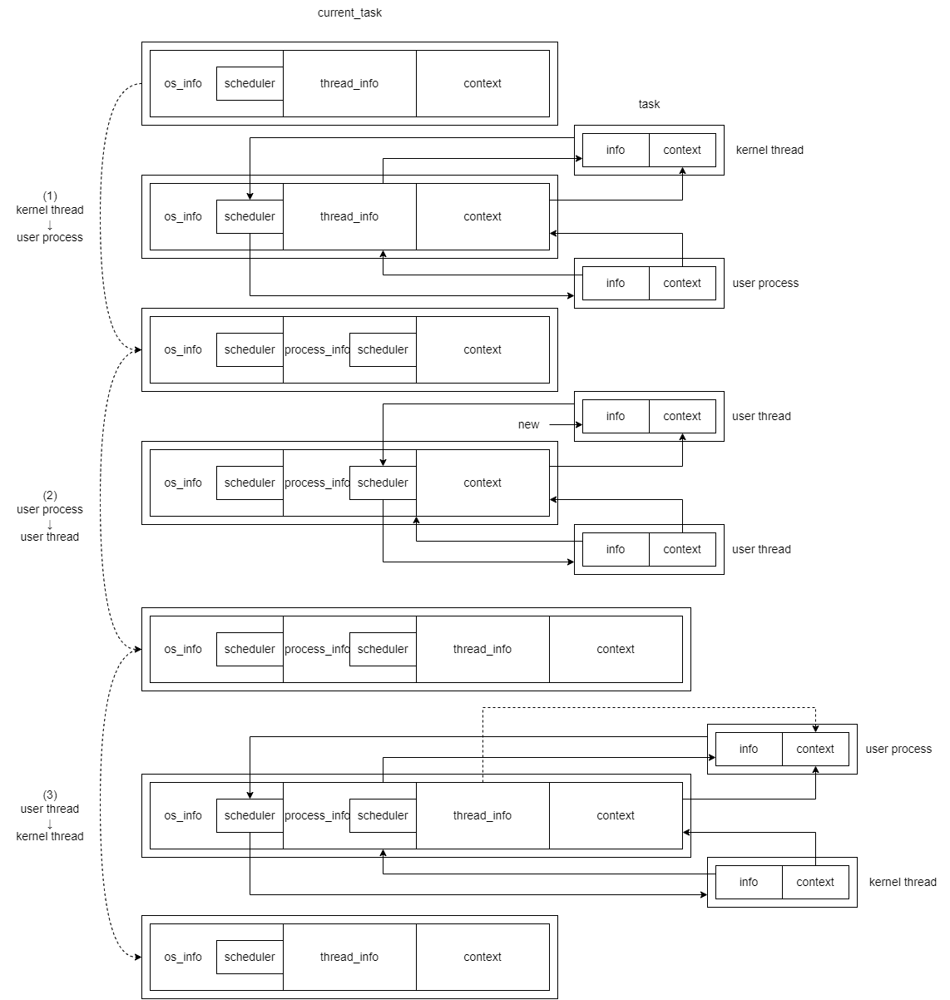

# 调度框架的队列管理

时间：2024/7/6

## 队列中的任务

目前对任务的描述为`TaskContext`，其包含了任务在切换时需要保存和恢复的各类上下文信息，例如通用寄存器、栈、特权级、地址空间。截至现在，对任务的操作也只涉及TaskContext的内容。因此可以直接使用`TaskContext`代表任务。

考虑实现内部可变性，以及增加额外信息（如id、状态、os和进程附带的调度器等）等可能的需要，可以对`TaskContext`进行包装：

```Rust
struct Task {
    inner: SpinNoIrq<TaskInner>, // 暂时使用[spinlock crate](https://github.com/Starry-OS/spinlock)，之后可以考虑其它实现方式
}

struct TaskInner {
    context: TaskContext,
    info: Box<dyn Info>, // 考虑到hypervisor、os、process、thread、coroutine的额外信息可能不同，为了提供统一的任务接口，使用特征对象实现。之后也可以考虑使用枚举实现，这样在提供信息的同时还能得知任务类型。
}
```

任务在整个生命周期中都位于当前任务、就绪队列、阻塞队列这三种位置中。任务的位置代表了它们的状态。

## 当前任务

每个CPU具备一个描述当前任务的数据结构。任务切换时，也会维护该`当前任务`数据结构，使得`当前任务`始终代表CPU上正在运行的执行流。

同一个执行流可能会在不同的任务数据结构间迁移。 *（考虑“从内核切换到用户进程，用户进程内部发生线程切换后，再返回内核”的场景，原本作为用户线程、参与进程内调度的执行流会在返回内核后，作为用户进程、参与内核调度）* 因此，我们在存储`当前任务`时，将`context`和`info`分开存储，从而取消了`context`与任务总体的绑定。

为了实现多级返回 *（例如，从用户进程内的线程返回到内核）* ， **我们发现，需要在`当前任务`中保存任务树上每一级的`info`，不过只需保存一个`context`。** （或者甚至可以不保存`context`，使用CPU当前的状态代表当前任务的上下文。）

下图展示了“从内核切换到用户进程，用户进程内部发生线程切换后，再返回内核”的场景下，三种不同的切换类型中，`当前任务`的更新方式和上下文切换的行为：



该图中有几个值得注意的地方：

1. 图中展示了相同执行流可能在不同类型的任务间迁移的情况。第二个任务作为用户进程换入，作为用户线程换出；第三个任务作为用户线程换入，作为用户进程换出。
2. 在多级返回的情况（图中的第三次切换），因为换出任务的`info`字段已经保存了`process_info`，`thread_info`无法在换出任务的`info`字段中保存。因此，需要进行额外的工作保存`thread_info`，例如将其保存在`context`中。当`thread_info`为空时，也可以忽略它的保存。
3. 与`context`相关的箭头不仅代表`TaskContext`类型数据的流向，也代表上下文的切换过程。

## 就绪队列

就绪队列与调度器绑定，而调度器位于每个hypervisor、os、process中。

就绪队列在一般情况下先进先出，但为了实现中断与抢占功能，需要从以下两种方案中选择一种实行：

1. 增加“插入就绪队列队首”的接口，使被唤醒的中断处理任务等高优先级任务可以及时执行。
2. 设置不同优先级的队列，进行优先级调度。

此外，为了实现更多功能，也可以提供增删改查的接口。

## 阻塞队列

阻塞队列可以在任意位置出现。

可以向其中放入任务以将其阻塞，也可以从中取出最前的任务，或者取出所有任务。

将这些任务放入调度器，或者在任务切换时传入`switch`函数，从而唤醒这些取出的任务。

阻塞队列需要实现让任务等待某个条件或者等待某个计时器的功能，当调用阻塞函数时，检查该条件是否达成，达成则唤醒，未达成则继续阻塞。

阻塞队列可以将唤醒的任务直接放入调度器，此时会放入当前执行环境所属的调度器。或者也可以取出任务后手动放入调度器，此时可以选择放入哪个调度器。