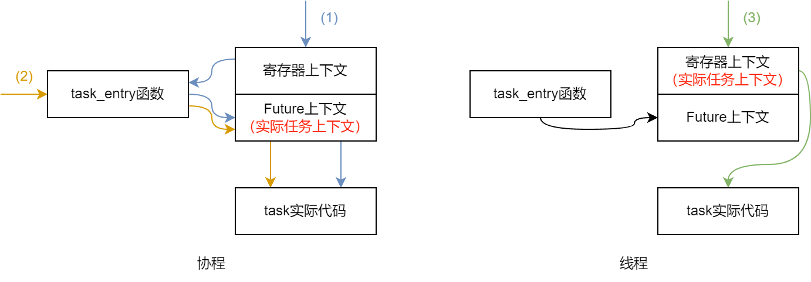
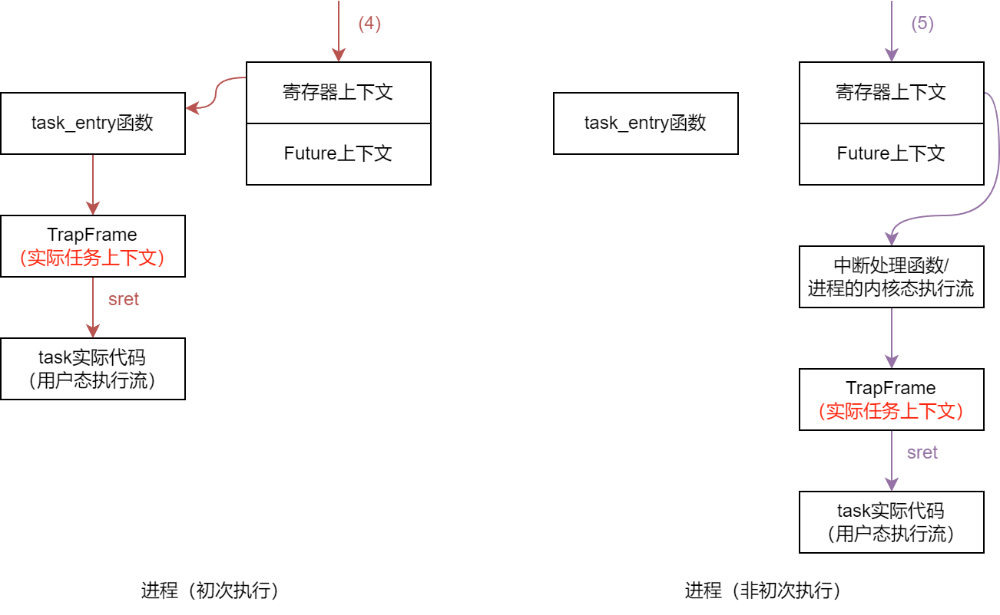

# zfl学长项目阅读笔记

时间：2024/9/17

## unikernel下的任务调度

暴露给用户的接口只能创建线程（只能传入`FnOnce()`），但其在系统中经过一层`asnyc`块的封装，视作协程处理。因此，系统中创建、退出的任务都是协程，而在让出或被抢占时，协程转换为线程。同时，系统中的协程只会返回`Poll::Ready`，不会返回`Poll::Pending`。

`Context`结构可以保存线程的寄存器上下文或者协程的`Future`上下文。线程与协程的暂停、运行功能不仅与`Context`有关，还和`task_entry`函数有关。在`unikernel`模式下，`task_entry`函数会调用`run_coroutine`函数从而从当前的`Future`上下文运行协程（如图中(1)路径）。而协程的寄存器上下文会始终指向`task_entry`函数，因此恢复协程的寄存器上下文也可以起到运行协程的作用（如图中(2)路径）。而对于线程，则只能通过恢复寄存器上下文的方式运行（如图中(3)路径）。

当任务进行切换时，根据新旧任务的不同种类，采用不同的切换方式：

|旧任务类型|新任务类型|切换到新任务的方式|
|-|-|-|
|协程|协程|调用task_entry函数（(2)路径）|
|协程|线程|恢复寄存器上下文（(3)路径）|
|线程|协程|恢复寄存器上下文（(1)路径）|
|线程|线程|恢复寄存器上下文（(3)路径）|

## monolithic下的任务调度

在`monolithic`下，系统使用`Process`代表进程。`AxTask`仍代表线程和协程，但它们可能属于系统内核或者用户进程。`AxTask`使用`process_id`和`page_table_token`等字段描述任务的进程信息。

在创建进程时，如此设置进程的主任务（主线程）的上下文信息：Future上下文置空，上下文类型设置为线程类型（即寄存器上下文）。不过此时，寄存器上下文的初始值仍然指向`task_entry`函数。进程的创建过程会根据进程入口设置`TrapFrame`，并将`TrapFrame`储存进内核栈。进程第一次运行时，先恢复寄存器上下文，再进入`task_entry`函数。`task_entry`函数会通过`TrapFrame`恢复上下文并进入用户态，运行进程的主线程（如图中(4)路径）。

而用户进程中任务的切换，由于是先陷入内核态再调用切换函数，因此切换时保存的是其内核执行流的寄存器上下文，类似于内核线程。从其它任务切换到这样的“至少运行过一次的用户进程下的任务”，也类似于切换到内核线程的过程（如图中(5)路径）。

