# 组件化内核报告学习笔记

时间：2024/9/13

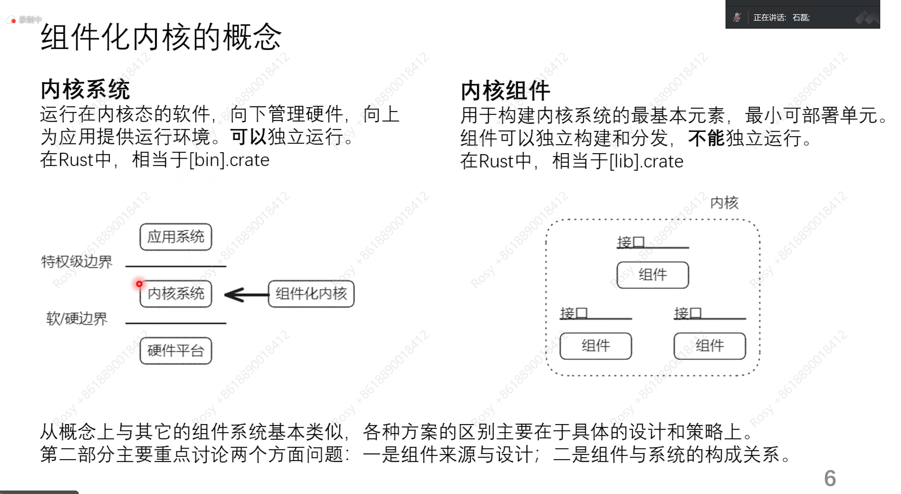

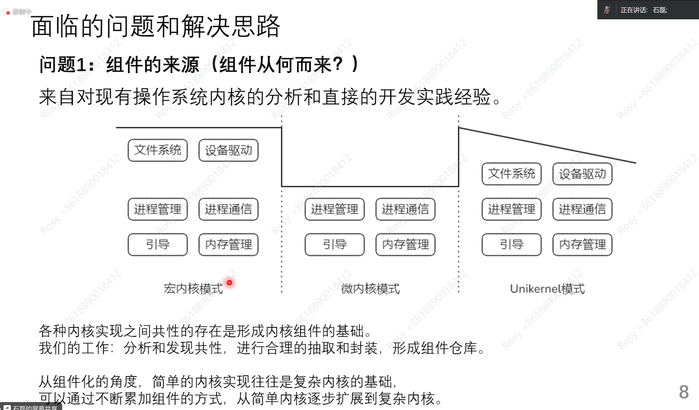

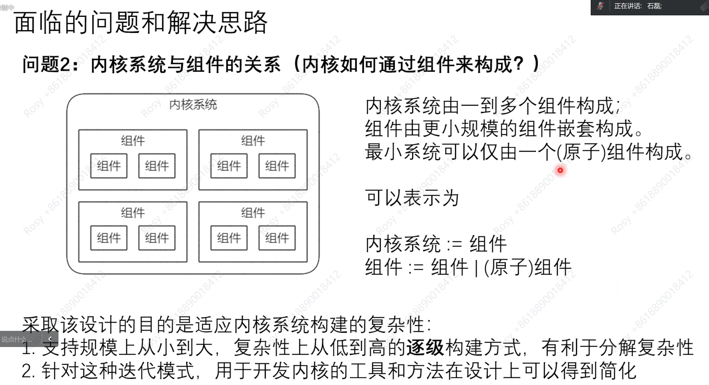

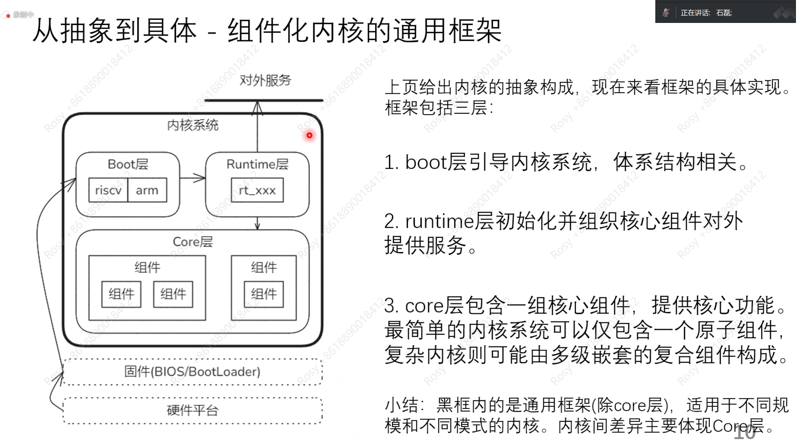

将内核分为boot、runtime、core很科学。boot与硬件联系更紧密，runtime与硬件联系较少。

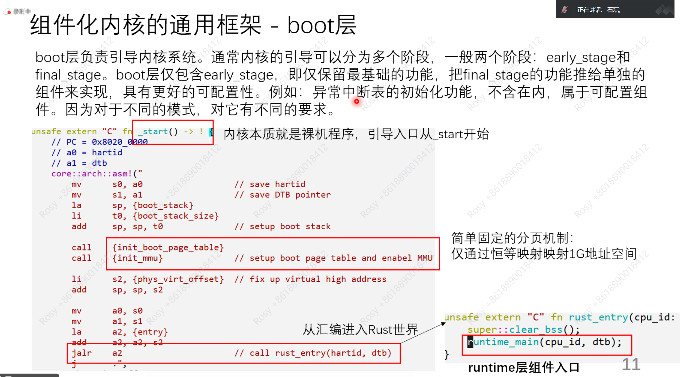

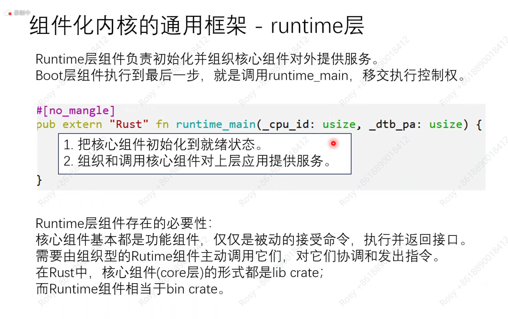

（启动过程中的一部分初始化流程由runtime而非boot完成。因为这些初始化流程与core联系紧密）

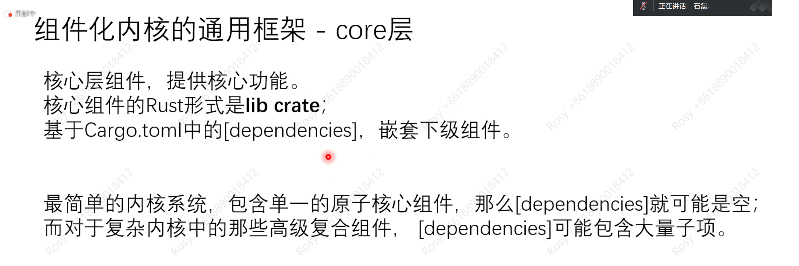

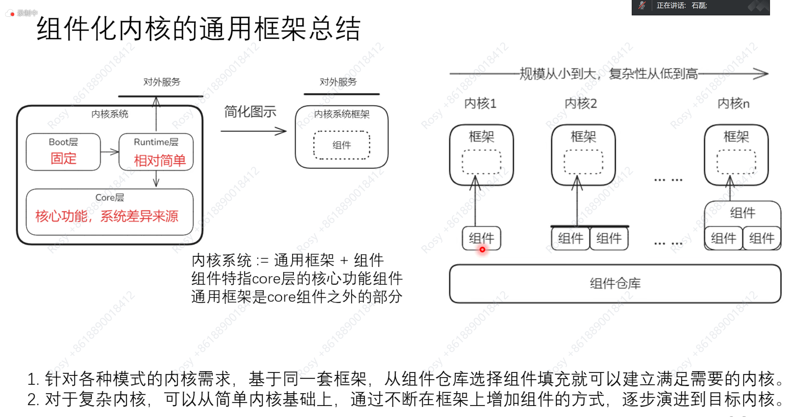

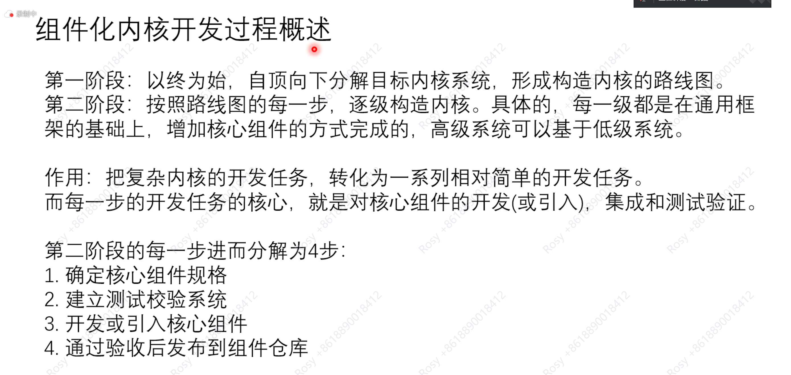

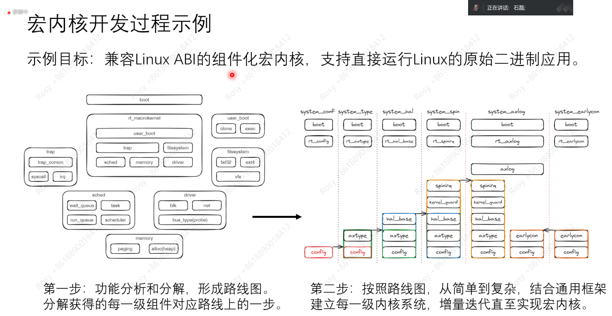

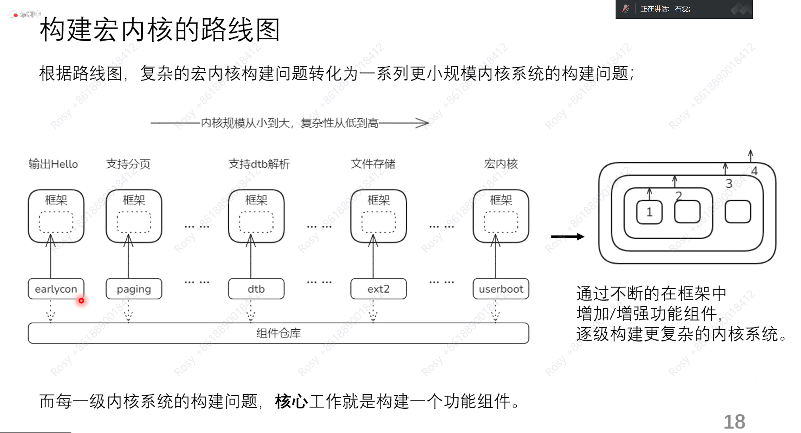

这种基于组件的开发方式很有条理。

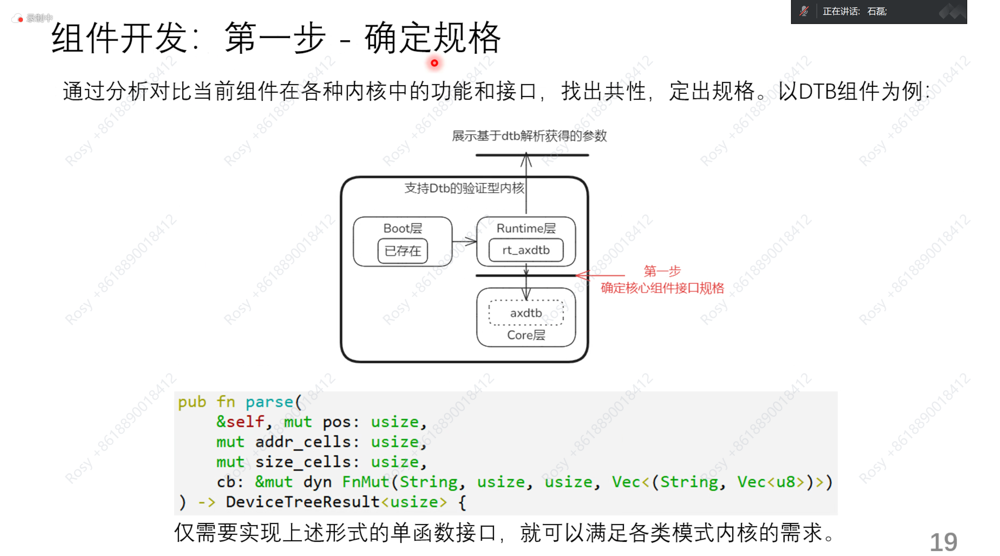

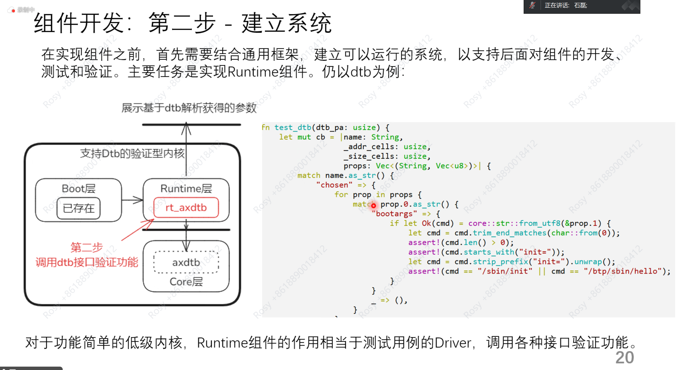

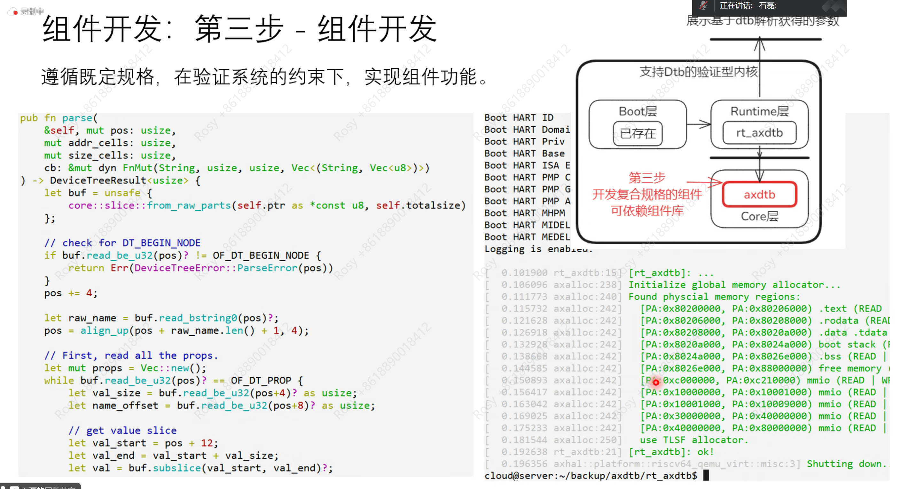

组件放在core层中，测试/验证放在runtime层中。

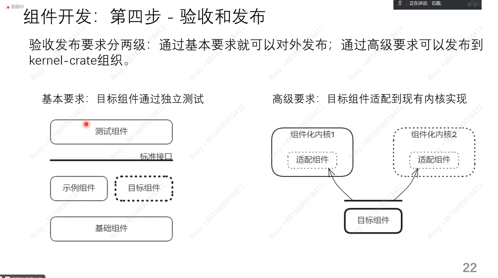

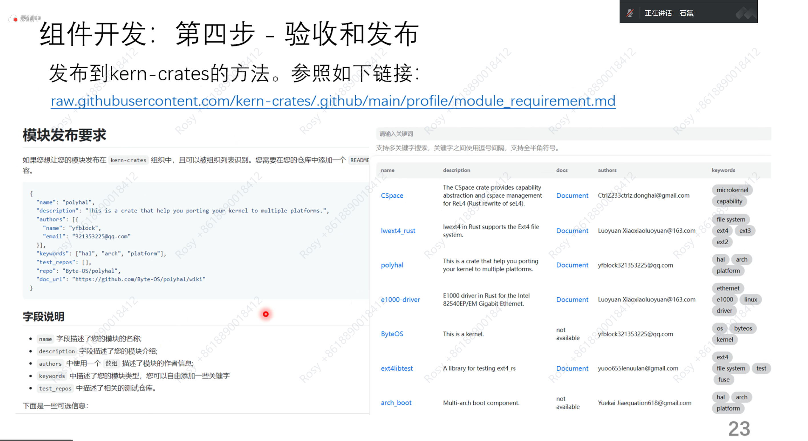