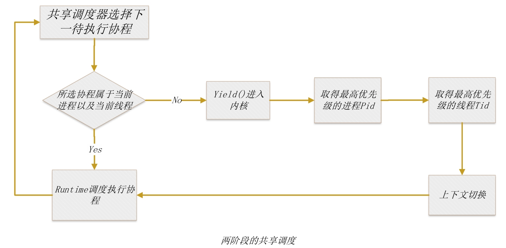

# 比赛项目学习笔记

时间：2024/9/5

## Rust协程不排队

### 技术路线

将协程作为线程之下的调度单元。

通过全局的**共享调度器**和每个进程各自的**协程运行时**相互配合。共享调度器负责整体调度和进程、线程切换，协程运行时负责协程的运行和切换。

通过**优先级位图**，使得共享调度器可以得知进程的优先级信息；进程可以得知线程、协程的优先级信息；线程可以得知协程的优先级信息。从而实现全局调度。

通过**共享内存**，实现共享调度器对优先级位图的访问。

### 可以学习的地方

- 过程文档写得很好。描述了详细目标、各个阶段的完成情况、按时间梳理的项目进展。
- 实验做得很详细，考虑了各种任务创建和调度的情况。
- 虽然是对rCore的修改，但将自己写的大部分代码封装成了独立的模块，条理更清晰。

## Phoenix

### 技术路线

异步支持：将进程和线程都实现为Future，实现全异步的操作系统。Future中自带了切换任务控制块、页表等的代码。

进程和线程：采用Linux的模式，将进程和线程使用统一的Task结构表示，每个Task只有一条执行流。通过创建线程组、设置组内主线程来实现进程。

抢占实现：通过在内核中断处理函数中直接运行下一协程，实现协程的内核态抢占。

### 可以学习的地方

- 新的设计思路：将进程和线程全部用Future表示
- 文档写得很详细
- 在TCB的可变字段中，每个字段单独设置锁
- 需要了解一下Linux的任务调度

## 对“协程和线程是同级还是上下级”两种方案的思考

### 协程作为线程的下级

是广泛采用的方案。

线程从独立的执行流变为和进程类似的、为多条执行流提供运行所需资源的结构。

线程为协程提供了：

- 运行栈
- 中断和抢占的支持（中断和抢占的对象是协程所在的线程，协程不会感知）
- 多核运行支持（协程运行在多个线程上，而这些线程运行在多个CPU核心上）

方案的优点：

- 实现简单，不需改动原有的线程机制，从而获得了更广的应用范围（例如，用于用户态程序等无法修改系统线程机制的场合）
- 可以借助协程所在的线程实现中断抢占支持、多核运行支持

方案的不足：

- 在原调度系统的基础上增加了一级，使系统、进程更难感知协程的调度情况，使得统一调度更困难（本队的项目是该问题的一种解决方案）
- 多核实现需要先将协程与线程对应，再将线程与CPU核心对应，引入了额外的开销（而“协程与线程同级”可以直接将协程与CPU核心对应）
- 使线程API和协程API产生较大的分歧（例如，如果不小心在协程中调用了线程的阻塞API，则会导致协程所在的线程被阻塞，从而该线程中其它就绪的协程也无法运行）
- 以线程为单位进行的中断或抢占可能会使线程内其它就绪协程无法运行

### 协程与线程同级

线程和协程均作为独立执行流，共同运行于进程中。

方案的优点：

- 协程不经过线程直接属于进程，在任务调度和多核运行方面开销更低。
- 可以更好地统一同步任务和异步任务、统一协程API和线程API

方案的不足：

- 需要对原有的任务调度运行机制进行修改，工作量太大，也使后续项目更难维护
- 无法原生支持抢占（赵方亮的AsyncStarry通过将协程被抢占时变为线程解决了这一问题）
- 对执行栈的处理较为复杂，需要考虑线程和协程间的切换是否需要切换栈
