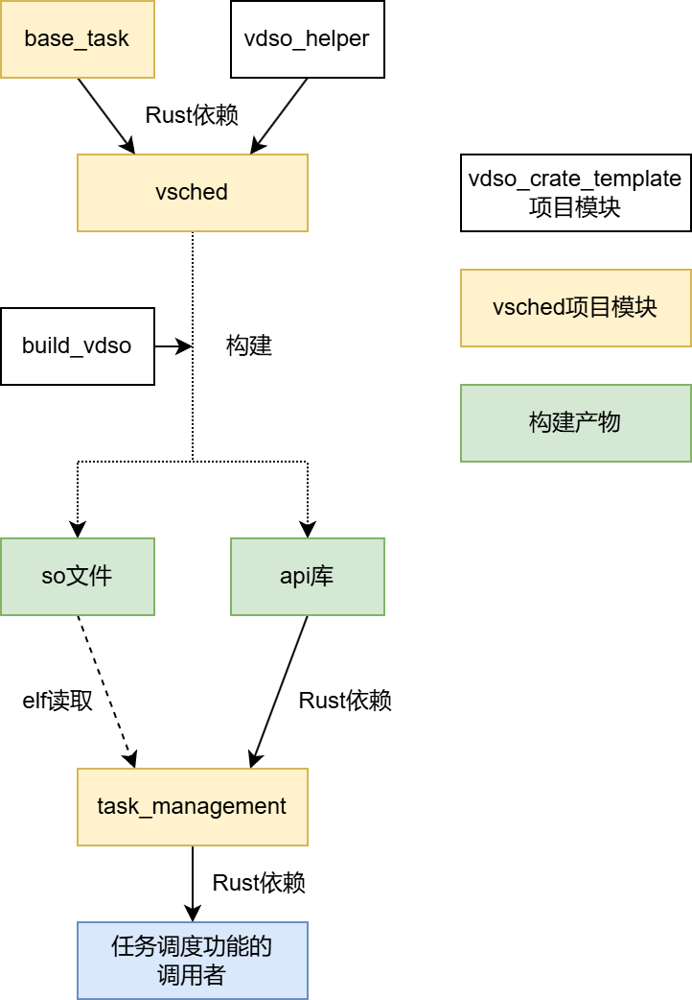

# vsched项目debug笔记

## 修改user_test阶段

本阶段用于做最小的修改使user_test重新可运行，未对项目结构进行较大修改。

### 数据结构命名问题

修改了`user_test`的引用中，已被更名或移动的数据结构：

- `BaseTask` -> `AxTask`
- `BaseTaskRef` -> `TaskRef`

### `TaskExt`与`TaskInnerExt`

在[此commit](https://github.com/AsyncModules/vsched/commit/0351acfb128ab0399e21f09fc6d2eb506ac97fa5)中，原本位于`user_test::TaskExt`中的大部分字段都被迁移到了`base_task::TaskInnerExt`中。因此对`user_test`中的代码做了修改以适应该重构。

### so加载问题

`map_vsched`函数中原本的so加载流程是直接将so文件的内容拷贝到指定内存区域。更改为了以segment为单位拷贝到指定位置。

### 引用计数与释放问题

原本的`TaskInner`会传入`task_clone`、`task_weak_clone`、`task_drop`、`task_strong_count`函数指针以辅助进行引用计数管理，而在新版的base_task中取消了这些接口。不过，传入`TaskInner`的指针仍由`Arc`转化而来，因此需要进行引用计数管理。

分析后发现，将任务放入调度器，直至运行完成被释放的过程，固定消耗1个引用计数，与创建任务时产生的1个引用计数相抵。只有在`join`的情况下，需要增加任务的引用计数。因此实现了增减任务引用计数的`Task::clone_increase_sc`和`Task::drop_decrease_sc`函数，并在涉及`join`操作时，在合适时机调用它们。

### 协程状态切换问题

在`coroutine_schedule`函数中，有以下代码，检查`poll`之后的协程需要已经将`state`从`Running`切换到其它状态（`Ready`, `Blocked`, `Exited`）。

```Rust
assert!(
    !curr.is_running(),
    "{} is not running",
    curr.task_ext().id_name()
);
```

因此我检查了各个辅助`Future`对协程状态的维护，在`Task::new_f`函数中，在创建的协程上做了一层包装，在调用`future.await`后还会调用`exit_f(0).await`，避免了用户创建的协程结束后没有修改运行状态导致的问题。

### 适应更改后的vsched接口

修改了一些调用参数适应更改后的vsched接口。例如，在`vsched_api::spawn`中，增加了获取并传入cpu_id的代码。

### `JUMP_SLOT`类型的重定位问题

见[此处](https://github.com/rosy233333/vdso_crate_template/blob/main/doc/%E5%BC%80%E5%8F%91%E6%97%A5%E5%BF%97/vdso%E6%A8%A1%E6%9D%BF%E9%87%8D%E6%9E%84-debug%E7%AC%94%E8%AE%B0.md#%E8%BF%90%E8%A1%8C%E6%97%B6%E9%87%8D%E5%AE%9A%E4%BD%8Dbug)。

### `PerCPU`结构的初始化问题

编译成功后，发现运行时出现了段错误。分析log文件、增加测试代码后得知，该错误由`PerCPU`结构未正确初始化引起。

首先发现，user_test自己定义了`PerCPU`，与base_task中的定义不同。于是将user_test中改为使用base_task中的`PerCPU`结构，但仍有bug。

最后发现，这是由于Makefile中定义的编译流程中，只在编译libvsched.so时传入了`RQ_CAP`和`SMP`环境变量，而没有在编译user_test时传入，导致了两者的`PerCPU`结构产生了不同。在user_test的编译流程中传入`RQ_CAP`和`SMP`环境变量，解决了该问题。

### 新增调试输出

为了更好地定位问题，在user_test中使用`env_logger`增加了对log调试输出的支持。

同时，在`vsched_api`调用`vsched`中的函数时，加入了调试输出，输出调用的函数和地址。该调试输出等级为trace。

## task相关内容重构阶段

重构已有的任务调度模块，将原本位于`user_test`中的任务调度功能代码分离出来。

### 创建task_management库

创建了task_management库，作为分离出的任务调度功能代码的存放位置。task_management库与base_task库的关系如下：

`base_task`：存放`TaskInner`及其配套数据结构（`TaskStack`、`TaskId`、`TaskState`）的定义和方法（不包含`TaskInnerExt`）。`base_task`被`vsched`库直接依赖，为vdso共享库的一部分。

`task_management`：存放`TaskInnerExt`、`WaitQueue`和`Mutex`的定义（是否要在该库中支持互斥锁还在考虑）、存放user_test原有代码中除了映射vdso以外的内容（包括协程调度、任务的阻塞和退出、join、gc任务、线程的task_entry定义等）。其位于主编译单元中，依赖vdso共享库，对主编译单元提供任务调度功能。



### 移动`TaskInnerExt`相关代码

将`TaskInnerExt`相关代码从`base_task`中移到`task_management`中。

原本兼容有无`TaskInnerExt`的`TaskInner`的方式为：使用`feature = "alloc"`，区分vdso编译单元内外的环境，定义和使用两种不同的`TaskInner`。由于因为两种`TaskInner`且除`ext`以外在内存表示上相同，因此两者的指针可以直接互相转化，vdso内外也可以通过指针传递任务结构。

移动`TaskInnerExt`后，我在task_management库中重定义了`TaskInner`：

```Rust
#[repr(C)]
pub struct TaskInner {
    inner: base_task::TaskInner,
    ext: TaskInnerExt,
}
```

此处定义的`TaskInner`（的inner部分）在内存表示上也和`base_task::TaskInner`相同，因此指针可相互兼容。但在Rust类型系统中视为两种不同的类型，需要显式转化。因此实现了转化指针的`base_to_ext`和`ext_to_base`函数。（内部调用`core::mem::transmute`实现）

这样修改的意图是让`base_task`中仅存储vdso所需的内容，因此不再需要通过`feature = "alloc"`区分“对vdso使用”和“对外部使用”的内容。但实际修改时发现，某些数据结构（例如`TaskInner`和`TaskStack`）需要在vdso中使用，但需要在外部库中创建，且这些数据结构的创建涉及alloc操作。因为不想将数据结构的定义和初始化放在不同的库中，因此在这些初始化代码还是留在了`base_task`库中，保留了`feature = "alloc"`。

### 互斥锁实现？

实现内核态和用户态共享的锁的难点在于，同时满足以下三个条件会导致死锁：

1. 用户态代码占用资源后，可能被内核态抢占
2. 内核态抢占的代码使用到了用户态代码占用的资源
3. 内核态抢占的代码执行完成前，无法回到被抢占的用户态代码。

在实现了内核态和用户态统一调度后，满足条件3的内核态代码只能是内核态的中断处理代码（因为其它内核态代码与用户态在同一个调度器上运行，之间没有类似同步系统调用的依赖关系）

必须在内核态中断处理代码中完成的功能（无法放在中断第二段完成）里，需要用到锁的功能只有抢占过程中涉及的调度机制（？）。

因此，虽然在用户态无法关中断，但如果能在调度机制中实现用户态的禁止抢占，也能达到防止以上死锁出现的效果。

### 去除对config的依赖，改为使用接口？

### 尝试移除gc_task？

因为目前任务使用`Arc`维护引用计数和管理释放，因此似乎不需要`gc_task`。

目前，任务引用计数增长的情况只有`join`时：

任务A `join` 任务B，由于`join`的API要求，任务A需要持有一个任务B的引用。此时，任务A只有一个引用，它在运行过程中从就绪队列移动到当前任务，再移动到任务B的等待队列。任务B有两个引用，一个被任务A持有，一个从就绪队列中移动到当前任务。任务B结束时，先唤醒任务A，再直接释放自己的引用。由于任务A还持有任务B的引用，因此任务B不会被立刻释放，只会在任务A完成`join`并释放任务B的引用后，任务B才会被释放。

在实际编码时发现，一个任务切换到下一任务后，下一任务还需要设置前一任务的`on_cpu`字段。因此在下一任务修改前一任务的字段后，判断其状态是否为`Exited`，是则释放。

### wait问题

执行wait测例后，程序在打印如下输出后卡死：

```
RUST_LOG=debug qemu-riscv64 -D qemu.log -d in_asm,int,mmu,pcall,cpu_reset,page,guest_errors /home/rosy/桌面/vsched/target/riscv64gc-unknown-linux-musl/release/wait
[2025-10-31T06:23:02Z INFO  user_test::vsched] vsched_map base: [0x4000807000, 0x4000849000]
[2025-10-31T06:23:02Z INFO  elf_parser] Base addr for the elf: 0x4000809000
[2025-10-31T06:23:02Z INFO  elf_parser::arch::riscv] Base addr for the elf: 0x4000809000
[2025-10-31T06:23:02Z INFO  elf_parser::arch::riscv] Relocating .rela.dyn
[2025-10-31T06:23:02Z INFO  elf_parser::arch::riscv] Relocating done
[2025-10-31T06:23:02Z DEBUG user_test::vsched] VA:0x4000809000, 0x14b0, MappingFlags(READ | EXECUTE | USER)
[2025-10-31T06:23:02Z DEBUG user_test::vsched] VA:0x400080b000, 0x228, MappingFlags(READ | USER)
[2025-10-31T06:23:02Z DEBUG user_test::vsched] VA:0x400080c000, 0xf8, MappingFlags(READ | WRITE | USER)
[2025-10-31T06:23:02Z WARN  user_test::vsched] Segment with size 0 found, skipping: VA:0x4000809000, 0x0, MappingFlags(READ | WRITE | USER)
[2025-10-31T06:23:02Z INFO  user_test::vsched] Relocate: src: 0x400080b023, dst: 0x400080c000, count: 8
[2025-10-31T06:23:02Z INFO  user_test::vsched] Relocate: src: 0x400080b023, dst: 0x400080c018, count: 8
[2025-10-31T06:23:02Z INFO  user_test::vsched] Relocate: src: 0x400080b023, dst: 0x400080c030, count: 8
[2025-10-31T06:23:02Z INFO  user_test::vsched] Relocate: src: 0x400080b023, dst: 0x400080c048, count: 8
[2025-10-31T06:23:02Z INFO  user_test::vsched] Relocate: src: 0x400080b023, dst: 0x400080c060, count: 8
[2025-10-31T06:23:02Z INFO  user_test::vsched] Relocate: src: 0x400080b037, dst: 0x400080c078, count: 8
[2025-10-31T06:23:02Z INFO  user_test::vsched] Relocate: src: 0x400080b037, dst: 0x400080c090, count: 8
[2025-10-31T06:23:02Z INFO  user_test::vsched] Relocate: src: 0x400080b037, dst: 0x400080c0a8, count: 8
[2025-10-31T06:23:02Z INFO  user_test::vsched] Relocate: src: 0x400080b066, dst: 0x400080c0c0, count: 8
[2025-10-31T06:23:02Z INFO  user_test::vsched] Relocate: src: 0x40008096f0, dst: 0x400080c0e8, count: 8
[2025-10-31T06:23:02Z DEBUG vsched_apis::apis] spawn: 4000809bfe
[2025-10-31T06:23:02Z DEBUG vsched_apis::apis] migrate_entry: 400080994a
[2025-10-31T06:23:02Z DEBUG vsched_apis::apis] yield_f: 4000809e94
[2025-10-31T06:23:02Z DEBUG vsched_apis::apis] set_priority: 4000809bea
[2025-10-31T06:23:02Z DEBUG vsched_apis::apis] yield_now: 400080a072
[2025-10-31T06:23:02Z DEBUG vsched_apis::apis] resched: 4000809ad0
[2025-10-31T06:23:02Z DEBUG vsched_apis::apis] preempt_current: 40008099c8
[2025-10-31T06:23:02Z DEBUG vsched_apis::apis] init_vsched: 4000809892
[2025-10-31T06:23:02Z DEBUG vsched_apis::apis] current: 4000809874
[2025-10-31T06:23:02Z DEBUG vsched_apis::apis] clear_prev_task_on_cpu: 4000809852
[2025-10-31T06:23:02Z DEBUG vsched_apis::apis] task_tick: 4000809d86
[2025-10-31T06:23:02Z DEBUG vsched_apis::apis] switch_to: 4000809ccc
[2025-10-31T06:23:02Z DEBUG vsched_apis::apis] resched_f: 4000809af2
[2025-10-31T06:23:02Z DEBUG vsched_apis::apis] unblock_task: 4000809d9a
[2025-10-31T06:23:02Z INFO  user_test::vsched] vsched mapped successfully
[2025-10-31T06:23:02Z DEBUG task_management::task_inner_ext] new task: Task(2, "idle")
[2025-10-31T06:23:02Z DEBUG task_management::task_inner_ext] new task: Task(3, "gc")
[2025-10-31T06:23:02Z DEBUG task_management::task_inner_ext] new task: Task(4, "task__1")
[2025-10-31T06:23:02Z DEBUG task_management::task_inner_ext] new task: Task(5, "task__2")
[2025-10-31T06:23:02Z DEBUG task_management::sched] task blocked "gc"
wait task start
[2025-10-31T06:23:02Z DEBUG task_management::sched] task blocked "task__2"
into spawned task inner
[2025-10-31T06:23:02Z DEBUG task_management::sched] "task__1" is exited
[2025-10-31T06:23:02Z DEBUG task_management::wait_queue] unblock task "task__2", is on cpu false
[2025-10-31T06:23:02Z DEBUG task_management::wait_queue] unblock task "gc", is on cpu false
back to idle task
[2025-10-31T06:23:02Z DEBUG task_management::sched] task blocked "main"
wait task ok
[2025-10-31T06:23:02Z DEBUG task_management::sched] "task__2" is exited
[2025-10-31T06:23:02Z DEBUG task_management::wait_queue] unblock task "main", is on cpu true
```

根据打印输出，推测是main task在阻塞时未设置`on_cpu`字段为false，导致无法正常唤醒。

对推测的证明：

#### 1. `on_cpu`字段一直为true，会导致无法正常唤醒

任务唤醒的调用链：`wait_queue::unblock_one_task` -> `vsched::unblock_task` -> `vsched::put_task_with_state`，而`put_task_with_state`函数中会自旋直到要唤醒的函数的`on_cpu`字段变为false。

#### 2. main task在阻塞时未设置`on_cpu`字段为false

所有代码中，能够设置`on_cpu`字段为false的只有`vsched::clear_prev_task_on_cpu`函数。该函数未被`vsched`内部的其它函数调用，而应由外部代码在任务切换完成后，在切换到新任务后立刻调用。

如果下一任务为协程，则切换到新任务后会进入`coroutine_schedule`函数。该函数中包含了每次切换后对`clear_prev_task_on_cpu`的调用。但如果下一任务为线程，则会进入`task_entry`函数，该函数开头也调用了`clear_prev_task_on_cpu`函数。但是，线程的恢复是从保存的上下文开始，而非每次都从`task_entry`开头开始。这导致如果切换到的线程曾运行过，则不会再调用`clear_prev_task_on_cpu`函数。

解决方案：在线程的每一个恢复点调用`clear_prev_task_on_cpu`函数。这些恢复点包括`vsched_apis::resched`和`vsched_apis::yield_now`函数的后一句。

## 使用vdso_crate_template框架代码阶段

### BuildConfig中的相对路径

这次因为路径问题踩了一些坑，学到的内容总结如下：

`BuildConfig`中传入的相对路径，因为其最终会使用`std::fs::canonicalize`解析为绝对路径，因此其相对路径为相对程序的工作路径。其包含两种情况：

- 若`build_vdso`函数在主程序中调用，则相对路径相对于调用主程序的命令行。
- 若`build_vdso`函数在`build.rs`中调用，则相对路径相对于`build.rs`文件。

### 设定结构体的对齐

使用`#[repr(align(n))]`指定对齐。

其可和`#[repr(C)]`同时使用，写作`#[repr(C, align(n))]`

注意：此处的n只能使用10进制写法，不能使用16进制写法。开发过程中，遇到过将n写成16进制导致设置的对齐不生效导致的bug。

### 演示时的错误

在演示时，原本可正常运行的测例忽然全都无法运行，有的卡死，有的报段错误。

经过排查后发现了原因：当编译的环境变量（`SMP`和`RQ_CAP`）改变时，共享数据结构的内存结构也会改变，因此vdso库需要重新编译。但当前的构建脚本并不会重新运行。因此，在`user_test/build.rs`中增加了以下内容：

```Rust
println!("cargo::rerun-if-env-changed=SMP");
println!("cargo::rerun-if-env-changed=RQ_CAP");
```

在这之后，当环境变量改变后，**第一次编译仍会出错，而第二次编译则可以正常运行**。推测原因是`api`库（`libvsched`）也由编译流程生成，而第一次编译使用了旧版的api库，第二次编译才会使用（第一次编译使用的）新版api库。

在进一步调查该问题的起因。考虑是否因为在依赖链`task_management <- user_test`中，两个库都依赖了`libvsched`，而`libvsched`的重新编译是在`user_test`中触发的，导致`task_management`依赖的`libvsched`为旧版？

将`libvsched`的重新编译移到`task_management/build.rs`中后发现，仍会出现问题。分析编译输出发现，`libvsched`、`task_management`、`user_test`三个crate的编译顺序并不固定，`libvsched`可能在`task_management`之前编译。

想尝试在`build.rs`中手动编译链接`libvsched`库，但未能正常运行。同时发现，由于上文提到的编译顺序不固定的问题，即使是手动编译链接，也可能出现`task_management`和`user_test`链接的版本不一致的问题。

因此，如果`libvsched`仍在`build.rs`中编译，则该问题无法完全解决。而若生成单独的编译脚本（如`Makefile`），则会增加使用框架库的复杂性。

目前的解决方案是，在`Makefile`中运行用户态测试时，使其编译两遍再运行。之后可以考虑是否有其它更好的解决方案。
