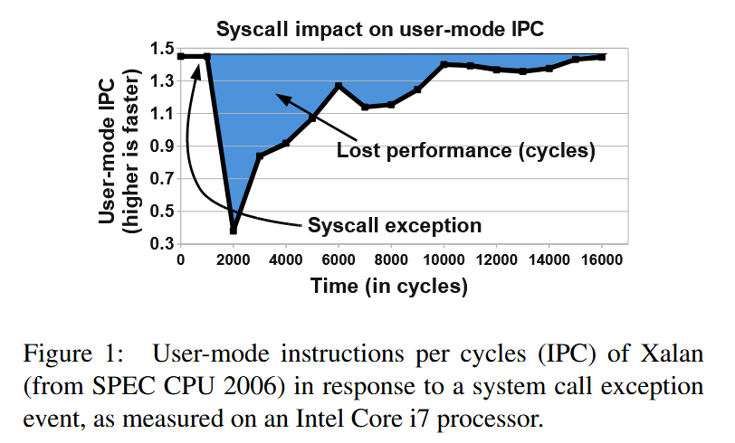
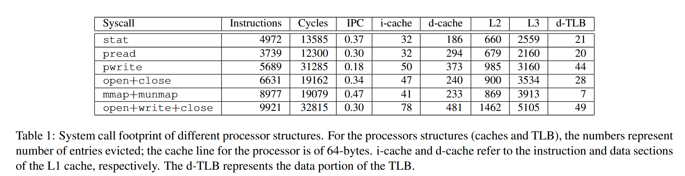
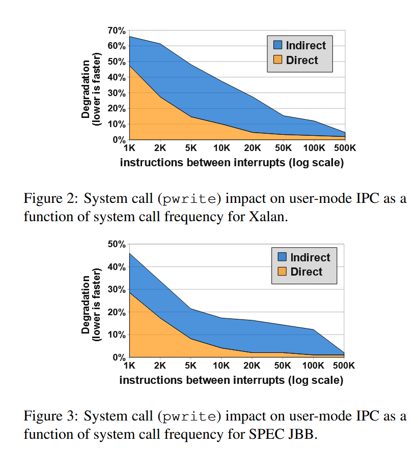
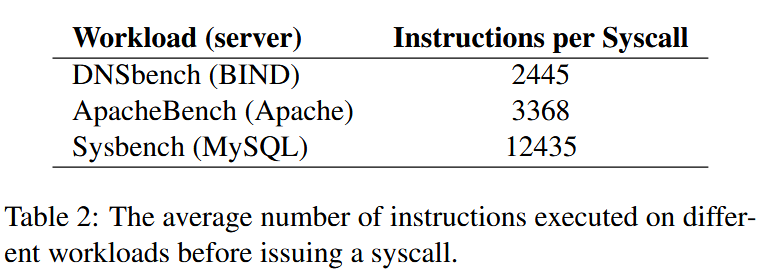
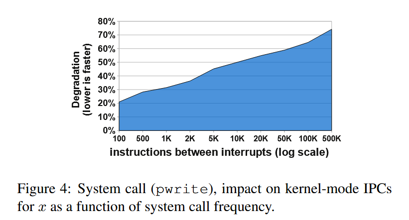
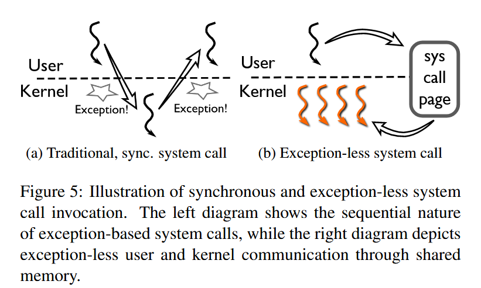
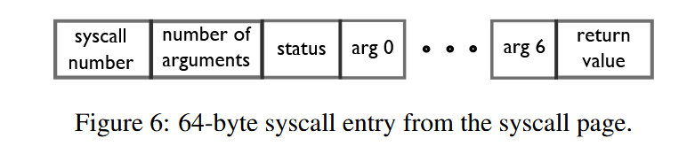

# 《FlexSC: Flexible System Call Scheduling with Exception-Less System Calls》阅读笔记

## 我学到的/评价

本文的方法似乎很大程度上与rel4中正在采用的方法类似。因此我的阅读不会面面俱到，而会聚焦于我不知道的地方。

## Abstract

本文：

- 评估了传统同步系统调用对系统密集型工作负载的性能影响。主要影响来自流水线冲刷和缓存失效。
- 提出了exception-less system calls：
  - 使用共享内存在用户态和内核态间传递系统调用信息
  - （多核情况下）用户态和内核态在各自的核心上运行
  - 使用用户级线程，使得异步接口与原有的同步接口类似
  - 在Linux上实现
  - 提供配套的用户级线程库FlexSC-Threads，与 POSIX 线程兼容
  - 在不修改用户程序的情况下将同步系统调用转换为异步系统调用
  - 在多核、多线程情况下提升明显

## Introduction

传统系统调用：

- 使用处理器异常触发
- 同步的执行模型

随着处理器内部结构日趋复杂，程序局部性被打断带来的开销（如流水线、分支预测、缓存的开销）越来越不可忽视。传统系统调用的过程就会发生程序局部性的打断。

如下图，发生系统调用后，CPU的指令执行速度（IPC, instruction per cycles）会急剧下降并缓慢回升到正常水平。

exception-less system calls的优势：

- 内核侧：批量执行系统调用带来的时间局部性
- （多核情况下）用户态和内核态在各自的核心上运行，带来的空间局部性
- 可以动态调整运行在用户态和内核态的核心数目，以适应负载的变化。

用户级线程FlexSC-Threads的作用：方便异步系统调用的使用，“像写同步代码一样写异步代码”。

本文的工作：

- 细粒度评估了同步系统调用对微架构处理器结构和对用户态执行流的影响。
- 提出了exception-less system calls机制及其在Linux中的实现，FlexSC。
- 实现了配套的用户态线程库FlexSC-Threads
- 评估了FlexSC和FlexSC-Threads带来的性能提升

## The (Real) Costs of System Calls

### Mode Switch Cost

传统的观点认为系统调用带来的开销只有特权级切换时延。

本文的测试结果：用户态->内核态79周期，内核态->用户态71周期。一次完整的系统调用带来的特权级切换时延（150周期）低于缓存未命中导致的时延（250周期）

### System Call Footprint

处理器结构（包括 L1 数据和指令缓存、转换查找缓冲区 （TLB）、分支预测表、预提取缓冲区以及更大的统一缓存 （L2 和 L3））会在特权级切换时被新特权级的状态覆盖，降低指令执行速度，带来隐藏的开销。

下表展示了系统调用过程中，被覆盖的处理器结构数量。

### System Call Impact on User IPC

上文提到的处理器结构覆盖，也会降低系统调用返回到用户态后，指令的执行速度。

纵坐标：用户态指令执行速度的下降幅度（越低越好）

横坐标：系统调用频率（左侧高，右侧低）

直接开销：发起的是空系统调用时，测量到的开销（因为在内核态没做事，因此内核态覆盖的处理器结构降到了最低）

总开销：发起的是`pwrite`系统调用时，测量到的开销

间接开销：总开销 - 直接开销

常见工作负载的系统调用频率：

### Mode Switching Cost on Kernel IPC

纵坐标：内核态指令执行速度的下降幅度（越低越好）

横坐标：系统调用频率（左侧高，右侧低）

系统调用频率越高，在用户态被覆盖的状态越少，因此内核态指令执行的平均速度越高。

内核态指令执行平均速度慢于用户态

## Exception-Less System Calls

设计思路：系统调用批处理、核心专门化。

包含：

- 异步系统调用接口
- 内核中的线程系统（这个需要专门实现吗？）

### Exception-Less Syscall Interface

用于通信的共享内存页称为系统调用页。

### Syscall Pages

系统调用的发起和返回使用同一个表项。

status字段：`free`--用户修改->`submitted`--内核修改->`done`--用户修改->`free`

（不考虑用户态线程间的同步吗？）

### Decoupling Execution from Invocation

创建了始终在内核的系统调用线程，专用于执行异步系统调用。

单核情况：当所有用户态线程都无法运行时，才会调度到系统调用线程。

多核情况：用户态线程和系统调用线程在不同核心上运行。将系统调用页面的条目从用户空间核心传送到内核核心，反之亦然，经过的是缓存间通信，延迟很低（以10个周期为单位），只会导致少量处理器停顿。

### Implementation – FlexSC

作为Linux的扩展。

新增的（同步）系统调用：

- `flexsc register()`：初始化FlexSC机制。映射系统调用页面，且为页面中的每一个条目创建一个系统调用线程
- `flexsc wait()`：当用户程序因为等待系统调用结果而无法继续执行时调用其阻塞等待。当内核完成该用户程序的至少一个系统调用后，唤醒该用户程序。

### Syscall Threads

系统调用线程通过用户程序调用`flexsc register`创建。通过内部使用`clone`，继承用户程序的地址空间。

理想情况下，一个FlexSC机制只需要一个系统调用线程，其遇到需要等待IO资源的情况时可以异步等待，并开始处理下一个系统调用。但这需要对Linux做太多修改（实现异步IO），因此改为了：

创建等同于条目数的系统调用线程，它们全部在同一个核心上运行。虽然线程数量很多，但Linux的内核态线程开销较低，只需要一个`task_struct`和一个占2页的内核栈。正常情况下，使用一个系统调用线程执行所有的系统调用。如果该线程因为等待IO而阻塞，则唤醒下一个系统调用线程(1\*)。当阻塞的线程唤醒后，它先执行该系统调用未完成的更新结果部分，之后直接阻塞（等待1\*的唤醒）。

### FlexSC Syscall Thread Scheduler

单核情况的调度：

- 用户态->内核态：用户调用了`flexsc wait()`（约定用户程序因为等待系统调用结果而无法继续执行时才会调用它）。
- 内核态->用户态：用户提交的所有异步系统调用请求均已完成或正在等待IO（其中，至少有一个请求已完成）。

多核情况的调度：

用户态线程和系统调用线程在不同核心上运行。预先给系统调用线程划分了一些核心，每个系统调用线程被唤醒时，从核心列表中依次选择，若该核心在运行用户程序，则发送核间中断使其运行系统调用线程；若该核心正在运行系统调用线程，则选择下一核心。

多核情况下，可能有多个核心同时执行系统调用线程。为了避免竞争，每个系统调用线程在运行时会锁住当前系统调用页。因为可能存在多个系统调用页，因此不同的系统调用线程仍可以并行运行。

## System Calls Galore – FlexSC-Threads

类似于事件驱动，为了简化代码编写而引入了协程/用户级线程。（本文中为用户级线程）

两种模式。

### Event-driven Servers, a Case for Hybrid Execution

对于事件驱动的应用程序，采用混合情况（同时支持同步和异步系统调用），只对关键路径上的系统调用进行异步改造。

### FlexSC-Threads

多线程应用程序：采用FlexSC-Threads，对用户透明地将同步系统调用转化为异步系统调用。

通过动态加载机制，拦截对libc的调用，将其中的同步系统调用改为异步系统调用。

多核支持：内核级线程thread-per-core。每个核心使用各自的系统调用页，避免多核间的同步开销。

固定在每个核上的系统调用线程不止会执行本核心上的异步系统调用，还会执行其它核心上的。
