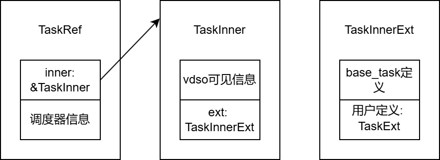

# vsched项目阅读笔记

## 任务数据结构

`TaskInner`中，除了`ext`以外的字段为vdso可见的信息。`TaskInner`的`ext`字段为`TaskInnerExt`类型，其也在base_task库中定义。`TaskInnerExt`中有用户定义的`TaskExt`类型的`task_ext`字段。

user_test中定义的`task_ext`，字段和功能如下：

|字段|是否与base_task中字段重复|
|-|-|
|base（指向base_task的指针）|否|
|name|TaskInnerExt::name|
|entry|TaskInnerExt::entry|
|in_wait_queue|TaskInner::in_wait_queue|
|timer_ticket_id（功能见代码注释）|TaskInner::timer_ticket_id|
|preempt_disable_count|TaskInner::preempt_disable_count|
|exit_code|TaskInnerExt::exit_code|
|wait_for_exit|TaskInnerExt::wait_for_exit|
|future|TaskInnerExt::future|

|功能|是否与base_task中功能重复|
|-|-|
|定义WaitQueue及相关功能|base_task中定义了WaitQueue，但没有实现任务等待相关功能|
|映射vsched|否|
|定义gc任务和idle任务|否|
|协程调度循环、栈的分配和回收|否|
|线程和协程的退出|否|
|协程的让出和阻塞|否（需要user_test和base_task中代码配合以完成协程调度）|
|线程的task_entry定义|否|
|join操作|base_task定义了join操作，但依赖于外部实现的join函数和JOIN_FUTURE|

`user_test`中所有字段在重构过程中都移动到了`base_task`中，但其所有功能均未移动到其它模块。

## 线程与协程的调度过程

### 任务的切换

线程 -> 线程：

`vsched_apis::yield_now` -> `vsched::api::yield_now` -> `vsched::sched::yield_current`: 先维护就绪队列，再调用`resched` -> `vsched::sched::resched` -> `vsched::sched::switch_to` -> `(*prev_ctx_ptr).switch_to(&*next_ctx_ptr)`: 真正的上下文切换过程

线程 -> 协程：

同上，但是在`vsched::sched::switch_to`函数中，在上下文切换前，调用`next_task.set_kstack`（`next_task: TaskRef`） -> `base_task::TaskInner::set_kstack`: 根据协程的`alloc_stack_fn`字段指向的函数分配内核栈；根据协程的`coroutine_schedule`字段指向的函数设置任务上下文的入口点。

协程 -> 线程：

`user_test::vsched::yield_now_f` -> `YieldFuture::new().await` -> `user_test::vsched::YieldFuture::poll`: 先调用`vsched_apis::yield_f`仅维护就绪队列不执行实际切换，再返回`poll::Pending`至`user_test::task::coroutine_schedule` -> `user_test::task::coroutine_schedule`: 先通过`vsched_apis::current`获取下一个要执行的任务，再通过`(*prev_ctx_ptr).switch_to(&*next_ctx_ptr)`执行上下文切换。

协程 -> 协程：

同上，但是在`user_test::task::coroutine_schedule`函数中，在上下文切换前，将自己已用完的栈传递给下一个协程。并且，不进行线程式的上下文切换，而是直接回到循环开始，运行下一个协程的`Future::poll`。

### 任务的阻塞

线程的阻塞：

`user_test::wait_queue::WaitQueue::wait` -> `user_test::vsched::blocked_resched`: 先将任务加入阻塞队列，再调用`vsched_apis::resched` -> `vsched::api::ressched` -> `vsched::sched::resched`，之后同任务切换过程

协程的阻塞：

`user_test::wait_queue::WaitQueue::wait` -> `BlockedReschedFuture::new(self).await` -> `user_test::vsched::BlockedReschedFuture::poll`: 先将任务加入阻塞队列，之后调用`vsched_apis::resched_f`仅维护就绪队列不执行实际切换，之后的切换过程同协程的切换。

（协程的阻塞没有使用`Waker`相关机制，且`user_test::task::coroutine_schedule`函数中使用的`Waker`也是`Waker::noop`，因此该协程调度器不支持基于`Waker`的协程阻塞。）

## user_test修改笔记

user_test中的测例代码因为没有适应
vsched代码的重构而无法运行。因此阅读vsched代码，从而修改user_test代码使其可以运行。

并且，目前的代码结构存在以下问题：

- 如上所述的协程的切换过程，仅适用于整个调度器中只有`user_test`中定义的一类任务的情况。如果出现多种类型的任务（例如用户态任务和内核态任务）（也就是说，有多种`TaskExt`定义、多种`alloc_stack_fn`和`coroutine_schedule`函数），则其协程调度机制不再能起作用。
- 功能代码与测试代码混合。之后的修改，希望将测试代码中的功能代码分离出来，封装为可复用的独立库。
- 对协程的`Waker`支持不足。
- 对多个地址空间的支持？

因此打算重新设计代码结构如下，分为如下几个crate：

**vdso调度器**：实现为vdso共享库。其功能包括：

- 定义任务的基础数据结构`BaseTask`（其中，协程的定义需要外部提供`alloc_stack`和`coroutine_schedule`函数）
- 每个CPU核心的就绪队列的维护
- 从线程到线程/协程的切换

**任务调度辅助库**：实现为普通库。其功能包括：

- 定义任务的延申数据结构`TaskExt`
- 协程相关操作（如让出、阻塞）对应的`Future`
- 协程的`alloc_stack`和`coroutine_schedule`函数
- 适用于线程和协程的阻塞队列
- 线程和协程的join操作
