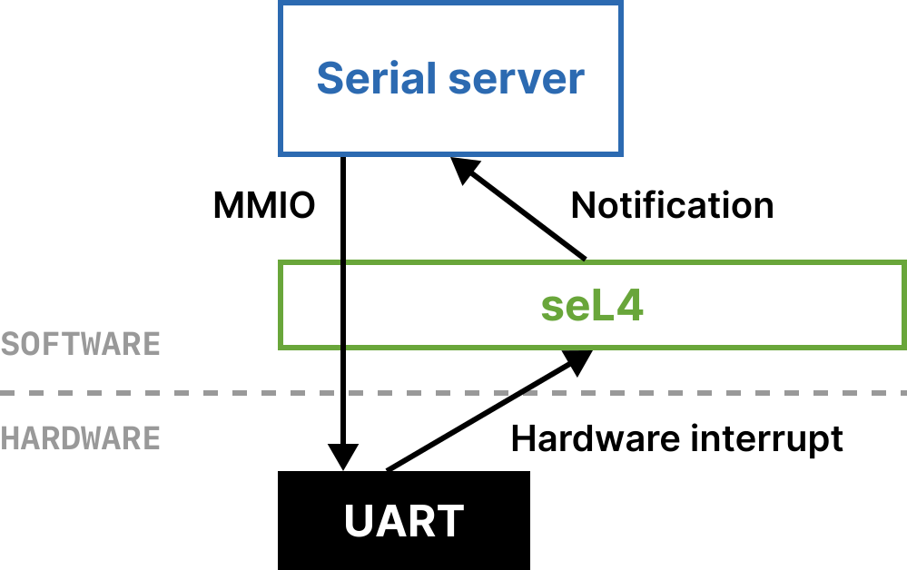

# seL4 docs 阅读笔记

原文：[seL4 docs](https://docs.sel4.systems/)

## 阅读目标

- 对seL4有系统性的了解
- 了解seL4中的设备驱动程序如何与设备通信、是否支持异步

## 我学到的

seL4微内核的功能：

- 启动用户态主任务root task
- 使用capability管理各类内核对象
- 提供内存分配机制，将空闲内存通过untyped capability提供给root task
- 提供进程/线程调度机制，管理各个线程的TCB并支持任务的创建、运行、停止等操作
- 提供IPC机制（endpoint、notification）
- 基于IPC提供中断和错误处理机制

因此，设备驱动在用户态实现，且seL4并未限定设备驱动的实现方式。

用户态硬件驱动的实现见后文。

## The seL4 Kernel / Tutorial

### root task

内核启动后启动的第一个用户态线程，负责初始化用户态环境。

### capability

在用户态访问内核资源时使用的令牌，可以理解为带访问权限的指针。三类capability：

- 访问具体内核对象的capability
- 访问抽象资源，例如`IRQControl`的capability
- 访问内存区域并负责分配它们：untyped capability

内核启动后，所有capability交给root task管理。

用户操作内核资源的方式：使用系统调用并传入对应的capability。

#### CNode、CSlot、CSpace

CSpace中保存了一个进程具有的所有capability，类似于虚存空间。

CNode类似于虚存空间中的页表，其为CSlot的数组。CSlot可能为空，也可能存储着一个capability。类似虚存，CNode也可能有多级。

出于惯例，CNode中的第0个CSlot总是为空。

CNode也由capability管理。CSpace的根CNode的capability保存在用户进程的TCB中。

#### capability的寻址方式

1. 通过预定义的名称（如`seL4_CapInitThreadTCB`）。该方式只能用于寻址用户进程的根CNode中的capability。

2. 在CSpace中直接寻址：

直接寻址需要提供的参数：

- `_service/root`：寻址的起始CNode的capability（此时就不必是根CNode了）
- `index`：本CNode中的CSlot序号
- `depth`：寻址的起始CNode在地址构成中占的bit数量。也就是说，该CNode最多存储`2 ^ depth`个capability。

对CNode的寻址必须使用直接寻址。

#### 初始CSpace

即为root task的CSpace。

一部分capability是静态确定的，在`libsel4`中预定义为常量。

一部分capability非静态确定，由`seL4_BootInfo`数据结构描述。

### Untyped

除了一小部分大小静态确定的内核内存以外，所有内存交由用户态管理。它们包括seL4启动时已创建的内核对象（例如root task的TCB），以及通过untyped capability管理的空闲内存（untyped 内存）

untyped capability的`device`属性：`false`代表其可被内核访问；`true`代表其不可被内核访问（后端不是RAM，或者位于RAM上不可被内核寻址的区域）。`device = true`的untyped capability只能被retype为页框对象。（类似块设备）

#### Retyping

使用`seL4_Untyped_Retype` API，对untyped capability进行retype，即使用这个空间分配更小的内核对象或者untyped 内存。retype出的capability被称为子capability。

在untyped对象内部，使用watermark记录空闲空间的起始。

根据retype的调用顺序，从左到右依次分配（符合大小和对齐要求的）空间。

```
obj1    obj2
[--|  |--|--|  |  |  |  ]
^           ^           ^
|           |           |
start       watermark   end
```

被retype后，原有的untype capability仍可继续使用。但其可用空间会减少。只有所有子capability均被释放后，被占用的空间才会重新可用。

`seL4_Untyped_Retype` API的各参数含义见原文。

### Mapping

seL4的虚存管理由用户态进行。只需保证内核占有虚存空间（VSpace）中的高地址部分。

root task启动时，内核已经创建了一个管理VSpace的capability：`seL4_CapInitThreadVSpace`。

可以通过API将页表对象和页对象映射和取消映射到VSpace中。页对象的成功映射要求其上级的页表对象均成功映射。

### Threads

TCB的构成：

- 当前优先级和可设置的最大优先级
- 寄存器上下文
- CSpace capability
- VSpace capability
- endpoint capability（用于错误处理，产生错误后向该endpoint发送消息）
- reply capability slot

调度算法：带优先级的round robin算法

进程和线程没有TCB上的区别，仅通过两个TCB是否具有相同的CSpace和VSpace区分它们在逻辑上属于一个进程的两个线程还是两个进程。

#### Domain scheduling

为了保证安全性，可以静态地将线程划分到不同的域。域调度在线程调度的上级进行，域间无法抢占，域调度的结果是确定性的。

每一时刻只有一个域出于活动状态，此时只有该域内的线程可运行。

可以结合域的划分和CSpace/VSpace的划分，从而实现更传统意义上的进程。

### IPC

使用endpoint进行同步IPC。相关系统调用：

- `seL4_Send`：发送消息并阻塞线程直到消息被另一线程接收
- `seL4_NBSend`：非阻塞的发送，但只有当有线程在等待消息时，发送才成功。
- `seL4_Recv`：阻塞接收
- `seL4_NBRecv`：非阻塞接收。因为不支持消息的缓存，因此只有当线程在等待发送时，接收才成功。
- `seL4_Call`：`seL4_Send` + `seL4_Recv`，但接收阶段时线程不会阻塞在该endpoint上，而是阻塞在一个一次性的capability（reply capability）上。发送消息时，reply capability存储在服务方的TCB中。这样，服务方就可以直接向reply capability中回复，省略了回复消息的分发过程。
- `seL4_Reply`：向reply capability中发送。
- `seL4_ReplyRecv`：`seL4_Reply` + `seL4_Recv`，接收阶段阻塞在该endpoint上。

每个线程具有一个IPC缓冲区。发送消息时指定消息长度，由内核执行消息的拷贝。

IPC可以传递capability。发送方需要指定`seL4_MessageInfo_t`中的`extraCaps`为传递的capability数量，之后在发送前调用`seL4_SetCap`。接收方需要在接收前调用`seL4_SetCapReceivePath`指定接收到的capability在自己CSpace中的位置。

badges（标志）：在endpoint上发送信息时，可以附带一个标志。当信息发送成功后，就会将endpoint的标志复制为该标志。接收方即可获得这个标志。标志在Endpoint和Notification中均有应用，可用于区分消息的类型。

Endpoint IPC在满足条件时可以使用fastpath。条件详见原文，但原文也未解释fastpath的原理。

### Notifications

notification：实现异步IPC，常用于中断处理和共享数据结构的同步。

其支持消息的缓存，但信息量较小。当多个消息到来并缓存时，会将它们按位或。因此，若要支持多种消息，则每种消息的信息量更少了。

状态：

- 等待：有正在阻塞等待的接收方，没有收到消息。
- 活跃：已收到消息，没有等待的接收方。
- 空闲：没有消息，也没有等待的接收方。

API：

- `seL4_Signal`：发送消息。在等待状态下，直接传递给接收方，否则缓存（并与已缓存的消息按位或）。
- `seL4_Wait`：阻塞接收消息。若有缓存的消息则接收并返回，否则等待。
- `seL4_Poll`：非阻塞地接收消息。

### Interrupts

reL4将内核的中断转发到notification，并让用户态来处理。

root task具有用于控制所有中断的capability，`seL4_CapIRQControl`。其可被移动，不可被复制。

使用`seL4_IRQControl_Get`，可以从`seL4_CapIRQControl` capability中创建`IRQHandler` capability，以控制单个中断号的中断处理。

使用`seL4_IRQHandler_SetNotification`操作`IRQHandler` capability，将一个中断信号绑定到一个notification。通过设定不同的标志，可以将多个中断信号绑定到同一个notification。之后，就可用`seL4_Wait`或`seL4_Poll`处理中断。

`seL4_IRQHandler_Clear`：取消中断和notification的绑定。

`seL4_IRQHandler_Ack`：对`IRQHandler` capability使用，确认该中断已处理完成。在一个中断到达之后、被确认之前，相同的新的中断不会转发到notification。

### Fault handling

当线程产生异常，seL4会阻塞其线程，并向其TCB中的fault handler endpoint发送消息。

endpoint接收端的异常处理程序处理完成后，可使用两种方法之一恢复异常的线程：

- 使用`seL4_Reply`系统调用，并设置`seL4_MessageInfo_t.label = 0`
- 对异常线程的TCB调用`seL4_TCB_Resume`

## The seL4 Microkit / Tutorial

seL4内核并未提供完整的操作系统功能（例如设备驱动）。

seL4 Microkit即为辅助在seL4之上实现完整的操作系统的开发框架。

用户态驱动程序的结构：



CPU和外设直接交互的方式为MMIO、PMIO和中断（DMA等也是基于这些机制的）。（PMIO类似于MMIO，不同之处在于其外设位于独特的地址空间中，且需要使用独特的指令访问（x86中的`IN`和`OUT`）。PMIO是一种较旧的外设访问方式。）

- MMIO：seL4将MMIO所在的内存区域交给root task管理，root task将这部分区域映射到驱动进程的VSpace中。
- PMIO：暂不清楚。外设使用的独特地址空间是否会被内核交给root task管理？访问外设的指令是否有特权级限制？
- 中断：通过seL4转发到驱动进程的Notification中，被其中的中断处理程序处理。
