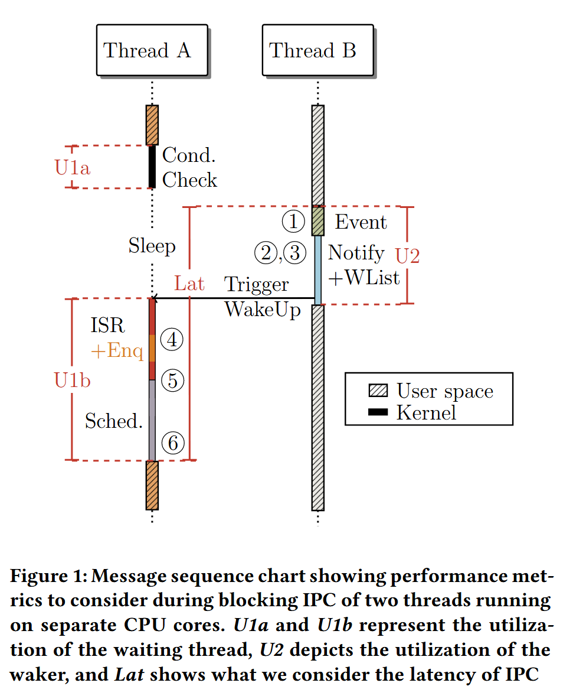
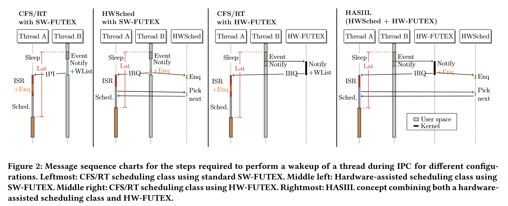
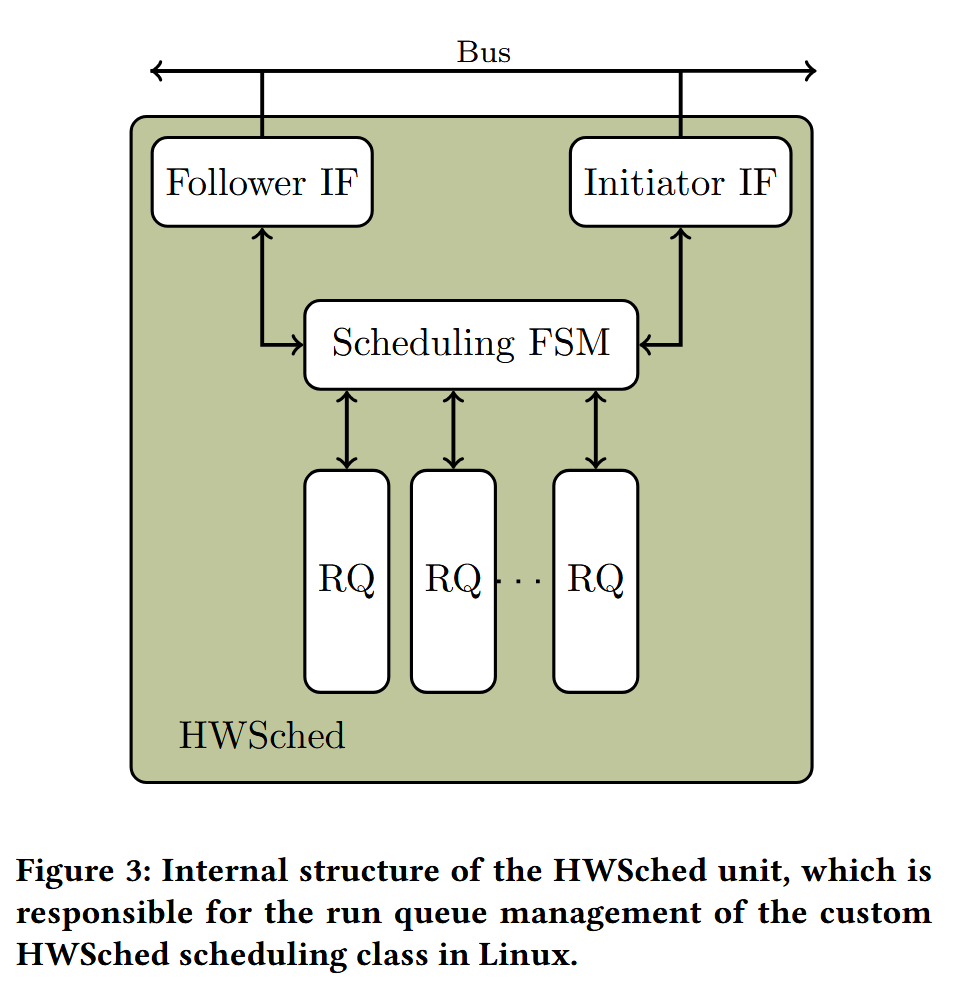
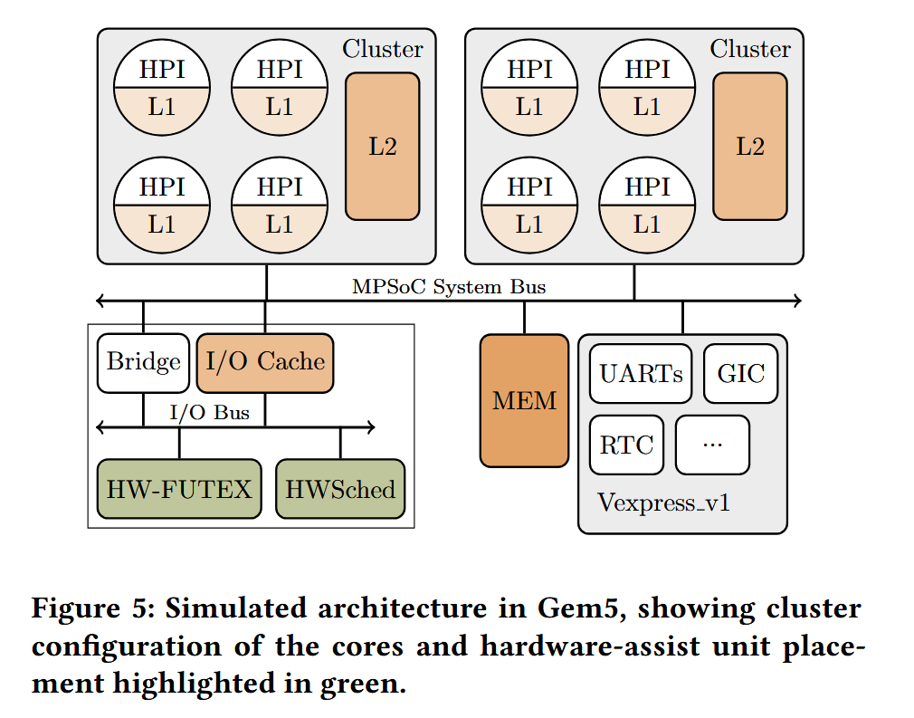
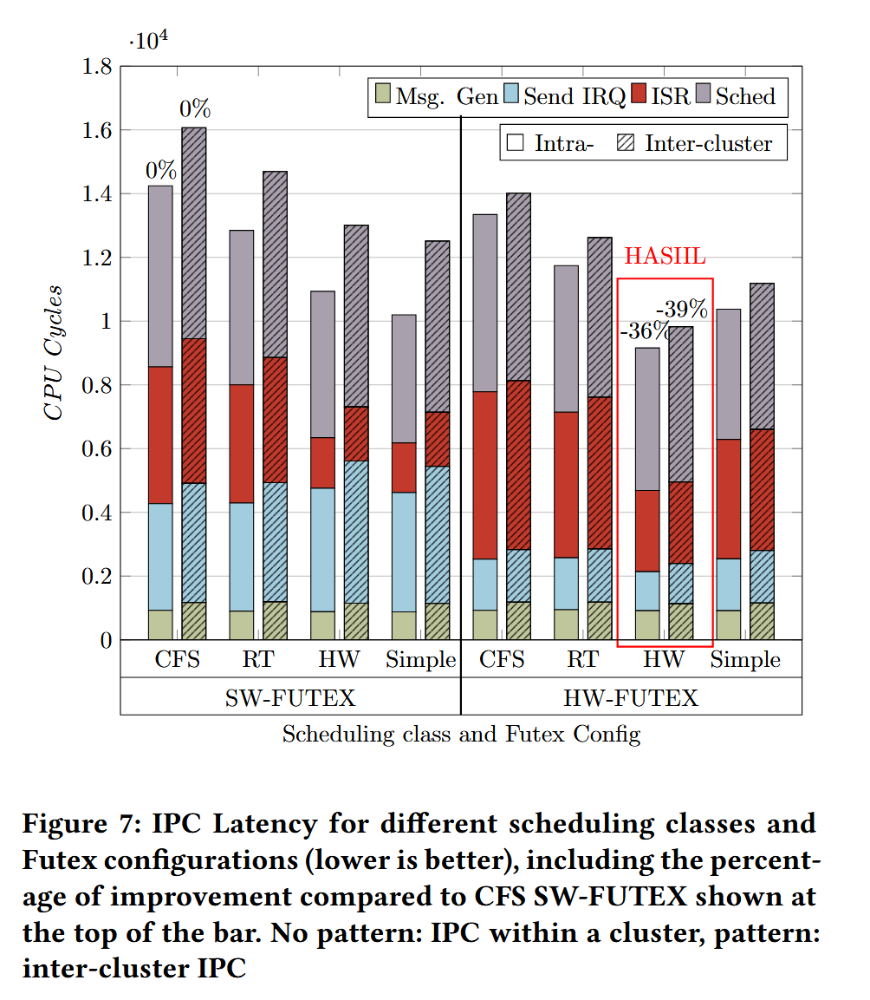
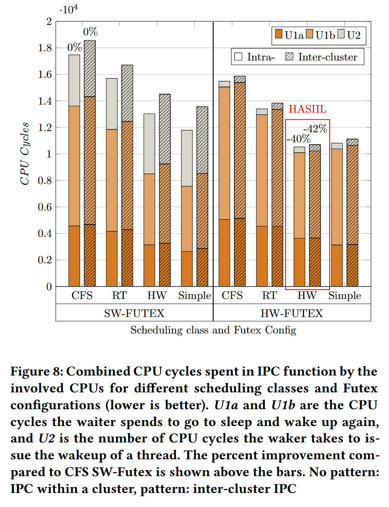
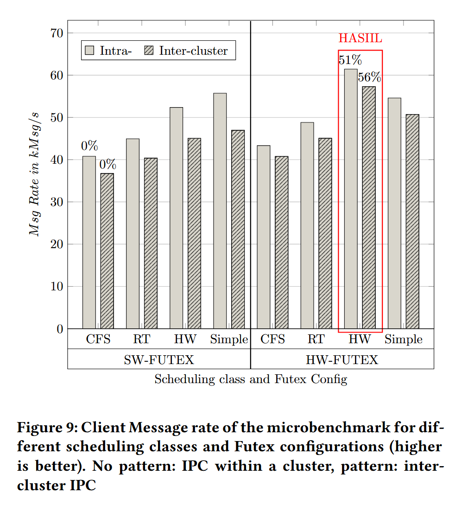

# HASIIL: Hardware-Assisted Scheduling to Improve IPC Latency in Linux 论文阅读笔记

## 我学到的

- IPC性能的衡量指标：除了时延外，还可以衡量用于IPC函数的CPU周期数。
- 使用时序图可以很好地描述IPC过程（各步骤的顺序和通信）
- 本文方法的创新点似乎全部体现在“用硬件比用软件性能更好”了，因此对我的工作帮助不大？

## Abstract

IPC效率的衡量因素：延迟、CPU利用率

Linux中的任务调度机制导致了阻塞式IPC的通知延迟。

HASIIL：IPC功能offload + 硬件协助调度

## 1 Introduction

Linux提供的IPC机制：Futex（快速用户态互斥锁）

[Linux 进程间通信（IPC）总结](https://www.cnblogs.com/huansky/p/13170125.html)

本文的工作：通过专业硬件辅助Linux调度，并配合Nolte et al. 实现的IPC唤醒offload机制，HW-FUTEX，从而改进Linux中阻塞式IPC的性能。

## 2 Background

### 2.1 IPC Metrics

IPC关键性能指标：CPU核心占用（utilization of the cores）、时延

**CPU核心占用**：IPC相关通信函数占用的CPU时间。该值越低越好，将尽可能多的CPU时间让给执行实际功能的代码。

**时延（本文的定义）**：从唤醒机制开始执行到目标线程被唤醒且回到功能代码所用的时间。

下文的情景：线程A等待线程B的事件，线程B在事件触发后唤醒线程A。

CPU核心占用：对于线程A来说，为U1a和U1b；对于线程B来说，为U2。

时延：对于本次IPC过程来说，为图中的Lat。

### 2.2 Wakeup Steps

对上图的唤醒流程的分析：

- (1) 线程B触发线程A正在等待的事件
- (2) 进入内核，将线程A加入对应核心的唤醒队列（wakelist）
- (3) （在内核态）向线程A所在核心发送核间中断以通知该核心，有新的就绪线程。
- (4) 线程A所在核心在内核态处理中断，在中断处理函数中将唤醒队列中的线程A放入就绪队列
- (5) 中断处理完成后，执行重调度，调度线程A执行。
- (6) 线程A（的用户态执行流）恢复执行。

此处使用了唤醒队列+就绪队列双队列，而非直接把唤醒线程加入就绪队列的原因是为了保持就绪队列的本地缓存一致性。

## 3 Related Work

MPI或DPDK的IPC机制：它们依赖轮询或非阻塞机制，并以提高CPU核心占用为代价分配线程的CPU核心。（这里的意思应该是使轮询的循环占据了太多CPU时间）。规避线程进入睡眠和进入内核。

Virtual-Link和SPAMer：同样使用专用硬件加速IPC，但专注于数据传输。而本文的研究专注于线程唤醒，二者可以结合。

XPC：在微内核中实现不需陷入内核的线程切换。**（这篇我也可以看一看）** 同样与本研究的内容垂直。

HW-FUTEX：通过专用硬件offload CPU的唤醒工作，降低IPC中线程唤醒的开销（但改善很有限）。

Carbon、CAF、FLASH：硬件辅助调度工作。本文则将硬件辅助调度与IPC offload结合了。

## 4 HASIIL Concept

向Linux中添加一种硬件管理的调度类（scheduling class），并与HW-FUTEX提供的唤醒offload结合。

下图演示了硬件调度与HW-FUTEX对线程唤醒流程的改变。

原始（左1） -> 硬件调度（左2）：在核心A上节省了软件Enq的时间；在核心B上增加了硬件Enq的时间。硬件队列不需要像软件队列一样实现为“唤醒队列+就绪队列”的二级队列。

原始（左1） -> HW-FUTWX（左3）：在核心B上节省了陷入内核的时间，可直接在用户态触发唤醒机制。

HW-FUTWX（左3） -> 硬件调度 + HW-FUTEX：将HW-FUTEX管理的软件调度流程改为了硬件调度。

因为实现的硬件调度机制为一种新的调度类，因此原有的调度类不受影响，仍可兼容使用传统调度算法的程序。

## 5 Implementation

### 5.1 Software changes

#### 5.1.1 Kernel changes

在Linux内核实现HWSched调度类。

包含不同调度类所有就绪队列的数据结构被扩展为包含 HWSched 类的数据结构。

HWSched类的运行队列数据结构为一个指向硬件设备文件的指针和一个标识硬件队列是否为空的标识。

Linux调度器会循环运行调度类，决定下一个执行任务，从优先级最高的开始（RT > HWSched > CFS > Idle）。

#### 5.1.2 Device Driver

被调度类调用，用MMIO与硬件通信。

### 5.2 Hardware Setup and Device

#### 5.2.1 HWSched unit

硬件对每个CPU核心维护一条就绪队列。

简单起见，选择了FIFO队列。

Follower接口：用于任务的放入和取出

Initiator接口：用于软件中队列为空标识的维护

#### 5.2.2 HW-FUTEX

若使用HWSched调度类，则将软件唤醒操作改为硬件唤醒操作

需要识别使用的调度类，以决定使用软件还是硬件唤醒。

## 6 Evaluation

Simple调度类：链表实现的FIFO，无负载均衡，无二级队列

实验硬件环境：

时延测量结果：

CPU占用情况（用于IPC函数的CPU周期数）测量结果：

消息速率测量结果：

