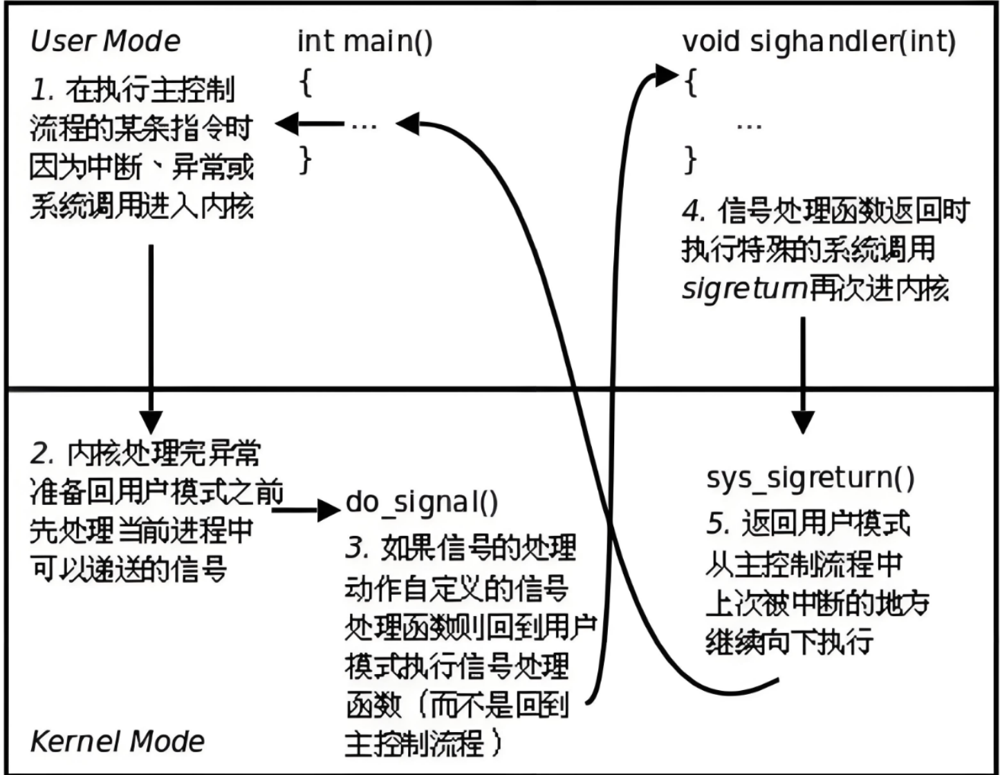

# Rust信号处理学习笔记

## Linux信号处理

[[操作系统] 信号](https://cloud.tencent.com/developer/article/2526275)



### 信号安全的函数

信号处理函数对于用户态代码来说与中断处理函数对于内核态代码来说相似，都是会任意地打断正常执行流并插入执行的代码。因此，需要考虑它们访问全局数据时的同步问题，且需要让处理函数自身可重入。（[什么是可重入的（Reentrant）的函数?](https://blog.csdn.net/qq_43689451/article/details/145320207)）

Linux提出了异步信号安全（async-signal-safe）的概念，要求信号处理函数满足以下两条要求之一：

- 保证信号处理函数只调用异步信号安全函数，并且对于主程序的全局变量而言，信号处理函数本身是可重入的。
- 信号处理函数或许可以获取某些全局数据。当使用不安全或处理这些全局数据的函数时，阻塞主程序获取信号。

第二条要求对程序来说太复杂了，因此一般满足第一条要求：在信号处理函数中使用原子变量或管道传递数据。也可以使用[`signalfd`](https://man7.org/linux/man-pages/man2/signalfd.2.html)函数，从fd中读取信号信息。该方式类似于使用管道。

## Rust信号处理——`signal_hook`库

[signal_hook](https://docs.rs/signal-hook/latest/signal_hook/index.html)

rust使用最广泛的信号处理库。

由于上文所述的与信号安全有关的内容，该库的推荐使用方式不是直接注册信号处理函数，而是通过原子变量和迭代器传递信号信息，并在正常代码中处理。

使用该库，可以在不同位置获取同一个信号的信息，进而为同一个信号执行多个操作，而不像直接使用信号处理函数时，新注册的函数会覆盖旧函数。

### 协程支持

该库支持协程。通过不同的适配器库，可以在不同的协程运行时中使用协程处理信号。

目前已有的适配器库：

- [signal-hook-async-std](https://docs.rs/signal-hook-async-std)
- [signal-hook-mio](https://docs.rs/signal-hook-mio)
- [signal-hook-tokio](https://docs.rs/signal-hook-tokio/latest/signal_hook_tokio/)

适配器需要为不同的协程运行时提供不同版本的原因和其内部实现有关：

所有适配器都通过为`SignalsInfo`实现`Stream`从而支持异步。如下：

```Rust
impl<E: Exfiltrator> Stream for SignalsInfo<E> {
    type Item = E::Output;

    fn poll_next(mut self: Pin<&mut Self>, ctx: &mut Context<'_>) -> Poll<Option<Self::Item>> {
        match self.0.poll_signal(&mut |read| Self::has_signals(read, ctx)) {
            PollResult::Signal(sig) => Poll::Ready(Some(sig)),
            PollResult::Closed => Poll::Ready(None),
            PollResult::Pending => Poll::Pending,
            PollResult::Err(error) => panic!("Unexpected error: {}", error),
        }
    }
}
```

关键步骤为调用内部的[`poll_signal`](https://docs.rs/signal-hook/latest/src/signal_hook/iterator/backend.rs.html#451-473)函数，并将自身的[`has_signals`](https://docs.rs/crate/signal-hook-tokio/latest/source/src/lib.rs#134-142)函数作为参数传入。

`poll_signal`函数的功能为：在已通过管道传递信号信息的情况下，通过传入的回调函数读取管道的读端，并将读取到的信号信息存入内部的迭代器中。

而适配器库传入的`has_signals`函数，则通过调用各个异步运行时的异步读接口，达到读取管道的效果。

因为各个异步运行时使用不同的异步读接口（因为读接口会涉及向内核注册的等待事件，因此与异步运行时强绑定），所以适配库也需要实现不同异步运行时的版本。

## 基于信号的协程唤醒

原本考虑的“在信号处理函数中调用协程`Waker`”的想法存在问题：这会导致信号处理函数访问协程就绪队列，造成同步问题。（`Waker`接口不要求协程运行时具备同步访问功能。）而如果要在运行时访问就绪队列前后关闭信号，又会涉及对运行时的修改。

目前的想法是，通过原子变量维护信号状态。协程检查原子变量，如果没有信号到来则一直`yield`，直到有信号到来再继续执行。该设计相当于让该协程轮询信号的到来。但问题在于，不依赖运行时特定的机制的话，协程本身对`yield`的支持不足。只能通过在`poll`函数中不等待IO、直接调用`Waker`的方式实现`yield`。但这会导致协程在还未停止时就放入了就绪队列，对于单线程的协程调度器来说没有问题，但对于多线程的协程调度器，则该协程可能在还未结束时，就被其它线程获取和运行了，导致出现问题。同时，如果使用轮询来处理信号，则整体设计中的“使用信号唤醒协程”就没有意义了，直接让协程在其原本等待的事件上轮询就行。

因此，运行时无关的基于信号的协程唤醒是难以实现的。只能分为两种情况：

- 在Linux系统上，则直接使用`signal_hook`库提供的适配器库。其底层调用异步读接口从管道中读取信号信息，因此管道可读事件可以通过多路复用机制和其它事件一起监听，起到了异步唤醒的作用。
- 在rel4上，目前不支持信号机制（不知道其上的用户态宏内核是否支持）。若需要实现信号机制，直接在内核层面改写，将信号处理过程的打断当前执行流，切换到一个临时执行流的操作改为唤醒一个协程并放入调度队列。

另：用户态中断唤醒协程的实现应该也会遇到上述同步问题。可能需要修改运行时，使访问调度队列前后分别屏蔽和开启用户态中断。

（虽然信号唤醒的部分也可以通过访问调度队列前后分别屏蔽和开启信号实现，但这意味着访问一次调度队列就要执行两个系统调用，开销太大。因此还是使用读取管道的方法吧。）
