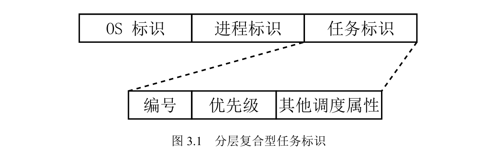
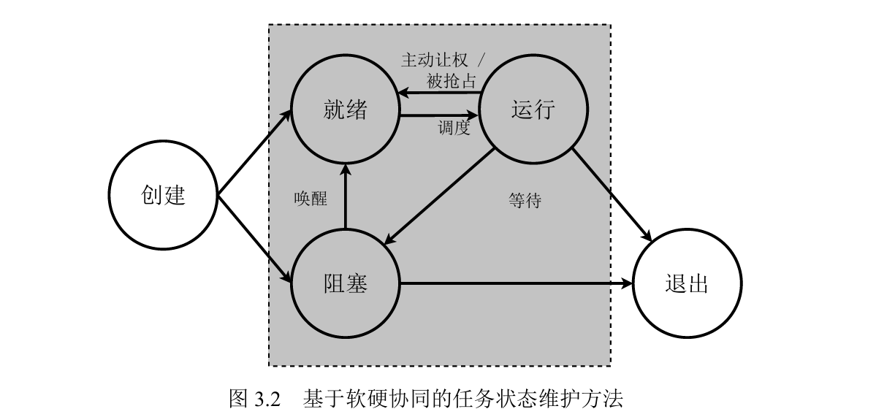

# zfl毕业论文阅读笔记

## 需要回答的问题

### 统一调度与分级调度相比，有何优势？是否有不足？统一调度的设计细节

### ldh的异步rel4（包括使用UINTC和使用TAIC两个版本），使用的任务模型为统一调度还是分级调度？

ldh的异步rel4，在用户态使用`crates/example/async_runtime`提供协程支持。其中的`Executor`，在使用UINTC时使用软件定义的局部队列作为就绪队列；在使用TAIC时使用TAIC硬件队列作为就绪队列。因此，在使用UINTC时为分级调度，在使用TAIC时为统一调度。

## 论文工作

### 1. 统一调度任务模型

统一进程、线程和协程的调度；统一用户态和内核态的调度。任务=执行流+执行环境。

任务标识：

任务状态：

灰色代表在硬件中维护。通过任务所处的队列代表任务状态。

#### 解决的问题

1. 内核态调度器无法感知到用户级线程/协程，不了解全局信息
2. 阻塞式的执行流切换机制（如系统调用、异常处理）会阻塞整个线程，使该线程内的其它协程也无法运行

#### 导致的问题

1. 是否会导致地址空间/特权级的频繁切换？例如，若有多个地址空间的协程依次执行，则会导致以协程切换的频率切换地址空间？
2. 所有核心以协程调度的频率同时访问调度器导致的同步开销。在使用硬件调度器时，硬件带来的低同步开销可以抵消该问题。但如果我的工作使用软件实现，则可能会遇到该问题。

### 2. 基于硬件的调度器

设计略。

#### 解决的问题

1. 通过硬件的同步机制（如总线事务）代替软件同步机制，降低开销
2. 通过硬件进行负载均衡，开销比软件更小

### 3. 基于硬件的中断处理、通知机制

中断处理设计略。

通知机制设计：需要先注册发送方和接收方，建立一条通道，之后发送方发送通知，硬件就会唤醒接收方对应阻塞队列上的协程。

（2和3实现为同一个硬件，此处为了对不同功能进行分析而分开讨论。）

#### 解决的问题

1. 降低了中断处理、IPC处理时需要切换的上下文次数
2. 统一了中断和用户的优先级
