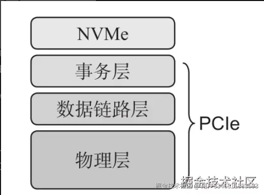
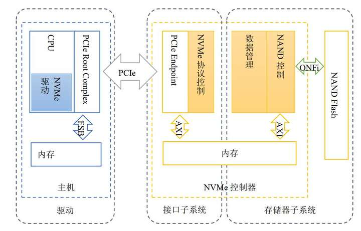
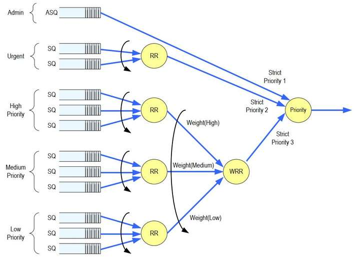
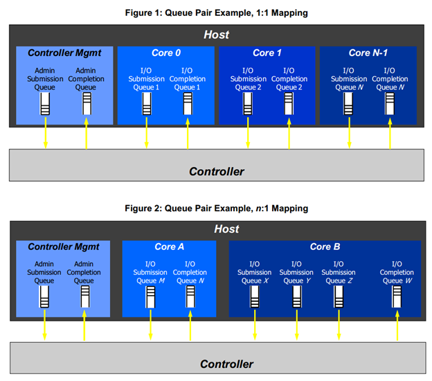
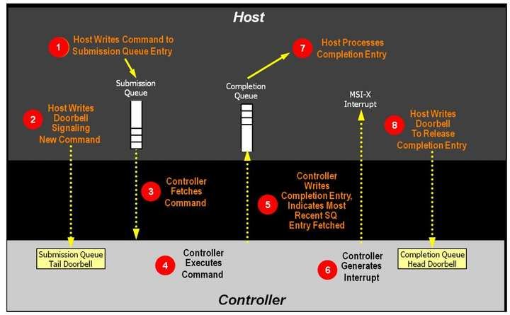

# NVMe学习笔记

参考[NVME(学习笔记一)—概述](https://www.cnblogs.com/FireLife-Cheng/p/16227775.html)

## 简介

NVMe（Non-Volatile Memory Express）是专为闪存与SSD设计的高性能存储协议，运行在PCIe总线之上，旨在最大化并行性、降低延迟并减少协议开销。

NVMe属于应用层协议，作为软件和硬件间的接口。其下由PCIe提供支持。主机通过NVMe协议与NVMe控制器交互，控制器再与存储器交互。

## 数据结构

NVMe采用了提交队列和完成队列的队列对结构，与io_uring类似。

队列对（SQ/CQ）分为Admin SQ/CQ和I/O SQ/CQ两种，前者传递控制和管理类命令（包括I/O SQ/CQ的创建和释放），后者传递真正的I/O命令。

支持多组SQ/CQ，且SQ/CQ之间可以区分优先级。各优先级间的调度方式如下：

多个SQ可以对应一个CQ。

提交命令后，通过写入提交队列的DB（Doorbell）寄存器使硬件开始执行命令；命令执行完成后，通过中断通知软件。软件处理完完成消息后，写入完成队列的DB以释放完成消息占用的队列位置。

## 另：询问deepseek得到的双队列结构的补充说明

提交队列-完成队列（SQ/CQ）结构确实在I/O操作从软件到硬件的多个层次中被广泛采用。它是一种解耦生产者和消费者、实现高效异步操作的核心模型。

下面的表格整理了几个典型层次的具体例子和主要特点：

| 层次 | 应用/协议 | 核心概念/队列 | 主要特点与目的 |
| :--- | :--- | :--- | :--- |
| **系统调用接口** | **io_uring** | 提交队列环（SQ Ring）、完成队列环（CQ Ring） | 通过用户态与内核共享内存实现高性能、异步I/O，减少系统调用和数据拷贝开销。 |
| **块设备/硬件接口** | **NVMe** | 提交队列（SQ）、完成队列（CQ） | 用于主机软件与SSD控制器间高性能通信。支持多队列（Admin SQ/CQ和多个I/O SQ/CQ），通过门铃寄存器（Door Bell）同步。 |
| **远程直接内存访问** | **RDMA / RoCE v2** | 工作队列（WQ，含发送队列SQ和接收队列RQ）、完成队列（CQ） | 在网卡层面实现零拷贝、低延迟的网络数据传输。应用提交工作请求（WR）到WQ，网卡处理后生成完成队列元素（CQE）到CQ。 |
| **应用层异步框架** | **bRPC ExecutionQueue** | 一个生产-消费队列 | 一个应用层的无锁多生产者单消费者队列，用于实现异步有序的任务执行，并非严格意义的“完成队列”，但体现了“提交-执行-完成”的异步模式。 |

### 💡 其他场景与延伸思考

这种异步队列思想在其他高性能计算领域也很常见：

* **GPU计算**：CUDA/OpenCL等框架中，CPU将计算任务（内核）提交到命令队列，GPU异步执行并通过事件或回调通知完成。
* **分布式任务队列**：如Celery，生产者将任务放入消息队列，多个消费者（Worker）异步拉取并执行，结果存储于后端。
* **高性能网络编程**：一些用户态网络协议栈（如DPDK）也常采用类似机制处理数据包。

### 🔍 总结

总的来说，**提交队列-完成队列是一种跨层次的、经典的异步I/O处理模式**。其核心价值在于：

1. **解耦与缓冲**：分离请求的提交与执行，缓冲速率差异，提升系统整体吞吐量。
2. **降低延迟**：通过批处理和轮询机制，减少频繁的上下文切换或中断。
3. **提升可扩展性**：尤其适合多核环境，不同的CPU核心可以操作不同的提交队列，减少竞争。

如果你想更深入地了解其中某个具体协议（比如NVMe的中断聚合机制是如何优化CQ处理的），我可以为你提供更详细的介绍。
