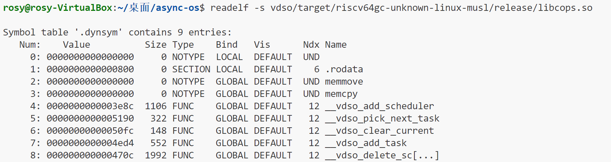
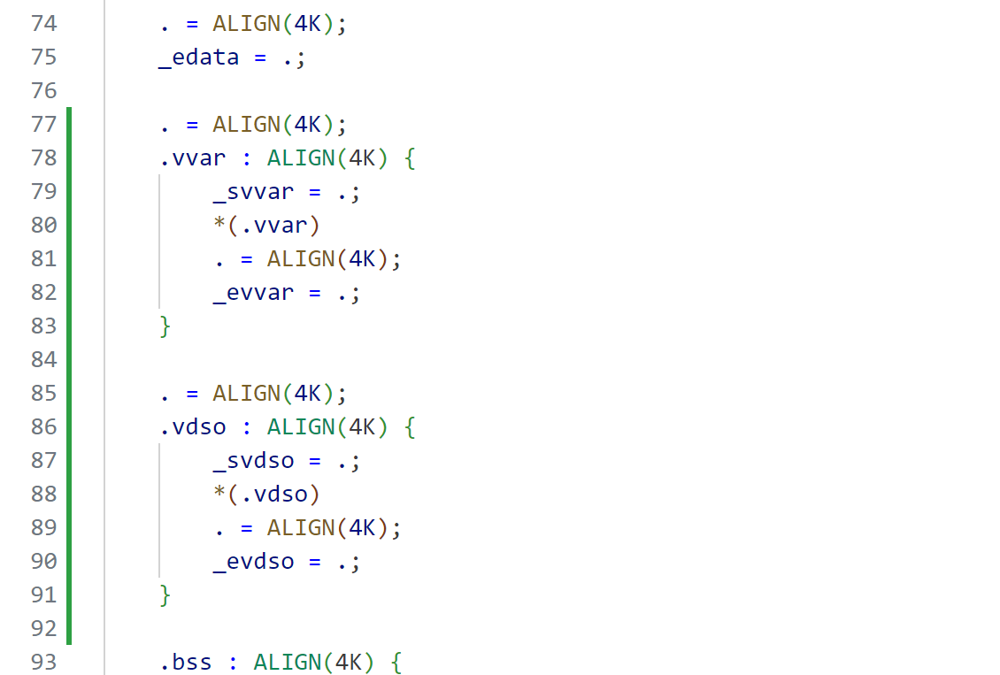
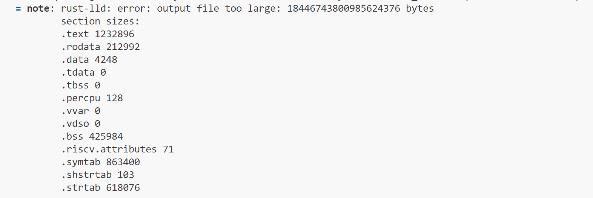
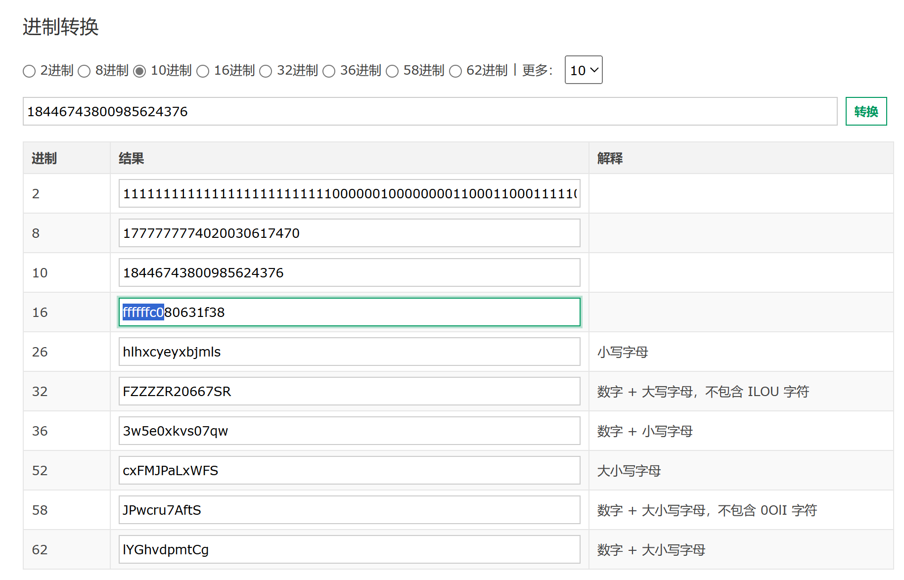
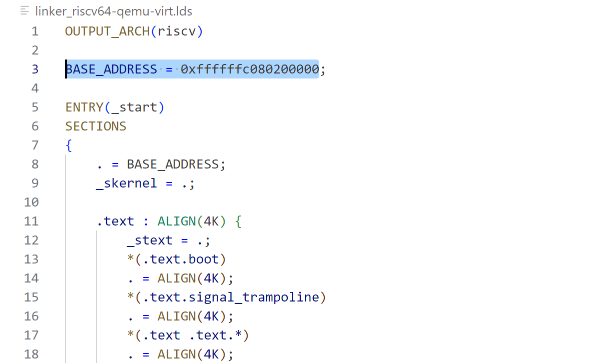
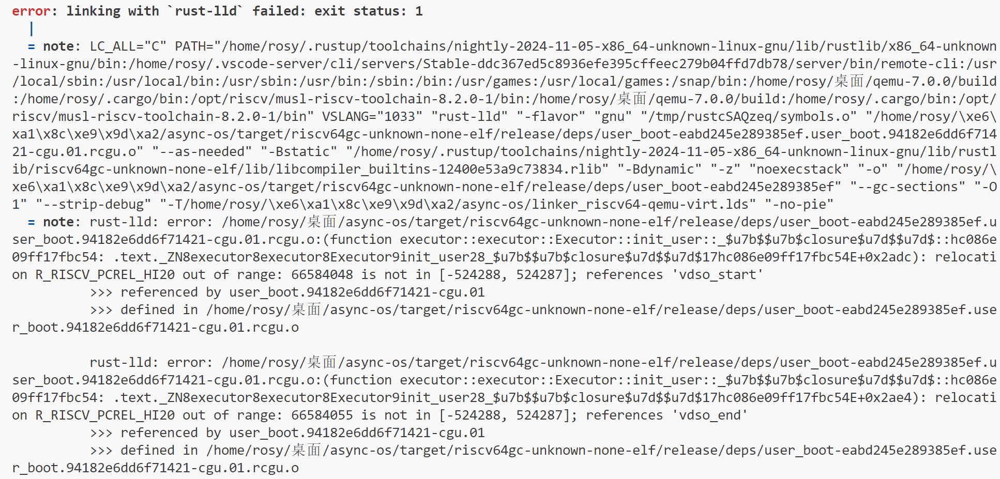

# vdso共享调度器debug日志

时间：2025/2/20

## 关于未定义符号的bug

共享调度器开发完成后，运行用户态测试代码，异常退出。

检查用户态映射过程，发现问题在于读取的elf中，`.dynsym`段有未定义符号（`Ndx=UND`）。

```Rust
// modules/executor/src/loader.rs
// fn: load_app
// line: 62
let relocate_pairs = get_relocate_pairs(&elf, elf_base_addr);
```

```Rust
// lib: elf_parser
// src/arch/riscv.rs
// fn: get_relocate_pairs
// line: 61
if let Some(dyn_sym_table) = elf.find_section_by_name(".dynsym") {
    let dyn_sym_table = match dyn_sym_table.get_data(elf) {
        Ok(xmas_elf::sections::SectionData::DynSymbolTable64(dyn_sym_table)) => {
            dyn_sym_table
        }
        _ => panic!("Invalid data in .dynsym section"),
    };
```

之后，了解到可以使用`readelf`检查vdso so文件的`dynsym`段，结果如下：



其中`Ndx=UND`的两个函数`memmove`和`memcpy`即是导致`get_relocate_pairs`发生painc的原因。

查询资料后发现，`.dynsym`段中的`UND`项代表依赖其它动态库的函数。而这两个函数是libc的函数。

因此，我计划将项目对libc的依赖方式改为静态链接。

尝试1：通过编译器参数`-C target-feature=+crt-static`强制静态链接。

结果：该编译器参数与`cdylib`的库类型冲突，因此无法通过编译。

尝试2：在打印中间结果以供查看时，发现在cargo调用指令前添加`RUSTFLAGS="--emit asm"`，可以使编译出的so文件不再依赖`memmove`和`memcpy`函数。该结果十分意外，因为理论上输出中间结果不应该影响编译的最终结果。但之后在[该网页](https://siliconsprawl.com/posts/rust-emit-asm/)上也发现了这个参数会影响最终结果的情况。

结果：反汇编后发现，输出的so文件有严重问题，例如`__vdso_delete_scheduler`函数被错误地优化成“直接将返回值置0后返回”了。因此该方法在产生错误的同时，并未根本解决问题。

尝试3：zfl学长向我介绍[该网页](https://os.phil-opp.com/zh-CN/minimal-rust-kernel/)，其上有将`memcpy`等函数直接内连进代码的选项。进一步了解后，通过在`config.toml`中添加以下内容，使项目构建过程中使用内置的`memcpy`实现重新编译`core`、`alloc`等库：

```toml
[unstable]
build-std-features = ["compiler-builtins-mem"]
build-std = ["core", "compiler_builtins", "alloc"]
```

结果：成功，编译出的so文件不再依赖`memmove`和`memcpy`函数，且反汇编后的代码没有明显问题。

## 关于so文件加载的bug

解决上一个bug后，继续运行（内核的）测试代码，发现触发了`StorePageFault`。

根据反汇编结果，出错的代码为一句`amoadd.d`指令。首先推测，是由于直接用不可变的全局变量模拟堆区导致的问题。因此考虑将该全局变量放在`.data`段，但问题依然存在。

之后进一步检查发现，`amoadd.d`指令的存取地址位于`.text`段。突然发现：我在内核态调用vdso代码时，并没有真正地**加载**vdso的二进制文件，而只是将二进制文件读入内存后就在该文件里查询符号。因此，vdso的数据和代码并没有放入相应的段中，而是一起放到了`.text`段里。因此接下来需要修改vdso代码的调用方式，添加加载过程。

不过，为了排除其它bug对结果的影响，决定先成功运行用户态调用vdso（其正常地加载了so文件），再修改内核态vdso的加载过程。

## 关于用户态vdso映射过程的bug

在用户态调用vdso时，依然出现了`StorePageFault`。

排查后发现，问题出在`vdso2memoryset`函数中（这个函数的作用是把`vdso`及`vvar`区域映射到用户空间），对`copy_nonoverlapping`函数的调用上。因为上面得到的`src`和`dst`都是`memory_set`中的虚拟地址（也就是用户空间的虚拟地址），但调用`copy_nonoverlapping`时，还位于内核空间中，因此会造成地址不正确。

于是我用`memory_set`的`query`方法尝试将用户空间地址转化为内核空间地址，却发现获取不到（返回了`None`）。因为新分配的两页还未建立内核到用户的映射。

于是我调整了顺序，先映射`vdso`区域，再映射`vvar`区域，不过还是会在访问`vvar`区域时出现访存异常。并且，`vdso`区域和`vvar`区域在内核空间中均会位于`text`段，而`vvar`不应位于`text`段。

此外，我也发现我对vdso和vvar的关系不是很了解，而这会影响到我对这段代码的修改。例如vdso区域中的数据应该是vdso的so文件的内容？那vvar区域的数据又是什么？vdso的代码是如何访问vvar的数据的？对这些内容不了解的话，也无法完全理解和修改`vdso2memoryset`的代码。因此，目前我正在进一步了解这部分内容。

进一步了解了vdso和vvar的关系：vvar在内核空间中保存在全局变量内，再映射到用户空间的特定地址。vdso通过该特定地址访问vvar变量。

因此，正在修改共享调度器，以匹配此数据访问逻辑。

但遇到了两个问题：

### 1. 在内核空间内，vvar不会正好位于vdso之前，因为内核虚拟地址使用平移映射，而vdso和vvar位于不同的段。而共享调度器要求在内核态调用vdso代码，即vdso代码需要在内核态也能访问vvar数据

解决方案1：在vdso_lib（与用户/内核代码一同编译，负责调用vdso代码的库）中封装传入vdso_data地址的逻辑？对vdso_data地址的处理放在vdso_lib中，对外不可见。

新问题：alloc函数也需要用到堆区地址，而该地址无法作为外部参数传入。

解决方案2：在内核空间将vdso和vvar映射到相邻的地址。

新问题：破坏内核空间的平移映射特性，可能对其它代码造成影响？

或者，不用映射，而是在内核空间分配相邻地址，将vdso和vvar复制过去？

### 2. 内核初始化时需要创建VdsoData对象，因此需要引用vdso库中的结构体和函数；但vdso库因为其被设置为cdylib，无法直接被内核代码引用

解决方案1：内核只负责提供内存页，初始化由vdso库内部负责；但这需要在特定地址上创建对象，不知Rust能否做到。（ds：可以先在别处创建对象，再拷贝过去）但在初始化完成前，vdso库内的alloc功能不可用。

解决方案2：将AllocArea和Scheduler的定义单独写成一个库。目前最可行的方案，但需要对代码做大规模重构。并且，在内核代码和vdso代码的target不同的情况下，引用同一个结构体是否会有相同的内存布局？（即使结构体被声明为repr(C)？）（ds说应该是会的，并且提供了验证的方式）

zfl说，可以把数据部分的定义全部放在vdso外部。

### 3.10更新

目前在使用“在内核空间分配相邻地址，将vdso和vvar复制过去”和“可以把数据部分的定义全部放在vdso外部”的修改路线。

但是，在内核空间中分配地址时发现，该分配过程为异步函数。而vdso初始化阶段没有异步运行时。

可以考虑将vdso内存区域硬编码？

## 3.12更新

继续“将vdso内存区域硬编码”的路线，在链接脚本`modules/axhal/linker.lds.S`中为vdso和vvar分配独立的段，以此满足两部分数据既**位置相邻**又**有不同的访问权限**的要求。

但在这之后，链接器报错，说输出文件过大。

一方面，根据链接器输出，各个段的长度之和明显小于报错里说的输出文件长度；我还把报错中的输出文件长度转化为16进制，发现是以ffffffc0开头的16进制，正好符合内核态虚拟地址的特征。因此我猜测链接器因为某种原因，把从0地址到内核虚拟地址的结尾这一段全都算进了输出长度。

但是，我检查编译过程中生成的链接脚本async-os/linker_riscv64-qemu-virt.lds（也是链接过程实际使用的脚本），发现链接脚本设定的起始地址没有问题（BASE_ADDRESS = 0xffffffc080200000）。因此，我不知道是什么原因导致了这个问题。









## 3.23更新

按照zfl学长的建议，更换了vvar段和vdso段在链接脚本中的位置（位于percpu段之前），得到如下错误信息：



## 3.26更新

读完《程序员的自我修养——链接、装载与库》后，尝试解读错误信息。

此外，将MODE改为debug，方便查看更多调试信息。

### 寻找问题

出错的引用为`_svdso`、`_evdso`（modules/axhal/src/mem.rs中）、`vdso_start`、`vdso_end`（vdso/src/lib.rs中）。

出错的重定位类型均为`R_RISCV_PCREL_HI20`。通过PC相对寻址32位范围内的地址时，先使用`auipc`指令加上立即数的高20位，再使用其它指令（例如`addi`）加上立即数的低12位。`R_RISCV_PCREL_HI20`类型的重定位即发生在`auipc`指令中，用于修改指令中的立即数。

通过反汇编得知，在modules/axhal/src/mem.rs中，对所有链接脚本中提供的符号（即每个段的开始和结束）的寻址都使用了上述提到的“`auipc`+其它指令”的模式。但别的符号（包括vvar相关符号）的重定位都没有问题，只有vdso相关符号的重定位有问题。此外，.text段与vdso段的距离在32位以内，因此理论上该重定位应该不会超出范围。

想通过反汇编获得相关重定位的计算过程（`S+A-P`），但未能成功。

### 解决问题

之前的尝试不算成功后，想到了考虑vdso相关符号与其它段相关符号的不同点。

vdso段的声明是在内联汇编中：

```asm
.section vdso
.globl vdso_start, vdso_end
.balign 0x1000
vdso_start:
	.incbin "vdso/target/riscv64gc-unknown-linux-musl/release/libcops.so"
	.balign 0x1000
vdso_end:
```

而其它段要么由编译器自动分配，要么在Rust代码中使用`#[link_section(...)]`显式声明。

因此考虑，是这段内联汇编带来了问题。

首先觉得，因为这段内联汇编是通过`global_asm!()`直接插入到Rust代码中，因此觉得可能是由于`.section`改变了所在段，但在结束时没有将所在段改回来，因此影响到了Rust代码。

因此，我尝试将`.section`伪代码改为`.section ... .previous`或者`.pushsection ... .popsection`从而在汇编代码结束时恢复所在段。但依然报错。

对内联汇编注释后测试发现，只有将段设置伪代码注释掉才能解决错误，注释其它语句均没有用。因此，可能在内联汇编中使用段设置伪代码和Rust的编译流程产生了冲突，但目前还不知道更深层次的原因。

因此，得出了解决方案：不在汇编代码中设置段，而是将vdso代码区域在Rust代码中定义、设置段和初始化。（目前还没来得及实施）

## 3.31更新

按照上述解决方案，解决了链接器问题。

现在出现的问题又回到了本文72行所述的问题。

因此决定调研Linux的vdso实现是如何重定位的。结果见[vdso在用户态的重定位调研.md](../25.3.27~25.4.9/vdso在用户态的重定位调研.md)