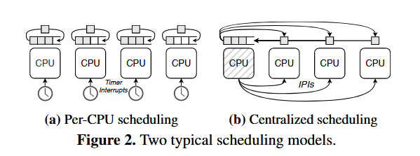
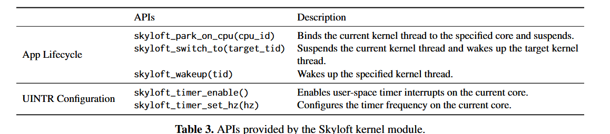

# Skyloft: A General High-Efficient Scheduling Framework in User Space 阅读笔记

## 我学到的

- 使用per-CPU结构和Single Binding Rule管理内核线程，从而将“内核线程”与“用户进程的CPU核心资源”一一对应。

- 使用共享内存维护共享调度队列，可以在用户态实现多应用共享调度。

## Abstract

Skyloft是用户空间调度框架，使用用户态中断，在用户态处理计时器，从而做到微秒级抢占。

支持抢占式或非抢占式接口。

兼容Linux，可无缝集成DPDK等高性能I/O框架

## Introduction

优化尾部时延很重要。

已有研究使用user agents、live updates和Berkeley Packet Filter (BPF) 对Linux调度器进行修改。（见原文引用文献）

在内核调度线程/在内核实现新的调度策略的不足：

- 频繁的特权级切换
- 降低代码/数据局部性
- 修改被已有接口限制
- 需要对内核做大量修改
- 无法利用内核旁路的驱动和框架

现有的用户态调度框架的不足：无法同时支持微秒级调度和多应用支持。

微秒级调度的重要性：（看原文）

（用户态）多应用调度的重要性：处理延迟敏感型（latency-critical, LC）应用和尽力型（best-effort, BE）应用的关系：在CPU空闲时运行BE应用，在CPU负载高峰期快速切换到LC应用。

Skyloft的优势：灵活、高效、兼容（见Design Goals节）

Skyloft的实现：

- 微秒级抢占：用户态中断。支持中心化抢占调度和per-CPU抢占调度两者方式，在per-CPU抢占调度中，支持在用户态处理时钟中断。
- 多应用调度：不使用全局控制器，而是在每个核上运行一个主循环，从而在用户态和内核态间提供清晰的接口。

Skyloft的评估：

- 在schbench上，per-CPU策略的Skyloft取得了比Linux原生调度器低几个数量级的唤醒时延
- 在人工负载上，中心化策略的Skyloft取得了比ghOSt高1.2倍的最大吞吐量
- 在现实应用（Mencached）上，采用任务窃取的Skyloft与Shenango性能相同
- 在现实应用（RocksDB）上，抢占式的Skyloft在达到了相同的尾部时延SLO的情况下，取得了比Shenango高1.2倍的性能
- Skyloft使用核间中断的抢占开销是0.6μs；处理时钟中断的开销是0.3μs，比软件定时器快了将近10倍。

文章的主要贡献；

- Skyloft使用用户态中断实现了内核旁路的抢占，且同时支持微秒级抢占和多应用。
- Skyloft提供了使用一组通用操作实现不同调度策略的范式。
- Skyloft取得了更好的性能。

## Motivation

### User-Space Scheduling Frameworks

执行时间较短的的RPC请求可以使用run-to-completion调度策略（减少了切换开销、保持了程序局部性）；而为了在长尾负载上实现低尾部时延，需要使用微秒级的抢占式调度。

支持具有不同特征的应用多应用调度（例如延迟敏感型应用或需要高吞吐量的批处理应用）。在CPU空闲时运行BE应用，在CPU负载高峰期快速切换到LC应用。

### Challenges in User-Space Scheduling

- **微秒级抢占**：如今，抢占多数情况下使用内核态核间中断或者信号实现。但这些实现方式引入了额外的开销。
- **多应用支持**：对用户态调度器而言，多任务上下文切换问题是首要的挑战。首先，其难以进行切换地址空间等特权操作；其次，其需要获取所有应用的任务信息，即在不同应用间进行信息共享。

### Limitations of Existing Work

- **用户态线程**：降低了线程创建、上下文切换、同步的开销。但难以实现低开销抢占和应用间调度。此外，内核态不了解用户态线程的信息，可能导致内核挂起了一个持有锁的用户态线程，进而导致死锁。
- **数据平面操作系统**：过去的研究分别具有如下问题：缺少对中断的支持；将调度逻辑与应用逻辑强绑定；将CPU核心与应用强绑定。
- **应用间的核心重分配**：已有研究根据应用与CPU核心的情况，定期调整为应用分配的核心数。但它们的灵活性受限于紧密集成的调度器。
- **内核态调度的用户态委托**：（可以了解一下这方面的实现）将一部分内核调度决策交给用户空间。但它们由于涉及了用户态和内核态的频繁切换，因此降低了性能。

### Design Goals

- **灵活**：支持不同的调度策略（per-CPU/中心化；协作式/抢占式）；掌握所有应用的调度信息，支持应用间调度。
- **高效**：支持基于用户态中断的微秒级抢占（per-CPU模式下，由定时器发出中断；中心化模式下，由分配器核心发出中断）；尽量减少与内核的交互

- **兼容**：最小化对内核的修改；提供POSIX兼容的线程API（从而使应用可以在Skyloft和Linux调度器间选择）；与用户态I/O框架兼容。

## Design

### Design Overview

在系统启动阶段，专门分出一定数量的CPU核心归Skyloft管理。其余CPU继续归Linux的调度器管理。

Skyloft分为两部分：用户态的Skyloft Library OS，和内核态的Skyloft Kernel Module。

- **Skyloft Library OS**：维护一个所有应用程序共享的运行队列和用户定义的调度策略；负责用户态线程切换（2）；处理用户态中断（4）；集成了内核旁路的I/O协议栈（5）
- **Skyloft Kernel Module**：管理内核线程；负责内核线程切换（3）和其它特权操作。

### User-Space Preemption

详细介绍了x86用户态中断的机制，此处略

Skyloft中的用户态中断由两种方式发出：IPI或硬件发起的时钟中断。

使用IPI发起用户态中断，适合中心化调度策略。分配器核心定期检查工作核心，判断是否需要抢占。分配器核心作为系统的时钟源。优点：灵活，因为抢占信号可以根据负载情况进行调整。缺点：吞吐量降低（因为空出了一个核心），且分配器可能成为性能瓶颈。

使用时钟发起用户态中断，适合per-CPU调度策略。为了在用户态处理时钟中断是一个难点，但Skyloft还是解决了。

### Scheduling Threads Across Applications

#### 管理内核线程

内核进程代表应用资源（例如地址空间和文件表），内核线程代表应用的CPU资源。

将一部分CPU分给Skyloft管理。每个应用在每个CPU上至多有一个内核线程（取决于Skyloft的分配）；每个CPU同时只有一个活动的内核线程（Single Binding Rule）。所有内核线程不会在CPU间迁移。

#### 调度用户线程

根据采用的调度策略为中心化或per-CPU，采用全局或局部的运行队列。单个运行队列中会保存所有应用的用户线程。

应用内切换：直接在用户态完成

应用间切换：需要将当前内核线程状态改为非活跃，同时将切换目标应用的内核线程状态改为活跃（维持了Single Binding Rule）。然后在内核态切换内核线程。

#### 应用终止

需要终止该应用的所有内核态线程和用户态线程。

内核态线程在退出前，需要唤醒当前核心上的另一个（属于其它应用的）内核态线程。

Additionally, since a kernel thread must reclaim its resources before terminating, which must be performed by the thread itself, each kernel thread remains in a runnable state until it fully exits. To adhere to the binding rule, Skyloft rebinds active kernel threads to non-isolated cores before allowing them to exit independently, or it sends a termination signal to inactive threads.（不太看得懂……）

### General Scheduling Operations

### Integration with User-Space I/O Frameworks

例如，Skyloft使用DPDK，在一个专用核心上轮询网络。

## Implementation

9k行C代码：实现LibOS

4K行C代码：集成DPDK、实现TCP/UDP网络栈

修改了163行UINTR kernel patch代码：实现用户态时钟中断

### Skyloft LibOS

#### 调度器初始化

使用内核控制台参数`isolcpus`获取隔离核心。（应该指的是单独给Skyloft管理的核心）

一个守护进程在应用前启动。其进行了如下操作：

1. 初始化共享状态
2. 创建和隔离核心数相同的内核线程并将它们绑定到各自的核心（使用pthread库和`sched_setaffinity`）

其它应用的启动过程类似，但它们使用Skyloft的api而非系统api。

应用启动时，先在每个内核线程上创建一个空闲用户线程，在其上运行调度器主循环。使用实现的快速路径进行线程间切换（这里指的是内核线程还是用户线程？）。如果没有就绪线程，则保存当前线程的上下文，并重新进入主循环，进行负载均衡等操作。

#### 共享内存

应用间使用共享内存交换数据，例如应用元数据、就绪队列、用于共享数据结构的内存池，等等。每个应用需要链接到完全相等的版本的Skyloft库。

- **元数据**：每个应用对应的各个内核线程ID，用于应用的唤醒
- **共享就绪队列**：保存所有就绪的用户线程，调度器使用调度策略选择下一个运行的就绪队列。线程对其它应用可见的信息有：线程状态、所属的应用、一个和调度策略有关的字段。线程的上下文、栈则为不对其它应用可见的私有字段。
- **内存池**：用于分配这些数据结构。

#### 用户态中断设置

基于Linux UINTR patch。

使用专用的分配器线程用于向其它核心发IPI。

为了解决发送方和接收方不在同一个应用，使得文件描述符无法访问的问题，使用`pidfd_get()`，共享用户态中断文件描述符（`uvec_fd`）

Skyloft同时支持通过用户态计时器实现的用户态中断，该情况下不需要分配器线程。为了实现用户态时钟中断，Skyloft进一步修改了UINTR patch。

#### 用户态中断处理程序

使用全局用户态中断处理程序（无论中心化模式还是per-cpu模式均使用）。

### Skyloft Kernel Module

实现为设备文件（`/dev/skyloft`），使用`ioctl()`接口向用户态提供两个功能：

- 线程状态转换的内核API
- 用户态中断配置的特权操作

## Evaluation

四个讨论的问题：

- 在per-CPU调度器上，Skyloft的时钟中断分派有什么影响？（5.1）
- 在多应用环境下，Skyloft的性能表现相较ghOSt如何？（5.2）
- Skyloft在真实应用的light-tailed和heavy-tailed的情境下表现如何？（5.3）
- 有关Skyloft操作的开销有哪些？（5.4）

### User-Space Timer Interrupts

测试程序会不断增大负载直到饱和，因此唤醒时延受到排队时间的影响。

### Synthetic Workload Comparison

将Skyloft与Shinjuku对比（均使用了中心化调度）。

单负载的情况：

30μs的抢占间隔表现最好。

Linux表现较差的原因：Linux调度器的主要目标为公平而非效率。

都使用了低开销抢占机制的Skyloft和Shinjuku性能差距不大。

ghOSt的性能被频繁的用户态内核态通信影响。

多负载情况：表现Skyloft的多应用能力。LC任务的尾部时延与Shinjuku相似，但BE应用的运行时间多于Shinjuku。

### Real-World Applications

### Microbenchmarks

## Discussion

### 内核旁路的计时器重置

目前用于重置计时器的方法有安全风险。可以通过引入新指令来解决，Intel已经计划在未来的处理器中引入。

### 共享内存的保护

因为用户线程的栈和上下文不会共享，因此可以一定程度上起到保护作用。用户程序有修改共享内存的读写权限的风险。不过，已有工作已经一定程度上解决了该问题。

### 设备中断

Skyloft的工作还提供了一种将设备中断委托到用户态的方式。

### 阻塞事件

对于主动阻塞，可以将阻塞式同步调用改为异步调用；对于被动阻塞，调度可以将其它应用的内核线程，从而保持Single Binding Rule。