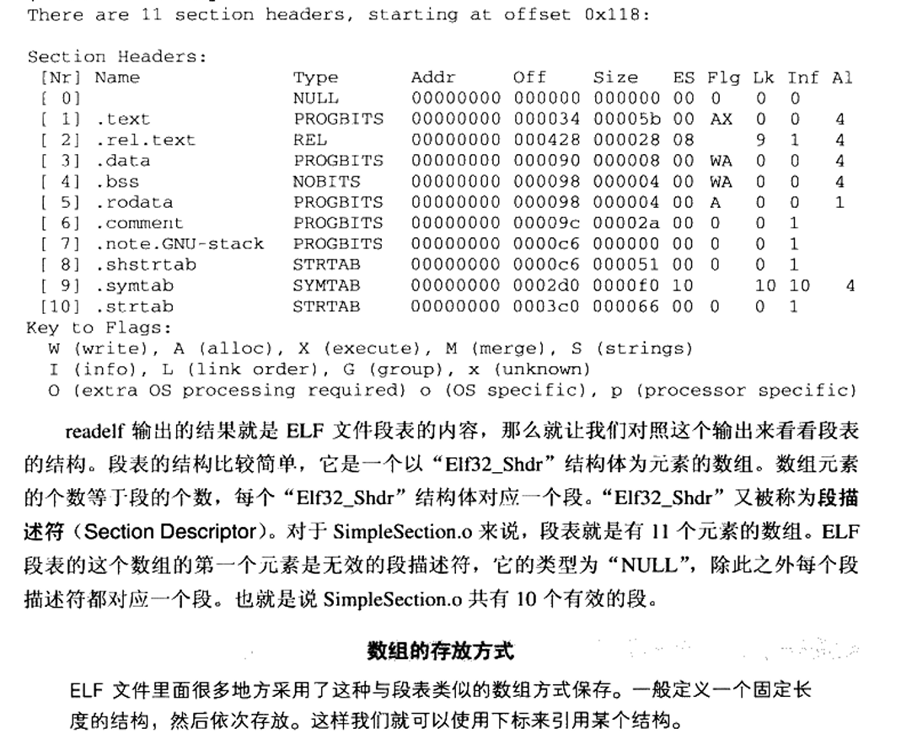
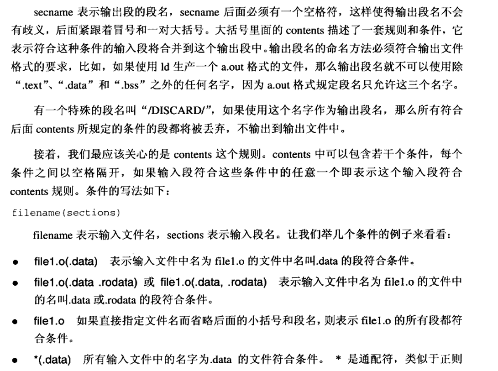
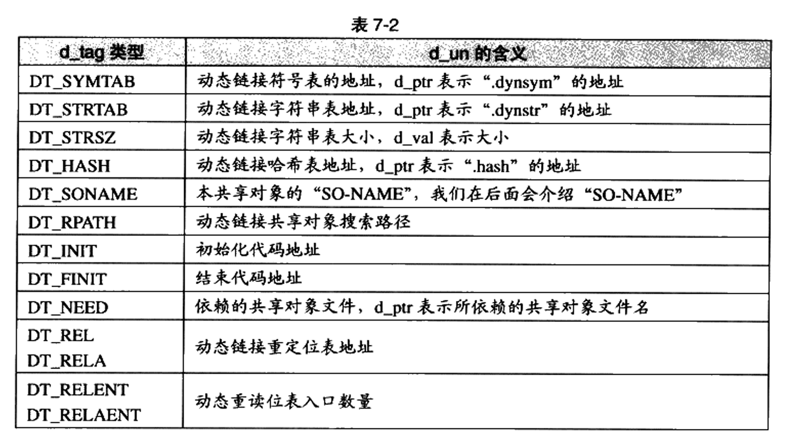
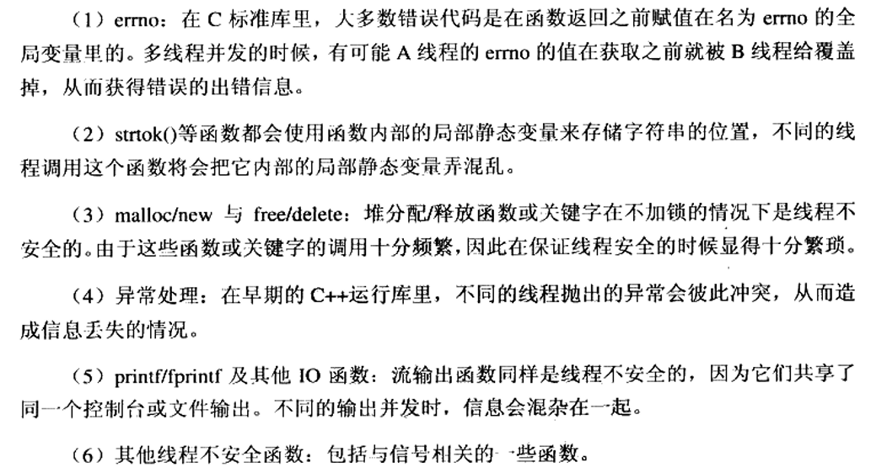

# 《程序员的自我修养--链接、装载与库》阅读笔记

时间：2025.3.15

## 第三章 目标文件

可执行文件格式：Windows下的PE格式，和Linux下的ELF格式

ELF格式分类：可重定位文件、可执行文件、共享目标文件、核心转储文件

Linux下使用`file`命令查看elf文件类型

### 自定义段

可以自定义新的段，不过自定义段名不要以`.`作为前缀，以免与系统定义段名冲突。


在C语言中指定函数或数据所在段（GCC提供的扩展机制）：

```C
__attribute__((section("FOO"))) int global = 42;
__attribute__((section("BAR"))) void foo() {

}
```

### ELF文件结构

#### 文件头

描述基本属性（如程序入口地址）

查看文件头：`readelf -h [文件名]`


魔数：用于确认可执行文件的类型。不只是ELF，其它可执行文件类型的最开始几个字节都是魔数。

#### 段表

描述每个段的信息（如段名、段长度、在文件中的偏移、读写权限等）

查看段表：`readelf -S [文件名]`



注意：段表中的`address`代表段加载到地址空间后的虚拟地址；`offset`代表段数据在elf中的偏移地址。

段表各个字段的含义，见原书P76。

段的类型（sh_type）、段的标志位（sh_flag）、段的链接信息（sh_link）的各个值代表的含义，以及各个系统保留段的属性值，见原书P77-P79。

#### 重定位表

名为`.rel.xxx`的段是名为`.xxx`的段的重定位表。

只有需要用到重定位的段会有对应的重定位表。

#### 字符串表

ELF存储字符串的方法：


- 字符串表：`.strtab`段，存储**程序中**用到的字符串
- 段表字符串表：`.shstrtab`段，存储**段表中**用到的字符串，例如段名。

文件头通过`e_shstrndx`字段获得段表字符串表（它也是一个段）在段表中的下标。

#### 符号表

`.symtab`段。

符号表元素的结构见原书P82，其中部分字段的取值含义见原书P83。

符号值（`st_value`）：


查看符号表：`readelf -s [文件名]`

### 符号

符号除了开发者定义的变量名和函数名以外，还包括段名。

特殊符号：链接器ld定义的符号，开发者可以在程序中使用。


#### 符号修饰

编译链接过程中，为了避免符号重名，会将用户定义的符号名进行修饰后，才是可执行文件中的符号名。

由于C++中涉及函数重载和命名空间，导致会出现同名函数。因此，C++通过函数签名（包含函数名、参数类型、所在类和命名空间等信息）而非函数名区分不同的函数，再将函数签名映射到elf中的符号名。C++的变量也会经过类似的修饰过程。

#### extern "C"

C++提供的机制（Rust的机制应该与之类似？），在`extern "C" {}`块内部的代码会被作为C语言处理，可以在其中声明外部符号或者定义符号。（例如，编译器会应用C而非C++的符号修饰规则。）

通过`extern "C"`配合用于确定当前语言是C还是C++的宏`__cplusplus`，可以实现被C和C++都能正确引用的库函数：


#### 强弱符号与强弱引用

处理同名符号的规则：


函数和初始化了的全局变量为强符号，未初始化的全局变量为弱符号。此外，可以通过`__attribute__((weak))`定义弱符号。

如果符号未定义，就会报错的引用为强引用；不会报错的为弱引用。对于未定义的弱引用，编译器默认其值为0或某个设定的特殊值。

可以通过`__attribute__((weakref))`定义弱引用。

强弱符号用于定义阶段，强弱引用用于声明外部符号/引用阶段。

该机制的作用：


### 调试信息

`.debug_xxx`的段存储调试信息。通用的标准为DWARF（Debug With Arbitrary Record Format）标准。

使用`strip [文件名]`去除调试信息。

## 第四章 静态链接


链接器“分配地址和空间”的含义：一是分配在输出文件中的地址和空间；二是分配加载到内存后的地址和空间（虚拟地址空间）。我们主要关注虚拟地址空间的分配。

链接的步骤：


图中VMA指虚拟地址。从图中可以看出，虚拟地址是在链接时分配的。


### 符号地址的确定

首先，链接器可以确定每个文件的每个段的起始虚拟地址。

之后计算各个符号的虚拟地址。根据符号在段中的偏移量和各个段的起始地址，确定符号的地址。

### 符号解析与重定位

重定位：在各个符号的地址确定后，将对符号的引用改为对相应地址的引用。

#### 重定位表

`.rel.xxx`段。

重定位表中存储的项为**重定位入口**，代表代码中的一个引用了需要重定位的符号的位置。

查看重定位入口的命令：`objdump -r [文件名]`

重定位入口的字段及其含义见原书P107


### COMMON块

链接器不知道符号的类型。因此，使用COMMON块机制声明符号需要的空间大小。

在出现多个同名弱符号而没有同名强符号时，取其中最大的大小作为符号的大小。

如果有同名强符号，则以强符号的大小作为符号的大小。此时，如果有同名弱符号的大小大于强符号，链接器会发出警告。

### C++相关问题

重复代码消除、全局构造与析构、C++与ABI，见原书P112

#### ABI

ABI：应用程序二进制接口。其与API的区别是，API位于源代码层面，ABI位于二进制层面。只有在ABI上兼容，才能实现二进制代码的重用。

ABI包含的内容：符号修饰标准、变量内存分布方式、函数调用方式等

影响ABI的因素：硬件、编程语言、编译器、链接器、操作系统等

### 静态库

静态库是一组目标文件压缩打包后形成的文件。

查看静态库包含的目标文件：`ar -t [文件名]`

可以使用objdump分析静态库。

libc静态库会将每个函数单独封装为一个目标文件，这样，当用户编写的程序与其链接时，就可以以函数为单位包含libc的内容，降低空间的浪费。

### 链接过程控制

控制链接过程的三种方法：


#### 链接脚本

链接脚本的主要工作：定义从**输入段**（各个输入文件中的段）到**输出段**（输出文件中的段）的变换。

链接脚本中的语句分为命令语句与赋值语句。


命令语句列表（除了`SECTIONS`命令外）：


`SECTIONS`命令格式：

```linker script
SECTIONS
{
    ...
    secname : { contents }
    ...
}
```




其实这些格式都遵从`[文件名]([段名]（0个、1个或多个）)`的规则，而文件名和段名各自可以使用正则表达式。

### BFD库

用于对不同平台的目标文件提供统一的接口。

详见原书P131。

## 第五章 Windows PE/COFF

Windows中的可执行文件采用PE格式，其由COFF格式发展而来。

在Visual C++的编译过程中，目标文件采用COFF格式，可执行文件采用PE格式。

### COFF格式

COFF与ELF一样，由文件头、每个段的属性、段的原始数据以及符号表组成。

COFF文件头结构见原书P137。

COFF段表项结构见原书P138。

`.drectve`段为链接指示信息，详见原书P139。

`.debug$x`段为调试信息，详见原书P140。

COFF符号表项结构见原书P141。

### PE格式

PE的文件头与COFF不同。PE文件头结构见原书P142。

PE具有数据目录结构，用于快速定位装载时所需的数据，例如导入表、导出表、资源、重定位表等。见原书P145。

## 第六章 可执行文件的装载与进程


（32位的情况）

### 装载方式

- 覆盖装入（Overlay）：主要在发明虚拟存储前应用。应用程序自己管理程序的装入行为。将程序各模块的调用关系构建成树，因为某个时刻，程序只会使用一条分支上的所有模块，所以可以将不同分支的模块装入同一个地址，按需进行覆盖切换。


- 页映射（Paging）：现在使用最广的方法。以页为单位装载，维护虚拟地址到物理地址的映射。缺页中断时装载新页，物理内存满时释放一个旧页。选择被释放的页的算法很多，例如FIFO。


### 进程的建立（操作系统视角的装载）

1. 创建一个独立的虚拟地址空间
2. 读取可执行文件头，建立虚拟地址与可执行文件的映射关系
3. 跳转到可执行文件的入口地址

注意：第2步的映射关系在虚拟地址与可执行文件间，是在装载时确定的。而虚拟地址与物理地址的映射关系在运行时维护。

可执行文件的每一个section映射到虚拟地址空间中的一个VMA（Virtual Memory Area）（Linux的概念）/ Virtual Section（Windows的概念）

### 进程虚存空间分布

操作系统可以将读写权限相同的section合在一起映射。因此，elf文件已经将这样的section进行了合成，称为segment。

链接视角下，可见section；装载视角下，可见segment。

描述section的结构是段表；描述segment的结构是程序头表。因为目标文件不需要装载，所以目标文件没有程序头表。

查看elf文件的segment，以及section到segment的映射关系：`readelf -l [文件名]`

中文“段”的含义根据上下文确定。在链接视图中，段指section；在装载视图中，段指segment。

程序头表项的结构及含义见原书P165。

OS分配给进程的空间，除了各个（需要装载的）段外，还有堆区和栈区。

查看进程地址空间：`cat /proc/[进程id]/maps`

### 段的对齐

两种方案：

- 按页对齐
- 不需按页对齐，两个段接壤处的物理页分别映射到两个虚拟页，使每个段使用各自的虚拟页。

### 栈初始化

初始情况下，栈的地址从高到低（从栈底到栈顶）分别包含：

- 环境变量内容
- 0（用于分隔）
- 辅助信息数组（见后文）
- 0
- 环境变量指针
- 0
- 传入参数（也就是C函数`main`中的`argc`和`argv`）

### Linux内核装载elf简介

- 用户库通过一系列操作发起`execve()`系统调用
- `execve()`调用`do_execve()`
- 读取文件的前128字节，从而判断可执行文件类型
- 调用`search_binary_handle()`匹配合适的可执行文件装载过程
- elf文件的加载使用`load_elf_binary()`函数，其主要步骤为：


### Windows PE的装载

见原书P175。

## 第七章 动态链接

动态链接：共享库在磁盘和内存中都只需要保存一份。

使用动态链接时，程序本身和共享库都可以看作程序的一个模块。


```bash
# 编译动态链接库
gcc -fPIC -shared -o Lib.so Lib.c
# 编译使用动态库的程序
gcc -o Program1 Program1.c ./Lib.so
```

编译链接过程也需要动态链接库参与的原因是：使编译器知道源代码中的未定义函数来自动态库，并将其处理为动态符号。

使用了动态链接的程序的地址空间除了自身可执行文件的映射外，还包含了动态库和动态链接器的映射。

动态链接器作为程序入口，负责在应用运行前处理动态链接工作。

动态库的elf文件中，装载地址从0x00000000开始，这说明共享对象的装载地址在编译时不确定。

### 地址无关代码（PIC）

早期存在静态共享库：同样使用运行时链接，但其不是位置无关代码，因此由操作系统为它们各自分配一个固定地址。

装载时重定位：一个和PIC不同的，实现动态库的方法。装载共享库时，根据装载共享库的虚拟地址，对共享库进行一次重定位。但因为动态库的代码部分需要被多个进程同时使用且不可变，因此其无法用于动态库的代码部分，只能用于每个程序持有一个可变副本的，动态库的数据部分。

PIC技术：将代码中需要被重定位修改的部分分离出来，与数据放在一起。剩余的代码就可以做到位置无关。

指令中涉及的四种寻址方式：


- 模块内部指令访问：都是相对地址调用，或者基于寄存器的相对调用，因此不需重定位。
- 模块内部数据访问：也使用相对当前指令寻址（实际上，需要使用一些技巧获得当前指令地址），因此不需重定位。
- 模块间数据访问：目标地址在装载时才能确定。因此，在数据段中建立一个全局偏移表（Global Offset Table, GOT），其中存放指向这些需要访问的全局变量的指针。装载时，动态链接器根据目标模块的装载地址填充GOT。将访问模块间数据转化为访问GOT表项（也就是模块内数据），因此可以做到地址无关。


- 模块间指令访问：也使用GOT，与模块间数据访问类似。

区分elf是否是PIC：`readelf -d [文件名] | grep TEXTREL`。原理：查找是否存在代码段重定位表，没有就是PIC。

与用于动态库的PIC类似，也有用于可执行文件的PIE（地址无关可执行文件）。

#### 全局变量问题

编译器在编译阶段，不知道声明的extern全局变量属于本模块还是其它模块。

如果对全局变量的访问在可执行文件中，因为其没有使用PIC方式，所以其会在链接时在`.bss` section创建该变量的副本，通过直接访问该副本地址的形式访问该变量。装载时，如果某个全局变量在可执行文件中有副本，则动态链接器就会将GOT中的地址指向该副本，从而保持符号的唯一性。

如果对全局变量的访问在共享库中，则将其视为对其它模块的访问，通过GOT进行访问。

#### 数据段地址无关性

数据段中的绝对地址引用：

```C
static int a;
static int *p = &a; // p引用了a的绝对地址
```

通过装载时重定位可以解决，因为共享库的数据段在每个进程中保存一个副本。

如果编译共享库时不使用`-fPIC`，则代码段也会使用与之类似的重定位方式，从而代码段也不能被多个进程共享，而是每个进程持有一个副本。

### 延迟绑定（PLT）

动态链接的性能损失：

- 寻址时查询GOT表
- 装载时的重定位

#### 延迟绑定

基本思想：当函数第一次用到时才进行绑定（符号查找、重定位等）

实现：使用PLT（Procedure Linkage Table）。在跳转到函数时，不直接查找GOT，而是先查找PLT，从而得知GOT中的相应表项是否填写完成。若是，则查找GOT；若否，则先调用`_dl_runtime_resolve()`函数解析该符号（填充GOT相应表项），再查找GOT。

具体代码和机制见原书P201。

`.plt` section中也是地址无关代码，因此可以与代码放在同一个segment。

### 动态链接相关结构

动态链接程序的启动过程：

1. 正常地分配地址空间、加载各个段。
2. 跳转到动态链接器ld.so，其同样在第1步中被加载了（如果是静态链接，这里就直接跳转到程序入口了）
3. 执行动态链接操作
4. 跳转到程序入口

#### `.interp`段

动态链接器的选择由elf文件做出，其`.interp`段中保存了选用的动态链接器的路径（Linux下，一般都是`/lib/ld-linux.so.2`）（这也是`.interp`段保存的唯一内容）

#### `.dynamic`段

保存了本程序依赖的共享对象、动态链接符号表的位置、动态链接重定位表的位置、共享对象初始化代码等信息。

以键值对方式存储。



查看程序或共享库依赖的共享库：`ldd [文件名]`

类似elf文件头保存了静态链接相关信息，`.dynamic`段保存了动态链接相关信息。

#### 动态符号表

`.dynsym`段与`.symtab`段类似，但其保存的只有与动态链接相关的符号，即该模块对外提供（导出）的符号和依赖（导入）的符号。

用于辅助`.dynsym`的段有`.dynstr`和`.hash`等。

#### 动态链接重定位表

用于数据段（如果没有使用PIC，则还包括代码段）的重定位。

数据段的GOT表和绝对地址引用都需要重定位。

代表重定位表的段：`.rel.dyn`、`.rel.plt`。其中`.rel.dyn`重定位`.got`和数据段（数据）；`.rel.plt`重定位`.got.plt`（函数引用）

（用于对比：用于静态链接重定位的段为`.rel.text`和`.rel.data`）

动态链接时有几种新的重定位计算方式，具体见原书P108。

函数的重定位入口位于哪个段与是否启用了PIC有关。启用PIC时，位于`.rel.plt`段；不启用PIC时，位于`.rel.dyn`中。

#### 进程堆栈的初始化信息

OS还会在进程堆栈中保存辅助信息数组（Auxiliary Vector），供动态链接器和程序使用。也是用键值对方式保存。

其中较重要的信息有：


### 动态链接的步骤

#### 动态链接器自举

一般的程序和共享库依赖动态链接器进行动态链接。但动态链接器自身也是共享库，它只能靠自己完成重定位工作，且不能依赖别的共享库。

首先，它要在无法访问全局变量、无法调用函数的情况下，找到自身的GOT、`.dynamic`段、重定位表，将重定位项全部重定位完成。

完成了自身重定位后，动态链接器才可以正常地调用函数和访问全局变量。

#### 装载共享对象

将可执行文件和链接器的符号表合并为全局符号表。

通过`.dynamic`段的`DT_NEEDED`项，获得可执行文件依赖的所有共享对象。对于这些共享对象（以及递归依赖的共享对象），读取文件头和`.dynamic`段，映射它们的代码段和数据段，并将它们的符号表合并入全局符号表。

全局符号重名时，全部解析到第一次读到该符号的文件中（全局符号介入）。因此应该避免该情况发生。

全局符号介入与地址无关代码的关系：见原书P218

#### 重定位与初始化

遍历重定位表，修正GOT/PLT中的地址。

之后，如果某个共享对象有`.init`段，则动态链接器会执行`.init`段的代码。（与之对应，程序退出时，也会执行共享对象的`.finit`段的代码）。但可执行文件的`.init`段不会在现在执行，而会在进入程序入口后执行。

### 动态链接在Linux下的实现

见原书P219

### 显式运行时链接

让程序自己在运行时控制共享库的加载和卸载。

通过动态链接器提供的API进行。

（以下函数的更多细节见原书P222）

`dlopen()`：打开和加载一个动态库到进程地址空间，返回被加载的模块的句柄。

`dlsym()`：找到已加载的动态库中的特定符号。

`dlerror()`：显示对本系列API的上一次调用是否成功

`dlclose()`：卸载一个已加载的模块

[深入窥探动态链接](https://zhuanlan.zhihu.com/p/134105591)

## 第八章 Linux共享库的组织

导致ABI不兼容的更新：


C++共享库的注意事项：


### 文件名、SO-NAME与链接名

Linux的共享库命名规则：`libname.so.x.y.z`

x：主版本号。修改主版本号的是不兼容旧版

y：次版本号。代表增量升级，与旧版兼容。

z：发布版本号。对接口没有任何更改。

SO-NAME用于记录共享库的依赖关系。其为共享库的文件名去掉次版本号和发布版本号，即`libname.so.x`。

Linux会为共享库创建名为SO-NAME的，指向共享库本身（存在多个版本时，指向`y.z`最新的共享库）的软链接。

SO-NAME也在`.dynamic`的`DT_NEEDED`项中使用。

链接名是在编译链接时用`-l`参数指定共享库时，使用的名称。一般来说，就是`libname`。版本的选择由编译器决定。

### 符号版本

次版本号交会问题：在SO-NAME相同的情况下，如果应用程序使用了较新次版本的功能，而本地的库是较旧次版本，则可能缺少应用程序所需的接口。

基于符号的版本机制：为每个导入和导出的符号都附带一个版本号，代表它们被添加时的版本。

#### Solaris中的符号版本机制

版本机制（符号的集合）：可以定义符号的集合，且集合间可以有包含关系（派生关系）

范围机制：允许将全局符号包含在局部集合中，从而使之变为局部。


链接器可以在程序的最终输出文件中记录它所用到的版本符号集合。

#### Linux中的符号版本

主要在Glibc下的共享库中使用符号版本。

在Solaris的基础上扩展：

`.symver`汇编伪指令：指定符号的版本，可以为某个版本的函数指定其它名称，也可以指定多个版本的同一函数。

```asm
.symver old_printf, printf@VERS_1.1
.symver new_printf, printf@VERS_1.2
```

编译共享库时，使用`--version-script`参数，指定符号版本脚本文件

### 共享库系统路径

FHS标准，规定系统文件该如何存放。


### 共享库查找过程

当`DT_NEEDED`保存相对路径时：动态链接器在/lib、/usr/lib，以及/etc/ld.so.conf文件中指定的路径中查找。

ldconfig程序：为各个共享库目录中的共享库维护SO-NAME的软链接；根据SO-NAME为共享库建立缓存（/etc/ld.so.cache文件中）

在更改了相应路径中的内容后，需要重新运行ldconfig文件。很多软件包的安装程序都会在安装完成后调用ldconfig。

如果在/etc/ld.so.cache中没有查找到相应共享库，还会查找/lib和/usr/lib，如果还没查找到，则宣告失败。

### 环境变量

`LD_LIBRARY_PATH`：临时改变某个应用程序的共享库查找路径

```bash
LD_LIBRARY_PATH=/home/user /bin/ls
# 还有一种方法改变共享库查找路径，即直接从动态链接库启动
/lib/ld-linux.so.2 -library-path /home/user /bin/ls
```

`LD_PRELOAD`：指定预先装载（在动态链接器搜索共享库之前）的共享库或目标文件。（可以用于有意的同名覆盖）

`LD_DEBUG`：打开动态链接器的调试功能

### 共享库的创建与安装

创建：编译时使用`-shared`和`-fPIC`。此外，使用`-Wl,-soname,my_soname`通过向链接器传参的方式指定共享库的SO-NAME。

几则注意事项见原书P245。

安装：将so文件复制到对应目录，然后运行ldconfig。

用户程序在编译时指定共享库：使用`-L`（指定搜索目录）/`-l`（指定共享库路径）/`-Wl,-rpath`（与-L相同，但是通过向链接器传参来实现）

共享库构造和析构函数：在共享库加载后执行/卸载前执行的函数。使用GCC的`__attribute__((constructor(n)))`和`__attribute__((destructor(n)))`
。属性中的数字为优先级，数字较小的函数会在构造函数中先执行、在析构函数中后运行。

如果使用了构造或析构函数，则必须使用系统默认的标准运行库和启动文件。即不可以使用gcc的`-nostartfiles`和`nostdlib`参数。

### 共享库脚本

符合一定格式的链接脚本文件（用于将一些共享库组合为一个共享库）也可以作为共享库。

## 第九章 Windows下的动态链接

dll和exe实际上使用相同的文件格式（PE），就像Linux下的可执行文件和共享库使用相同的文件格式（elf）一样。

dll共享数据段：一般情况下，dll的数据段在各个进程中独立。但Windows允许设置dll的共享数据段，从而实现进程数据共享。

在dll中，需要显式指定导出的全局符号（而so默认导出全部全局符号）。使用`__declspec(dllexport)`属性或者`.def`文件来声明导出的符号。详见原书P251。

dll的创建和使用：详见原书P252

使用dll中的函数或变量，需要用`__declspec(dllimport)`显式声明，或者使用模块定义文件（`.def`）。

Windows下的显式运行时链接：详见原书P256。

Windows的符号导入导出：使用导出表（详见原书P257）和导入表（详见原书P261）。

导出重定向：将某一个导出符号重定向到另一个dll。详见原书P261。

### dll优化

重定基地址：见原书P267。因为dll的寻址都基于基地址，因此只需要将基地址重定位即可。

序号：见原书P270。

dll绑定：见原书P271。

### C++开发dll指导意见


## 第十章 内存

程序运行环境：内存、运行库、系统调用


平坦（flat）内存模型：直接使用单个内存地址来寻址（区别于以往使用段地址+段内偏移的模式）

应用地址空间的内容：内核空间、用户空间（栈、堆、可执行文件映像、动态链接库映射区、保留区（没有数据也禁止访问的区域，如0地址））


### 栈

（以下介绍的是x86的情况）

栈帧的内容：


ebp指向函数栈帧中的特定位置（从而通过ebp寻址栈帧中的内容），esp指向函数栈帧顶


函数调用规范：


编译器对函数调用的优化：


通过钩子（Hook）截获函数调用：见原书P292。

“函数调用惯例”的内容：函数参数的传递顺序和方式；栈的维护方式（特别是，出栈操作由调用方还是被调用方完成）；名字修饰策略。


对于返回值传递，各种函数调用惯例都会使用eax、edx寄存器传递一般大小的返回值。但对于特大返回值，各种惯例的处理就不同了。

如果遇到特大的返回值类型，则会由调用方在自己的栈帧上申请一块空间，并传入被调用方。被调用方将返回值拷贝到这块空间中，将其首地址放在eax、edx中返回。

在该情况下，若将返回的对象存储在某个变量中，则会产生又一次拷贝，一共进行了两次拷贝，造成时间和空间的浪费。因此C++使用了返回值优化技术，当在`return`语句中调用构造函数时，可以直接将对象构造在传出时使用的临时对象上。

### 堆与内存管理

需要堆的原因：


运行库从操作系统“批发”堆空间，再“零售”给程序。

#### 进程堆管理（“批发”）

Linux下，使用`brk()`（通过修改进程数据段结束地址来获取堆空间）或`mmap()`（向操作系统申请一块未映射到文件的空间（匿名空间））系统调用实现。

Windows下，使用`VirtualAlloc()`（申请4096B整数倍大小的虚拟空间）API申请用于各种用途（包括堆）的空间。不过，Windows已经提供了堆管理器API（详见原书P310），可以直接使用。


#### 堆分配算法（“零售”）

管理一大块连续的内存空间，按照需求分配、释放其中的空间。

堆分配算法：

- 空闲链表（原书P312）
- 位图（原书P313）
- 对象池（原书P314）


## 第十一章 运行库

### 入口函数

入口函数：位于运行库中，是程序真正的入口点

应用程序的执行流程：


#### 实现（glibc）


程序入口为`_start`，在链接脚本中指定。

调用链为：

`_start` -> `libc_start_main` -> (`main`, `_exit`)

`_exit` -> `exit`（系统调用）

`_start`的工作：

- 清零`%ebx`寄存器，用于表示`_start`是最外层函数
- 将栈上的`argc` pop 到`%esi`中，将新的栈顶（`argv`起始地址） mov 到`%ecx`中。
- 准备`libc_start_main`的参数（`(main, argc, argv, __libc_csu_init, __libc_csu_fini, %edx, %esp)`）并发起调用

`libc_start_main`的工作：


- 根据传入参数计算出环境变量首地址（位于argv数组之后）
- 注册`init`、`fini`和`rtld_fini`函数指针，使其在正确的时机调用。

#### 实现（MSVC CRT）

见原书P324。

### 运行库与I/O

I/O指代了程序与外界的交互，包括文件、管道、网络、命令行、信号等。广义地说，它们都是被操作系统理解为“文件”的事务。Linux和Windows均有这样的广义文件概念。

在操作系统层面上，Linux使用文件描述符，Windows使用文件句柄描述文件。


Linux中的文件相关结构：


打开文件表和内核对象均位于内核空间，用户无法访问。用户只能访问到`fd`，C语言再基于`fd`封装为`FILE`。


### MSVC CRT入口函数初始化

包含两部分：堆初始化和I/O初始化。

详见原书P329。


### C/C++运行库


C标准库与C运行时库的关系：运行时库包含了标准库。

标准库包含的内容：


变长参数：见原书P337

非局部跳转：见原书P340

glibc和MSVC CRT：它们都扩展了标准库的功能（例如加入了线程操作功能）

#### glibc

除了提供给用户直接调用的库外，glibc还包括：

glibc启动文件：包括crt1.o、crti.o和crtn.o。其中包含了入口函数`_start`，控制程序的初始化流程。此外，也负责`.init`和`.finit`段代码的执行（例如C++全局对象的构造和析构）

gcc平台相关目标文件：包括crtbeginT.o、libgcc.a、libgcc_eh.a、crtend.o。这些文件实际上属于gcc而非crt，因为全局对象的构造和析构等功能的具体代码由编译器负责生成。

#### MSVC CRT

详见原书P345。

### 运行库与多线程


一般的C标准库是线程不安全的，体现在以下方面：



不过，其中也有线程安全的部分：


多线程版的运行库都增加了对线程安全的支持：

- 使用TLS（线程局部存储）保存errno
- 加锁
- 改进函数调用方式（但该做法很多时候会损失兼容性）

TLS的实现：见原书P353。

### C++全局构造和析构

见原书P357

### fread实现

详见原书P368

`fread`库函数和`ReadFile` Windows API的参数列表几乎相同，理论上可以通过直接调用`ReadFile`的方式实现`fread`。不过`fread`额外进行了以下工作：

- 缓冲


- 加锁，保证线程安全
- 对于文本模式打开的文件，转换回车符


## 第十二章 系统调用和API


Linux系统调用具体实现详见原书P390。

### vDSO

vDSO是虚拟动态共享库，该库不在磁盘上存在实际的文件。

本节讲的基本是vsyscall的内容，见原书P399

### Windows API

Windows通过dll机制，将系统调用封装为Windows API。Windows的系统调用是不公开的，只有API公开。


将导出函数声明的头文件、导出库、相关文件和工具一起提供，即是SDK。

Windows API的分类：


Windows使用API而非系统调用作为接口的原因：系统调用较为依赖硬件结构，因此封装一层API，从而增加向后兼容性。

## 第十三章 运行库实现

详见原书P412
