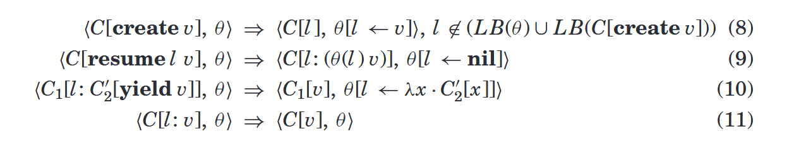
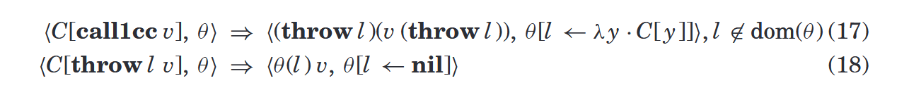

# 《Revisiting Coroutines》阅读笔记

时间：2025.4.2

## 对两个问题的深入思考

### 1. 什么是完全协程？作为有栈协程，完全协程和线程有何区别？

按照论文的描述，完全协程是有栈且作为一等对象的协程。

在增添了`async/await`语法后，作为一等对象的无栈协程（如Rust中的协程）是否也能作为完全协程，我的看法如下：`async/await`语法使无栈协程通过逐层返回和恢复实现了类似有栈协程的原地返回和恢复的效果。不过，有栈协程的原地返回可以在任何嵌套的函数内完成，但无栈协程的嵌套返回需要嵌套函数也被声明为`async`，因此不能从任意函数中返回。因此，即使具有了`async/await`语法，无栈协程的表示能力还是稍弱于有栈协程。论文中有一个例子说明嵌套返回的意义：例如，当协程调用某些I/O库完成操作时，能否修改I/O库，使得挂起/继续在库函数中完成？在该情况下，无栈协程的修改难度是要明显高于有栈协程的。（因为有栈协程只需要在让出点增加让出操作，而无栈协程除此之外还需要在每一级函数的声明和调用上分别标记`async`和`await`，而这可能会影响到更多的函数。）

完全协程与线程的区别，**我认为最本质的区别是采用的调度策略是协作式调度还是抢占式调度；执行流的挂起，是由用户控制的，还是由运行环境控制、对用户透明的。** 其余的区别，例如位于用户态还是内核态、有栈还是无栈，我认为都未触及本质。不过，线程和协程的边界并不清晰，例如大部分线程实现也支持用户主动让出的操作。我理解的区别也不能很好地区分每个例子属于线程还是协程。例如，对于不支持用户态中断的用户级线程而言，其采用的也是协作式调度。这样的用户级线程符合协程的定义。不过由于线程一般不被实现为一等对象（见第2个问题），因此这样的用户级线程应该不能算作完全协程。

更准确、更符合一般认知的对线程和协程的分类方法是：

```
所处的特权级？
- 内核态：线程
- 用户态：
    是否有栈？
    - 有栈：线程
    - 无栈：协程

或：
是否采用async/await语法？
- 采用：协程
- 不采用：线程
```

但我认为，这样的分类方法是无法体现线程和协程的本质区别的。

此外，按照文中对协程的定义，协程分为对称协程和不对称协程。对称协程一般作为“同级任务”的抽象，因此对标线程；不对称协程一般作为“子过程”的抽象，因此对标函数。在当前的协程实现中，顶级协程之间属于对称关系。而顶级协程内部可由嵌套的不对称协程构成（例如使用`async/await`语法）。可以类比为线程由嵌套的函数构成。上文中讨论的，与线程对比的协程均指对称协程。

### 2. 什么是续体？函数调用上下文、线程上下文、中断上下文是一种续体吗？

续体是程序捕获的栈、寄存器等当前执行状态，调用该续体可以使程序回到该执行状态执行下一条语句。假设在Rust中实现了获取续体的call_cc函数：

```Rust
let result = call_cc(|c: Continuation| {
    let result = calculate();
    c(result);
})

// 类似于
let result = calculate();
```

`call_cc`函数会将当前的执行状态保存在续体中，并传入闭包中。当在闭包中调用该续体时，程序执行状态回到续体保存时执行下一步代码，就像`call_cc`函数返回了一样。调用续体`c`时传入的参数就是`call_cc`函数的“返回值”。

而使用`call_cc`与直接使用函数调用的区别在于，前者可以将续体嵌套传递到内层函数，然后从内层函数直接返回到`call_cc`的调用点（非本地返回）。而函数调用则必须逐层返回。

```Rust
let result = call_cc(|c: Continuation| {
    calculate_and_return(c);
})

fn calculate_and_return(c: Continuation) {
    let result = TODO!()
    c(result) // 直接返回到call_cc函数，而不需要先返回到闭包
}
```

从保存的程序执行信息上看，函数调用上下文、中断上下文、线程上下文可以看作一种续体。

不过，从实现机制上看，续体和函数调用上下文均为编程语言层实现，而中断上下文、线程上下文为硬件层和操作系统层实现。

此外，续体一般指可以作为一等对象的一等续体。而对其它几种上下文来说：

- 中断上下文和线程上下文在内核视角下是一等对象，因为它们作为Context对象保存，可以存入变量，可以传入传出函数。同时，从语法层面上，内核也有在任何时刻恢复这类上下文的执行流的能力。不过在具体实现上，内核会按照中断和线程的机制适时地恢复这些执行流。
- 线程在用户视角下不是一等对象。即使用户可以通过作为一等对象的handle控制线程，也无法做到随时恢复handle指向的线程的执行流。
- 函数调用上下文则不是一等对象。它们由编程语言的规则生成，用户无法直接操控。

## 我学到的

协程的定义和分类

既然这里说到，完全协程的表示能力是最高的，为何现在的大部分协程实现都使用了无栈协程？

## Introduction

### 协程的概念和分类

协程的概念在1960s被提出。Conway：协程是“饰演主程序的子程序”。

不过，（在当时）许多语言没有提供协程的支持。其原因可以部分地源于对协程没有清晰的定义和统一的视角。Marlin概括的协程的特征：

- 局部变量的值在连续的调用间保持。
- 程序返回视为任务暂停，程序调用视为任务继续。

其描述了协程的行为（保存状态），但不涉及协程的结构。因此可以按照实现方式，对协程进行三种分类：

- 控制流转移方式：对称协程和不对称协程
- 是否在其语言中视为一等对象（First-class Object）（一等对象：可以存入变量，可以作为函数参数和返回值）
- 实现是否有栈，决定了能否从嵌套协程中返回（不过，目前使用async-await语法的无栈协程是可以做到从嵌套协程中返回的。虽然这种嵌套返回的实质也是层层返回到最外层。）

一些适应特定用途的协程：例如生成器、迭代器等。但它们在可表示性（后文定义）上与一般协程不一样。

### 对协程研究兴趣下降的原因

1. **一等续体（First-class Continuation）**：具有明确定义、可以用于实现许多种功能（如生成器、异常处理、backtracing、源代码级多任务、协程）的控制流抽象。其导致了协程作为**通用控制抽象**的研究兴趣近乎终结。但该特性在许多语言中未提供。

[first-class continuation介绍]("./first-class continuation介绍")

2. 线程称为多任务实现的事实标准，也导致了对协程作为**多任务实现方式**的关注下降。

### 本文的目标：呼吁对协程的重新关注

协程可以作为与过程式编程语言适配的、实现和理解简单的强大的控制抽象。

本文证明：

1. 一等有栈协程（称为完全协程）具有和单次续体（One-shot Continuation）、单次限定续体（One-shot Delimited Continuation）相同的表示能力。（注：One-shot continuation几乎可以所有应用中替换标准Continuation）
2. 对称协程和非对称协程的表示能力相同。不过处于方便的考虑，选用不对称协程做演示。

### 文章结构

第2章：协程的分类，及各个类型协程的可用程度对比

第3章：不对称完全协程的形式化定义

第4章：使用不对称完全协程实现的几种控制行为示例

第5章：证明不对称完全协程的表达能力与对称完全协程、单次续体、单次限定续体相同。

第6章：总结

## 协程的分类

### 控制流转移方式

对称协程：使用单个yield操作，在对称协程之间转移控制，转移目标不确定。协程间为平级关系。

非对称协程：使用call操作建立协程间的调用关系，yield操作一定返回到该协程的调用者。协程间为树状的调用关系。

迭代器和生成器就可以看作一种非对称协程。

对称协程和非对称协程具有相同的表达能力。但在使用的难易度上，非对称协程由于具有确定的控制流转移目标，因此更简单。

### 是否为一等对象

受限协程：在语法层面受限、无法被程序员直接使用。例如CLU中的迭代器，只能在for循环内部使用，且每次循环调用一次。（不过，Rust中的迭代器也是一等对象了。）Icon的生成器具有较宽松的限制，但同样不是一等对象。

一等协程：作为一等对象的协程。

### 是否有栈

实现是否有栈，决定了能否从嵌套协程中原地返回和原地恢复。

如果需要在无栈协程中，从嵌套协程中返回，则需要将每一层都实现为无栈协程，嵌套返回。（这里提到的就是async-await语法的问题：async的“传染性”）

### 完全协程

完全协程就是有栈、作为一等对象的协程。

因为非对称协程更方便（且非对称协程支持“调用了不支持协程的其它语言代码”的环境），因此后文讨论非对称协程。

## 非对称完全协程的定义

### 协程操作符

- `create: fn(Fn(T) -> T) -> Coroutine`：创建（但不立即执行）新协程
- `resume: fn(Coroutine, &mut T)`：启动或继续协程的运行，协程暂停或结束时，该函数返回。已结束的协程不能再`resume`。
- `yield: fn(T)`：暂停协程运行。如果要结束协程的运行，则正常使用`return T`。

主从协程的数据传输：

- `yield`的第二参数，在第一次调用某协程时，作为传入协程主函数的参数。
- 协程暂停或结束时，`yield`或`return`传递的返回值放入`resume`的第二参数中。

### 操作语义

#### 核心语言的定义

一个使用传值调用（call by value）的、附加了赋值语句的λ演算。该语言包含：

- 标签：l和一系列常数值
- 变量（x）
- 函数定义（λ演算中的“抽象”）
- 函数调用（λ演算中的“应用”）
- 赋值语句
- 条件语句
- 适用于标签的取等表达式
- nil取值

`e → l | x | λx · e | e e | x := e | if e then e else e | e = e | nil`

表示值的表达式：标签、函数、nil：`v → l | λx · e | nil`

`FV(e)`：`e`中的自由变量集合；`LB(e)`：`e`中的标签集合

`store`（用`θ`表示）：将变量和标签映射到值，代表对一些变量和标签（应该类似全局变量）的赋值：`θ : (variables ∪ labels) → values`。用于实现有副作用的函数。

`FV`和`LB`可以表示`store`中的自由变量和标签。

#### 核心语言的求值

求值上下文（`C`）：用于定义下一步需要求值的子表达式。在该核心语言中，从右向左求值。


各式含义：

1. 对变量求值，获得其在`store`中的值。
2. 对“应用”（函数调用）的求值：先在`store`中创建一个新变量`z`，将其赋值为`v`，再将`z`代入函数。
3. 赋值的求值，就是对`store`中的变量进行操作。
4. if的求值
5. if的求值
6. 取等运算的求值
7. 取等运算的求值

（`[z/x]`代表用`z`替换`x`；`[z←v]`代表将v赋值给z）

表达式或程序`e`求值为`v`，记作`e ⇓ v`（`〈e, θ0〉 ∗ ⇒ 〈v, θ 〉`），`θ0`为空`store`，`θ`为任意`store`。

#### 语法糖

`let x = e1 in e2`：`(λx · e2) e1`（`x`可能在`e2`中作为自由变量）

`e1; e2`：`(λx · e2) e1`（`x`在`e2`中不是自由变量）

优先级：标签（见后文） < `let` < 分号 < 其它操作符

例如，`let x = e1 in x := e2; e3`的运算顺序为`let x = e1 in ((x := e2); e3)`

#### 协程的表示

扩展表达式的范围：增加了带标签的表达式，以及各个协程运算符：`e → ... | l: e | create e | resume e e | yield e`。

使用标签代表协程，使用标签表达式代表正在运行的协程。

协程的求值上下文：

`C → ... | create C | resume e C | resume C v | yield C | l: C`

分为完整上下文和子上下文。子上下文即为不包含带标签上下文的上下文，其代表调用关系最内层的协程。



各式含义：

8. 创建协程。在`store`中创建新标签l代表被创建的协程，然后将该语句求值为l。
9. 运行协程。将本句求值为一个代表相应协程的带标签表达式，并且传入协程所需的参数。（因此，继续求值本句就相当于进入协程。）将协程对应的标签赋值为`nil`，避免该协程被重复启动。
10. 暂停协程。首先，本语句需要带标签（代表在协程中），且需要带有协程内的求值上下文。将本句求值为值`v`。（因此，继续求值本句相当于回到主执行流。）并将标签`l`赋值为协程当前的求值上下文。
11. 标签不会影响求值。同时，这句代表了协程的结束。结束时会保持标签`l`取值为`nil`，从而防止协程再次启动。

## 使用非对称完全协程编程

先在Lua语言中实现完全非对称协程，在使用其实现多种控制结构。

### Lua中非对称完全协程的实现

Lua是一个动态类型、词法作用域、自动内存管理的轻量级脚本语言。在当时，与许多提供受限协程的语言不同，Lua提供了对非对称完全协程的支持。

[词法作用域介绍](https://www.freecodecamp.org/chinese/news/javascript-lexical-scope-tutorial/)

Lua中，函数是一等对象。`function foo(x) ... end`：`foo = function (x) ... end`

Lua的`table`：用关联数组实现，可以用任何值来索引。用`table`可以实现数组、集合、对象等。甚至提供了`a.name`：`a["name"]`的语法糖。

Lua提供的协程符合第3章中的非对称完全协程定义。

`coroutine.wrap`函数：创建新协程；其返回值为一个函数，该函数在被调用时，resume该协程。

在第三章的语言中定义`wrap`：`wrap = λ f · let l = create f in λx · resume l x`

`coroutine.yield`函数：与第三章的`yield`功能相同。

### 生成器

示例实现了遍历二叉树的迭代器。能够在嵌套协程中原地返回的特性，为该迭代器的实现提供了方便。


### 面向目标编程

将需要解决的问题分解为一系列替代目标的逻辑或，再将每个替代目标分解为一系列子目标的逻辑与。

该编程范式被应用于模式匹配问题和类Prolog查询中。

协程实现面向目标编程：

- 主协程作为主目标，将主协程包裹在循环中重复调用
- 替代目标的逻辑或：一个轮流返回其替代目标的结果的子协程。
- 子目标的逻辑与：对第一个子目标迭代，获得成功时再执行下一个子目标

示例：实现模式匹配。

要匹配的模式：`("abc"|"de")."x"`


注意：`prim`、`alt`、`seq`都是协程中的函数。

### 协作式多任务

在协作式多任务中，多个任务如何交织运行是确定性的，同步访问的机制也可以降到最少。因此，在时延不敏感的系统中，可以使用协作式多任务。

不过，协作式多任务也会遇到公平性问题，因为任务完全可以执行很长时间再让出。此外，性能问题和饥饿条件也难以复现，因此编程者可能难以确定何处插入让出语句更合适。同时，如果某个任务调用了阻塞操作，则整个线程都会被阻塞。因此，需要调用非阻塞式接口。

用户级多任务中，因为多个任务需要协作完成同一项任务，因此公平性问题可以得到缓解。

协作式多任务的实现：


其中，`table.remove()`可以移除元素后，让之后的元素前移填补缺口；

## 表示其它控制结构

表示能力的形式化定义：


### 对称协程

对称协程的操作：`create`和`transfer`。

`transfer`的第二参数：传给其唤醒的协程的数据。

用非对称协程实现对称协程：在一个主循环内轮询所有协程，协程和主循环即为非对称协程关系。

### 单次续体

单次续体的操作：`call1cc`（捕获续体）、`throw`（运行续体）

`throw`不是由程序员使用的，而是由`callcc/call1cc`在求值过程中生成的。


上文`callcc`复制了当前上下文（即续体），可能会违背单次运行的约束。为了实现单次限制，可以将当前续体存放在标签中，运行一次后就将该标签置空。



当单次续体被捕获时，当前栈被捕获，且对接下来执行的代码分配一个新的栈帧。当该续体执行时，丢弃当前栈，恢复到之前捕获的栈帧。

上文的情境中，捕获栈的过程类似于创建并执行一个子协程；执行续体的过程类似于从子协程返回父协程。

### 单次子续体

单次子续体是单次限定续体的一种。捕获的续体仅到当前函数末尾。


19. spawn的语义：为表达式v加标签（代表子过程），将controller和标签传入其中。
20. 当子过程完成时，将返回值传回spawn的调用点
21. 调用controller，创建子续体。需要语句标签与controller标签相同才能调用。

增加单次限制：


## 总结

协程研究遇冷，内因：没有清晰的定义；外因：单次续体的线程的广泛应用。

当前协程的研究兴趣提升，两个使用场景：代替多线程的协作式多任务；迭代器、生成器等受限协程。

本文的工作：对协程进行清晰的分类；明确定义了完全协程；证明了完全协程的表示能力与单次续体相同。

本文的局限：不涉及跨语言调用；不涉及性能的进一步讨论；（使用本文的实现方式，使用协程实现续体性能较高。用续体实现协程性能较低。）；没有对负面情况进行证明（例如，非完全协程不能实现单次续体；完全协程无法实现多次续体）


