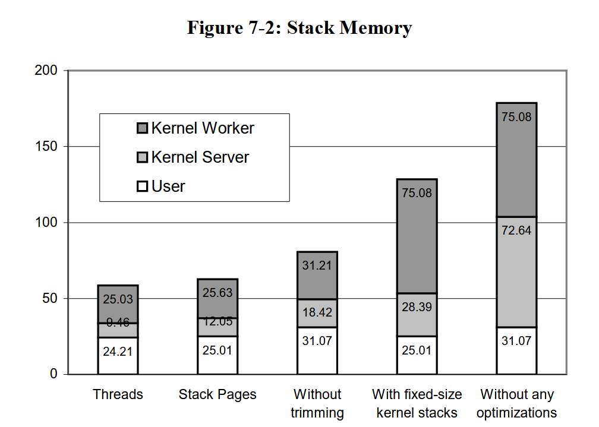

# Unifying the User and Kernel Environments阅读笔记

## 基本信息

发表时间：1997年

研究单位：Microsoft Research

## 我学到的内容

- 提供内核态和用户态统一接口的优势：可以方便地将用户态程序移植进内核态。
- 可以使用调用中间层实现统一接口：调用中间层负责根据调用方和被调用方的不同位置选择函数调用、系统调用或RPC以完成调用过程。【可以作为选题】
- 与用户栈相比，内核栈有一些限制（如静态分配空间、不可动态增长等），使得涉及栈的内核代码需要仔细检查。如果需要在内核态和用户态统一接口，则需要放宽对内核栈的限制。（本文中有放宽限制的方法）

## Abstract

在一个交互式电视操作系统中，将用户态和内核态环境统一。体现在以下方面：

- 接口
- 运行时要求
- 文档
- 调试器

统一内核和用户环境的系统能够自动地支持透明内核加载——将可信的用户态程序移入内核。其具有软件工程上的优势，因为为用户态和内核态只需要开发一套程序。并且可以降低内存使用、提高性能。

## Introduction

在本文研究的系统（Rialto）中，设备驱动、文件系统、网络栈等内核级别的子系统为分别加载的二进制文件，并且与用户态使用相同的接口、库函数和调试器。

用户态的接口在内核态中继续可用。内核态不会对程序做出抢占、调度、共享库使用或栈空间上的限制。

本文解决的技术问题：

- 为内核访问系统调用和远程过程调用提供了安全、高效和透明的接口
- 为共享库跨越用户/内核边界提供了不需要PIC的机制
- 可动态增长、可分页的内核栈

## Related Work

Multics：提供了用户和系统编程的统一环境。每个进程包含了不同特权级的段（包括内核的段），进程的特权级仅决定它能访问哪些段。但它的实现依赖于特定的、已过时（即使对论文发表的1997年来说，也已经有30年的历史了）的硬件。

Chorus和Mach的一些版本：通过监管者任务（supervisor task）支持内核移植（kernel collocation）。监管者任务是由用户创建、但运行在内核态的任务。监管者任务间的IPC可以被简化。但这种简化不是透明的，因此造成了用户态和内核态的接口不同。

微内核系统将所有开发放在用户态，消除了内核态开发环境。例如，L4将设备驱动放在用户态，内核将设备中断变为IPC转发给驱动进程。exo-kernel最大程度地取消了内核的资源管理功能，而是让内核将硬件资源安全地暴露给用户态。

一些可延伸内核支持将代码安全地注入内核，同时保护内核不受恶意代码的影响。但这样增大了用户和内核的接口区别。本文的系统没有进行保护，而是通过提供统一调试器，使代码在引入内核前可以先在用户态调试，从而实现保护内核的功能。

## Software-Engineering Examples

一些软件系统的开发能够从用户内核环境统一中获益，例如Andrew File System（AFS）、Windows NT Win32子系统、DCE RPC运行时。

AFS：将其用户级缓存管理器移到内核中，可以提高性能、实现更多功能、增加可移植性（因为内核级API比用户级API的标准更统一）

Windows NT Win32子系统：在早期，将Win32 GUI子系统实现为用户进程。4.0版本后，移入内核以提高性能。而用户与内核接口的区别（主要是系统调用与IPC的区别），使得这次移植导致了子系统的部分重构。

DCE RPC运行时：需要为用户和内核提供两个版本。

## Unifying User-Level and Kernel-Level Interfaces

出于性能考虑，一些对性能敏感的程序需要在用户态和内核态提供不同的专用接口。

**本节讨论，对于一个通用操作系统，是否需要统一接口？**

早期Unix的用户态和内核态环境：

- 用户程序的二进制文件作为进程加载进用户空间
- 驱动程序与内核一同编译进内核映像
- 内核代码和数据不会进行分页或换入换出
- 内核代码无法被抢占
- 内核代码不支持多线程、多处理器

当时的内核态环境很简单。

随着发展，内核态支持动态加载的驱动和子系统，支持线程、抢占和分页。

如今，用户态和内核态的功能有许多重叠，但接口上却很少相同。

对于更复杂、更数据集中型的接口（例如文件和网络I/O），能否进行用户态和内核态的接口统一？首先，已有不需拷贝，跨地址空间进行数据传输的方案；其次，可以为每个模块创建“内部接口”和“外部接口”两组接口。内部接口在模块与其合作者位于同一环境时使用（无论是内核态还是用户态），而外部接口在位于不同环境时使用。

### Device Drivers

在中断处理的情况下，本文不建议进行用户态和内核态的接口统一。本节考虑，是否能够在一组专用于内核态的API和用户态内核态统一的API下开发设备驱动程序。

许多设备驱动需要注册first-level中断处理程序。中断处理程序运行在内核中，且中断处理程序中对调度和抢占有限制。因此，这部分中断相关API只对内核态提供。

设备驱动程序还需要访问物理内存（例如DMA或MMIO的情况）。虽然内核可以提供虚拟内存相关的API，但也可能选择在内核态限制使用这些API。（？）

此外，驱动程序的一些行业标准规定的功能中，某些是可以被用户态程序利用的。

## Impact on Operating System Structure

创建用户-内核统一执行环境对系统结构的要求：问题和解决方案

- 内核代码没有访问共享库的限制；
- 内核和用户采用统一的抢占与调度方案
- 分页、代码大小限制等特性在内核态和用户态相同

除此之外，以下详细讲解了三个问题。

### Location-Transparent System Calls and RPC

系统调用与RPC需要做到位置无关，因为它们可能从用户空间、内核空间、或者服务器地址空间（sever address space，大概指的是从远程调用）也就是说，**调用者可以使用统一的机制调用被调用者，无论它们是否位于同一个地址空间、同一个机器；不关心底层使用函数调用、系统调用或RPC实现。**

#### 调用机制的位置无关

可以通过链接过程中加一层抽象以实现（This is easy to achieve with a level of indirection in the call linkage）。

抽象层可以使用C++的虚拟函数，或者基于跳转表的共享库链接等多种方式实现。

**抽象层的功能：当调用方和被调用方位于不同的地址空间时，使用系统调用或RPC完成调用过程。** 若位于相同的地址空间，则直接使用函数调用。

#### 调用参数的位置无关

通过映射一个临时页（scratch page），从参数导致的异常中恢复。

该机制用于解决位置无关调用机制与参数的验证机制的矛盾：参数验证机制在得知调用从内核态发出时，可以绕过验证机制从而保证性能。但使用位置无关调用机制后，难以确定调用是否从内核态发出。

当调用者（用户态）传入错误的指针，导致被调用者（内核态）产生页错误时，将一个临时页（某个特定的物理页）映射到对应内存区域，从而使内核的调用可以继续执行；该错误被记录，并在返回用户态时引发用户态的异常。

保护措施：由于一个临时页可能被映射到多个位置，导致其可能成为进程间的后门。在上下文切换时，取消映射所有临时页，归零那些曾被映射的临时页。对于多核，每个CPU核心使用各自的临时页；再加上之前所述的取消映射机制，可以保证一个线程的临时页不能对其它线程可见。

使用该机制，可以在被调用者代码中降低异常处理开销；同时，可以同时适用于系统调用和RPC。

### Shared Libraries

对用户空间和内核空间进行了一些重叠，使内核可以使用位置有关的共享库，同时保证内核仍可以访问整个用户空间。

共享位置相关代码：代码的加载位置在所有地址空间中相同。但会导致问题：如果内核通过某个用户进程访问共享库，那内核访问的全局变量也是该进程的。

#### Position-Independent Code

PIC导致的性能损失：

Windows NT没有选择使用PIC的共享库。

#### Independent User and Kernel Address Spaces

本文实现共享库的方式：创建分离、独立的内核和用户空间。用户和内核都会获得a full hardware space（是指物理空间也被切分成了用户和内核两块吗？）。使得位置相关代码（PDC）更容易映射到内核和用户的相同用户，但会导致内核难以访问用户空间。

#### Overlapping User and Kernel Address Spaces

将PDC共享库加载进重叠区域（如红框所示）。用户内存区域在内核中可以通过一个偏移量访问（如蓝框所示）。

### Kernel Stacks

提供与用户栈功能相同的内核栈。（可分页、动态增长）

一般来说，内核栈的大小和可分页性均被限制，从而防止发生页错误时递归地产生页错误。而用户栈则可以支持内存的按需分配和大小的动态增长。

#### Dynamically Growable Kernel Stacks

两个需要解决的问题：

- 内核栈的页错误需要在不递归触发页错误的条件下解决。
- 避免临界区内发生内核栈错误导致的死锁

**页错误解决** ：页错误的处理位于可能被抢占或阻塞的上下文，因此需要配备一个栈。不过，使用专用的线程（helper线程）处理内核栈的页错误，则可以限制该线程的栈大小，并全部分配。当其它线程产生内核栈的页错误时，将其阻塞并加入队列中。该专用线程从队列中获取线程，代替它们处理内核栈页错误。（如果是其它的页错误，则由线程自身处理）

**避免死锁** ：在进入最外层临界区之前，先为内核栈分配至少2K的空间；进入内层临界区前则不能这样分配。使用探测计数令helper线程得知线程是否位于临界区中。

helper线程可以回收未在临界区中的线程的未使用栈。

## Implementation

### Intel

Intel平台上的两个问题：

- 切换页表的开销很大，需要清空TLB
- 硬件的页错误处理机制会把状态push到内核栈上，若内核栈不可用就会导致无法恢复的错误。

问题1：使用Intel的段页式机制，降低切换地址空间开销。切换地址空间时，只切换段表，不切换页表。

问题2：使用不同的特权级，正常的内核代码在ring 1执行，前文提到的，处理内核栈页错误的helper线程在ring 0执行。

### MIPS

为用户进程的空间分配两个ASID（地址上下文），一个用于进程自身访问，一个用于内核访问。

### Deficiencies（不足）

- 移植到内核的用户调试器功能不够强大：可以调试加载到内核的共享库或server（RPC的被调用方？），但无法调试中断处理程序、无法进入最内层的内核代码。
- Win32图形服务（GDI）与窗口服务（USER）在内核无法正确运行，因为除了正常的位置无关接口外，它们还使用了一些非位置无关的“后门”接口。

## Performance

- 内核集成在CPU时间方面有35%的提升，降低了900K以上的内存占用。
- 栈管理机制将栈内存消耗降到1/3，节省了460K内存
- Intel实现中，使用ring 1导致CPU时间增加了2-4%；MIPS实现中，每个进程使用两个ASIDS使硬件TLB命中率降低了约3%。

### Kernel Collocation

因为使用的测试程序为交互式程序，因此通过衡量CPU的空闲时间，计算得出有效CPU时间。

三个测例的内存节省相对类似，因为其主要反映静态程序开销，例如页表的页、copy-on-write共享库数据页、初始栈的页。

### Stack Space

其中的threads指平均线程数量，stack pages指（在使用本文的优化后）平均使用的栈页面数量；without trimming指不回收已分配的栈页的情况下，平均使用的栈页面数量。后面两个也是平均使用的栈页面数量。

平均使用的栈页面数量略高于平均线程数量，因为大部分线程只会使用一个栈页。

### Intel Ring 1 Overhead vs Task Gates

Intel平台上各种特权级切换的开销：

运行应用的用时：

### MIPS ASID Pressure

这部分的结果是在模拟器环境下测量的。

统计了TLB未命中次数和其中由于双ASIDS导致的“额外”未命中次数，从而计算出相对开销。

## Conclusions

本文提供的方式最大意义在软件工程上：将用户态程序方便地移入内核。

虽然实现机制上带来了一定的开销，但移入内核带来的性能提升远比开销大。
