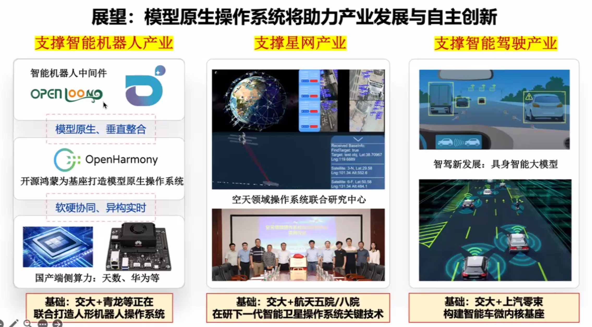

# 报告笔记

主题：模型原生操作系统

## 1. 操作系统的演进

PC互联网时代：强调兼容性，Linux中的大量代码都用于兼容

移动互联网时代：通过基础设施（如应用商店）实现盈利

广义的操作系统：经典操作系统+向用户与用户程序提供的服务、库、框架

例如，对智能车来说，存在三个不同分工的操作系统：车控系统、座舱系统、辅助驾驶系统

## 2. 大模型带来的发展机遇与趋势

AI提升OS资源供给效率：利用操作系统运行过程中产生的数据，进行更精准的资源分配

智能助手（Agent）

当前大部分还未进入应用阶段

## 3. 模型原生操作系统探索实践

目前发展阶段位于“高原地带”，已具有较高的高度，但难以再提升。

外挂大模型方式，由于性能制约，可能依赖服务端模型

目前AI的发展阶段：Chatbot ~ Reasoner

“交互方向”：指AI智能体如何与OS交互

图b：基于时间块进行抢占

图c：为每个核心分别调度任务

理想状态：立即抢占

快速GPU checkpoint；将模型快速在GPU间迁移

