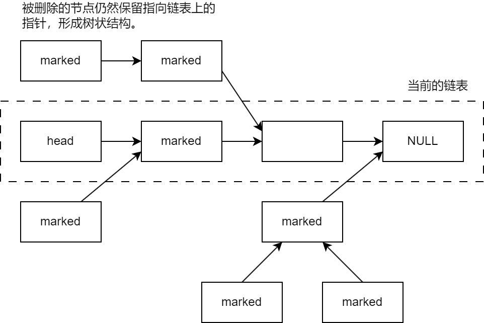

# 无锁链表与垃圾回收实现调研

## crossbeam

### 算法

使用了基于epoch的垃圾回收算法（EB）。

#### 算法描述

参考了[此网页](https://pwang7.github.io/eb.html)以及[crossbeam-epoch源码](https://docs.rs/crossbeam-epoch/0.9.18/src/crossbeam_epoch/lib.rs.html)

维护的数据结构：全局epoch、每个线程的本地epoch（两者均在0、1、2间轮转）、全局垃圾队列（每个epoch配一个垃圾队列）、每个线程的状态（活跃/不活跃）（有什么用？）

操作：`EB::enter()`、`EB::leave()`（分别用于标记线程进入和离开临界区；线程需要在临界区内访问共享数据和回收内存）、`EB::add()`（将内存交给EB回收）。

`EB::enter()`的操作：

1. 读取当前全局epoch，用其更新线程的本地epoch。
2. 尝试更新全局epoch：
   1. 检查每个线程的本地epoch是否一致
   2. 若一致，则`CAS(全局epoch, 本地epoch, 本地epoch + 1)`，并在更新成功时回收新全局epoch-2对应epoch的队列中的垃圾。
3. 将本地状态设为活跃

`EB::add()`的操作：

1. 将待回收对象放入本地epoch对应的全局垃圾队列。

`EB::leave()`的操作：

1. 将本地状态设为不活跃。

此外，为了提高性能，有以下优化：

- 将垃圾缓存在本地队列，本地队列满后提交到全局队列；
- 进行多次`EB::enter()`后，才实际进行一次垃圾回收。

#### 算法的正确性证明

1. 在一个线程里，待回收对象只会关联一个线程的本地阶段，不会关联多个阶段。（因为每个待回收对象只会被`EB::add()`一次。）
2. 每个线程的本地epoch要么和全局epoch一致，要么处于全局epoch的前一阶段。（因为，如果某线程正处于全局epoch的前一阶段，则其它线程在`EB::enter()`时无法再更新全局epoch）
3. 当某线程在第n epoch从共享结构删除一个元素并回收时，只有epoch小于等于它的其它线程可能正在访问该元素。
4. 综上，全局epoch-2对应epoch的垃圾一定没有线程能够访问，因此可以删除。

或者更简单的描述：某时刻活跃的线程，位于当前全局epoch或全局epoch-1的阶段。全局epoch+2后，那些线程一定退出了当时的临界区。因此，在那些临界区中删除的节点一定能回收。

#### 讨论1

基于epoch的垃圾回收机制能否用于Harris链表（我们现在使用的链表）这样，被删除的元素间可能相互链接的情况。因为，被删除的元素间相互链接，可能导致即使某个已被删除的元素即使不会通过链表被访问，也可能通过其它被删除的元素被访问。



当被删除的元素相互链接时，前一个元素一定在后一个元素之前被删除。当其它线程仍有能力从被删除的前一个元素访问到被删除的后一个元素时，说明：

1. 该线程依然在活跃阶段
2. 其能访问到删除的前一个元素

由于前一个元素可被一个活跃阶段的线程访问，说明前一个元素当前不会被删除。因此，后一个元素当前也不会被删除。因此，对Harris链表应用EB没有问题。

#### 讨论2

作为垃圾回收算法，该算法做到了无锁。因为垃圾不要求及时回收，一个在临界区内的线程被一直阻塞时，最坏的结果也只是内存泄漏，且在该线程唤醒后，就可以回收这些“暂时泄漏”的内存。

然而，堆分配器要求等待内存区域不再被其它线程访问（即，满足垃圾回收的条件）后，再返回这块内存，之后算法才真正结束。因此，在上文提到的情况下，一个在临界区内的线程被一直阻塞，会导致垃圾回收条件一直无法满足，所有线程都无法返回内存。因此，用户线程在临界区内中断，中断处理程序再访问堆分配器时，也无法获得内存，进而导致死锁。

因此，我认为基于epoch的垃圾回收机制无法用于堆分配器。

### 实现

crossbeam使用[`Guard`](https://docs.rs/crossbeam-epoch/0.9.18/src/crossbeam_epoch/guard.rs.html#69)实现临界区的进入和退出，在其基础上实现了[`defer`](https://docs.rs/crossbeam-epoch/0.9.18/src/crossbeam_epoch/guard.rs.html#89)方法，可以在当前活跃线程全部退出临界区后（等价于EB的垃圾回收条件），执行某个函数。向`defer`方法中传入对象的`drop`方法，即可实现垃圾回收。此外，`Guard`还实现了[`repin`](https://docs.rs/crossbeam-epoch/0.9.18/src/crossbeam_epoch/guard.rs.html#326)方法，用于退出当前临界区并重新申请临界区，从而实现更精细的临界区管理。

crossbeam使用一个usize同时代表epoch和是否活跃（活跃与否在crossbeam中称为`pinned`和`unpinned`）：[`Epoch`](https://docs.rs/crossbeam-epoch/0.9.18/src/crossbeam_epoch/epoch.rs.html#17)结构的最低位代表是否`pinned`，其它位代表所处epoch。在crossbeam中，epoch的范围为`(isize::MIN / 2) .. (isize::MAX / 2)`。

crossbeam的垃圾回收器由全局的[`Collector`](https://docs.rs/crossbeam-epoch/0.9.18/src/crossbeam_epoch/collector.rs.html#22)和每个线程的[`LocalHandle`](https://docs.rs/crossbeam-epoch/0.9.18/src/crossbeam_epoch/collector.rs.html#73)组成。`Collector`存储全局数据结构[`Global`](https://docs.rs/crossbeam-epoch/0.9.18/src/crossbeam_epoch/internal.rs.html#156)，包括全局epoch、全局回收列表，以及所有局部数据的链表。`LocalHandle`存储局部数据结构[`Local`](https://docs.rs/crossbeam-epoch/0.9.18/src/crossbeam_epoch/internal.rs.html#271)，包括局部回收列表、局部epoch等。

## arc_swap

### 接口

`ArcSwap<T>`可以从`Arc<T>`或`T`创建。对`ArcSwap<T>`的读写均使用或返回`Arc<T>`。

`ArcSwap<T>`不包含与`Arc`类似的，通过`clone`在线程间共享的能力。因此，如果在静态变量中使用`ArcSwap`实现共享，则使用`ArcSwap<T>`类型；如果在局部变量中使用`ArcSwap`实现共享，则使用`Arc<ArcSwap<T>>`类型。

`ArcSwap`类似于可并行的`Arc`。可以原子地读写其中的内容，也就是把`ArcSwap<T>`中当前的`Arc<T>`换为另一个`Arc<T>`。如果更新前的`Arc<T>`仍被其它线程持有，则该`Arc<T>`和其中的`T`都不会被释放。

### 原理

**基本思想：** 通过`Arc`与裸指针的转化接口（`from_raw`和`into_raw`），将`Arc`转化为裸指针后保存在`AtomicPtr`中，且在读出时转化回`Arc`。

**问题：** 当读`ArcSwap`时，从读取裸指针到增加引用计数有一个时间差，如果某线程读取`ArcSwap`，却没来得及增加引用计数（完成步骤1，未完成步骤3），此时另一个线程完成了`ArcSwap`的更新（完成了步骤3），就会在引用计数增加之前减少到0并释放掉指向的区域。（见下文中的读和更新流程）

读`ArcSwap`的流程：

1. `AtomicPtr::load()`（读取裸指针）
2. `Arc::from_raw()`
3. `Arc::clone()`（增加引用计数）
4. 将一个`Arc`返回，另一个`Arc`通过`Arc::into_raw()`泄漏掉，以保证总引用计数+1

更新`ArcSwap`的流程：

1. `Arc::into_raw()`（将新的`Arc`转化为裸指针）
2. `AtomicPtr::swap()`（更新的同时，获得旧的指针）
3. `Arc::from_raw()`（将旧的指针转化为`Arc`，从而在自动`drop`时降低引用计数）

**这个问题也是我们的链表在使用引用计数机制时遇到的问题之一。**

**解决方案：** 在实现了“引用计数的欠和还”后，混合两种方案以解决。

引用计数的欠和还：读者访问指针时，不需立即增加引用计数，而是在本地列表中标识该指针（类似于风险指针）。（“欠”）当写者更新指针后，对于指针的旧值，访问每个线程的本地列表，将未增加的引用计数全都增加，并将该指针的记录从各个本地列表删除。（“还”）

第一种方案是容许失败的首选方案，基于修改后的风险指针算法（风险指针算法间下文）。该方案即为上面提到的欠还过程。将指针加入本地列表的过程允许失败，失败可能是因为本地列表已满，也可能是因为上文提到的释放前更新问题。失败后，使用第二种方案。

第二周方案是后备方案。首先发布自己读取指针的意图（包含线程id与指针），再读取指针，最后再将指针加入本地列表。当写者遇到这样的意图时，会把旧指针传给读者，让读者直接使用（？）

### 使用的算法：风险指针（Hazard pointer）

[https://www.cnblogs.com/namudelong/p/15098960.html](https://www.cnblogs.com/namudelong/p/15098960.html)

读者在读取指针前，创建一个与该指针对应的风险指针（应该类似于为每个指针的读操作配备了Guard），并且加入到全局风险指针列表上。完成指针的读取后，从全局列表上移除这个风险指针。

写者在更改指针时，不立即回收指针的旧值指向的地址，而是将该地址放入一个本地列表。定期遍历该列表：for each 地址，查看地址是否不与全局风险指针列表中的每一个地址相同。若都不同，则可以回收该地址指向的内存。否则不回收。

因此，风险指针的实现需要一个并行列表。

风险指针的使用限制：对某个节点的访问只能 **开始于** 该节点被删除之前，不能开始于该节点被删除之后。（结束时机则没有要求。）（因此，风险指针不能用于Harris链表。）

不过，似乎风险指针依然存在“在声明之前被删除”的问题：读者从获取到要访问的指针到将其声明为风险指针间存在时间间隔，如果目标区域在这段时间内即被释放，则风险指针无法起到保护作用。不过，由于写着的释放具有较长的延迟（从删除到释放间的时间间隔很长），这种情况发生的概率也很低。

### 实现

`ArcSwap`底层由[`ArcSwapAny`](https://docs.rs/arc-swap/latest/src/arc_swap/lib.rs.html#307)实现。`ArcSwapAny`很灵活，可以自定义使用的引用计数类型（`RefCnt` trait）和策略类型（`Strategy` trait）。

`RefCnt` trait定义了引用计数指针与裸指针间的相互转化（转化过程不影响引用计数，就像`Arc`一样），以及增加降低引用计数的操作。

`Strategy` trait定义了如何在并发操作中维护引用计数。目前只能使用已有的几种`Strategy`，无法定义新的`Strategy`。

### 移植难度分析

需要alloc库（使用了`Arc`，且垃圾回收机制内部需要实现无锁链表）

no-std下的thread-local为实验性内容

因此，应该难以在分配器内部的环境里使用。

## 分离式引用计数

用于解决“增加指针指向节点的引用计数时，指针可能无效”的问题。

将一个节点的引用计数分为外部计数和内部计数：外部计数用于在获取节点前增加引用计数，因此存储在指向节点的指针中（例如，第一个节点的外部计数存储在head指针中，其它节点的外部计数存储在上一个节点的next指针中），可以与指针一起进行CAS操作。内部计数用于在节点使用完成后减少引用计数，因此存储在节点中。

内部计数存储为有符号类型，取值为0或负数。

将一个节点的外部计数加上内部计数，就可以得到实际的引用计数。

当节点从链表上取出后，将其原有的外部计数与内部计数相加存储在内部计数中。此时，内部计数即为其引用计数，取值为正数或0。当内部计数为0（也就是释放某指针前内部计数为1）时，即可释放该节点。

[https://gitbookcpp.llfc.club/sections/cpp/concurrent/concpp20.html](https://gitbookcpp.llfc.club/sections/cpp/concurrent/concpp20.html)

分离式引用计数一般用于实现无锁栈（与我们所需的链表相比，缺少了delete操作）中的垃圾回收。

`push`的实现：

```C++
void push(T const& data) {
   auto new_node =  ref_node(data); // ref_node会创建一个指向数据节点的指针，外部计数为1，内部计数为0
   new_node._node_ptr->_next = head.load(); // head也为ref_node类型，即包含了外部计数的指针
   while (!head.compare_exchange_weak(new_node._node_ptr->_next, new_node));
}
```

`pop`的实现：

```C++
std::shared_ptr<T> pop() {
    ref_node old_head = head.load();
    for (;;) {
        //1 只要执行pop就对引用计数+1并更新到head中
        ref_node new_head;

        //2 增加第一个节点的外部计数（存储在head中）
        do {
            new_head = old_head;
            new_head._ref_count += 1;
        } while (!head.compare_exchange_weak(old_head, new_head));

        old_head = new_head;
        //3 获取第一个节点
        auto* node_ptr = old_head._node_ptr;
        if (node_ptr == nullptr) {
            return  std::shared_ptr<T>();
        }

        //4 若CAS成功，则代表该线程存储的old_head和head相等，即old_head中的外部计数即为第一个节点的外部计数；从链表上删除old_head
        if (head.compare_exchange_strong(old_head, node_ptr->_next)) {
            // 在CAS之前，由head保存被pop节点的外部计数；在CAS之后，改为由old_head保存被pop节点的外部计数

            //要返回的值
            std::shared_ptr<T> res;
            //交换智能指针
            res.swap(node_ptr->_data);

            //5 准备将外部计数加到内部计数上。-2的原因是，指向该节点的head和old_head均将被释放
            int increase_count = old_head._ref_count - 2;
            //6 将外部计数加到内部计数上。fetch_add的返回值为-increase_count，相当于fetch_add之后的值为0，即为释放内存的条件。
            if (node_ptr->_dec_count.fetch_add(increase_count) == -increase_count) {
                delete node_ptr;
            }

            return res;
        }else {
            //7 如果CAS失败，则释放指向第一个节点的指针并重新获取。因此需要降低第一个节点的内部计数。fetch_sub的返回值为1，则fetch_sub之后的值为0，即为释放内存的条件。（同时，若满足条件，则说明内部计数在fetch_sub前为正数，即该节点已从链表上删除；节点的内部计数即为引用计数。）
            if (node_ptr->_dec_count.fetch_sub(1) == 1) {
                delete node_ptr;
            }
        }
    }
}
```

能否用于无锁链表，还需进一步调研。

## 用户态-内核态统一环境下的无锁分配器的可行性

如果使用无锁链表等无锁数据结构管理内存，则可以安全地将节点作为内存分配出去的时机即为垃圾回收机制中，可以将节点回收的时机，因为此时，未拥有该节点的其它线程不再会访问该节点。

无论何种垃圾回收机制，都会等待其它线程不再访问节点后再将其回收。在内存分配器中，拥有该节点的线程需要等待该节点达成回收条件，因此就构成了一个线程对其它线程的单向等待。这样的等待不会导致死锁，因为一个线程在进行等待时，不会持有其它节点，因此其它线程不会等待它。

在用户态-内核态统一环境中，有两种情况：

- 如果考虑用户态代码因为中断而陷入内核态，且用户态代码和中断处理的内核态代码都需要访问内存分配器，则如上所述的单向等待都是不可接受的。因为用户态代码需要等待中断处理代码完成才能继续执行，而中断处理代码可能由于内存分配器而等待被中断的用户态代码，导致死锁。
- 如果不考虑中断处理导致的，用户态代码和内核态代码的等待关系，仅考虑用户态代码的临界区可能被内核态代码抢占，则如上所述的单向等待不会导致死锁。如果这样，就需要将中断的处理逻辑实现为普通任务，而使中断处理函数尽量简单、不使用内存分配器。（同时，如果这样修改了中断机制，则甚至不需要使用无锁同步——中断处理函数可以检测用户态是否位于临界区，若位于，则不抢占、直接返回。）
