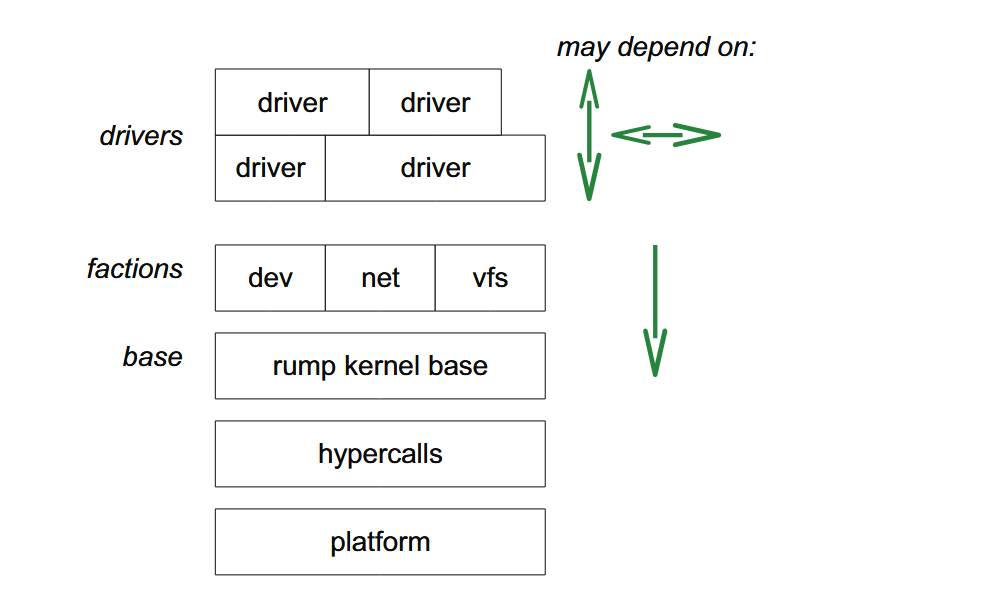

# Flexible Operating System Internals阅读笔记

## 略读

因为这篇是博士论文，篇幅较长，因此先略读一遍（只看每章/每节的总结段），再选择出需要细读的内容。

### Abstract

宏内核的重要性：大量的正在工作和已证明的代码基于此架构

宏内核的不足：

- 安全性和健壮性不高（因为所有代码位于同一个域内，可以直接相互访问）
- 代码复用受限（为了虚拟化内核服务，需要复制整个内核）
- 开发和测试困难

其它内核架构：微内核、exokernel（？）、partitioned kernel（？）

这些架构的不足：无法完全覆盖宏内核的使用需求；代码太少且经过验证的更少。

本文提出了anykernel架构，可以将系统服务以不同的配置运行，例如微内核式的服务器、应用库，或者宏内核的一部分。配置可以在运行时决定。

宏内核架构可以通过可行的时间和工作量重构为anykernel，且不引入降低性能的中间层。转化后的系统服务可以继续以宏内核运行，也可以在运行时选择以anykernel运行。

为了实现这种转化，使用rump kernel作为系统服务以anykernel模式运行的容器

rump kernel在虚拟机上运行，提供线程调度、虚拟内存等高级原语。

### 1. Introduction

宏内核的不足 -> 其它内核架构 -> 这些架构的不足 -> 提出anykernel架构 -> 通过rump kernel实现anykernel

（见Abstract）

host：runp kernel运行的宿主机，在论文的实现中，为用户态进程。

client：使用rump kernel服务的应用。有以下三种类型：

- local：rump kernel作为应用库向client提供服务。client和rump kernel位于同一个用户进程（也就是同一个虚拟机？）。可以使用rump kernel的系统调用接口，也可以直接调用rump kernel。
- microkernel：The host routes client requests from regular processes to drivers  running in isolated servers. Unmodified application binaries can be used.  For example, it is possible to run a block device driver as a microkernel style  server, with the kernel driver outside the privileged domain.
- remote：client和rump kernel可以位于同一个进程或不同的进程。client决定哪些服务由host kernel提供，哪些由rump kernel提供。

（每个类型详见2.2.）

anykernel解决了宏内核的三个不足。

本文的贡献：

- 提出了anykernel和rump kernel的定义
- 展示可以以生产环境的质量、在一个可实际使用的宏内核OS的基础上实现和维护anykernel
- 分析其通用性、该方法可以应用于其它操作系统

文章结构：

- chapter 2：定义anykernel、解释rump kernel
- chapter 3：讨论实现、提供microbenchmark以支持实现中的选择
- chapter 4：评估解决方案
- chapter 5：相关工作
- chapter 6：总结

### 2. The Anykernel and Rump Kernels

#### 2.1. An Ultralightweight Virtual Kernel for Drivers

将部分系统功能虚拟化可以为宏内核提供可移植性和隔离性，从而解决Abstract中的问题。

将OS虚拟化为应用库，可以通过将应用与OS运行于同一虚拟机上来实现（？）（原文：Using a fully virtualized OS as an application library is less straightforward, but can be done by bootstrapping a guest instance of an operating system  and communicating with the guest’s kernel through an application running on the  guest.）

##### 2.1.1. Partial Virtualization and Relegation

一些guest所需的系统功能（如调度和虚拟内存）可以直接由host提供，而不需要在guest的os中再实现一遍。

##### 2.1.2. Base, Orthogonal Factions, Drivers

将rump kernel分成三层：base、factions、drivers

（hypercall：虚拟机的guest向host发起的调用）

- base：基础支持（如内存分配、锁）
- factions：对三类不同的驱动（设备、网络、文件系统）提供各自专用的支持。各个faction彼此垂直，互不依赖
- drivers：驱动

##### 2.1.3. Hosting

rump kernel不需要以root权限运行。

#### 2.2. Rump Kernel Clients

Rump Kernel Client：一个需要rump kernel提供服务的应用。

#### 2.3. Threads and Schedulers

之后详细阅读

rump kernel需要处理的上下文包括进程/线程上下文，以及每个线程关联到的唯一的rump kernel CPU。

#### 2.4. Virtual Memory

rump kernel的虚拟内存支持由host提供。

### 3. Implementation
