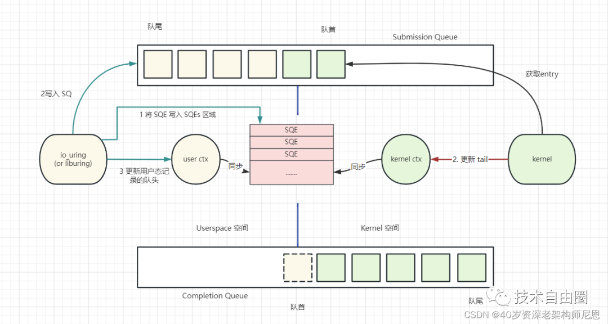
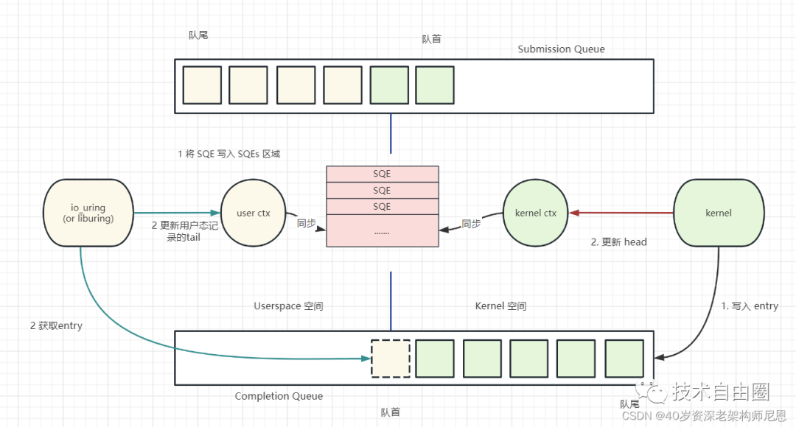
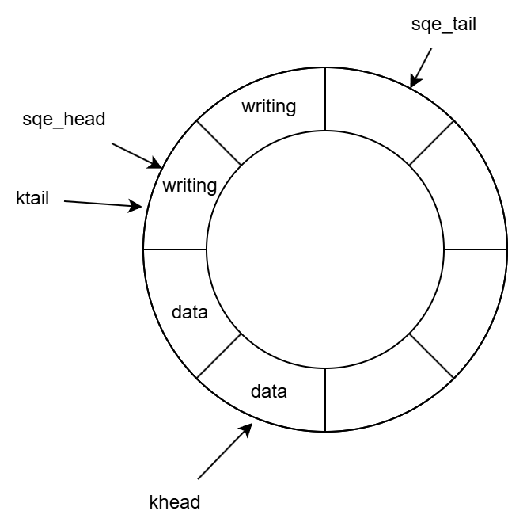

# io_uring学习笔记

主要参考文章[https://arthurchiao.art/blog/intro-to-io-uring-zh/](https://arthurchiao.art/blog/intro-to-io-uring-zh/)。对于一些没弄懂的地方，在下面补充说明。

## 三种工作模式

- 中断驱动模式：进程将IO请求提交给块设备后会进入睡眠（D）状态，块设备在处理完IO请求后会触发硬中断，硬中断中会唤醒进程并通知其IO的完成。
- 轮询模式：指**内核对硬件设备** 的轮询。io_uring会额外启动一个内核进程来循环检查IO的完成。
  
    无论是中断模式还是轮询模式，应用更新SQ后均需调用 `io_uring_enter()` 提交IO请求，从而进入内核处理该请求。其中中断和轮询模式的区别体现在**内核与硬件设备** 的交互方式。

- SQ轮询模式：指**内核对SQ（提交队列）** 的轮询。应用更新SQ后，内核轮询线程自动完成，用户不需调用 `io_uring_enter()` 提交IO请求。

## 各个API在实际使用过程中的作用

见[https://www.cnblogs.com/crazymakercircle/p/17149644.html#autoid-h2-10-0-0](https://www.cnblogs.com/crazymakercircle/p/17149644.html#autoid-h2-10-0-0)的`梳理一下io_uring的核心流程`章节

`io_uring_enter`的功能：[https://www.cnblogs.com/crazymakercircle/p/17149644.html#autoid-h2-10-0-0](https://www.cnblogs.com/crazymakercircle/p/17149644.html#autoid-h2-10-0-0)的`IO 提交`章节

提交请求：

处理结果：

如果采用非SQ-poll模式，则提交请求时需要系统调用（`io_uring_enter`），处理结果时不需要。如果采用SQ-poll模式，则两个过程都不需要系统调用。

## 用户api

对用户而言，io_uring的API分为两部分：一部分是io_uring相关的系统调用；一部分是手动操作fd中的`sq`、`cq`、`sqe`等数据结构。

因为这种API较为底层，因此提供了[liburing用户库](https://github.com/axboe/liburing)。

## 数据结构深入理解

提交队列`io_uring_sq`分为两个部分：一个为提交队列自身（以下简称`sq`，代码中为`array`），一个为`sqe`的数组（以下简称`sqes`）。`sq`和`sqes`均为队列，`sq`的首尾分别为`khead`和`ktail`，`sqes`的首尾分别为`sqe_head`和`sqe_tail`。

参考：[liburing/src/include/liburing.h#L85](https://github.com/axboe/liburing/blob/506688059030ddb1b0f09eda437c75d32534ce9a/src/include/liburing.h#L85)

`sq`和`sqes`两个队列可以视为共用同一块缓冲区，如下图：

- **[khead, ktail)**：已填写好并提交到内核的`sqe`，对内核可见
- **[sqe_head, sqe_tail)**：已分配给用户，正在填写的`sqe`
- **[sqe_tail, khead)**：空槽位

对这两个队列的操作有三个：

- **`get_sqe`**：增加`sqe_tail`，返回新加入`sqes`的槽位指针以供用户填写。
- **`submit`**：`sqe_head = sqe_tail; ktail = sqe_tail`，用户已将`sqe_head`和`sqe_tail`之间的内容填写完成，因此将它们提交到内核可见的`sq`中。
- **`consume_sqe`**：获取`khead`指向的`sqe`并增加`khead`。

`cq`也与`sq`类似，分为`cq`和`cqes`两个队列。

在io_uring中，`sq`和`cq`均使用了缓冲（虽然按代码命名来看是缓存cache，但个人认为更像缓冲buffer？）技术，先在私有内存中暂存更改，再批量提交到共享数据结构中。

## 完整工作流程

### 1. 用户获取并填写`sqe`

用户对`sqes`进行`push_back`，将`sqes`中的一个空位加入队列，该空位对应的`sqe`即为获取到的`sqe`。之后，填写该`sqe`中的字段。

参考：[liburing/src/include/liburing.h#L1638](https://github.com/axboe/liburing/blob/506688059030ddb1b0f09eda437c75d32534ce9a/src/include/liburing.h#L1638)

### 2. 用户提交`sqe`

通过`io_uring_enter`系统调用或者`liburing`库中的`io_uring_submit`函数（实质也是`io_uring_enter`），进行提交操作。

[`io_uring_submit`](https://github.com/axboe/liburing/blob/506688059030ddb1b0f09eda437c75d32534ce9a/src/queue.c#L453)函数首先调用了[`__io_uring_flush_sq`](https://github.com/axboe/liburing/blob/506688059030ddb1b0f09eda437c75d32534ce9a/src/queue.c#L203)函数，其功能为清空`sqes`，并将其中的内容全部`push`到`sq`中。之后，在[`__io_uring_submit`](https://github.com/axboe/liburing/blob/506688059030ddb1b0f09eda437c75d32534ce9a/src/queue.c#L422)函数中，进行参数合法性检查后，根据io_uring的配置情况（例如，是否启用了`SQ_POLL`模式；sq线程是否活跃），在需要时调用`io_uring_enter`系统调用。

### 3. 内核处理用户提交

#### 情况1：非`SQ_POLL`模式

该模式下，内核通过[`io_uring_enter`](https://github.com/torvalds/linux/blob/d7b8f8e20813f0179d8ef519541a3527e7661d3a/io_uring/io_uring.c#L3339)系统调用处理用户提交。

该函数会从`sq`的`head`取出一定数量的请求并提交到相应I/O模块进行处理。（注意：在请求被提交成功后，才会更新`head`。）

当I/O操作完成并获得`response`后，最终会调用[`io_fill_cqe_req`](https://github.com/torvalds/linux/blob/d7b8f8e20813f0179d8ef519541a3527e7661d3a/io_uring/io_uring.h#L201)，从而将`response`中的`cqe`填充到`cq`中。其先使用[`io_get_cqe`](https://github.com/torvalds/linux/blob/d7b8f8e20813f0179d8ef519541a3527e7661d3a/io_uring/io_uring.h#L169)获取一个`cqe`同时增加`cached_cq_tail`，再将`responce`中的`cqe`内容复制到获取的`cqe`中。最后，在[`io_commit_cqring`](https://github.com/torvalds/linux/blob/d7b8f8e20813f0179d8ef519541a3527e7661d3a/io_uring/io_uring.h#L290)中刷新缓存的`cq_tail`。

参考：[io_uring源码分析](https://xz.aliyun.com/news/16939)

#### 情况2：`SQ_POLL`模式

目前找不到相应的代码（主要是找不到运行在sqpoll线程上的函数）。

### 4. 用户接收返回结果

直接从`cq`的头部`pop`获取返回结果。
