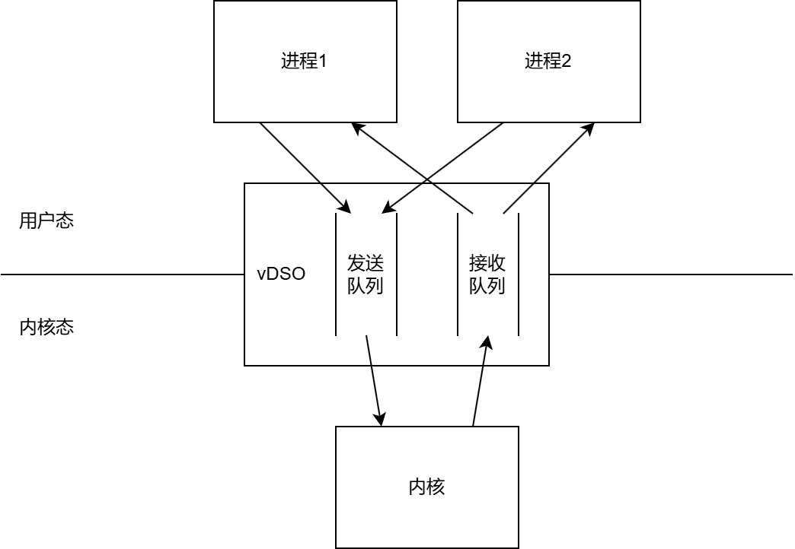
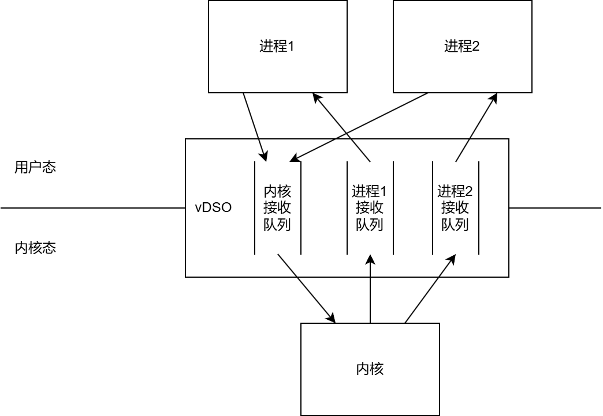

# 关于队列结构的想法

在队列的设计上，原有的设计是所有地址空间共享一条发送队列和一条接收队列。发送队列用于各个进程发起异步系统调用，接收队列用于内核向各个线程返回异步系统调用的处理结果。（如下图）

但是，这样的设计会导致：

1. 接收过程中，所有进程的处理结果混杂在一起，某个进程获取自己的处理结果较为困难。
2. 如果将系统调用的场景扩展到一般IPC，则在没有清晰的调用-被调用关系时，无法确认消息应该通过发送队列还是接收队列传递。（扩展到IPC的原因：我想通过vdso可运行在用户态或内核态环境的特性，减少异步系统调用和IPC的区别，从而使该异步系统调用机制兼容宏内核和微内核。）

因此，我想改用一种新的队列结构：每一个地址空间（进程或内核）有一条自己的接收队列。这些队列依然位于vdso中，它们只是逻辑上被各个地址空间拥有。（如下图）

在该设计中，异步系统调用的过程变为：各个进程将调用请求放入内核的接收队列从而发起系统调用；内核处理完成后，将处理结果放入每个线程各自的接收队列。

这样，既解决了不同进程的系统调用结果混杂在同一条队列中的问题，也使该机制更适合IPC场景。
