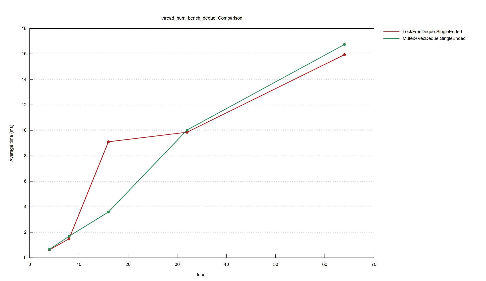
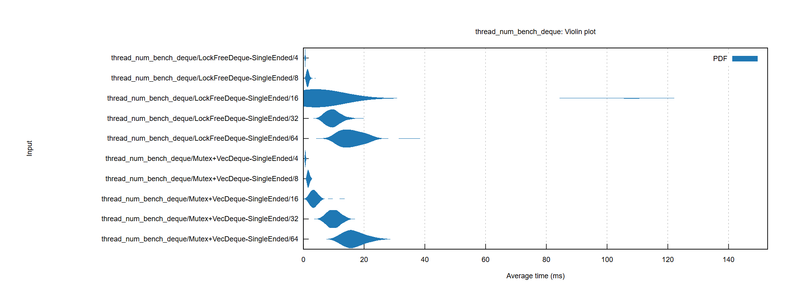
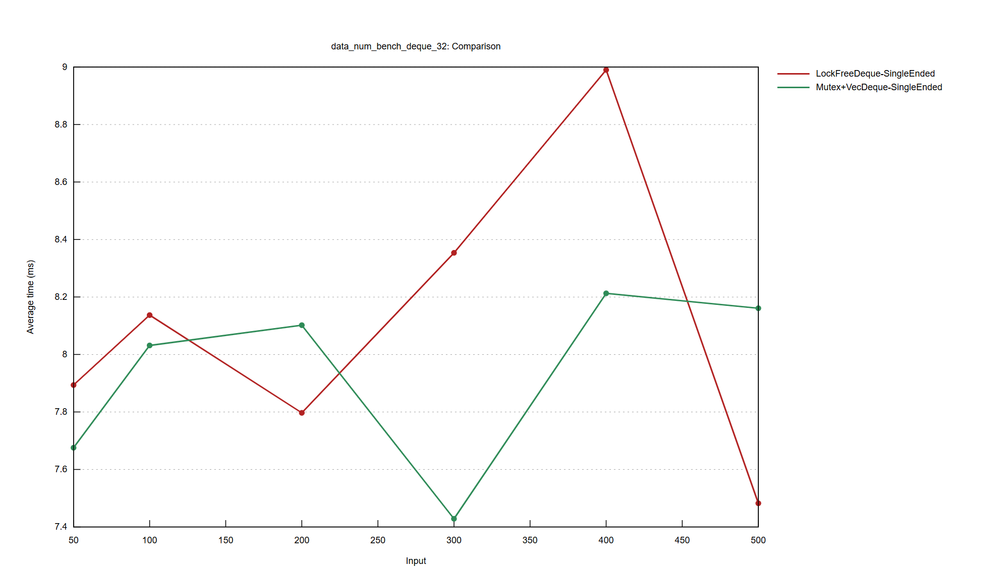
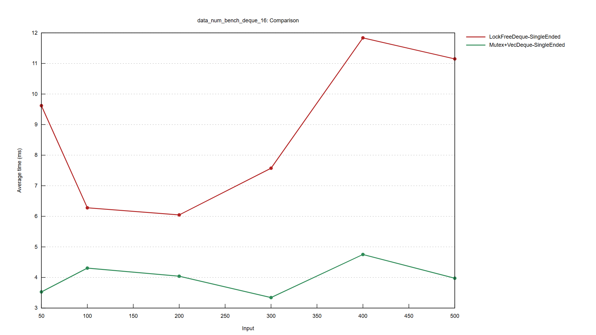

# 性能测试结果

测试项目：仅单端情况，

- 数据量=100，不同并发量
- 并发量=32，不同数据量
- 并发量=16，不同数据量

## 数据量=100，不同并发量

与上次的结果相同。线程数16时，仍能观察到无锁队列的耗时较高。

在线程数=16时，无锁队列的用时方差明显更大。

## 并发量=32，不同数据量（对无锁队列有利的并发量）

（注意纵坐标的范围是7.4~9，因此看起来波动很大，实则波动不大）

耗时并不随着数据量明显地增长。无锁队列和有锁队列的结果各有优劣。

因此推测，实验的大部分耗时用在了创建线程等操作上，而`push/pop`操作所占的耗时不高。

## 并发量=16，不同数据量（对无锁队列不利的并发量）

（纵坐标范围为3~12）

除了无锁队列的用时明显高于有锁队列以外，其它情况类似于并发量=32时。
