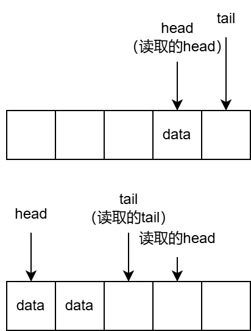
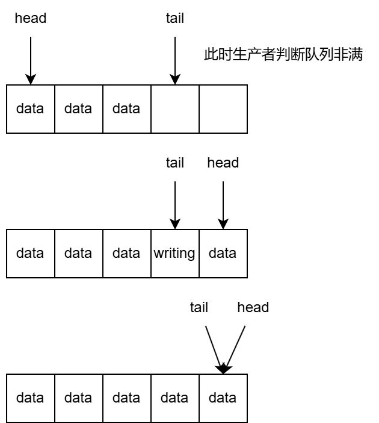

# 双端队列debug文档

当前成功运行了[此处](https://github.com/AsyncModules/vsched/blob/250fef2e989eb13b435b6493a83e469ef0f8d635/utils/src/deque.rs)的双端队列实现，其各个测试用例都能通过。

不过，队列的注释中提到MPMC情况下，使用`pop_back`操作会导致错误，因此尝试定位和解决该错误。

## 测试结果与错误定位

首先测试生产者和消费者的不同情况，结果如下：

|生产者\消费者|pop_front|pop_back|混合|
|-|-|-|-|
|**push_front**|正常|出错|出错|
|**push_back**|正常|正常|正常|
|**混合**|正常|出错|出错|

之后，对`pop_back`进行了更多测试：

- 若不存在生产者-消费者并发（等到所有生产者执行完成后再启动消费者），则多个使用`pop_back`的消费者并发不会导致出错。
- 若存在生产者-消费者并发，则消费者使用`pop_back`，生产者使用`push_front`会导致出错。
- 通过增加更多输出，确认出错的位置在于生产者有时会错误地认为队列已满，从而`push`失败。（而在测试用例中，队列一定不会满。）

## 推测原因与验证

继续检查代码，确认导致该错误的原因是没有同时获取`head`和`tail`的值（先获取`head`再获取`tail`）。

在使用`push_front`和`pop_back`的情况下，读取到`head`的值后，`head`和`tail`均向左移动，则可能导致`读取的head - 1 == 读取的tail`的情况，从而错误地判断“队列已满”，导致`push`失败。



验证：若将`head`和`tail`的读取顺序改为先`tail`再`head`，则`pop_back`和`push_front`不会导致问题，而`pop_front`和`push_back`会导致问题。（经过测试，确实如此。）

## 解决方案

```Rust
let (head, tail) = loop {
    let head = self.head.load(Ordering::Acquire);
    let tail = self.tail.load(Ordering::Acquire);
    let head_ = self.head.load(Ordering::Acquire);
    if head_ == head {
        break (head, tail); // 等同于原子地读取了某一时刻的head和tail
    }
};
```

通过保证读取期间`head`不变，可以避免之前提到的“`head`值过时导致误判队列已满”的问题。

在实际代码实现中，部分位置采用了“两次读`head`并验证”，部分位置采用了“两次读`tail`并验证”，它们是等价的，都等同于原子地读取了某一时刻的`head`和`tail`。采用两种方式是因为，此处的循环可以提前检测出`head`或`tail`的过时。因此，对于需要更新`head`的操作，使用“两次读`head`并验证”；对于需要更新`tail`的操作，使用“两次读`tail`并验证”。

修改后再测试，结果如下：

|生产者\消费者|pop_front|pop_back|混合|
|-|-|-|-|
|**push_front**|正常|正常|正常|
|**push_back**|正常|正常|正常|
|**混合**|正常|正常|正常|

虽然使用了这种解决方案并（从实验结果上看）解决了问题，但尚未分析它引入的ABA问题。

## 其它bug

考虑在长时间为满的状态下使用该队列，则`push_back`可能在判断队列是否满时，认为队列未满而可以push。但在更新`tail`时，由于`head`的值已经过时，此时队列实际已满（只剩一个槽位为`EMPTY`）。

更新`tail`后，所有槽位均被填满，`head == tail`，导致所有生产者获取不到`EMPTY`槽位而卡死，所有消费者认为队列为空而卡死，最终导致死锁。



编写了在队列长时间为满的情况下的测试用例，此时生产者和消费者均为在`push`/`pop`失败时循环直到成功。测试结果中，出错的表现是长时间运行（>60s），基本可以判断为发生死锁。（正常的一次运行过程会<30s）

修改前的代码在该用例上的测试结果如下：

|生产者\消费者|pop_front|pop_back|混合|
|-|-|-|-|
|**push_front**|正常|正常|正常|
|**push_back**|出错|正常|正常|
|**混合**|出错|出错|出错|

修改后的代码在该用例上的测试结果如下：

|生产者\消费者|pop_front|pop_back|混合|
|-|-|-|-|
|**push_front**|正常|正常|正常|
|**push_back**|正常|正常|正常|
|**混合**|出错|出错|出错|
