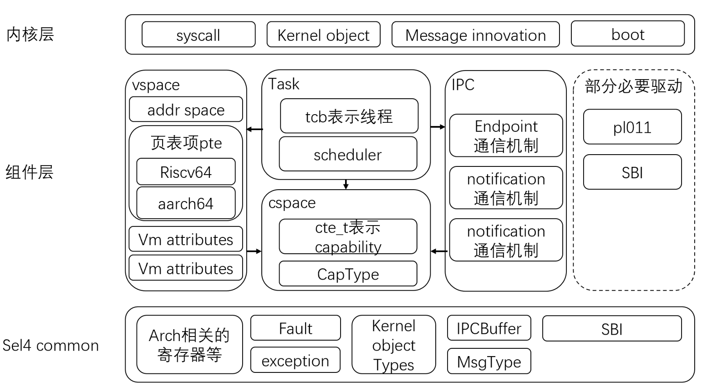
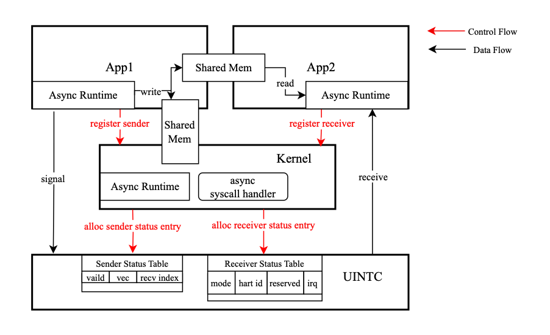
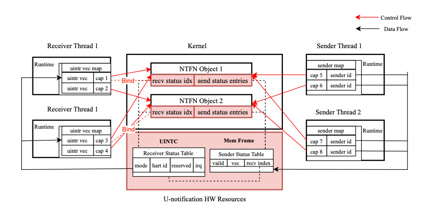

# Rel4 Book调研笔记

原文：[https://rel4team.github.io/zh/docs/about_rel4/introduction/](https://rel4team.github.io/zh/docs/about_rel4/introduction/)

## 简介

Rel4为使用Rust语言改写的Sel4微内核操作系统。分为[最小内核](https://github.com/reL4team2/rel4-integral)和[用户态宏内核](https://github.com/reL4team2/rel4-linux-kit)两部分。目前应该专注于前者。

（其中的cspace通过capability（一种句柄）管理内核对象）

Rel4目前可运行的平台为qemu下的riscv spike和qemu-arm-virt。

Sel4的特点：

- 经过了形式化验证
- 内核最小化（只包含中断控制器、定时器、MMU 相关的一点硬件驱动代码）

## Rel4的IPC

参考内容：

- [sel4内核概述/seL4的IPC](https://rel4team.github.io/zh/docs/reL4kernel/Summarize/summarize/#34-sel4%e7%9a%84ipc)
- [模块划分/ipc](https://rel4team.github.io/zh/docs/architecture/architecture/#ipc)
- [异步微内核设计与实现/背景介绍/seL4 IPC机制](https://rel4team.github.io/zh/docs/async/Background/seL4-IPC%E6%9C%BA%E5%88%B6/)

使用虚拟消息寄存器（固定每个线程内的一段定长内存）进行参数的传递。

系统调用与IPC的关系：所有的系统调用共用同一个系统调用号。不同的系统调用号则用于实现不同的IPC。

Sel4的IPC方式为**slowpath**和**fastpath**两种。详见[此处](https://rel4team.github.io/zh/docs/async/Background/seL4-IPC%E6%9C%BA%E5%88%B6/#2-ipc-framework-in-sel4)。

在这两种IPC方式之上，实现了两种同步原语：endpoint和notification。它们都通过内核对象capability实现。

- [**endpoint**](https://rel4team.github.io/zh/docs/architecture/architecture/#endpoint)：线程可以选择从endpoint上发送或接收消息。如果该endpoint上已有行为相反的线程正在阻塞（例如，发送消息时，endpoint上已有接收消息的线程），则直接进行消息传递。否则，将线程阻塞在其上（阻塞方式）或不发送直接返回（非阻塞方式）。接收与发送同理。支持阻塞或非阻塞的发送或接收。
- [**notification**](https://rel4team.github.io/zh/docs/architecture/architecture/#notification)：与endpoint类似，支持阻塞或非阻塞的接收。不同之处在于：首先，支持异步发送，如果没有接收方正在等待，发送方也可以发送后返回。（如果如此暂存了多条发送消息，则将它们按位或运算。）其次，可以绑定一个tcb（bound_tcb），使得没有等待的消息接收方时，使bound_tcb代表的任务处理消息。传递的信息只支持u32。

Rel4使用notification机制处理中断，使用endpoint机制处理错误。详见[此处](https://rel4team.github.io/zh/docs/async/Background/seL4-IPC%E6%9C%BA%E5%88%B6/#3-%e4%b8%ad%e6%96%ad--%e9%94%99%e8%af%af)。

## ldh的工作

参考：[异步微内核设计与实现](https://rel4team.github.io/zh/docs/async/)

基于[UINTC硬件](https://github.com/U-interrupt/uintr)，通过用户态中断减少IPC通信时陷入内核态的次数，从而提高性能。

其**基于Rel4的notification机制**。因此，也和notification一样只能传递1bit的信息，更大的信息通过共享内存传递。

**注册**：需要通过内核。内核首先会创建notification对象 *（图中的NTFN Object）* ，并使发送方和接收方获取指向该对象的capability *（图中的cap）* 。（目前不知道此处的notification对象有何作用。）内核同时也会维护UINTC中的接收方状态表 *（图中的Receiver Status Table）* 和内存中的发送方状态表 *（图中的Sender Status Table）* ,而这两张表都可以在用户态访问。

**通信**：不需通过内核。发送方通过查找发送方状态表获得接收方索引，并在UINTC的对应位置设置寄存器触发用户态中断。接收方收到用户态中断后，通过中断号（uintr vec）识别发送方。

## ARM上的工作
