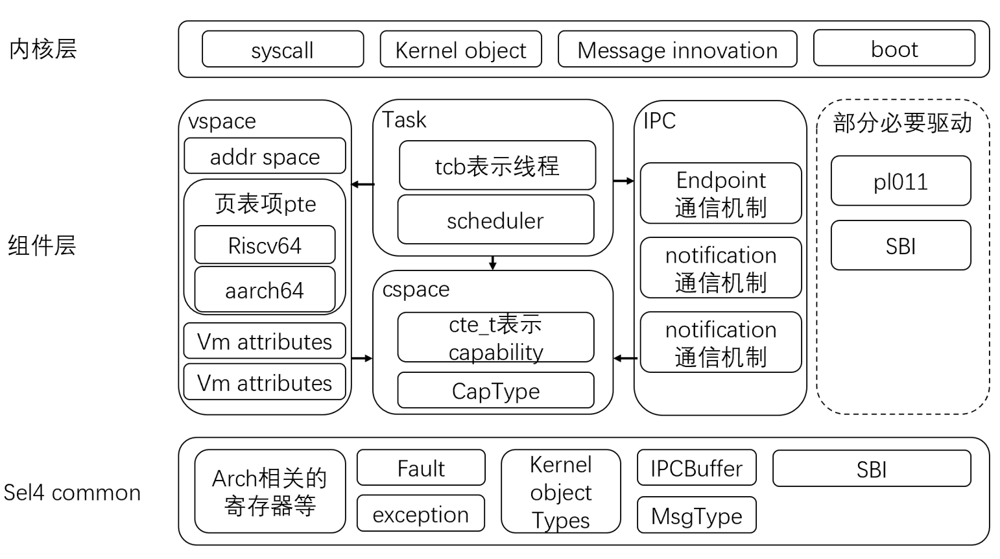
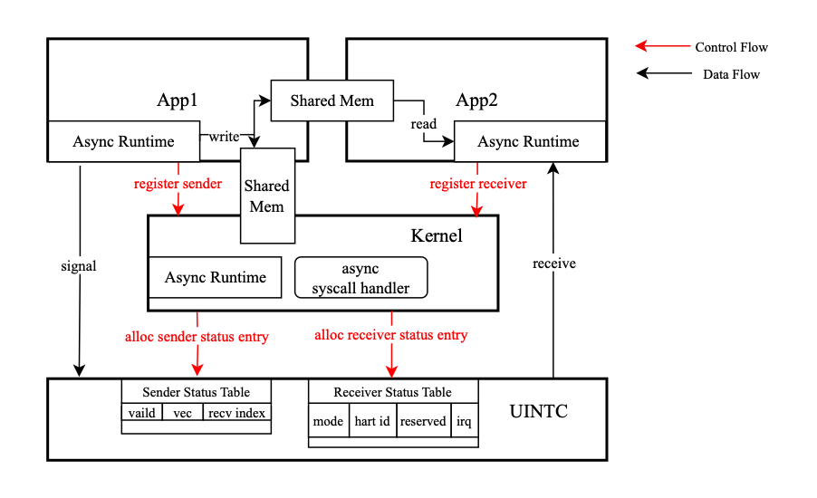
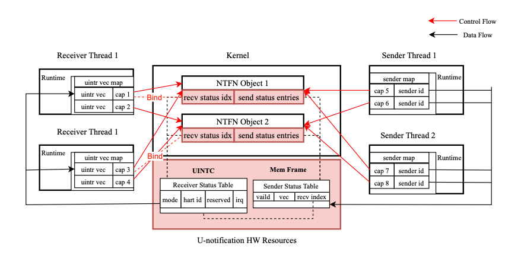
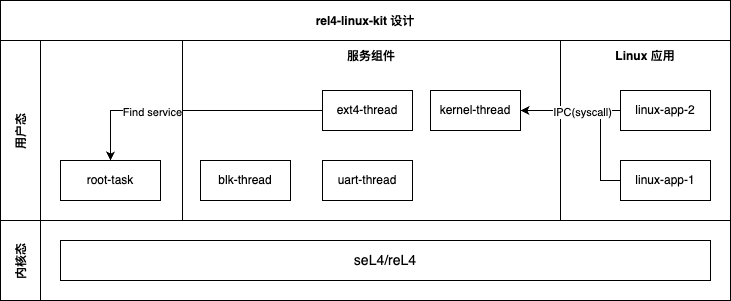

# Rel4 Book调研笔记

原文：[https://rel4team.github.io/zh/docs/about_rel4/introduction/](https://rel4team.github.io/zh/docs/about_rel4/introduction/)

## 简介

Rel4为使用Rust语言改写的Sel4微内核操作系统。分为[最小内核](https://github.com/reL4team2/rel4-integral)和[用户态宏内核](https://github.com/reL4team2/rel4-linux-kit)两部分。目前应该专注于前者。



（其中的cspace通过capability（一种句柄）管理内核对象）

Rel4目前可运行的平台为qemu下的riscv spike和qemu-arm-virt。

Sel4的特点：

- 经过了形式化验证
- 内核最小化（只包含中断控制器、定时器、MMU 相关的一点硬件驱动代码）

## Rel4的IPC

参考内容：

- [sel4内核概述/seL4的IPC](https://rel4team.github.io/zh/docs/reL4kernel/Summarize/summarize/#34-sel4%e7%9a%84ipc)
- [模块划分/ipc](https://rel4team.github.io/zh/docs/architecture/architecture/#ipc)
- [异步微内核设计与实现/背景介绍/seL4 IPC机制](https://rel4team.github.io/zh/docs/async/Background/seL4-IPC%E6%9C%BA%E5%88%B6/)

使用虚拟消息寄存器（固定每个线程内的一段定长内存）进行参数的传递。

系统调用与IPC的关系：所有的系统调用共用同一个系统调用号。不同的系统调用号则用于实现不同的IPC。

Sel4的IPC方式为**slowpath**和**fastpath**两种。详见[此处](https://rel4team.github.io/zh/docs/async/Background/seL4-IPC%E6%9C%BA%E5%88%B6/#2-ipc-framework-in-sel4)。

在这两种IPC方式之上，实现了两种同步原语：endpoint和notification。它们都通过内核对象capability实现。

- [**endpoint**](https://rel4team.github.io/zh/docs/architecture/architecture/#endpoint)：线程可以选择从endpoint上发送或接收消息。如果该endpoint上已有行为相反的线程正在阻塞（例如，发送消息时，endpoint上已有接收消息的线程），则直接进行消息传递。否则，将线程阻塞在其上（阻塞方式）或不发送直接返回（非阻塞方式）。接收与发送同理。支持阻塞或非阻塞的发送或接收。
- [**notification**](https://rel4team.github.io/zh/docs/architecture/architecture/#notification)：与endpoint类似，支持阻塞或非阻塞的接收。不同之处在于：首先，支持异步发送，如果没有接收方正在等待，发送方也可以发送后返回。（如果如此暂存了多条发送消息，则将它们按位或运算。）其次，可以绑定一个tcb（bound_tcb），使得没有等待的消息接收方时，使bound_tcb代表的任务处理消息。传递的信息只支持u32。

Rel4使用notification机制处理中断，使用endpoint机制处理错误。详见[此处](https://rel4team.github.io/zh/docs/async/Background/seL4-IPC%E6%9C%BA%E5%88%B6/#3-%e4%b8%ad%e6%96%ad--%e9%94%99%e8%af%af)。

## ldh的工作

参考：[异步微内核设计与实现](https://rel4team.github.io/zh/docs/async/)



基于[UINTC硬件](https://github.com/U-interrupt/uintr)，通过用户态中断减少IPC通信时陷入内核态的次数，从而提高性能。

其**基于Rel4的notification机制**。因此，也和notification一样只能传递1bit的信息，更大的信息通过共享内存传递。



**注册**：需要通过内核。内核首先会创建notification对象 *（图中的NTFN Object）* ，并使发送方和接收方获取指向该对象的capability *（图中的cap）* 。（目前不知道此处的notification对象有何作用。）内核同时也会维护UINTC中的接收方状态表 *（图中的Receiver Status Table）* 和内存中的发送方状态表 *（图中的Sender Status Table）* ,而这两张表都可以在用户态访问。

**通信**：不需通过内核。发送方通过查找发送方状态表获得接收方索引，并在UINTC的对应位置设置寄存器触发用户态中断。接收方收到用户态中断后，通过中断号（uintr vec）识别发送方。

## ARM上的工作

## 用户态宏内核

参考：[rel4宏内核用户态程序设计](https://rel4team.github.io/zh/docs/monolithic/)

系统架构：



- `root-task`：用户态宏内核的初始任务，用于初始化其它内核模块
- `kernel-thread`：系统调用入口点
- `其它xx-thread`：设备驱动程序

系统调用执行路径：用户程序 -> kernel-thread -> 设备驱动，它们的通信均由IPC实现。

### 宏内核中的任务调度

暂不清楚上述`xx-task`和`xx-thread`是进程、线程还是协程（文档里说用户态宏内核也支持协程），需要进一步调研。

#### Rel4的任务调度

seL4中没有进程和线程的明确区分，并统一以线程作为调度单位。在 seL4中创建一个进程就是让一个TCB拥有全新的资源，创建一个线程就是让一个TCB和另一个TCB共享资源。上述资源指（`CNode`（指用作Capability表项（类似页表项），指向一级Capability表的Capability）、`CSpace`（Capability空间）、`VSpace`（地址空间））。

使用`Rust-sel4`用户库（用于在Rust中编写Sel4程序，也兼容Rel4），创建任务的语句如下：

```Rust
let mut task = Sel4Task::new();

 // 配置任务， TIPS: IPC Buffer 为空，不可用
task.tcb.tcb_configure(
    ep.cptr(),
    root_cnode,
    CNodeCapData::new(0, sel4::WORD_SIZE - 12),
    vspace,
    0,
    Granule::from_bits(0),
 )?;
```

运行任务：`task.tcb.tcb_resume().unwrap()`

停止任务：`task.tcb.tcb_suspend()`

#### 宏内核的任务调度

在`rel4-linux-kit/root-task/src/task.rs`中，定义了`Sel4Task`结构用于实现sel4中定义的TCB。其中的`clone_thread`函数用于创建线程，`build_kernel_thread`函数用于创建进程。它们都是**内核级**的，即对rel4微内核可见。

`root-task`为内核级进程，是rel4启动时创建的第一个用户态线程。

`root-task`会从`TASK_FILE`中读取要创建的任务，并将每一个任务创建为一个内核级进程（使用`build_kernel_thread`函数）。`TASK_FILE`由`rel4-linux-kit/tools/app-parser.py`脚本生成，其会根据命令行输入从`rel4-linux-kit/apps.toml`中选取要运行的任务。这些任务包含了架构图中的所有用户态任务（除了`root-task`）。也就是说，**架构图中的所有用户态任务都作为内核级进程运行。**

在处理系统调用的`rel4-linux-kit/services/kernel-thread/src/main.rs`中，`main`函数在循环中**为每一个系统调用请求创建一个协程来处理。** 该协程运行于用户态宏内核中，对rel4微内核不可见。

在处理用户发起的任务相关系统调用时，`rel4-linux-kit/services/kernel-thread/src/task`模块定义了`Sel4Task`结构体，其`tcb`字段存储了其作为rel4内核级进程和线程所需的信息，`pcb`字段则存储了作为Linux进程所需的额外信息。不过，任务的上下文仍使用了rel4内核级进程/线程的上下文。也就是说，**用户程序通过系统调用创建的用户态线程/进程为内核级线程/进程。**

### 宏内核中的IPC

延迟回复机制：见[sel4 ipc延迟回复机制](https://rel4team.github.io/zh/docs/monolithic/common/irq-saver/)。

系统调用到IPC的转化：在用户程序编译后或加载时，将其中的系统调用指令全部修改为一条错误指令`0xdeadbeef`，使用户程序执行到这条指令时，触发异常，由rel4内核将其转发到用户程序的fault_endpoint，也就是kernel-thread处理。因此，kernel-thread可以从endpoint上接收系统调用请求并处理。

kernel-thread对同步和异步任务的处理：kernel-thread创建了系统调用处理协程后，先运行executor直到没有协程就绪，再进入对endpoint的同步等待。因此，基本上不会出现同步阻塞导致异步任务无法执行的情况（只有一种情况：在同步等待endpoint时，异步任务解除阻塞，此时是否无法立刻执行解除阻塞的异步任务？）
