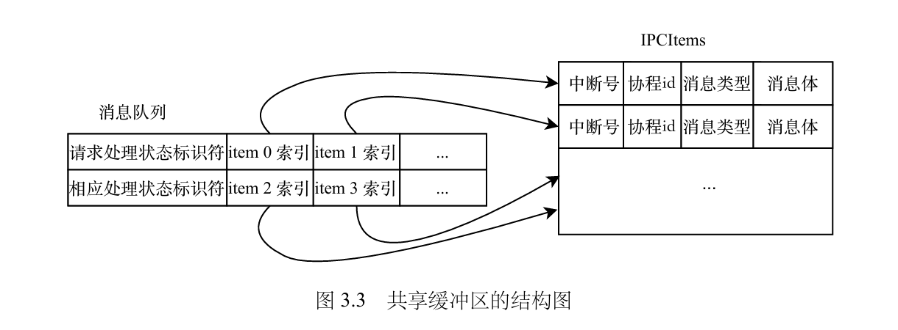
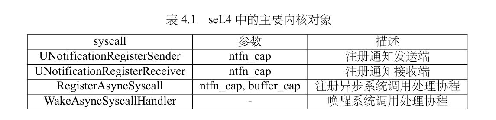

# ldh论文阅读笔记

## 问题与回答

对ldh工作的已有调研见[Rel4 Book调研笔记/ldh的工作](../25.8.14~25.8.20/Rel4%20Book调研笔记.md#ldh的工作)。

在此基础上，仍有需要弄清的问题：

- 用户态中断的处理流程，及其与Sel4原有中断处理的关系。ldh的工作中，申请notification对象的作用。
- endpoint按照文档也有非阻塞的发送接收方式，为何选择notification而非endpoint进行改造？
- 中断模式与轮询模式结合的方式，能如何在此基础上提高性能？

### 用户态中断的处理流程，及其与Sel4原有中断处理的关系。ldh的工作中，申请notification对象的作用

用户态中断的处理机制与S态中断类似，首先注册中断向量，再通过置位`uip.USIE`触发中断。可以将已委托到S态的中断委托到U态，从而将高特权级的中断放在用户态处理。详见[此处](https://blog.kuangjux.top/2021/11/14/RISC-V-N%E6%89%A9%E5%B1%95/)。

硬件UINTC通过用户态中断实现了IPC机制。其维护内存中的发送方状态表和硬件中的接收方状态表，并通过这两张表，将进程的IPC请求转化为特定的用户态核间中断。

在其中，内核Notification对象的作用为：每个Notification对象绑定了一个发送方状态和一个接收方状态，从而管理这两个状态的生命周期。（当通信双方不再需要通信时，释放该Notification对象，也将从两张表上将它们的状态项删除。）

目前来看，用户态中断的处理使用UINTC提供的机制（除了注册阶段外，不需陷入内核），与内核的中断处理机制平行。（需确认）

ldh的工作中，对用户态中断的使用见[此处](../25.8.14~25.8.20/Rel4%20Book调研笔记.md#ldh的工作)描述。

### endpoint按照文档也有非阻塞的发送接收方式，为何选择notification而非endpoint进行改造？

endpoint的非阻塞发送机制是在没有接收方时**不发送**直接返回，意味着需要多次调用直到接收方可用才能发送成功（见[sel4 docs：IPC/Background/System calls](https://docs.sel4.systems/Tutorials/ipc)）。而异步发送机制要求没有接收方时也可以**成功发送**（此时由发送机制进行消息暂存）。因此endpoint不支持异步发送，而notification支持。

而对于接收端，endpoint和notification都支持非阻塞接收（通过poll查询接收状况），很容易改造为异步接收（接收失败时调度另一协程运行，直到接收成功时唤醒原协程）。

### 中断模式与轮询模式结合的方式，能如何在此基础上提高性能？

从论文中可知，ldh已经实现了中断和轮询的自适应模式切换。因此，需要寻找其它创新点。

ldh的论文中实现的也是类似io_uring的机制，具备io_uring的几个优势：

- 真正的异步操作（例如，无需先poll再进行写，可以直接提交异步写操作），适合与协程结合。
- 可扩展性好，可以用于不同类型的IO操作和系统调用。

目前存在的不同就是队列结构上，ldh是每一对通信双方使用一组发送+接收队列，使用的是单生产者单消费者队列；我是每一个进程使用一个接收队列，为多生产者单消费者队列。

## 论文阅读笔记

### 1.2.4 用户态中断与TAIC加速器

UINTC机制：将中断状态管理分为操作系统维护的发送状态表和硬件控制器（UINTC）管理的接收状态表。当触发中断时，硬件通过专用指令自动完成状态查询和处理器间中断传递，最终直接跳转到用户态注册的处理函数执行。

### 2.2.4. （Sel4的）同步IPC和通知机制

Endpoint：同步通知，Notification：异步通知。

区别：

- 同步IPC需要维护完整的调用上下文，而通知机制仅需管理信号位图
- 同步IPC涉及双向数据传输，而通知主要是单向事件指示
- 同步IPC会深度影响调度决策，而通知对系统调度的影响相对有限（同步IPC与线程调度深度结合，因此难以在以协程为调度单位的环境下使用）

对Sel4提供两种IPC机制的评价：展现设计平衡，但违反了最小化原则，增加了内核复杂度。同时，两种通信机制都具有陷入内核的开销。

### 3.1. 通知机制

- 用户态通知用户态：用户态中断
- 内核态通知用户态：用户态中断
- 用户态通知内核态：系统调用和中断（包括采用自适应轮询的异步系统调用）
- 内核态通知内核态：核间中断（不需切换特权级）

### 3.1.1. U-notification

在Rel4阅读笔记中已说明。

### 3.1.2. 自适应的混合轮询

通过实时比较通知到达的间隔时间和单个通知的处理时间，感知当前负载情况，进行模式切换：高负载时进入轮询模式，低负载时进入中断模式。

其中，轮询模式的实现：处理线程持续处于运行状态，通过定期检查共享缓冲区中的状态标志来获取新通知。发送方通过更新共享内存中的状态标志实现隐式通知。

### 3.2. 异步运行时

### 3.2.1. 共享缓冲区

数据结构：单生产者单消费者无锁队列，每一对发送方和接收方配备一组队列。一组队列包括请求和响应两条队列。

队列元素：定长的IPCItem，分为发送者id（中断号）、接收方id（协程id）、消息类型和长度（msginfo）、消息体（extendmsg）。

除了队列以外，每一对发送方和接收方还会维护了对端处理程序的就绪状态标识handler_status，客户端和服务端将根据该标志位来决定是否发送U-notificaiton。

### 3.2.2. 协程与调度器

以协程作为任务执行的基本单元。

分为worker协程和dispatcher协程。worker协程处理任务，而dispatcher协程处理中断信号、唤醒对应的worked协程。若使用TAIC硬件，则dispatcher协程的工作由硬件完成，dispatcher协程作为硬件资源不足时的后备方案。

worker协程负责发起IPC请求，而dispatcher协程则专门处理响应消息。这种分工带来了一个重要的调度权衡问题：从系统吞吐率的角度考虑，应当优先调度worker协程以提升请求处理能力；而从降低延迟的角度出发，则应当优先处理dispatcher协程以加快响应速度。这样的权衡通过设置优先级解决。

### 3.2.3. API兼容层

通过hook拦截用户态系统调用并转化为异步系统调用。

出于兼容考虑，维护notification cap、sender map和uintr vec map。

### 4. Rel4系统实现

### 4.1. 新增系统调用

### 4.2. 异步IPC

原文讲得很清楚，见原文。

### 4.3. 异步系统调用

异步系统调用与异步IPC相似但存在差异：

1. 通知机制无法使用U-notification。

    因此需要系统调用WakeAsyncSyscallHandler。

2. 内核环境具有更复杂的执行上下文.与用户态进程可以专注于处理异步IPC请求不同，内核还需要同时处理硬件中断、异常处理、线程调度等关键任务。

    因此，采用优先级调度策略，维护每个内核任务的动态优先级（内核关键任务>用户态请求>空闲任务）。每次通过系统调用陷入内核时，内核选择低优先级核心并抢占以执行该请求。若没有合适的核心，则延迟到下次时钟中断再处理。

### 4.4. 兼容性讨论

### 4.4.1. Notification 与 U-notification

除了通知处理过程不需陷入内核以外，U-notification与Notification的不同还体现在不支持多接收端。

U-notification不需要poll接口，因为直接由用户态中断实现通知机制。但为了兼容Notification，U-notification也实现了Poll和Wait接口。

### 4.4.2. 同步IPC与异步IPC

异步IPC基本能实现同步IPC的基本功能，但Sel4的同步IPC还具有额外的功能：

- 错误处理：可用U-notification实现。
- 能力派生：不再支持通过IPC来进行能力派生，仅通过系统调用进行能力派生，损失了一部分灵活性，保留了功能的完整性。

### 4.4.3. 同步系统调用与异步系统调用

异步系统调用的发起和处理有可能是多核心且并行的。

两类系统调用无法异步化：

1. 由于异步系统调用依赖于异步运行时，因此与异步运行时初始化相关的系统调
用无法被异步化。
2. 对于实时性要求较高的系统调用无法进行异步化，如get_clock()。
