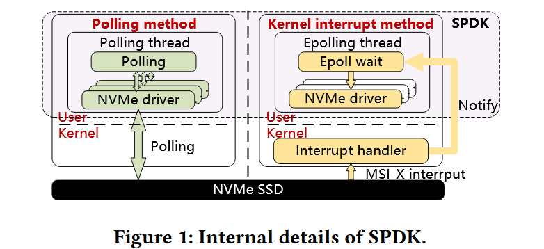
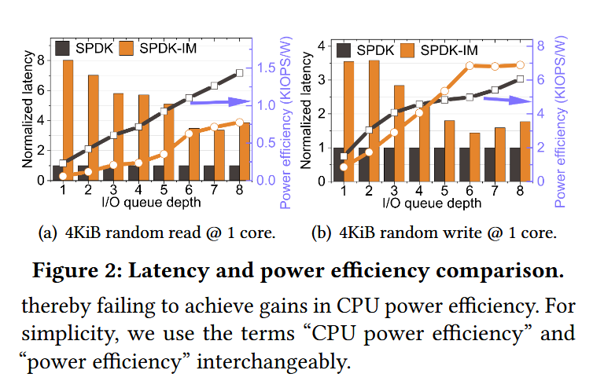
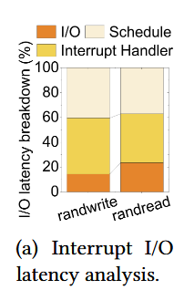
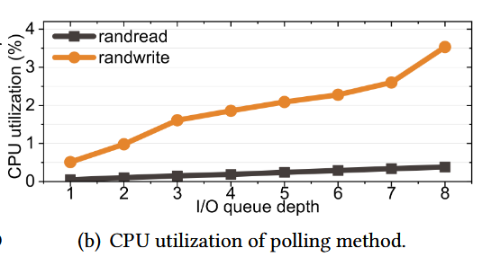
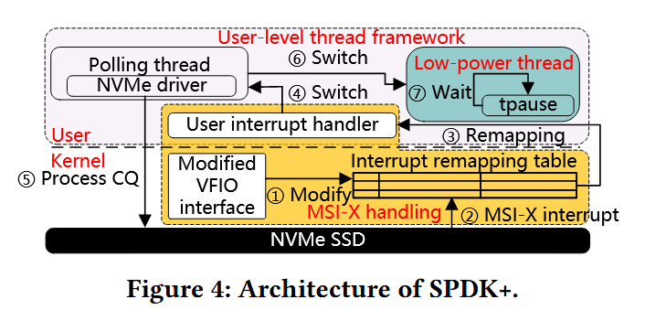
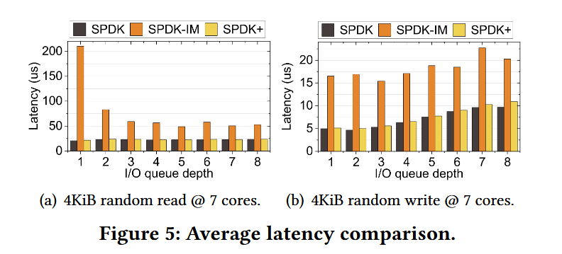
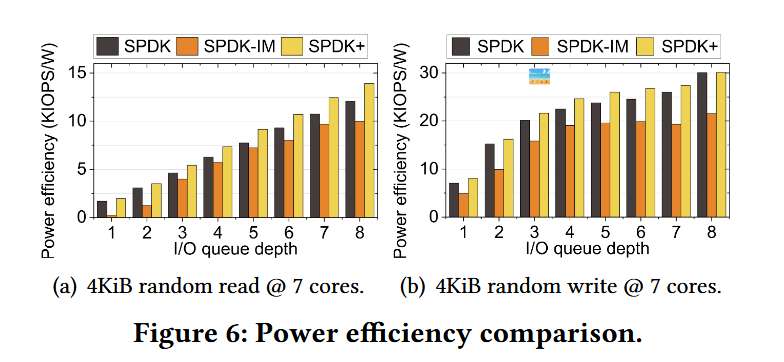
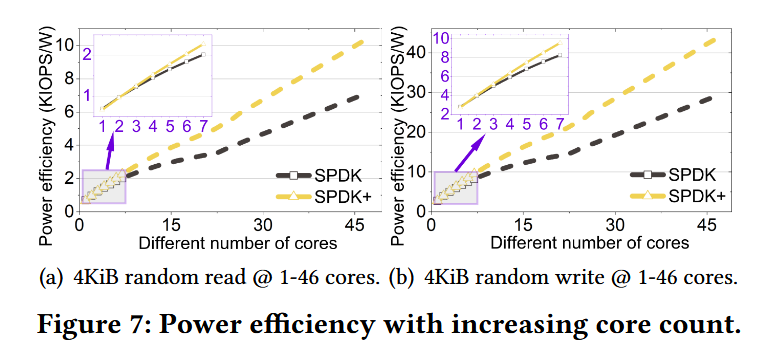

# SPDK+: Low Latency or High Power Efficiency? We Take Both论文阅读笔记

## 我学到的

1. 用户态中断相关知识：用户态中断的注册和处理需要在同一个进程/内核级线程中进行；Intel用户态中断的处理流程。
2. 通过用户态中断实现节能的方式：在同一个内核级线程中设置两个用户级线程：工作线程和空闲线程。
3. 对中断模式和轮询模式的理解：轮询模式可以按轮询周期分为短周期轮询和长周期轮询。短周期轮询基本能做到每次收到一个请求就立刻处理，而长周期轮询则每隔一个较长的间隔接收一批请求批量处理。长周期轮询的等待期间可以让出给其他任务执行。
   1. 时延：短周期轮询 < 中断 < 长周期轮询
   2. 吞吐量：短周期轮询 > 长周期轮询（有线程切换开销） > 中断（有线程切换和中断开销）？
   3. 对共享处理机的支持：短周期轮询弱于另两者
   4. 能效：短周期轮询弱于另两者
   5. 此外，中断模式的开销大多来源于特权级和上下文切换的开销。因此，如果使用了用户态中断，则可以将时延降低到与短周期轮询相近的水平。然而，这也会使其对共享处理机的支持降低到和短周期轮询相似的水平，因为这要求注册了中断处理函数的进程持续运行。

## 摘要

SPDK（I/O存储软件）通过轮询做到了最低的I/O时延。但轮询模式也导致了低负载下CPU资源的浪费。SPDK提供的中断方式也没有改进这个问题。

本文提出了SPDK+，使用用户态中断同时达到了低时延和高能效。其采用用户态中断处理来直接处理来自SSD设备的MSI-X中断，并在IO等待期间利用用户等待指令来节省功耗。

## 1 INTRODUCTION

在存储领域，应用软件有达到低时延的需求，而硬件的发展（如固态硬盘）也能达到这一点。但内核中的存储软件栈因为密集的用户内核上下文切换、基于锁的争用和繁琐的控制路径而导致了巨大的开销。

因此，用户态的存储软件栈（如SPDK）发展起来。但SPDK的轮询模式使其浪费了CPU资源。

而（内核态的）中断方式虽然可以节省CPU资源，但引入了特权级和线程切换开销，导致时延提高了76%。这导致了高能效和低时延无法兼得。

不过，用户态中断的提出使得中断方式的低时延成为可能。在第4代Intel Xeon及以后的处理器中，触发用户态中断时，CPU只会保存`rip`、`rsp`和`rflags`三个寄存器，使中断响应时延降低至2μs。

因此，本文提出了SPDK+，使用用户态中断同时达到了低时延和高能效。通过中断映射机制，将来自SSD设备的MSI-X中断映射成用户态中断，在用户态处理。

原有的节能方式（如睡眠或上下文切换）无法配合用户态机制，因为用户态中断机制要求中断的注册和响应位于同一内核级线程。不过，可以使用Intel提供的新的节能指令（`tpause`、`umonitor`和`umwait`）配合用户态中断。

与 SPDK 相比，SPDK+ 将能效提高了 49.5%，延迟增加可以忽略不计。

## 2 BACKGROUND AND MOTIVATION

SPDK：存储性能开发套件（Storage performance development kit）

SPDK 采用称为 Bdev 的块设备抽象来执行与内核中块设备层相同的功能。SPDK 还实现了用户空间、异步、基于轮询的 NVMe 驱动程序。

SPDK的轮询模式：每个CPU核心一个轮询线程，其在循环中执行多个轮询器（poller）。这些轮询器本质上是执行特定任务的函数，例如检查I/O请求的CQ。

SPDK的内核态中断模式：epoll线程是轮询线程的基于中断的版本，支持阻塞等待中断。

### 2.2 Preliminary Study（预先研究）

**与常识相反，在写操作中，在低 I/O 队列深度下，轮询方法表现出优于中断方法的功率效率。**

SPDK：轮询模式；SPDK-IM：中断模式

性能：柱状图，左侧纵坐标，以时延为标准，越低越好

能效：条形图，右侧纵坐标，以“单位时间处理的I/O任务数 / CPU功率”为标准，越高越好

在低I/O队列深度下，中断模式导致的时延的提升抵消了能效优势（见本文对能效的定义），因此反而比轮询模式能效更高。

中断模式下的时延构成：

**尽管轮询方法在小型I/O方面具有优势，但并未充分利用CPU时钟周期，为能效优化留下了很大的空间。**

在轮询模式下，只有 3.5% 的 CPU 时钟周期被有效利用，剩余的 CPU 周期被浪费在等待中。

即使单个内核同时轮询七个磁盘，每个磁盘的队列深度为 8，也只有 15.17% 的时钟周期被主动利用。

## 3 DESIGN

### 3.1 Key Insights

**Intel用户中断技术简化了传统的内核中断机制，从而有效降低了 I/O 延迟。**

用户态中断技术允许在用户态、不切换地址空间和特权级的情况下处理中断。

用户态中断处理流程：

用户通过x86指令senduipi直接从用户空间向目标内核发送用户中断。在发送用户中断之前，senduipi 在 User Posted-Interrupt Descriptor （UPID） 中设置 Posted-Interrupt Requests （PIR） 字段以指示发送者的身份。然后，目标内核将接收到的中断向量与用户中断通知向量寄存器进行比较。如果匹配，则该过程继续;否则，中断将被视为标准中断。之后，CPU硬件根据PIR设置用户中断请求寄存器。如果 PIR 为空，则硬件将忽略中断。当CPU在用户模式下执行时，会触发用户中断。多个寄存器（包括 rsp 和 rip）被保存到堆栈中，并将控制权移交给用户中断处理程序。最后，处理程序将执行 UIRET 指令以恢复正常执行。

**Intel用户等待指令可在用户空间内降低 CPU 功耗。**

用户态中断可用于以微秒级的时间间隔等待时间。在此情况下，基于内核的等待机制因时延太高而无法使用。

为了解决这个问题，Intel引入了一组新的低功耗指令（例如 umonitor、umwait 和 tpause），允许以更小的 CPU 功率进行高效等待。

umonitor 和 umwait 提供了一种机制来暂停 CPU 执行，直到写入作访问指定地址的数据。

tpause 使当前线程能够休眠指定的时间（最多 100 us）。

### 3.2 Overview

SPDK+修改了现有的用户中断机制，接管了处理SSD设备发送的MSI-X中断的角色。

它还利用Intel等待指令创建低功耗线程，从而在 I/O 完成期间实现省电。

### 3.3 Design Details of SPDK+

**MSI-X 中断处理**：先将 MSI-X 中断路由到与用户中断相对应的中断向量，再准备触发用户中断的先决条件。前者是通过修改VFIO模块来实现的，该模块将MSI-X中断的中断重映射表条目设置为用户中断向量（图中①）。后者要求 PIR 不应为空，因此SPDK+ 在用户中断处理程序注册期间和中断处理过程之后主动执行 senduipi 指令以填充 PIR。通过设置Suppress Notification（SN）为1， senduipi 指令不会发送真正的中断，因此不会引入过多开销。

**用户级线程切换和省电**：用户中断机制无法使核心进入睡眠状态或切换到其他用户进程，因为用户中断必须在定义了用户中断处理程序的线程上处理 *（这里的线程指内核级线程）* 。为了解决这个问题，我们建议将 CPU 内核切换到低功耗线程而非其他用户进程 *（这里的线程指用户级线程）* ，这不仅减少了对 SPDK 的入侵，还增加了进一步优化的可能性。中断到达时，表示需要 I/O 处理，中断处理程序直接调用线程切换函数以切换回轮询线程进行进一步处理。

我们的实现中没有采用 umwait，因为它需要对 SPDK 的较低层进行侵入性修改，以监控完成队列中的更改，从而损害 SPDK 架构设计的完整性。

## 4 EVALUATION

将本文的SPDK+与SPDK（轮询模式）、SPDK-IM（内核级中断模式）比较。

### 4.2 Overall Comparison

**时延**：

低时延的原因：与SPDK一样，SPDK+ 进程始终在前台运行。

**能效**：

（与上文相同，能效越高越好）

SPDK+ 在所有场景下都能实现最佳能效。具体来说，它在随机读取方面比 SPDK 高出 14.6% ∼ 18.2%，在随机写入方面比 SPDK 高出 0.1% ∼ 13.6%。

（为什么使用中断模式的SPDK-IM能效比轮询模式的SPDK更低？）

### 4.3 Sensitivity Study（敏感性研究）

研究核心数对SPDK和SPDK+的能效的影响。（每个核心管理一个 SSD，每个 SSD 都有一个队列对，每个队列配置为 1 的深度）

其中，1~7核心数为实际测量得出，更多核心的能效是根据 8∼46 个 SSD 的理论性能 （IOPS） 和 8∼46 个 CPU 内核的实测功耗得出的。

结论：SPDK+的能效优势随着核心数增加而增大。

## 5 CONCLUSION

在本文中，我们提出了SPDK+，它通过UINTR增强SPDK，以实现低延迟和高能效。

**未来工作**：

- SPDK全栈优化，例如优化用户级线程调度器、优化I/O路径。
- 将SPDK与混合轮询机制结合，在用户态实现混合轮询机制。
