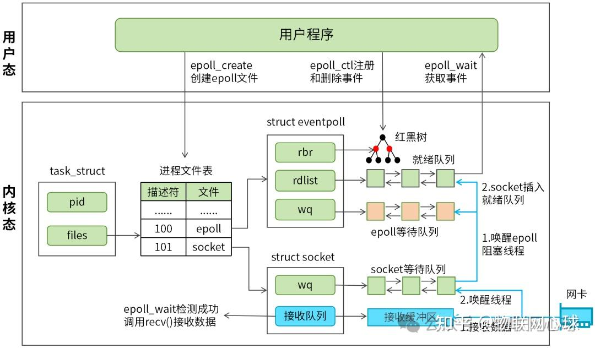

# tokio和io_uring阅读笔记

原文：[io-uring 与 Tokio 的华丽合体：Rust 异步 IO 的零拷贝革命](https://mp.weixin.qq.com/s/FHaJ6_7alzLRezLhFBctgw?click_id=1)

## 原文阅读

原文所述，不是tokio官方提供了对io_uring的支持，而是自己实现的使用tokio和io_uring的异步I/O方式。

而文中提供的两个示例代码均有不足，分析如下：

### 示例代码1

该代码使用io_uring实现了`IouringReader`类型，并为其实现了tokio中的`AsyncRead` trait。

然而，`AsyncRead`中的`poll_read`接口在返回`Pending`时需要实现相应的协程唤醒机制，而本示例中的代码并未实现该唤醒机制。

因此，该示例代码中实现的`IouringReader`也无法直接在tokio运行时中使用。在该示例代码中，是通过在循环中不断调用`poll_read`来使用`IouringReader`的。

同时，该代码读取的内容会先存放在`IouringReader`的内部缓冲区中，之后再拷贝到调用者的缓冲区中。如此就没有达到文中宣称的零拷贝优势。

### 示例代码2

该代码在主协程提交SQE后，并创建了另一个blocking task（可以理解为，在另一个线程中创建了一个协程）不断轮询CQ获取结果。

该设计与ldh的设计类似，通过一个独立的任务（dispatcher）轮询CQ，获取结果并唤醒工作协程。

## tokio中实现`AsyncRead`的示例

tokio中的`File`实现了`AsyncRead`。`File`的内部状态如下：

```Rust
enum State {
    Idle(Option<Buf>),
    Busy(JoinHandle<(Operation, Buf)>),
}
```

在`Idle`状态下，其内部缓冲区已有读到的内容，直接拷贝到调用者缓冲区中再返回即可。

在`Busy`状态下，其会对`JoinHandle`调用`poll`，等待读操作的完成。（`JoinHandle`指向的任务在内部缓冲区被读完时创建，读取更多内容到内部缓冲区中）

## tokio与io_uring的整合情况

目前，tokio方也在进行整合io_uring的工作：

- [tokio_uring](https://github.com/tokio-rs/tokio-uring.git)库，为tokio运行时提供了io_uring支持。
- [【Rust日报】2025-05-27 tokio 准备将 io-uring 用于文件 IO](https://rustcc.cn/article?id=02a654fc-b6c1-4906-8942-5180e5bd8d73&current_page=1)

仍需进一步调研：tokio_uring的内部实现；io_uring与tokio的整合情况。

### 简介

提案准备将io_uring引入tokio主线中，并使用基于io_uring的文件I/O替换原本基于线程池的文件I/O（通过创建工作线程执行I/O系统调用，并使原线程返回来实现异步）。其可以减少陷入内核次数和线程创建次数，从而提升性能。

已有工作：tokio_uring库。本提案将复用该库中的`Operation Future`代码。但整合到tokio中的代码与tokio_uring库的不同在于：

- 整合到tokio中的代码只有文件I/O，而tokio_uring支持基于io_uring的文件I/O和网络I/O。
- 整合到tokio中的代码（暂时）创建多线程共享的uring对象（可能在未来开发中修改），而tokio_uring创建线程本地（thread-local）的uring对象。
- tokio_uring支持一些高级功能，例如kernel-registered buffers。

本提案仅对io_uring和文件I/O提供最基础的支持。一些高级功能（registered fds、registered buffers）在后续提案中再支持。

目前（2025.10.10）进度：在tokio中添加了io_uring的基础设施；支持`fs::OpenOptions`操作。[见此处](https://github.com/tokio-rs/tokio/issues/7266)

### io_uring与epoll

#### epoll简介

[Linux epoll完全图解，彻底搞懂epoll机制](https://zhuanlan.zhihu.com/p/17856755436)

用户API（均为系统调用）：

- `epoll_create`：在内核创建`struct eventpoll`对象，同时会返回该对象的文件描述符给用户。
- `epoll_ctl`：添加，修改，删除socket事件。epoll只监听已添加的事件。
- `epoll_wait`：若有就绪事件，则直接返回就绪事件。否则，阻塞等待直到就绪事件到来。

内核实现：



#### io_uring与epoll

提案中说，io_uring的文件描述符可被epoll监听。

io_uring（`io_uring_enter`）与epoll（`epoll_wait`）的通知方式均为使一个内核级线程陷入内核并阻塞，在特定事件到来时唤醒。

此处选用epoll监听io_uring的原因，可能是与使用epoll的tokio网络驱动兼容。此外，epoll监听io_uring也可以用于同时监听多个io_uring实例的情景。

### io_uring的高级功能

FD注册和缓冲区注册。

`io_uring_register`：将FD、缓冲区等实例注册到内核、允许内核长时间管理它们。这样，当io_uring操作需要使用这些实例时，就可以减少一些检查、创建、删除的过程。

见[此处](https://www.cnblogs.com/crazymakercircle/p/17149644.html)的“io_uring_register”章节。
