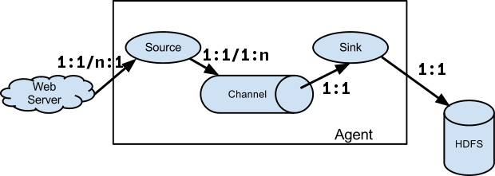

# Flume学习笔记

## 我学到的

通过事件驱动的`source`类型，可以不需要创建额外的`source`线程，而是复用`web server`的线程，通过调用`source`的回调函数，把信息写入`channel`。

不过，我的IPC情景中，原本就没有单独的`source`任务，原本就有工作线程直接将消息写入队列中。因此，这里的设计对我帮助不大。

## 简介

Apache Flume 是一个分布式、高可靠、高可用的用来收集、聚合、转移不同来源的大量日志数据到中央数据仓库的工具。

## 数据流模型

每个 **`agent`** 为一个Flume实例，对应一个JVM进程。`agent`包含`source`、`channel`和`sink`， **`source`** 把消息（消息的基本单位为 **`event`** ）从输入端放入`channel`， **`sink`** 把消息从channel放入输出端， **`channel`** 起到消息缓冲区的作用。

`source`可以接收多个消息源。`source`可以把消息复制或分配到多个`channel`。（采用特定协议的）`sink`可以连接到下级`agent`的`source`，形成复杂的拓扑结构。

`source`和`sink`及其代表的消息源可以视为对`channel`的生产者和消费者，与我的研究场景类似。因此需要进一步研究这些模块与JVM任务的关系。

## Java任务模型

进程：每个Java进程对应一个操作系统进程，也对应一个JVM实例。

线程（`Thread`类）：每个JVM实例中可以执行多个线程。线程可通过继承`Thread`类或实现`Runnable`接口来创建。

`ExecutorService`：可以以线程为执行环境，运行继承了`Runnable`或`Callable`接口的类。其中，`Callable`接口的类运行后可以得到`Future<T>`的返回值，对其调用`get`可以获知其结果。类似Rust中的协程。

## source和sink与Java任务的关系

通过[`SourceRunner`](https://github.com/apache/logging-flume/blob/trunk/flume-ng-core/src/main/java/org/apache/flume/SourceRunner.java#L31)驱动`source`。根据`source`的类型，`SourceRunner`分为两种，可轮询的（`PollableSourceRunner`），以及事件驱动的（`EventDrivenSourceRunner`）。`PollableSourceRunner`直接创建一个线程来轮询`source`。`EventDrivenSourceRunner`则不创建额外的线程，而是将`getChannelProcessor().processEvent()`或`getChannelProcessor().processEventBatch()`（将`event`加入`channel`的操作）作为回调函数传入`Source`中，使`Source`在处理流程中调用。

通过[`SinkRunner`](https://github.com/apache/logging-flume/blob/ff739dbe659ec5fa3fa92dcf2e4339c115673e7c/flume-ng-core/src/main/java/org/apache/flume/SinkRunner.java)驱动所有的`sink`。其内部使用`PollingRunner`，创建线程来轮询这些`sink`。
