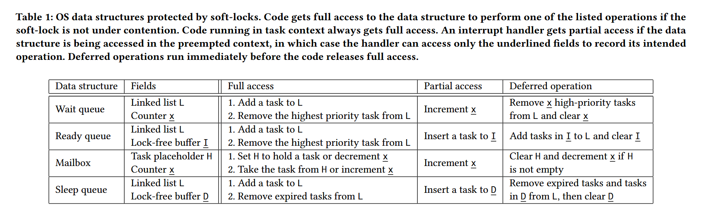

# Softlock算法阅读笔记

论文：[Hopter: a Safe, Robust, and Responsive Embedded Operating System](https://doi.org/10.1145/3711875.3729149)，我仅阅读其中的Softlock算法部分。

## 简介

不需要关中断的锁算法。

申请锁时，若没有冲突，则可直接访问被锁保护的内容。若有冲突，则记录下需要对被锁保护的内容进行的操作，由占用锁的任务在释放锁时完成。

## 详细理解

[hopter/src/sync/soft_lock.rs](https://github.com/hopter-project/hopter/blob/6d8b6f635c495c20914431f7bdc4ee1b0e9da375/src/sync/soft_lock.rs)

被`SoftLock`保护的数据结构需要实现`AllowPendOp` `trait`，其规定了`FullAccessor`和`PendOnlyAccessor`两种类型，且`FullAccessor`需要实现`run_pended_op`方法。

对Softlock的访问，若无冲突，则可获得访问全部字段的`FullAccessor`类型。若有冲突，则获得仅可访问部分（无锁）字段的`PendOnlyAccessor`。在冲突的情况下，对无锁字段的部分访问的目的是为了将操作暂时记录（例如，push进一个无锁操作队列）。

当`PendOnlyAccessor`结束访问时，会将`SoftLock`的`pending`字段设为`true`，从而提示有挂起的操作需要处理。当`FullAccessor`结束访问时，会检查`pending`字段，若为`true`，则执行`run_pended_op`方法，将挂起的操作完成。

此外，文章提到，从任务上下文中获取的`SoftLock`一定为`FullAccessor`，只有从中断上下文中获取的`SoftLock`可能为`PendOnlyAccessor`。

## 使用案例

从使用案例中可以看出，SoftLock可以应用于就绪队列、阻塞队列等与任务调度联系紧密的环节中。

其`partial access`操作有两种情况：一种是加入（无锁）队列（如就绪队列），一种是增加计数器（如阻塞队列）。

对于加入队列的情况，实际上形成了二级队列，其中第一级为有锁，第二级为无锁。而我的实现中直接使用了无锁队列，反而更加简便。

对于增加计数器的情况，`partial access`和`deferred operation`操作都较简便，因此可以作为一个较好的实现无锁阻塞队列的方案。
