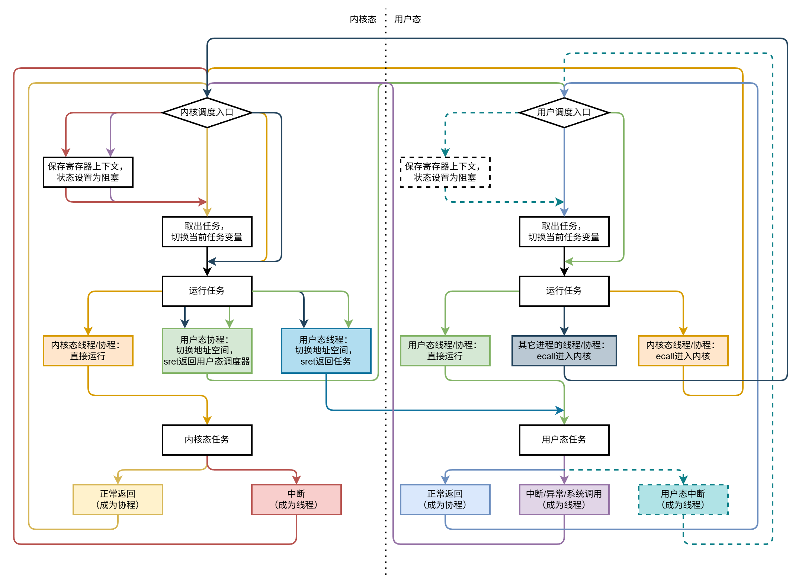
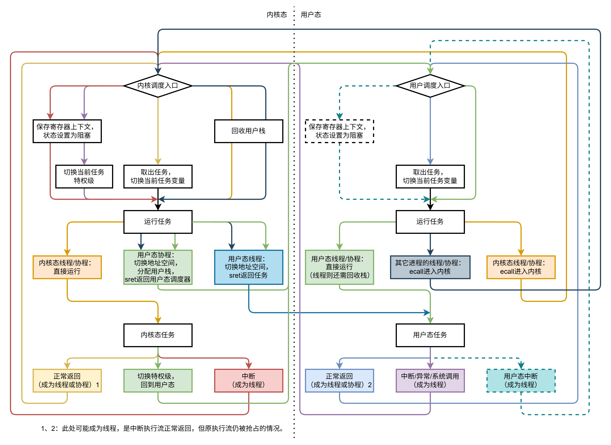
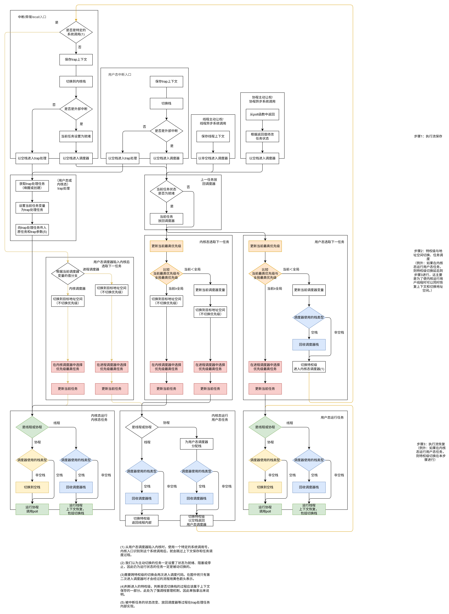
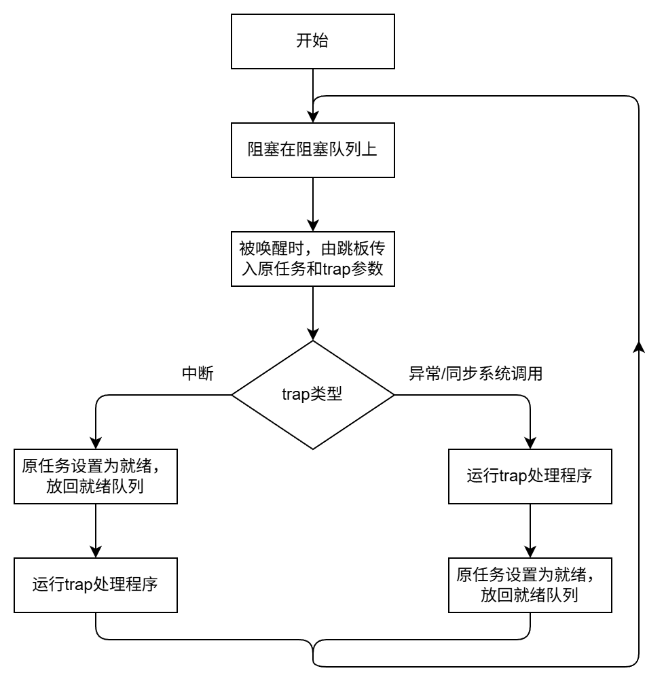

# 调度器模块重构思路

## 目的

当前的下一个目标为使调度器模块支持进程调度。但为了做到这步，就需要操作系统的支持。为了降低其移植到多个操作系统（reL4、ArceOS）上的难度，就需要同时优化其接口（包括设计接口的进程调度部分）。

## 目标

- 支持进程调度
- 降低跨平台移植难度，为我移植到reL4上，以及xjj移植到ArceOS上提供方案。

## 思路

### 调度器的复用

直接使用`schduler`库这样的接口即可。

### 任务切换框架的复用

#### 任务切换模型

<!-- trap前后的执行流视为不同任务的情况：



trap前后的执行流视为同一任务的情况：

 -->

trap前后的执行流视为不同任务的情况：



调度器中的代码在各个地址空间中共享（类似跳板页），因此进程切换只需要进入内核->切换地址空间->返回用户态，省略了内核态任务切换的步骤。

文字版切换流程：

（以下的“陷入内核”均为进入内核调度入口，“返回用户态调度器”均为进入用户调度入口）

- **调度大循环**：调度器取出任务 -> 调度器运行任务（包括上下文恢复） -> 任务返回调度器（包括上下文保存） -> 调度器取出任务 -> ……
  - **调度器运行任务**：
    - 用户态运行相同进程的线程：回收调度器栈 -> 恢复寄存器上下文（包括切换栈）
    - 用户态运行相同进程的协程：调用`poll`函数
    - 用户态运行不同进程的线程：回收调度器栈 -> 陷入内核 -> 切换进程上下文 -> 恢复寄存器上下文（包括切换栈和返回用户态）
    - 用户态运行不同进程的协程：回收调度器栈 -> 陷入内核 -> 切换进程上下文 -> 分配调度器栈（这里必须回收再分配的原因是老栈和新栈位于不同的地址空间中） -> 返回用户态调度器（包括切换栈、恢复上下文和返回用户态） -> 调用`poll`函数
    - 用户态运行内核线程：不会出现此情况。内核线程仅在内核执行流被中断时出现，而该核心只有在执行完中断处理任务、返回内核线程并执行完成、返回内核态调度器后才会再次执行用户态任务。否则，就会在内核栈非空的情况下返回用户态。
    - 用户态运行内核协程：回收调度器栈 -> 陷入内核 -> 调用`poll`函数
    - 内核态运行用户线程：切换进程上下文 -> 恢复寄存器上下文（包括切换栈和返回用户态）
    - 内核态运行用户协程：切换进程上下文 -> 分配调度器栈 -> 返回用户态调度器（包括切换栈、恢复上下文和返回用户态） -> 调用`poll`函数
  - **任务返回调度器**
    - 用户态线程程返回内核调度器（中断/异常/系统调用）：陷入内核 -> 保存寄存器上下文（包括用户栈）
    - 用户态线程程返回用户调度器（用户态中断）：陷入用户态中断入口（即调度入口） -> 保存寄存器上下文（包括用户栈）
    - 用户态线程程返回用户调度器（通过线程式接口正常返回）：切换到静态保存的用户态调度器上下文（包括分配栈） -> 保存寄存器上下文（包括用户栈）
    - 用户态协程返回用户调度器：从`poll`函数返回（包括上下文保存）
    - 内核态线程返回内核调度器（中断）：陷入内核态中断入口（即调度入口） -> 保存寄存器上下文（包括内核栈，但该内核栈同时也会被中断处理任务复用）
    - 内核态线程程返回内核调度器（通过线程式接口正常返回）：切换到静态保存的内核态调度器上下文（包括分配栈） -> 保存寄存器上下文（包括内核栈）
    - 内核态协程返回内核调度器：从`poll`函数返回（包括上下文保存）

该模型的优势：

1. 同进程的协程切换可以在用户态进行（zfl已实现）
2. 同进程的线程切换可以在用户态进行（有前提条件）
3. 跨进程的切换省略了内核任务切换的步骤
4. 在从用户调度器陷入内核的情况，不需保存用户态上下文（因为已经静态保存了进入用户调度入口的用户态上下文）。
5. 在不使用硬件的情况下统一中断优先级和任务调度优先级，避免优先级倒置现象。（但仍需要CPU响应中断，造成地址空间切换的开销）

#### 栈的分配和复用

栈的使用情况：

- 线程在运行时需要栈，保存的上下文包括栈。
- 协程在运行时需要栈，保存的上下文不包括栈。
- 第一次进入用户进程时，会进入调度器代码。此时需要为其分配一个栈。
- 调度器复用前一个任务的栈。在运行后一个任务时，视情况进行栈的切换和回收。

栈的分配、传递和回收时机：

- 第一次进入某个地址空间的调度入口前，需要为调度入口分配一个栈。
  - 内核启动时，为每个核心初始化内核栈。
  - 从内核返回用户态调度器时，为用户态调度器上下文分配一个用户栈
- 某个核心上，从内核态进入用户态时：此时运行代码处于调度器中而非某个任务中，因此不需额外保存上下文（内核态任务的上下文此时已经保存好了）
  - 将内核栈指针传入`sscratch`寄存器中，在该核心下次进入内核时复用该栈。、
  - 如果用户态任务为线程，则其已经持有一个栈作为上下文的一部分，在用户态使用该栈即可。
  - 如果用户态任务为协程，则返回的是用户态调度器的上下文。此时，为其分配一个栈。用户态进程的栈可以使用以进程为单位的栈池来维护，从而使被回收的栈也可复用。
- 从用户态任务内部进入内核态时：该任务会成为线程。
  - 此时的用户栈成为该任务上下文的一部分。
  - 进入内核时，使用当前核心的`sscratch`寄存器存储的内核栈。
- 从用户态调度器进入内核态时：上一任务成为协程且已保存好了无栈的上下文。
  - 不需保存调度器的上下文。调度器之前使用的栈若是空栈，则可以回收。
  - 进入内核时，使用当前核心的`sscratch`寄存器存储的内核栈。
- 从相同特权级的任务进入调度器
  - 从协程进入：即为从poll函数返回，调度器和协程使用同一个栈，且调度器使用的是空栈。
  - 从线程进入；线程保存上下文后，通过函数调用进入调度器。调度器和线程使用同一个栈，且调度器使用的是非空栈。
- 调度器运行相同特权级的任务
  - 运行协程，直接复用调度器的栈
  - 运行线程：切换到线程的栈。调度器之前使用的栈若是空栈，则可以回收。

用户栈的管理：每个进程配备一个栈池，从内核态进入调度器上下文时分配栈，在用户态调度器中运行同进程的线程时回收调度器的栈。

内核栈的管理：系统启动时为每个核心分配一个内核栈。然而，如果需要支持内核任务进行线程式的主动让出/阻塞，则需要在内核态也设置栈池。（仅仅支持内核态中断则不需要，因为中断可以复用原本的内核栈，处理完成后立刻返回原任务。但线程切换则无法复用内核栈。）

#### 调度入口的分支和上下文保存如何实现？

调度入口的分支可以使用多个判断语句实现。

trap进入内核时，`pc`修改为内核入口的值，原有的`pc`转存至`sepc`中；`sp`仍指向用户栈（可以通过后续操作将其与指向内核栈的`sscratch`互换）。因此，刚进入调度入口时，除`pc`以外的寄存器均有可能保存着上下文，无法随意使用。

因此，在调度入口不进行太复杂的判断。调度入口的分支可以使用多个判断语句实现，进入调度入口时，仅进行“是否需要保存上下文”的判断。之后的判断在保存上下文后进行，因此可以正常使用寄存器。

需要保存上下文的情景：发生中断/异常/系统调用时（但从用户态调度器进入内核时不需要）；线程让出并进入调度入口时？

不需保存上下文的情景：协程返回时；从用户态调度器进入内核时。其中，通过把入口与上下文保存部分放在调度循环之外，可以分离出协程返回的情况，使只有在特权级切换时需要进入调度入口。因此，所有进入调度入口的场景中，只有从用户态调度器进入内核时不需保存上下文。可以为这种情况分配一个特定的系统调用号。

因此，对“是否需要保存上下文”的判断，可通过以下方式：判断`scause`是否为系统调用，且保存系统调用号的寄存器是否为特定的系统调用号。若是，则不需保存上下文，否则需要保存上下文。

对于线程让出的情况：可以使用另一个函数保存上下文（因为线程上下文和trap上下文不同），之后不进入调度入口，而是直接跳到上下文保存之后的任务调度部分。

#### 切换次数分析

比较原本情况与当前情况的任务切换中，各项操作（上下文保存，上下文恢复，进出内核，地址空间切换）的次数。用加粗标注了当前情况下有性能优势的操作。

<!-- 增加与AsyncOS的比较？ -->

|情况|传统任务模型|AsyncOS|当前设计|
|-|-|-|-|
|用户线程进入内核|1次上下文保存，1次进内核|1次上下文保存，1次进内核|1次上下文保存，1次进内核|
|**用户协程进入内核**|2次上下文保存（在用户态保存协程上下文；在内核态保存trap上下文），1次进内核|2次上下文保存（在用户态保存协程上下文；在内核态保存trap上下文），1次进内核|**1次上下文保存，1次进内核**|
|内核返回用户线程|1次上下文恢复，1次出内核|1次上下文恢复，1次出内核|1次上下文恢复，1次出内核|
|内核返回用户协程|2次上下文恢复，1次出内核|2次上下文恢复，1次出内核|2次上下文恢复，1次出内核|
|内核态线程/协程切换|1次上下文保存，1次上下文恢复|1次上下文保存，1次上下文恢复|1次上下文保存，1次上下文恢复|
|内核态进程切换|1次上下文保存，1次上下文恢复，1次地址空间切换|1次地址空间切换|1次地址空间切换|
|**同进程线程切换**|2次上下文保存，2次上下文恢复，1次进内核，1次出内核（用户线程进入内核+内核态线程切换+内核返回用户线程）|2次上下文保存，2次上下文恢复，1次进内核，1次出内核（用户线程进入内核+运行新进程的内核执行流+内核返回用户线程）|**1次上下文保存，1次上下文恢复**|
|同进程协程切换|1次上下文保存，1次上下文恢复|1次上下文保存，1次上下文恢复|1次上下文保存，1次上下文恢复|
|**跨进程线程切换**|2次上下文保存，2次上下文恢复，1次进内核，1次出内核，1次地址空间切换（用户线程进入内核+内核态进程切换+内核返回用户线程）|2次上下文保存，2次上下文恢复，1次进内核，1次出内核，1次地址空间切换（用户线程进入内核+内核态进程切换+运行新进程的内核执行流+内核返回用户线程）|**1次上下文保存，1次上下文恢复，1次进内核，1次出内核，1次地址空间切换（用户线程进入内核+内核态进程切换+内核返回用户线程）**|
|**跨进程协程切换**|3次上下文保存，3次上下文恢复，1次进内核，1次出内核，1次地址空间切换（用户协程进入内核+内核态进程切换+内核返回用户协程）|2次上下文保存，3次上下文恢复，1次进内核，1次出内核，1次地址空间切换（用户协程进入内核+内核态进程切换+运行新进程的内核执行流+内核返回用户协程）|**1次上下文保存，2次上下文恢复，1次进内核，1次出内核，1次地址空间切换（用户协程进入内核+内核态进程切换+内核返回用户协程）**|

#### 接口

- 任务的描述：
  - 获取任务的进程、特权级、执行流，用于在进入调度入口时以及运行任务时选择路径
  - 切换任务状态：运行，就绪，阻塞。
- 任务的切换：
  - 进程切换：`switch_process`，只会在内核态调用，用于切换地址空间等进程持有的资源。对应图中“内核调度器运行用户线程/协程”的切换地址空间步骤。
  - 特权级切换：
    - `into_kernel`和`into_user`，切换到内核/用户态并进入内核/用户态的调度入口，对应图中“内核调度器运行用户态协程、用户调度器运行内核态线程/协程、用户调度器运行其它进程的线程/协程”路径。
    - `into_user_context`：切换到用户态的寄存器上下文，对应图中的“内核调度器运行用户态线程”路径。
  - 上下文切换：
    - `poll`：从协程上下文恢复，一定在与上下文相同的特权级中调用。
    - `save_context`：保存寄存器上下文，不一定在与上下文相同的特权级中调用，可能在内核态保存用户态的寄存器上下文。
    - `restore_context`：从寄存器上下文恢复，一定在与上下文相同的特权级中调用。
- 任务调度（这部分接口由任务调度模块提供，任务切换模块使用）
  - 获取当前任务
  - 将任务放入就绪队列
  - 从调度器中获取下一任务，并用其更新当前任务字段
- trap处理
  - 覆盖操作系统“从进入内核，到保存好上下文传入系统调用处理函数”的过程，实现上下文的按需保存。

内核调度器不属于某个内核任务的上下文，用户调度器也是如此，类似Executor和Future的关系。如果将用户态执行流与内核态执行流看作两个不同任务，则中断/系统调用被实现为上一任务被抢占/阻塞，切换到内核态运行下一任务；如果将用户态执行流与内核态执行流看作同一任务，则中断/系统调用被实现为当前任务不变，但改变当前任务的特权级，并从用户态执行流切换到内核态执行流（类似AsyncOS）。

<!-- ```Rust
trait Task<Process: Eq> {
    /// 获取任务上下文信息
    fn get_process(&self) -> Process;
    fn is_kernel(&self) -> bool;
    fn is_coroutine(&self) -> bool;
    /// 保存任务上下文
    fn save_reg_context(&self); // 该函数执行后，再对其调用`is_coroutin`应返回`false`。
}
``` -->

**如上的设计对比AsyncOS已有的设计能体现出优势。但是，如上的设计会遇到以下这些问题，如果无法解决，则无法实现如上提到的优势。**

#### 对调度器与中断、系统调用关系的讨论

若调度器修改了中断/系统调用的入口，则其也需要承担处理原有的中断/系统调用的功能。此时，可以做到任务调度与中断处理的统一，避免优先级倒置问题。（中断到来时，生成中断处理任务并加入调度器，再比较调度器取出的任务与当前任务的优先级，决定是否抢占。）然而，作为一个可移植的调度模块，牵涉到中断和系统调用的处理会使其接口更加复杂，将调度器移植进系统需要对系统进行的修改增多，降低可移植性。

作为替代方案，可以使调度器不承担全部的中断处理，而是通过注册一个中断向量的形式（可以通过`linkme` crate实现中断向量的注册），仅对于特定的中断/系统调用的处理会进入调度器。但这样就无法修改进入内核态之后的处理流程，每次进入内核态都会保存用户态上下文，进而无法实现上文中的优势4和5。

#### 用户态寄存器上下文的保存和恢复

用户态寄存器上下文可以分为线程上下文和中断上下文两种。（如果不提供线程式的任务接口，则线程只能由中断/系统调用产生，所有的寄存器上下文均为中断上下文。）

中断上下文难以在用户态被恢复，因为其存储了所有的通用寄存器。如果在内核态恢复中断上下文，则中断时的`pc`存储在`sepc`中，使用`sret`将`sepc`赋值给`pc`。而在用户态，一般是使用`ra`存储`pc`在上下文恢复后的位置，通过`ret`将`ra`赋值给`pc`。但这样就丢失了`ra`的信息，而中断上下文中`ra`的取值也是有意义的。

如果使用用户态中断，则可以解决上述的问题。

如果无法解决该问题，则无法实现上文中的优势2。

#### 可能的解决方案：兼容多种不同的任务模型

将任务划分为`(进程, 特权级, 执行流)`的方式可用于用户执行流与内核执行流视为不同任务的情况，也可用于用户执行流与内核执行流视为同一任务的情况，只要增添一个修改当前任务的特权级信息的接口。AsyncOS已证明，无论用户执行流与内核执行流是否视为同一个任务，都可以实现用户态和内核态的统一调度（不过，视为不同任务的设计可以进一步降低切换次数）。因此，无论原有系统的任务模型如何，均可以使其兼容该任务调度模块，并且实现统一调度。

任务调度模块对外提供`reschdule`接口，涵盖了任务调度与任务切换过程。若要最小化的修改的内容，可以不修改内核的中断/系统调用处理逻辑，仅在某个特定系统调用（例如`yield`）中调用`reschdule`接口。为了统一任务调度与中断/系统调用处理，可以将内核的中断入口直接修改为`reschedule`。（此时也需要在`reschedule`中增加额外的中断和系统调用处理逻辑。）（两种`reschedule`接口可能有所不同，可以实现为两种接口。）或者，可以承担保存上下文的工作后，再将上下文传递给系统的中断处理函数。

对于用户态寄存器上下文的保存问题，可以在不支持用户态中断时，将保存了Trap上下文的任务视为内核任务，需要进入内核再返回用户态；在支持用户态中断时，将它们视为用户任务，可以直接在用户态恢复。

这样的解决方案本质上仍未解决上面两个问题中涉及的矛盾，但其为接口提供了灵活性，用户可以根据需要进行选择。

#### 考虑vDSO限制的情况下的模块结构设计（todo）

- 使用泛型描述任务，难以放入vDSO。
- 将任务的切换与任务的调度分开考虑，则任务调度有大量的共享信息（就绪队列、当前任务），而任务切换的共享信息量不大（只有判断需要走哪条切换路径的状态信息），不过需要获取任务调度器的共享信息。
- 任务切换代码作为跳板页，需要在每个地址空间中映射到相同的地址，类似于使用vDSO共享的代码页。

综合考虑后，可以将任务切换的代码放在vDSO中。关于vDSO难以使用泛型的问题，可以考虑传递指针（代表任务自身）和虚函数表（代表任务的方法）的方式实现。

能否在vDSO中运行协程？如果使用虚函数表的方式使vDSO调用其外部的函数，不也要求这些外部函数在所有地址空间中均存在于同一位置吗？解决方案：可以将虚函数表实现为vDSO中的私有数据，即要求每个地址空间均提供一个该地址空间内部实现。

#### 异步系统调用

协程式的异步系统调用：首先在用户态和内核态间创建共享的提交和完成队列。协程需要发起系统调用时，将请求放入提交队列中，之后自身返回`Pending`。内核的任务从提交队列中获取系统调用请求，处理后将结果放入完成队列，并唤醒用户态的协程。

在原有设计下，线程式的系统调用是用户任务执行`ecall`指令进入内核，由内核保存trap上下文作为任务上下文，之后进入调度代码。而线程的主动让权则为在用户态保存上下文后进入调度代码。vDSO可以做到用户态代码和内核态代码的共享，并可以把一些原本需要进入内核执行的代码放到用户态执行。因此可以讨论：**线程的系统调用和线程的主动让权能否使用同一套代码；线程的系统调用的上下文保存过程能否放到用户态执行？**

- 上下文保存：在内核保存系统调用上下文时，保存的是包含全部通用寄存器的trap上下文，这种上下文支持从代码的任何位置保存和恢复，因此可以用于被动抢占的情况。不过系统调用在逻辑上是主动让出的过程，因此可以改为保存在主动让出时使用的、保存的寄存器数目更少的线程上下文。
- 参数传递：原本内核会读取在内核保存的trap上下文以获取系统调用参数。当参数在用户态保存后，可以使用vDSO的数据共享功能，为系统调用创建请求/返回队列，用于系统调用的参数和返回值的传递。

可能的方案：从用户函数库中找到封装了系统调用过程的函数（例如AsyncOS中的`syscalls/src/raw_syscall`中的函数），该函数的参数为系统调用号和其参数，返回值为系统调用结果，其内部封装了寄存器传参、调用`ecall`等过程。将这个函数的实现替换为：将系统调用参数放入提交队列、在用户态保存上下文、主动让权并阻塞。

这样实现的线程式系统调用，因为被调用方不一定在调用方发起调用后的同一个核心执行，因此算作异步系统调用。

#### 同步系统调用/中断/异常

内核态的同步系统调用/中断/异常，以及用户态的用户态中断，都是在保存trap上下文后进行任务切换的例子。由于此类处理可能具有高实时性（例如时钟中断）和高优先级（如电源异常），因此考虑在trap发生后不进行任务调度，直接运行trap处理程序。

trap处理程序与被打断的任务是两条不同的执行流。按照“任务与执行流一一对应”的设计，应对应两个任务。视为两个任务的优势为：在发生中断等被打断的任务在逻辑上没有被阻塞的情况，可以在中断处理程序运行时就把上一个任务放回调度队列，让其它核心执行。不过，为了把trap前后看成两个任务，需要让两个执行流使用不同的栈。这意味着即使是在相同优先级发生的中断，也需要切换栈，可能导致一些开销。

目前按照对应两个任务来设计，在内核态保存一个阻塞在一条队列上的trap处理任务。trap进入内核态时，将该任务唤醒，传入相应的参数，并执行该任务。若trap时队列中没有任务（即trap处理任务已经在运行），则创建一个新的trap处理任务。这些处理任务运行完成后都会阻塞在同一条队列上，使得后续出现同时运行多个trap处理任务的情景也无需新建任务。对于用户态中断，则在每个进程中分别管理trap处理任务。

trap任务的处理流程如下图所示：



内核态的处理任务需要处理在内核态和在所有用户进程发生的内核态中断。由于内核态可以访问所有地址空间中的内容，因此不需要在内核态为每个进程创建单独的处理任务。

#### 安全性

为避免用户进程获取其它进程与内核的任务信息，可以在用户态获取到其它的任务时，不返回具体的任务，而是返回一个“需要进内核”的信息，进入内核后再获取具体的任务。

然而，在vDSO的设计中，调度器的代码和数据都在用户空间内，被用户进程执行和访问。调度器选出下一个运行任务的调度过程一定需要获取其它进程的任务信息。而获取当前任务的代码也在vDSO中，并未给用户程序提供获取下一任务的接口，而是在vDSO中决定是否陷入内核。因此，如果用户只使用vDSO给定的接口，则无需修改接口也不会对用户提供其它进程的任务信息；如果用户通过特殊方法获取vDSO内部的信息，则如上的修改方案也无法阻止用户获取其它进程的任务信息。

因此，需要同时修改调度算法：

- 在vDSO中共享的内容只有全局优先级位图；内核可以获得所有进程的任务信息。
- 在进程中选择下一任务时，比较进程自身的最高优先级和其它进程的最高优先级，若自身的优先级更高则运行自身的线程/协程；若其它进程的优先级更高则陷入内核。
- 在内核中选择下一任务时，汇总所有进程的任务，选取最高优先级的任务并运行。

##### 与IPC设计的整合

我的设计是将IPC队列与调度队列统一，直接将IPC消息放入接收者的调度队列中。但在该设计中，无法访问其它进程的调度队列。

因此需要修改设计，不再追求统一的队列，而是由调度器从多条队列中获取优先级最高的消息。在修改的设计中，仍需要专门的IPC队列，但是，不再需要dispatcher协程。用户态executor在几个事件源（本进程调度队列；IPC队列；全局队列）中选择优先级最高的响应（每个事件源的响应操作可能不同，例如，本进程调度队列的响应操作为运行协程；IPC队列的响应操作为唤醒或创建对应协程并运行以处理该IPC；全局队列的响应操作为陷入内核）。内核态的executor选择的事件源则为各进程和自身的调度队列、系统调用队列和硬件队列。

用户态调度器对应的事件源与响应操作：

|事件源|响应操作|
|-|-|
|本进程调度队列|运行协程|
|IPC/异步系统调用队列|唤醒并运行对应协程|
|全局优先级位图|陷入内核|

内核态调度器对应的事件源与响应操作：

|事件源|响应操作|
|-|-|
|内核调度队列|运行协程|
|异步系统调用队列|唤醒并运行对应协程|
|所有进程的调度队列|返回用户态运行协程|
|PLIC|唤醒并运行协程处理对应的中断|

另外还有一类特殊事件源：硬件队列（例如NVMe的队列）。处理该队列的特权级由系统架构决定：宏内核下由内核调度器处理，微内核下由用户调度器处理。

|事件源|响应操作|
|-|-|
|硬件队列|唤醒并运行对应协程|

能否将外部中断处理也纳入事件源中？中断发生时，执行流被打断并进入内核。此时与异常处理一样，根据`scause`进入对应的trap处理任务并运行。不过，外部中断发生时，`scause`只是指明其发生的是外部中断，而未说明具体的中断类型，需要软件从PLIC中查询中断类型。PLIC会缓存不同中断源的已挂起的中断请求，并在软件触发complete后清除对应的挂起中断。因此，PLIC的逻辑类似于上面提到的消息源，可以考虑使用调度器管理“从PLIC中获取并处理中断”的过程。也就是说，发生外部中断后，依然进入内核的中断向量。但如果`scause`说明此trap为外部中断，则不直接运行trap处理任务，而是进入调度器，从所有消息源（包括PLIC）中选取最高优先级任务运行。这样就以软件方式实现了中断优先级与任务优先级的统一。在此思路上延申，还可以考虑能否在运行任务时设置PLIC的优先级阈值，使得高优先级任务不被低优先级中断打断？不过这样有一个难点，也就是在用户态运行时，当前任务的优先级也可能改变，此时无法设置PLIC的优先级阈值。

调度器从事件源中获取事件并运行对应协程的过程本质上是一种轮询，因此在具备轮询方式的高实时性的优点的同时，也导致浪费CPU时间的不足。不过，在将外部中断纳入事件源后，可以为所有事件源添加一个活跃与否的标记，调度器仅轮询活跃的事件源。对于支持中断通知的事件源（如硬件队列），在取出暂存的所有事件后即标记为不活跃。当该事件源对应的中断到来后，再重新将该事件源标记为活跃。这样即在这一种事件源上实现了中断方式。

引入了IPC后，设计的关键在于调度器承担的“从多个不同的事件源选取优先级最高的事件并处理”的功能。因此，新的接口需要围绕该功能设计。

##### 开销分析

- 更新优先级位图：内核需要在时钟中断发生时，检查所有消息源的最高优先级并更新优先级位图。
- 两次任务调度：需要切换特权级的调度路径会触发两次任务调度，而原本只需要触发一次任务调度。（任务切换则还是一次。）

##### 实现难点

###### 页面映射方式

该设计的实现除了vDSO的共享数据和私有数据以外，还需要另一种用户态-内核态的页面映射方式，用于管理每个进程内部的任务队列：这部分数据由用户进程与内核共享，且与vDSO类似，需要共享对该数据的一些操作（例如从任务队列中取出任务）；但与vDSO不同，这部分数据不能在进程间共享，只能在进程和内核间共享。因为每个进程会持有一份数据，所以内核需要在一处管理所有进程的这部分数据。

###### 全局优先级位图的维护

因为无论是用户态还是内核态，响应的消息源都不止就绪队列一种，因此在维护全局优先级时，也需要考虑所有这些消息源类型（调度队列、IPC/异步系统调用队列、PLIC、硬件队列）的优先级。难点在于，一些队列位于用户态，内核如何获取到它们的优先级；内核能否获取到它们之中的协程。

目前的解决方案是，不维护全局优先级，而是每个地址空间都维护自身的最高优先级并共享；调度时，直接根据最高优先级选择目标地址空间并切换；切换后，再在地址空间内选择最高优先级协程运行。这种实现同时可以绕开“页面映射方式”问题。

###### 消息源的优先级

消息的优先级可以使用它们对应的处理协程的优先级来描述，因为消息到来意味着处理协程被唤醒，被唤醒的协程需要与就绪队列中的其它协程比较优先级决定谁最先运行。但一些消息源（例如仅设置了一组队列的IPC队列）并不会将消息按优先级分别排列，因此难以获取这些消息源中的最高优先级。

###### 最高优先级的更新时机

由于消息源的存在，除了进程的创建、唤醒和运行会改变最高优先级以外，一些事件（异步IPC/系统调用）的到达也会导致最高优先级的更新。因此，在进程触发重新调度时，需要更新一遍自身的最高优先级（用于处理事件到达导致的优先级更新），在取出任务运行时再更新一遍最高优先级。

但如上的设计有一些问题：若某个进程一直没有机会运行，则一直无法更新自身的最高优先级，即使实际上由于事件的到达，进程中的高优先级协程已经可以运行了。

因此，需要在所有事件到达时更新最高优先级？

- 异步系统调用与IPC：可以由请求方写入请求队列时同时更新响应方的最高优先级；响应方写入响应队列时同时更新请求方的最高优先级
- 中断控制器：中断到来时本来就会打断当前执行流进入内核，使内核有机会更新自身的最高优先级
- 硬件：
  - 内核态处理硬件事件：
    - 硬件事件到来时有中断通知：在中断到来时得以在调度器中更新内核最高优先级
    - 硬件事件到来时无中断通知：在时钟中断时更新内核最高优先级
  - 用户态处理硬件事件：
    - 硬件事件到来时有中断通知：通过中断转发机制，让内核更新对应任务的最高优先级
    - 硬件事件到来时无中断通知：似乎无法及时更新进程最高优先级。而若进程没有协程可运行，其会被设置为最低优先级，导致难以被调度运行，也难以更新最高优先级。因此，可以在硬件驱动进程中创建一个稍低优先级的协程并循环执行yield，从而即使没有待处理事件时，进程的优先级也不会被设置为最低，因此后续还可被调度运行，并根据事件的到来更新最高优先级。

如果在事件到达和任务创建/唤醒/调度时都更新了最高优先级，则可以保证最高优先级的实时性。

在触发重新调度（还未取任务）时仍需更新最高优先级，用于上一任务加入就绪队列以及中断到来两种改变优先级的情况。

对于优先级实时更新的事件源，可以将最高优先级缓存下来，从而在调度器查询最高优先级时减少开销。

###### 在内核直接获取到用户线程并运行

若当前任务处于内核态，下一个要运行的任务是用户线程，最理想的方案就是从内核态直接sret到线程上下文，而非先切换到用户态调度器，再切换到线程。这就需要在内核可以获取到这个要运行的用户线程。但是，在使用消息源构建调度器后，内核态就无法获取到用户进程内的所有可运行任务了。

线程会出现在就绪队列中或响应队列中（使用线程执行异步系统调用的情况）

内核切到对应的地址空间后，能否访问对应进程的全部消息源？应该可以！如果可以，就能在内核态获取用户态线程并运行了。

#### 高优先级协程独占栈

感觉现阶段可以先不考虑这个功能，在做完一版后再考虑能否添加该功能？

#### per-cpu的实现

已有实现per-cpu的库[percpu](https://github.com/arceos-org/percpu)，但研究后认为无法在vDSO中使用。它的原理是划分一块内存区域专门存储per-cpu的数据，并且设置一个寄存器的指针指向这块区域。但vdso和其外部的代码是分开编译的，vdso的代码和数据本身就加载到了一起，因此vdso内部的per-cpu数据无法放到外部代码的per-cpu数据区。而如果在vdso中单独设置一块per-cpu数据区，那么vdso内部的per-cpu数据区指针就会覆盖外部的per-cpu数据区指针。

如果要让内核代码对用户代码完全透明，那还能在用户态获得和内核态一致cpuid吗？（是否会加上例如“虚拟cpu”这样的抽象层？）

#### 同步问题与关中断

能否允许调度器代码被中断？如果调度器在切换“当前任务”变量前被中断，则中断时保存的上下文会覆盖前一个任务的上下文。导致下一次调度到前一个任务时，无法恢复到正确的上下文。如果调度器在切换“当前任务”变量后被中断，则中断时保存的上下文会保存在TCB中，覆盖原本需要恢复的上下文，导致从中断返回后，无法恢复对应的任务。（即，调度器代码是不可重入的。）因此，需要在调度器代码中关中断（包括当调度器在用户态运行时，也不能被内核态中断）。

在用户态关用户态中断，以及在内核态关内核态中断，都只是设置寄存器的事。可以做成依赖接口，让os来完成。但在用户态关内核态中断则无法直接实现。目前的想法是使用一个flag标注用户态进入调度器的情况，内核态处理中断时，检测到flag则直接退出。不过，由于多核环境下percpu的实现需要先获取cpuid再获取对应的flag，导致flag的操作不再是原子操作，也可能被中断，因此目前多核环境下也只能使用全局flag，可能导致误判。被耽搁的中断如何处理？是否可以结合异步系统调用的机制，把中断号放进异步系统调用的处理队列中？

用户态关内核态中断的问题，后续可以考虑有没有更好的实现方式。已考虑但不可行的方式：

- 通过vdso的代码段位于特定范围的方式，通过用户态pc判断是否在调度器中。不可行的原因是vdso会通过虚函数表调用外部的函数，导致pc跑到范围之外。
- 使用系统自身的percpu实现（如[percpu](https://github.com/arceos-org/percpu)）。系统的percpu数据获取和操作也不是原子操作，该库在访问percpu数据前后也需要关中断/开中断。然而用户态无法关内核态中断。
- 使用其它寄存器作为flag：在不支持用户态中断的情况下，用户态无法修改csr（即使csr中留有和处理用户态中断相关的字段）。用户态的其它寄存器都是trap上下文的一部分，可能被用户程序使用，无法单独拿一个寄存器作为flag。

trap的触发/返回对内核态关中断的影响？在riscv中，中断使能由`sstatus`寄存器中的`SIE`等位控制，且只在内核态时有效。（因为`SIE`和`sie`均在riscv特权级架构中存在，需要通过大小写区分其是字段（大写）还是寄存器（小写）。`SIE`是`sstatus`寄存器中的一位，控制全局中断使能；`sie`是一个单独的寄存器，控制每个中断号的中断使能。）发生中断时，将`SIE`的值转存到`SPIE`，`SIE`赋为0。通过`sret`返回（无论返回用户态或内核态）时，将`SPIE`的值赋给`SIE`。因此，中断进入内核态调度器时一定关了中断；恢复trap上下文离开内核态调度器时，如果`SPIE`为1，则可以在`sret`的同时开中断；在主动进入内核态调度器，以及恢复线程上下文/协程上下文离开内核态调度器时，需要主动关中断/开中断。对线程而言，这个关中断/开中断的代码需要写在上下文中而非调度器代码中，因为写在调度器代码中就只能先开中断，再恢复线程上下文，此时可能发生中断导致上下文的覆盖；对协程则没有影响，因为trap上下文和协程上下文不会相互覆盖。

```Rust
disable_irq();
save_context_and_switch(); // 在这个函数中保存上下文并切换，这样当线程再次执行时，可以先恢复上下文再开中断。
enable_irq();
```

解决了关中断的问题，剩余的同步问题就只剩下多核之间同步访问数据的问题了。只需要使用恰当的同步机制保护数据即可。并且，由于用户态临界区不会被内核态抢占，因此共享数据不要求无锁同步，使用锁也可以。（但是，只能使用不涉及任务阻塞的锁，例如自旋锁。如果涉及任务阻塞，就会导致调度器代码的重入，进而产生上文所述的逻辑问题。）

#### 关于调度器可重入的讨论

在用户态关闭内核态中断（即使是间接的），会导致内核代码不再对用户代码完全透明，进而在实现有更多透明层的系统（例如虚拟机-内核-用户）时更为复杂和困难。

希望达到的效果是使调度器可重入，也就是“在调度器代码执行的任意时刻被中断，且在中断处理程序中再次访问调度器代码，最后返回原先的调度器代码”这一过程不会导致逻辑错误。

##### 好处

- 在用户态执行调度器代码时可以被中断，重新实现了内核代码对用户代码的完全透明。
- 中断不会因调度器代码而关闭，提高了系统的实时性。

##### 坏处

暂无。

##### 实现上的困难

- 所有在用户态和内核态共享的数据结构均要实现无锁同步，而无锁同步（尤其是在没有提供垃圾回收的环境里）难以实现。
  - 目前已实现的无锁数据结构仅有二端队列和BTreeMap（支持插入和弹出最小值），而调度器目前还需要可在任意位置插入的列表。
- per-cpu的困难：在访问per-cpu数据期间被中断再恢复后，如果位于和中断前不同的cpu上，那么恢复后的访问会破坏per-cpu数据的一致性。
- 需要修改对任务的界定，以将被中断的调度器执行流也视为任务。需要在设计和实现上都进行大修改
  - 当前的设计为：调度器不属于任何任务。虽然其可能占用上一个线程的栈，但线程的上下文在进入调度器前就保存好了，不会把在调度器中的执行流保存为上下文。
  - 为了支持调度器的可重入，需要让调度器中的执行流也被视为任务的一部分，可以被保存为上下文。
