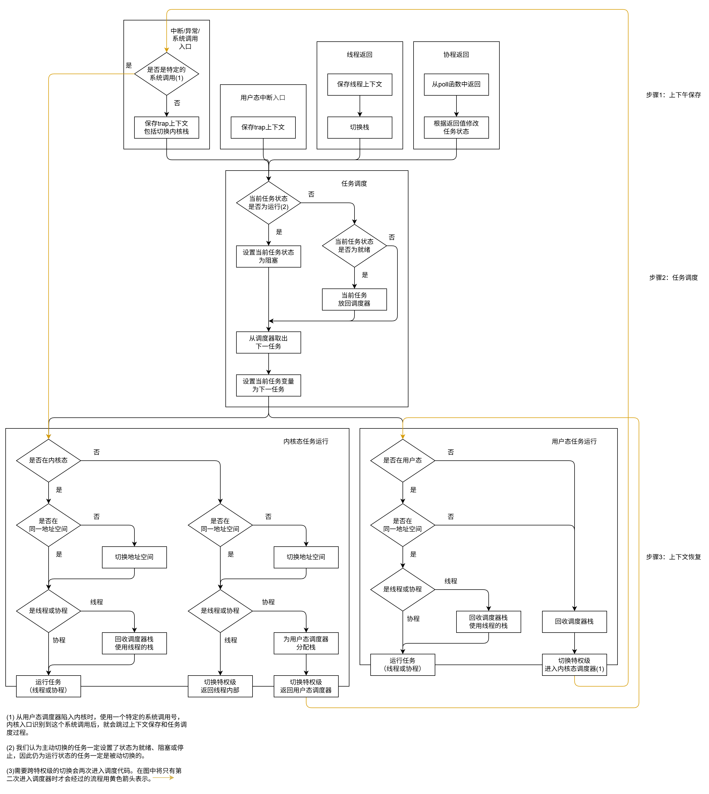

# 调度器模块重构思路

## 目的

当前的下一个目标为使调度器模块支持进程调度。但为了做到这步，就需要操作系统的支持。为了降低其移植到多个操作系统（reL4、ArceOS）上的难度，就需要同时优化其接口（包括设计接口的进程调度部分）。

## 目标

- 支持进程调度
- 降低跨平台移植难度，为我移植到reL4上，以及xjj移植到ArceOS上提供方案。

## 思路

### 调度器的复用

直接使用`schduler`库这样的接口即可。

### 任务切换框架的复用

#### 任务切换模型

<!-- trap前后的执行流视为不同任务的情况：


trap前后的执行流视为同一任务的情况：

 -->

trap前后的执行流视为不同任务的情况：



调度器中的代码在各个地址空间中共享（类似跳板页），因此进程切换只需要进入内核->切换地址空间->返回用户态，省略了内核态任务切换的步骤。

文字版切换流程：

（以下的“陷入内核”均为进入内核调度入口，“返回用户态调度器”均为进入用户调度入口）

- **调度大循环**：调度器取出任务 -> 调度器运行任务（包括上下文恢复） -> 任务返回调度器（包括上下文保存） -> 调度器取出任务 -> ……
  - **调度器运行任务**：
    - 用户态运行相同进程的线程：回收调度器栈 -> 恢复寄存器上下文（包括切换栈）
    - 用户态运行相同进程的协程：调用`poll`函数
    - 用户态运行不同进程的线程：回收调度器栈 -> 陷入内核 -> 切换进程上下文 -> 恢复寄存器上下文（包括切换栈和返回用户态）
    - 用户态运行不同进程的协程：回收调度器栈 -> 陷入内核 -> 切换进程上下文 -> 分配调度器栈（这里必须回收再分配的原因是老栈和新栈位于不同的地址空间中） -> 返回用户态调度器（包括切换栈、恢复上下文和返回用户态） -> 调用`poll`函数
    - 用户态运行内核线程：不会出现此情况。内核线程仅在内核执行流被中断时出现，而该核心只有在执行完中断处理任务、返回内核线程并执行完成、返回内核态调度器后才会再次执行用户态任务。否则，就会在内核栈非空的情况下返回用户态。
    - 用户态运行内核协程：回收调度器栈 -> 陷入内核 -> 调用`poll`函数
    - 内核态运行用户线程：切换进程上下文 -> 恢复寄存器上下文（包括切换栈和返回用户态）
    - 内核态运行用户协程：切换进程上下文 -> 分配调度器栈 -> 返回用户态调度器（包括切换栈、恢复上下文和返回用户态） -> 调用`poll`函数
  - **任务返回调度器**
    - 用户态线程程返回内核调度器（中断/异常/系统调用）：陷入内核 -> 保存寄存器上下文（包括用户栈）
    - 用户态线程程返回用户调度器（用户态中断）：陷入用户态中断入口（即调度入口） -> 保存寄存器上下文（包括用户栈）
    - 用户态线程程返回用户调度器（通过线程式接口正常返回）：切换到静态保存的用户态调度器上下文（包括分配栈） -> 保存寄存器上下文（包括用户栈）
    - 用户态协程返回用户调度器：从`poll`函数返回（包括上下文保存）
    - 内核态线程返回内核调度器（中断）：陷入内核态中断入口（即调度入口） -> 保存寄存器上下文（包括内核栈，但该内核栈同时也会被中断处理任务复用）
    - 内核态线程程返回内核调度器（通过线程式接口正常返回）：切换到静态保存的内核态调度器上下文（包括分配栈） -> 保存寄存器上下文（包括内核栈）
    - 内核态协程返回内核调度器：从`poll`函数返回（包括上下文保存）

该模型的优势：

1. 同进程的协程切换可以在用户态进行（zfl已实现）
2. 同进程的线程切换可以在用户态进行（有前提条件）
3. 跨进程的切换省略了内核任务切换的步骤
4. 在从用户调度器陷入内核的情况，不需保存用户态上下文（因为已经静态保存了进入用户调度入口的用户态上下文）。
5. 在不使用硬件的情况下统一中断优先级和任务调度优先级，避免优先级倒置现象。（但仍需要CPU响应中断，造成地址空间切换的开销）

#### 栈的分配和复用

栈的使用情况：

- 调度器本身的运行需要栈（包括用户栈和内核栈）。
- 协程的运行复用调度器的栈。
- 上下文保存为线程时，需要将线程使用的栈保存为上下文的一部分

栈的分配、传递和回收时机：

- 第一次进入某个地址空间的调度入口前，需要为调度入口分配一个栈。
  - 内核启动时，为每个核心初始化内核栈。
  - 返回用户态调度器时，为用户态调度器上下文分配一个用户栈
- 某个核心上，从内核态进入用户态时：此时运行代码处于调度器中而非某个任务中，因此不需额外保存上下文（内核态任务的上下文此时已经保存好了）
  - 将内核栈指针传入`sscratch`寄存器中，在该核心下次进入内核时复用该栈。、
  - 如果用户态任务为线程，则其已经持有一个栈作为上下文的一部分，在用户态使用该栈即可。
  - 如果用户态任务为协程，则返回的是用户态调度器的上下文。此时，为其分配一个栈。用户态调度器使用的栈可以使用以进程为单位的栈池来维护，从而使被回收的栈也可复用。
- 从用户态任务内部进入内核态时：该任务会成为线程。
  - 此时的用户栈成为该任务上下文的一部分。
  - 进入内核时，使用当前核心的`sscratch`寄存器存储的内核栈。
- 从用户态调度器进入内核态时：上一任务成为协程且已保存好了无栈的上下文。
  - 不需保存调度器的上下文。调度器之前使用的栈可以回收。（但需要在内核态回收用户栈）
  - 进入内核时，使用当前核心的`sscratch`寄存器存储的内核栈。
- 调度器运行相同特权级的任务
  - 运行协程，直接复用调度器的栈
  - 运行线程：
    - 用户态：回收当前栈，使用线程的栈。线程如果正常返回调度器（成为协程），则会以线程的栈运行调度器。
    - 内核态：在内核态运行内核线程只有一种情况：内核态中断处理完成后返回被打断的内核线程。该情况下，栈不会变更，直接从内核栈上恢复线程的执行流即可。

用户栈的管理：每个进程配备一个栈池，从内核态进入调度器上下文时分配栈，在用户态调度器中运行同进程的线程时回收调度器的栈。

内核栈的管理：系统启动时为每个核心分配一个内核栈。然而，如果需要支持内核任务进行线程式的主动让出/阻塞，则需要在内核态也设置栈池。（仅仅支持内核态中断则不需要，因为中断可以复用原本的内核栈，处理完成后立刻返回原任务。但线程切换则无法复用内核栈。）

#### 调度入口的分支和上下文保存如何实现？

调度入口的分支可以使用多个判断语句实现。

trap进入内核时，`pc`修改为内核入口的值，原有的`pc`转存至`sepc`中；`sp`仍指向用户栈（可以通过后续操作将其与指向内核栈的`sscratch`互换）。因此，刚进入调度入口时，除`pc`以外的寄存器均有可能保存着上下文，无法随意使用。

因此，在调度入口不进行太复杂的判断。调度入口的分支可以使用多个判断语句实现，进入调度入口时，仅进行“是否需要保存上下文”的判断。之后的判断在保存上下文后进行，因此可以正常使用寄存器。

需要保存上下文的情景：发生中断/异常/系统调用时（但从用户态调度器进入内核时不需要）；线程让出并进入调度入口时？

不需保存上下文的情景：协程返回时；从用户态调度器进入内核时。其中，通过把入口与上下文保存部分放在调度循环之外，可以分离出协程返回的情况，使只有在特权级切换时需要进入调度入口。因此，所有进入调度入口的场景中，只有从用户态调度器进入内核时不需保存上下文。可以为这种情况分配一个特定的系统调用号。

因此，对“是否需要保存上下文”的判断，可通过以下方式：判断`scause`是否为系统调用，且保存系统调用号的寄存器是否为特定的系统调用号。若是，则不需保存上下文，否则需要保存上下文。

对于线程让出的情况：可以使用另一个函数保存上下文（因为线程上下文和trap上下文不同），之后不进入调度入口，而是直接跳到上下文保存之后的任务调度部分。

#### 切换次数分析

比较原本情况与当前情况的任务切换中，各项操作（上下文保存，上下文恢复，进出内核，地址空间切换）的次数。用加粗标注了当前情况下有性能优势的操作。

<!-- 增加与AsyncOS的比较？ -->

|情况|传统任务模型|AsyncOS|当前设计|
|-|-|-|-|
|用户线程进入内核|1次上下文保存，1次进内核|1次上下文保存，1次进内核|1次上下文保存，1次进内核|
|**用户协程进入内核**|2次上下文保存（在用户态保存协程上下文；在内核态保存trap上下文），1次进内核|2次上下文保存（在用户态保存协程上下文；在内核态保存trap上下文），1次进内核|**1次上下文保存，1次进内核**|
|内核返回用户线程|1次上下文恢复，1次出内核|1次上下文恢复，1次出内核|1次上下文恢复，1次出内核|
|内核返回用户协程|2次上下文恢复，1次出内核|2次上下文恢复，1次出内核|2次上下文恢复，1次出内核|
|内核态线程/协程切换|1次上下文保存，1次上下文恢复|1次上下文保存，1次上下文恢复|1次上下文保存，1次上下文恢复|
|内核态进程切换|1次上下文保存，1次上下文恢复，1次地址空间切换|1次地址空间切换|1次地址空间切换|
|**同进程线程切换**|2次上下文保存，2次上下文恢复，1次进内核，1次出内核（用户线程进入内核+内核态线程切换+内核返回用户线程）|2次上下文保存，2次上下文恢复，1次进内核，1次出内核（用户线程进入内核+运行新进程的内核执行流+内核返回用户线程）|**1次上下文保存，1次上下文恢复**|
|同进程协程切换|1次上下文保存，1次上下文恢复|1次上下文保存，1次上下文恢复|1次上下文保存，1次上下文恢复|
|**跨进程线程切换**|2次上下文保存，2次上下文恢复，1次进内核，1次出内核，1次地址空间切换（用户线程进入内核+内核态进程切换+内核返回用户线程）|2次上下文保存，2次上下文恢复，1次进内核，1次出内核，1次地址空间切换（用户线程进入内核+内核态进程切换+运行新进程的内核执行流+内核返回用户线程）|**1次上下文保存，1次上下文恢复，1次进内核，1次出内核，1次地址空间切换（用户线程进入内核+内核态进程切换+内核返回用户线程）**|
|**跨进程协程切换**|3次上下文保存，3次上下文恢复，1次进内核，1次出内核，1次地址空间切换（用户协程进入内核+内核态进程切换+内核返回用户协程）|2次上下文保存，3次上下文恢复，1次进内核，1次出内核，1次地址空间切换（用户协程进入内核+内核态进程切换+运行新进程的内核执行流+内核返回用户协程）|**1次上下文保存，2次上下文恢复，1次进内核，1次出内核，1次地址空间切换（用户协程进入内核+内核态进程切换+内核返回用户协程）**|

#### 接口

- 任务的描述：
  - 获取任务的进程、特权级、执行流，用于在进入调度入口时以及运行任务时选择路径
  - 切换任务状态：运行，就绪，阻塞。
- 任务的切换：
  - 进程切换：`switch_process`，只会在内核态调用，用于切换地址空间等进程持有的资源。对应图中“内核调度器运行用户线程/协程”的切换地址空间步骤。
  - 特权级切换：
    - `into_kernel`和`into_user`，切换到内核/用户态并进入内核/用户态的调度入口，对应图中“内核调度器运行用户态协程、用户调度器运行内核态线程/协程、用户调度器运行其它进程的线程/协程”路径。
    - `into_user_context`：切换到用户态的寄存器上下文，对应图中的“内核调度器运行用户态线程”路径。
  - 上下文切换：
    - `poll`：从协程上下文恢复，一定在与上下文相同的特权级中调用。
    - `save_context`：保存寄存器上下文，不一定在与上下文相同的特权级中调用，可能在内核态保存用户态的寄存器上下文。
    - `restore_context`：从寄存器上下文恢复，一定在与上下文相同的特权级中调用。
- 任务调度（这部分接口由任务调度模块提供，任务切换模块使用）
  - 获取当前任务
  - 将任务放入就绪队列
  - 从调度器中获取下一任务，并用其更新当前任务字段
- trap处理
  - 覆盖操作系统“从进入内核，到保存好上下文传入系统调用处理函数”的过程，实现上下文的按需保存。

内核调度器不属于某个内核任务的上下文，用户调度器也是如此，类似Executor和Future的关系。如果将用户态执行流与内核态执行流看作两个不同任务，则中断/系统调用被实现为上一任务被抢占/阻塞，切换到内核态运行下一任务；如果将用户态执行流与内核态执行流看作同一任务，则中断/系统调用被实现为当前任务不变，但改变当前任务的特权级，并从用户态执行流切换到内核态执行流（类似AsyncOS）。

<!-- ```Rust
trait Task<Process: Eq> {
    /// 获取任务上下文信息
    fn get_process(&self) -> Process;
    fn is_kernel(&self) -> bool;
    fn is_coroutine(&self) -> bool;
    /// 保存任务上下文
    fn save_reg_context(&self); // 该函数执行后，再对其调用`is_coroutin`应返回`false`。
}
``` -->

**如上的设计对比AsyncOS已有的设计能体现出优势。但是，如上的设计会遇到以下这些问题，如果无法解决，则无法实现如上提到的优势。**

#### 对调度器与中断、系统调用关系的讨论

若调度器修改了中断/系统调用的入口，则其也需要承担处理原有的中断/系统调用的功能。此时，可以做到任务调度与中断处理的统一，避免优先级倒置问题。（中断到来时，生成中断处理任务并加入调度器，再比较调度器取出的任务与当前任务的优先级，决定是否抢占。）然而，作为一个可移植的调度模块，牵涉到中断和系统调用的处理会使其接口更加复杂，将调度器移植进系统需要对系统进行的修改增多，降低可移植性。

作为替代方案，可以使调度器不承担全部的中断处理，而是通过注册一个中断向量的形式（可以通过`linkme` crate实现中断向量的注册），仅对于特定的中断/系统调用的处理会进入调度器。但这样就无法修改进入内核态之后的处理流程，每次进入内核态都会保存用户态上下文，进而无法实现上文中的优势4和5。

#### 用户态寄存器上下文的保存和恢复

用户态寄存器上下文可以分为线程上下文和中断上下文两种。（如果不提供线程式的任务接口，则线程只能由中断/系统调用产生，所有的寄存器上下文均为中断上下文。）

中断上下文难以在用户态被恢复，因为其存储了所有的通用寄存器。如果在内核态恢复中断上下文，则中断时的`pc`存储在`sepc`中，使用`sret`将`sepc`赋值给`pc`。而在用户态，一般是使用`ra`存储`pc`在上下文恢复后的位置，通过`ret`将`ra`赋值给`pc`。但这样就丢失了`ra`的信息，而中断上下文中`ra`的取值也是有意义的。

如果使用用户态中断，则可以解决上述的问题。

如果无法解决该问题，则无法实现上文中的优势2。

#### 可能的解决方案：兼容多种不同的任务模型

将任务划分为`(进程, 特权级, 执行流)`的方式可用于用户执行流与内核执行流视为不同任务的情况，也可用于用户执行流与内核执行流视为同一任务的情况，只要增添一个修改当前任务的特权级信息的接口。AsyncOS已证明，无论用户执行流与内核执行流是否视为同一个任务，都可以实现用户态和内核态的统一调度（不过，视为不同任务的设计可以进一步降低切换次数）。因此，无论原有系统的任务模型如何，均可以使其兼容该任务调度模块，并且实现统一调度。

任务调度模块对外提供`reschdule`接口，涵盖了任务调度与任务切换过程。若要最小化的修改的内容，可以不修改内核的中断/系统调用处理逻辑，仅在某个特定系统调用（例如`yield`）中调用`reschdule`接口。为了统一任务调度与中断/系统调用处理，可以将内核的中断入口直接修改为`reschedule`。（此时也需要在`reschedule`中增加额外的中断和系统调用处理逻辑。）（两种`reschedule`接口可能有所不同，可以实现为两种接口。）或者，可以承担保存上下文的工作后，再将上下文传递给系统的中断处理函数。

对于用户态寄存器上下文的保存问题，可以在不支持用户态中断时，将保存了Trap上下文的任务视为内核任务，需要进入内核再返回用户态；在支持用户态中断时，将它们视为用户任务，可以直接在用户态恢复。

这样的解决方案本质上仍未解决上面两个问题中涉及的矛盾，但其为接口提供了灵活性，用户可以根据需要进行选择。

#### 考虑vDSO限制的情况下的模块结构设计（todo）

- 使用泛型描述任务，难以放入vDSO。
- 将任务的切换与任务的调度分开考虑，则任务调度有大量的共享信息（就绪队列、当前任务），而任务切换的共享信息量不大（只有判断需要走哪条切换路径的状态信息），不过需要获取任务调度器的共享信息。
- 任务切换代码作为跳板页，需要在每个地址空间中映射到相同的地址，类似于使用vDSO共享的代码页。

综合考虑后，可以将任务切换的代码放在vDSO中。关于vDSO难以使用泛型的问题，可以考虑传递指针（代表任务自身）和虚函数表（代表任务的方法）的方式实现。

能否在vDSO中运行协程？如果使用虚函数表的方式使vDSO调用其外部的函数，不也要求这些外部函数在所有地址空间中均存在于同一位置吗？解决方案：可以将虚函数表实现为vDSO中的私有数据，即要求每个地址空间均提供一个该地址空间内部实现。
