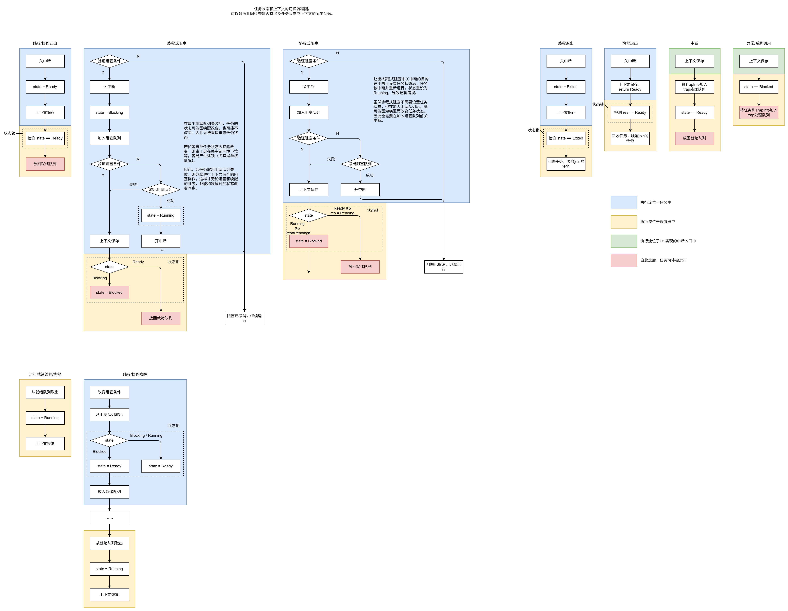

# trap_handler修改计划

修改在`vsched`调度器中进行。

## 原有实现

每个CPU绑定一个trap_handler，在调度器取出任务时，如果trap队列中有未处理的trap，则取出该trap_handler并运行。

该设计导致若trap_handler在运行过程中阻塞在某个内核资源上，则当前核心的其它trap都无法及时处理（即使再次取出了trap_handler，也会在获取到资源前继续阻塞。）

## 修改后的实现

不再每个CPU绑定trap_handler，而是将所有等待处理trap的trap_handler放在一个阻塞队列上。

trap_handler如果处理完了所有的trap，则阻塞在trap_wait_queue的阻塞队列上（在调度器内部代码中实现）。如果在处理trap的过程中等待内核资源，则阻塞在那个内核资源对应的阻塞队列中（在TrapInfo::handle接口中，由OS实现）。

调度器取出任务（take_task方法）时，如果trap队列中有未处理的trap，则首先从trap_wait_queue的阻塞队列中取出trap_handler；如果阻塞队列中没有任务，则创建一个trap_handler。

**trap_handler总是处理当前cpu上的trap，并可能在阻塞唤醒后迁移到不同的cpu上。** 当某个cpu出现trap时，调度器从阻塞队列中获取一个trap_handler，该handler即在当前cpu上运行，处理cpu上的全部trap。如果在处理trap的过程中未被阻塞，则会将当前cpu的trap处理完成；如果被阻塞，则下次进入调度器时，若当前cpu上仍有trap，就重新获取一个trap_handler来处理。

### 同步问题分析

多个trap_handler对当前CPU的trap队列的访问可以通过加锁来同步。

“访问trap队列”过程和“阻塞”过程之间不会有同步问题。

对于trap_handler阻塞在当前cpu的阻塞队列的过程，参考流程图中的“线程式阻塞”流程，也就是在任务内部设置Blocking状态，在进入调度器后再改为Blocked。

对于从trap_wait_queue的阻塞队列中取出trap_handler的过程，参考流程图中的“线程/协程唤醒”流程。只是修改任务状态（Blocked-->Ready）后，不需放入就绪队列，而是直接把任务传出`take_task`函数中；如果修改任务状态为（Blocking-->Ready），则被唤醒的trap_handler将由调度器继续运行，本次`take_task`返回None即可。

### 优先级设置问题

优先级仲裁分为两个层面：进程间和进程内。

进程间的优先级仲裁依靠每个进程在进程信息表中存储的优先级数值。该数值不是实时更新的。

进程内的优先级仲裁依靠直接对各个事件源调用highest_priority获得的优先级数值，是实时的。这部分没有问题。

进程信息表中存储的优先级数值会在取出任务、放入任务、放入TrapItem时更新。目前没有在取出TrapItem时更新。因此目前有两个问题：

- 因为TrapItem队列是per-cpu的，而进程的优先级不是per-cpu。因此TrapItem队列的优先级如何反映到进程的优先级上？
  - 将进程的优先级也改为per-cpu。
- 将TrapItem队列清空时，优先级更新的时机是怎样的？是在唤醒中断处理任务时更新，还是在取出TrapItem时更新？
  - 现在，由于trap_handler可能阻塞，因此无法假定唤醒一个handler后，该核心上的所有trap一定会在未来处理完成。因此改为在取出TrapItem时更新：如果取出后TrapItem队列为空，则更新当前进程优先级。

已经完成上述的两个修改。[commit 6814290](https://github.com/rosy233333/vsched2/commit/6814290bc54012efbeac7aa0711f09a345192947)、[commit 5738b48](https://github.com/rosy233333/vsched2/commit/5738b4857194b742c630f9ad1e79c4ec5a836644)

### handler的地址空间与所属进程

目前的设计，所有进程和内核的trap都会进入内核的trap队列中。handler在获取到用户任务相关异常时设置自身pid为用户任务所属进程，并切换地址空间。

若handler等待trap而阻塞，则其会进入内核的handler阻塞队列。在调度时，其属于内核调度器（会从内核调度器中将其取出）；若handler在处理trap的过程中阻塞，则其进入内核资源的阻塞队列；唤醒时，无论其pid如何，都应进入内核的就绪队列（因为在内核态运行的，用户进程所属任务也需要进入内核就绪队列）。**这一点需要OS的实现保证。**

因此，handler无论pid如何，都作为一个内核态任务，在内核的几条队列（handler阻塞队列；内核资源阻塞队列；内核就绪队列）间转移。

## 修改清单

- 在调度器中增加阻塞队列的支持。
- trap_wait_queue的数据结构修改：从每个CPU从绑定一个trap_handler到绑定一个阻塞队列。
- trap_wait_queue的take_task方法修改：如果trap队列中有未处理的trap，则首先从trap_wait_queue的当前CPU的阻塞队列中取出trap_handler；如果阻塞队列中没有任务，则创建一个trap_handler。
- trap_handler修改：trap处理完成后，增加将自己阻塞在对应CPU的阻塞队列上的代码。

在修改过程中，应该可以保证不动interface和api？
