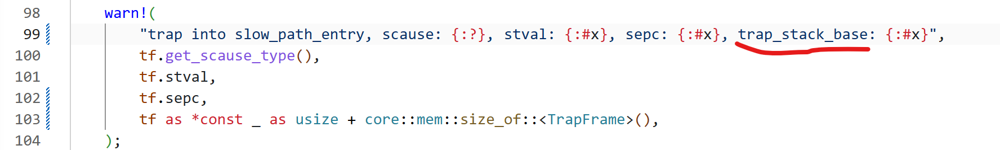
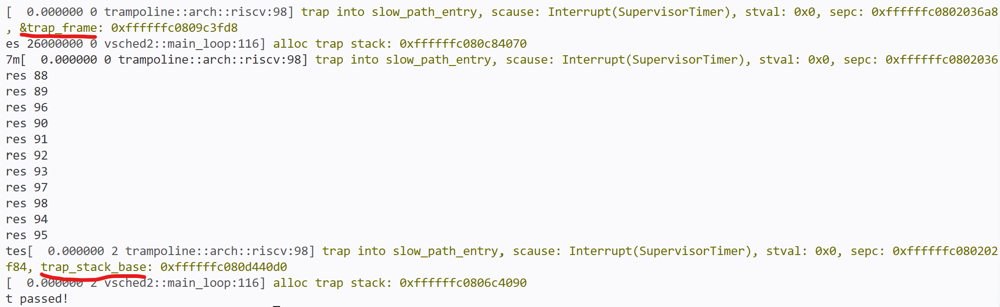

# AsyncOS和调度器中的多核同步问题记录

## AsyncOS中的问题

### 1. 在join的实现中，在获取另一任务的状态、将任务的Waker放入另一任务的等待队列期间，退出的任务先唤醒了等待队列中的所有任务，再有另一任务放入其等待队列中，导致放入的任务无法唤醒

修改：通过状态锁保证其它核心不会在此时修改任务状态，阻止了上述情况出现。

解决问题的版本：[async-os fc8a594](https://github.com/rosy233333/async-os/commit/fc8a594f033441bd89fe6bb7d98ab85064ee73e4)

### 2. 测试程序卡死，增加调试输出后发现所有任务在等待一个持有锁的任务，而该任务在被时钟中断后进入了Blocking

首先，修改了AsyncOS中的实现和调度器中的约定，使不仅是外部中断，而是所有中断均将任务状态改为Ready。

之后发现状态改为Ready后，问题已消除。（只是会大量拖长运行时间，因为被放回就绪队列的任务需要等待之前的大量任务全都执行一遍并被阻塞后才会继续运行。）

AsyncOS中的Mutex似乎不会在获取锁时关中断。在一般的中断处理方式中可能导致问题，但在我们的实现（中断只会将任务改为Ready并放回就绪队列）中理论上不会有问题。因为原来就是这么设计的，因此不做修改。

此外，还在测试输出中发现了进入调度器时即为Blocked状态的任务。似乎不应出现，任务要么使用Blocking状态代表阻塞，要么不设置任务状态，通过协程返回Poll::Pending代表阻塞。

解决问题的版本：[async-os 5883459](https://github.com/rosy233333/async-os/commit/5883459a6159579eda3fe96d4cee4f9b13f64e1d)

### 3. 不知何种原因导致的发生中断时的错误，进入中断向量时scause正确，但在处理该中断时提示scause非法（还未解决）

并且，在测试过程中还出现了非常难以置信的现象：在我修改了代码中的某个测试输出后，打印的结果居然一部分是修改前的格式，一部分是修改后的格式？？

（热升级了属于是）

出现问题的版本：[async-os 5883459](https://github.com/rosy233333/async-os/commit/5883459a6159579eda3fe96d4cee4f9b13f64e1d)、[vsched2 06a876b](https://github.com/rosy233333/vsched2/commit/06a876bf61a172a8e740eceeb1b1a95c7ae7da1d)

## 调度器中的问题

### 1. 调度器多次获取任务状态，而任务状态在期间改变，导致了与预期不一致的行为

修改：将x_entry中设置任务状态的步骤和xschedule中根据任务状态将任务放入就绪队列的步骤合并，放在x_entry中。

解决问题的版本：[vsched2 dd0085f](https://github.com/rosy233333/vsched2/commit/dd0085fa8f11f9d3fc98c2dd4a288814e7de7ffa)

### 2. 调度器复用线程栈，在多核环境下调度器使用该栈时线程被调度到另一个核心上运行并使用该栈，造成同步问题

修改：在多核模式下，thread_entry中会切换到空栈。单核模式下仍复用线程的栈。

解决问题的版本：[vsched2 9d2e688](https://github.com/rosy233333/vsched2/commit/9d2e688f52f20599d7796d34843c982e449b2ea6)

### 3. 之前未考虑到，需要操作各种队列的api在进入时也需要关中断（还未解决）

因为进入调度器后会获取锁，因此需要关中断。
